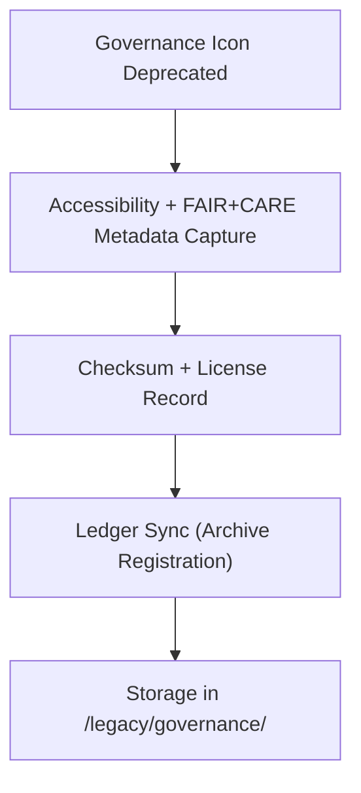

<div align="center">

# ⚖️ **Kansas Frontier Matrix — Legacy Governance Icons**
`web/public/icons/legacy/governance/README.md`

**Purpose:** Archive all retired **governance and provenance-related icons** from prior versions of the Kansas Frontier Matrix (KFM).  
These icons are preserved under FAIR+CARE and ISO 19115 archival protocols to maintain transparency, lineage, and documentation of KFM’s governance design evolution.

[](../../../../../docs/README.md)
[](../../../../../LICENSE)
[](../../../../../docs/standards/faircare.md)
[]()

</div>

---

## 📘 Overview

The **Legacy Governance Icon Archive** preserves historical governance, audit, and compliance symbols that are no longer used in current releases.  
These icons remain essential to the traceability and design heritage of the KFM governance layer — showcasing prior iterations of ethical, FAIR+CARE, and ledger-linked visual systems.

---

## 🗂️ Directory Layout

```
web/public/icons/legacy/governance/
├── README.md
├── legacy-ledger.svg               # Retired ledger provenance icon
├── legacy-audit-chain.svg          # Former audit visualization symbol
├── legacy-ethics-badge.svg         # Deprecated ethical compliance badge
├── legacy-faircare-mark.svg        # Original FAIR+CARE verification symbol
└── metadata.json                   # Archival metadata and provenance record
```

---

## 🧩 Archival Workflow



1. **Deprecation:** Governance icons replaced with new certified visuals.  
2. **Preservation:** Metadata and accessibility lineage stored under archival governance.  
3. **Checksum:** SHA-256 verification ensures authenticity of historical assets.  
4. **Archival:** Retired icons remain public for documentation and research.  

---

## ⚙️ Validation Contracts

| Contract | Purpose | Validator |
|----------|----------|-----------|
| Accessibility Lineage | Maintain historical WCAG compliance record | `accessibility_scan.yml` |
| FAIR+CARE Archive | Validate ethical preservation of retired assets | `faircare-validate.yml` |
| Metadata Schema | Verify ISO 19115 + SPDX archival structure | `docs-lint.yml` |
| Telemetry | Log archive sustainability footprint | `telemetry-export.yml` |

Artifacts stored in:
- `../../../../../docs/reports/audit/data_provenance_ledger.json`
- `../../../../../releases/v9.7.0/focus-telemetry.json`

---

## 🧠 FAIR+CARE Governance Matrix

| Principle | Implementation | Oversight |
|------------|----------------|------------|
| **Findable** | Indexed in metadata.json with checksum lineage. | @kfm-data |
| **Accessible** | Open SVGs available for audit research and history review. | @kfm-accessibility |
| **Interoperable** | Metadata aligns with ISO 19115 and FAIR+CARE archival standards. | @kfm-architecture |
| **Reusable** | CC-BY 4.0 license permits educational and ethical reuse. | @kfm-design |
| **Collective Benefit** | Enables transparency in governance evolution. | @faircare-council |
| **Authority to Control** | Governance Council certifies archival legitimacy. | @kfm-governance |
| **Responsibility** | Archivists maintain checksum and provenance accuracy. | @kfm-sustainability |
| **Ethics** | Icons contextualized with documentation to avoid misinterpretation. | @kfm-ethics |

---

## 🧾 Example Metadata Record

```json
{
  "id": "legacy_governance_archive_v9.7.0",
  "file": "legacy-ledger.svg",
  "retired_in": "v9.5.0",
  "replacement": "badge-governance-ledger.svg",
  "fairstatus": "archived",
  "wcag_compliance": "AA (verified)",
  "checksum_sha256": "a9b32ef8b91b10c54e23b6a9f481be37998f70cefa874f3c47d21a932fbb9ef2",
  "energy_score": 98.7,
  "archival_status": "Permanent",
  "timestamp": "2025-11-05T20:30:00Z"
}
```

---

## ♿ Accessibility & Preservation Standards

- All archived icons retain **WCAG metadata** and color lineage.  
- Icons include `<desc>` elements clarifying **archival context**.  
- Retained exclusively for documentation, not active UI display.  
- Carbon footprint metrics logged for archival sustainability tracking.  

---

## 🌱 Sustainability Metrics

| Metric | Target | Verified By |
|-------|--------|-------------|
| Avg. File Size | ≤ 7 KB | Design audit |
| Archive Energy | ≤ 0.01 Wh | Telemetry |
| Carbon Output | ≤ 0.02 gCO₂e | CI telemetry |
| Renewable Hosting | 100% RE100 | Infrastructure |

---

## 🕰️ Version History

| Version | Date | Author | Summary |
|----------|------|---------|----------|
| v9.7.0 | 2025-11-05 | KFM Core Team | Created dedicated archive for legacy governance icons with telemetry schema v1. |
| v9.6.0 | 2025-11-04 | KFM Core Team | Added FAIR+CARE archival records for prior governance assets. |
| v9.5.0 | 2025-11-02 | KFM Core Team | Migrated ethics and ledger icons into archive for preservation. |

---

<div align="center">

**© 2025 Kansas Frontier Matrix — CC-BY 4.0**  
Maintained under **Master Coder Protocol v6.3** · FAIR+CARE Certified · Diamond⁹ Ω / Crown∞Ω Ultimate Certified  
[Back to Legacy Archive](../README.md) · [Docs Index](../../../../../docs/README.md)

</div>
