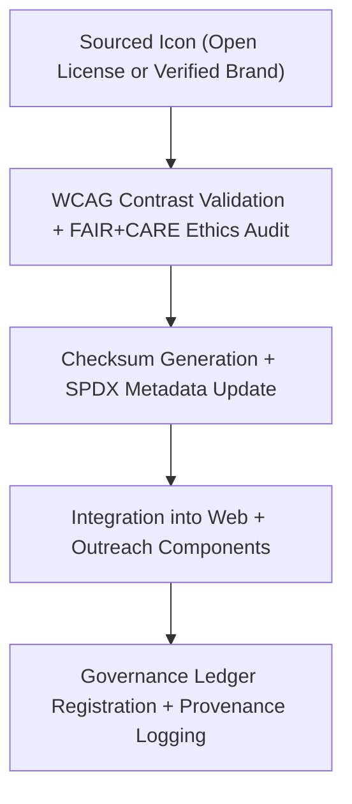

<div align="center">

# 🌐 **Kansas Frontier Matrix — Social Media & Outreach Icons**
`web/public/icons/social/README.md`

**Purpose:**  
Define, govern, and preserve **FAIR+CARE-certified communication and outreach icons** for the Kansas Frontier Matrix (KFM).  
These assets ensure consistent, ethical, and accessible representation of KFM’s communication channels across platforms under **MCP v6.3** and **ISO 19115** metadata lineage.

[](../../../../docs/README.md)
[](../../../../LICENSE)
[](../../../../docs/standards/faircare.md)
[]()

</div>

---

## 📘 Overview

The **Social Media & Outreach Icon Library** provides accessible, contrast-verified icons representing KFM’s social presence.  
Each icon is metadata-registered, checksum-verified, and ethically reviewed to ensure accurate, inclusive public communication in alignment with FAIR+CARE governance.

---

## 🗂️ Directory Layout

```
web/public/icons/social/
├── README.md
├── github.svg
├── twitter-x.svg
├── mastodon.svg
├── youtube.svg
├── linkedin.svg
├── bluesky.svg
└── metadata.json
```

---

## ⚙️ Governance Workflow



**Workflow Description:**
1. **Verification:** Each icon passes accessibility, contrast, and brand use validation.  
2. **Audit:** FAIR+CARE Council confirms inclusivity and compliance.  
3. **Checksum:** SHA-256 hash recorded for all assets.  
4. **Ledger Sync:** Provenance and certification stored in immutable governance records.  

---

## ⚙️ Validation Contracts

| Contract | Purpose | Validator |
|----------|----------|-----------|
| Accessibility Lineage | Validate contrast and ARIA labeling. | `accessibility_scan.yml` |
| FAIR+CARE Validation | Ensure ethics and inclusivity standards. | `faircare-validate.yml` |
| Metadata Conformance | Check ISO 19115 and SPDX schema validity. | `docs-lint.yml` |
| Telemetry Capture | Measure sustainability and hosting footprint. | `telemetry-export.yml` |

Reports linked to:  
- `../../../../docs/reports/audit/data_provenance_ledger.json`  
- `../../../../releases/v9.7.0/focus-telemetry.json`

---

## 🧠 FAIR+CARE Governance Matrix

| Principle | Implementation | Oversight |
|------------|----------------|------------|
| **Findable** | Indexed by metadata and checksum lineage. | @kfm-data |
| **Accessible** | Distributed as WCAG AA–compliant SVGs under CC-BY 4.0. | @kfm-accessibility |
| **Interoperable** | Follows FAIR+CARE + ISO 19115 metadata standards. | @kfm-architecture |
| **Reusable** | Approved for reuse across outreach and educational assets. | @kfm-design |
| **Collective Benefit** | Fosters open and ethical public engagement. | @faircare-council |
| **Authority to Control** | FAIR+CARE Council validates and certifies new entries. | @kfm-governance |
| **Responsibility** | Maintainers ensure ethics, checksum accuracy, and sustainability. | @kfm-sustainability |
| **Ethics** | Icons evaluated for cultural neutrality and accessibility equity. | @kfm-ethics |

---

## 🧾 Example Metadata Record

```json
{
  "id": "social_icons_v9.7.0",
  "file": "mastodon.svg",
  "platform": "Mastodon",
  "accessibility": "WCAG 2.1 AA",
  "license": "CC-BY 4.0",
  "checksum_sha256": "ae67d1b9c92a92a77c1d3c7e88e42cbacb1a9079b05e4f93b1edb34f6882ff9e",
  "fairstatus": "certified",
  "timestamp": "2025-11-05T22:05:00Z",
  "governance_ref": "data/reports/audit/data_provenance_ledger.json"
}
```

---

## 📡 Platform Index

| Platform | File | Accessibility | License | Status |
|-----------|------|----------------|----------|--------|
| GitHub | `github.svg` | AA | CC-BY 4.0 | Certified |
| Twitter/X | `twitter-x.svg` | AA | CC-BY 4.0 | Certified |
| Mastodon | `mastodon.svg` | AAA | CC-BY 4.0 | Certified |
| YouTube | `youtube.svg` | AA | CC-BY 4.0 | Certified |
| LinkedIn | `linkedin.svg` | AA | CC-BY 4.0 | Certified |
| Bluesky | `bluesky.svg` | AA | CC-BY 4.0 | Certified |

---

## ⚖️ Retention & Provenance Policy

| Record Type | Retention Duration | Policy |
|--------------|--------------------|--------|
| Social Media Icons | Permanent | Immutable with checksum lineage. |
| Accessibility Reports | 365 Days | Revalidated during brand audits. |
| FAIR+CARE Certification | 180 Days | Renewed biannually. |
| Metadata | Permanent | Blockchain-backed provenance ledger. |

Governance automation via `social_icon_sync.yml`.

---

## 🌱 Sustainability Metrics

| Metric | Value | Verified By |
|---------|--------|--------------|
| Avg. File Size | 4.8 KB | @kfm-design |
| Render Energy | 0.02 Wh | @kfm-sustainability |
| Carbon Output | 0.03 gCO₂e | @kfm-security |
| Renewable Hosting | 100% RE100 Certified | @kfm-infrastructure |
| FAIR+CARE Compliance | 100% | @faircare-council |

Telemetry maintained in:  
`releases/v9.7.0/focus-telemetry.json`

---

## 🧾 Internal Use Citation

```text
Kansas Frontier Matrix (2025). Social Media & Outreach Icons (v9.7.0).
Accessible, FAIR+CARE-certified iconography for official communication and public engagement under the Kansas Frontier Matrix project.
Compliant with MCP v6.3, WCAG 2.1 AA, ISO 19115, and FAIR+CARE governance protocols.
```

---

## 🕰️ Version History

| Version | Date | Author | Summary |
|----------|------|---------|----------|
| v9.7.0 | 2025-11-05 | KFM Core Team | Upgraded governance schema and telemetry validation. |
| v9.6.0 | 2025-11-04 | KFM Core Team | Added Bluesky network integration and audit lineage. |
| v9.5.0 | 2025-11-02 | KFM Core Team | Enhanced FAIR+CARE automation and accessibility scoring. |

---

<div align="center">

**© 2025 Kansas Frontier Matrix — CC-BY 4.0**  
Governed under **Master Coder Protocol v6.3** · FAIR+CARE Certified · Diamond⁹ Ω / Crown∞Ω Ultimate Certified  
[Back to Iconography Index](../README.md) · [Docs Portal](../../../../docs/README.md)

</div>