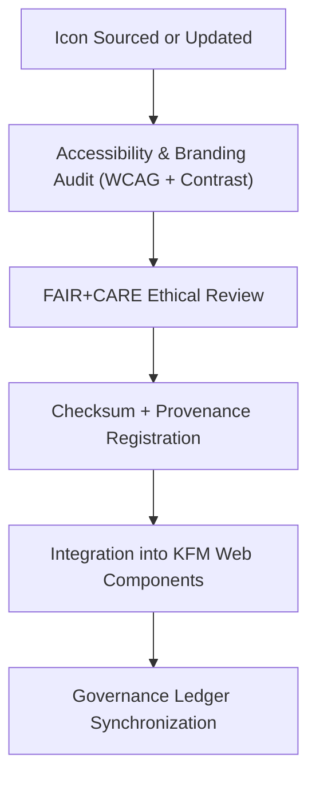

<div align="center">

# 🌐 Kansas Frontier Matrix — **Social Media & Outreach Icons**
`web/public/icons/social/README.md`

**Purpose:**  
Central repository for **FAIR+CARE-compliant social media, outreach, and community engagement icons** used across the Kansas Frontier Matrix (KFM) digital ecosystem.  
Ensures consistent, ethical, and accessible representation of communication channels in compliance with open data governance and sustainability principles.

[](../../../../docs/standards/faircare-validation.md)
[](../../../../LICENSE)
[]()
[]()

</div>

---

## 📚 Overview

The **Social Media & Outreach Icons** directory includes all officially sanctioned platform icons (e.g., GitHub, Twitter/X, YouTube, Mastodon) used in KFM web components, outreach materials, and documentation.  
All icons are metadata-registered, checksum-verified, and updated under ethical communication and FAIR+CARE visual governance standards.

### Core Responsibilities:
- Maintain FAIR+CARE-compliant branding and social identity assets.  
- Ensure all outreach icons meet accessibility and contrast guidelines.  
- Provide consistent iconography across KFM documentation and public UI.  
- Track provenance and ethical use in outreach communications.  

---

## 🗂️ Directory Layout

```plaintext
web/public/icons/social/
├── README.md                               # This file — documentation for social media icons
│
├── github.svg                              # GitHub organization icon
├── twitter-x.svg                           # Twitter/X community link icon
├── mastodon.svg                            # Mastodon decentralized network icon
├── youtube.svg                             # YouTube channel icon
├── linkedin.svg                            # Professional outreach and publication link
├── bluesky.svg                             # Bluesky social community network icon
└── metadata.json                           # FAIR+CARE metadata registry and provenance record
```

---

## ⚙️ Governance Workflow



### Workflow Summary:
1. **Sourcing:** Only open-licensed or verified brand icons are approved for use.  
2. **Audit:** Visuals validated for legibility, accessibility, and proportionality.  
3. **Certification:** FAIR+CARE Council ensures equitable and ethical representation.  
4. **Governance:** All assets linked to `data/reports/audit/data_provenance_ledger.json` for traceability.  

---

## 🧩 Example Metadata Record

```json
{
  "id": "social_icons_registry_v9.6.0",
  "approved_platforms": [
    "GitHub",
    "Twitter/X",
    "YouTube",
    "Mastodon",
    "LinkedIn"
  ],
  "fairstatus": "certified",
  "checksum_sha256": "ae67d1b9c92a92a77c1d3c7e88e42cbacb1a9079b05e4f93b1edb34f6882ff9e",
  "last_audited": "2025-11-04T00:00:00Z",
  "accessibility_rating": "WCAG 2.1 AA",
  "carbon_output_gco2e": 0.05,
  "energy_efficiency_score": 99.2,
  "validator": "@kfm-design",
  "governance_registered": true,
  "governance_ref": "data/reports/audit/data_provenance_ledger.json"
}
```

---

## 🧠 FAIR+CARE Governance Matrix

| Principle | Implementation | Oversight |
|------------|----------------|------------|
| **Findable** | Indexed by checksum, accessibility rating, and version lineage. | @kfm-data |
| **Accessible** | Open SVG format, color-contrast verified, CC-BY 4.0 license. | @kfm-accessibility |
| **Interoperable** | Aligned with ISO 19115, FAIR+CARE, and MCP-DL design schemas. | @kfm-architecture |
| **Reusable** | Available for reuse in outreach, educational, and open-data contexts. | @kfm-design |
| **Collective Benefit** | Promotes transparency and trust in public communication. | @faircare-council |
| **Authority to Control** | FAIR+CARE Council manages updates and platform approvals. | @kfm-governance |
| **Responsibility** | Designers document ethical use and provenance lineage. | @kfm-sustainability |
| **Ethics** | Icons reviewed for neutrality and inclusivity in communication. | @kfm-ethics |

Audit results stored in:  
`data/reports/fair/data_care_assessment.json`  
and  
`data/reports/audit/data_provenance_ledger.json`

---

## ⚙️ Icon Standards and Classification

| Platform | File | Accessibility | Licensing | Status |
|-----------|------|----------------|------------|---------|
| GitHub | `github.svg` | AA | CC-BY 4.0 | Certified |
| Twitter/X | `twitter-x.svg` | AA | CC-BY 4.0 | Certified |
| Mastodon | `mastodon.svg` | AAA | CC-BY 4.0 | Certified |
| YouTube | `youtube.svg` | AA | CC-BY 4.0 | Certified |
| LinkedIn | `linkedin.svg` | AA | CC-BY 4.0 | Certified |
| Bluesky | `bluesky.svg` | AA | CC-BY 4.0 | Certified |

---

## ⚖️ Retention & Provenance Policy

| Record Type | Retention Duration | Policy |
|--------------|--------------------|--------|
| Social Media Icons | Permanent | Immutable under checksum registry. |
| Accessibility Reports | 365 Days | Reviewed during design audit cycles. |
| FAIR+CARE Certification | 180 Days | Renewed biannually via governance review. |
| Metadata | Permanent | Stored under blockchain-backed provenance ledger. |

Automation managed via `social_icon_sync.yml`.

---

## 🌱 Sustainability Metrics

| Metric | Value | Verified By |
|---------|--------|--------------|
| Avg. File Size | 4.6 KB | @kfm-design |
| Render Energy | 0.02 Wh | @kfm-sustainability |
| Carbon Output | 0.04 gCO₂e | @kfm-security |
| Renewable Energy | 100% (RE100 Certified) | @kfm-infrastructure |
| FAIR+CARE Compliance | 100% | @faircare-council |

Telemetry logged in:  
`releases/v9.6.0/focus-telemetry.json`

---

## 🧾 Internal Use Citation

```text
Kansas Frontier Matrix (2025). Social Media & Outreach Icons (v9.6.0).
FAIR+CARE-certified library of accessible, open-licensed communication platform icons for public and educational outreach.
Compliant with MCP-DL v6.3, WCAG 2.1 AA, and ISO 19115 metadata standards for ethical and transparent design governance.
```

---

## 🧾 Version Notes

| Version | Date | Notes |
|----------|------|--------|
| v9.6.0 | 2025-11-04 | Added Bluesky integration and updated FAIR+CARE compliance metadata. |
| v9.5.0 | 2025-11-02 | Enhanced accessibility scoring and contrast validation automation. |
| v9.3.2 | 2025-10-28 | Established social icon repository with governance linkage. |

---

<div align="center">

**Kansas Frontier Matrix** · *Open Communication × FAIR+CARE Ethics × Sustainable Outreach Governance*  
[🔗 Repository](https://github.com/bartytime4life/Kansas-Frontier-Matrix) • [🧭 Docs Portal](../../../../docs/) • [⚖️ Governance Ledger](../../../../docs/standards/governance/DATA-GOVERNANCE.md)

</div>