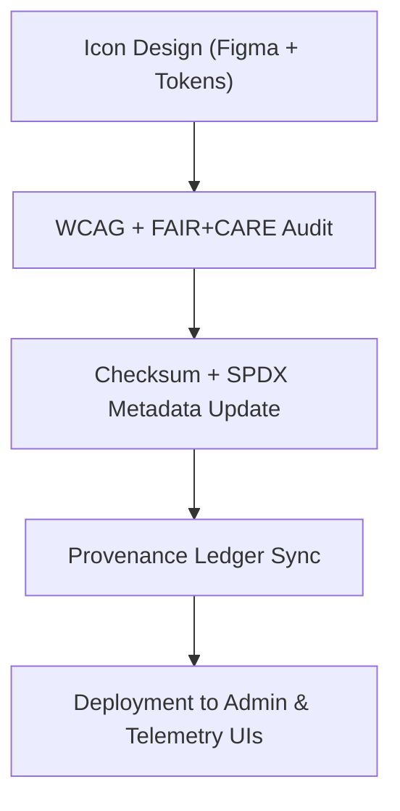

<div align="center">

# ⚙️ **Kansas Frontier Matrix — System Utility Icons**
`web/public/icons/system/README.md`

**Purpose:**  
Provide an accessible, FAIR+CARE-certified library of **system-level icons** for configuration, validation, telemetry, and governance utilities used across KFM administrative interfaces, dashboards, and tooling.

[](../../../../docs/README.md)
[](../../../../LICENSE)
[](../../../../docs/standards/faircare.md)
[]()

</div>

---

## 📘 Overview

This library standardizes **settings, sync, power, governance, validation, and telemetry** iconography for KFM’s internal UIs.  
All assets are vector-first (SVG), contrast-verified, checksum-logged, and linked to provenance ledgers under **ISO 19115** and **MCP v6.3**.

---

## 🗂️ Directory Layout

```
web/public/icons/system/
├── README.md
├── settings.svg
├── sync.svg
├── power.svg
├── governance.svg
├── validation.svg
├── telemetry.svg
└── metadata.json
```

---

## 🧩 Governance Workflow



1. **Design:** Icons built with tokenized color geometry and ethical guidelines.  
2. **Audit:** WCAG 2.1 AA checks plus inclusivity review.  
3. **Register:** SHA-256 checksum and license stored in `metadata.json`.  
4. **Publish:** Manifests, SBOM, and telemetry updated in CI/CD.

---

## ⚙️ Validation Contracts

| Contract | Purpose | Validator |
|----------|----------|-----------|
| Accessibility | Contrast + ARIA labeling rules | `accessibility_scan.yml` |
| FAIR+CARE | Ethical and governance metadata verification | `faircare-validate.yml` |
| Metadata | ISO 19115 + SPDX schema validation | `docs-lint.yml` |
| Telemetry | File size + energy/carbon footprint | `telemetry-export.yml` |

Artifacts recorded in:
- `../../../../releases/v9.7.0/focus-telemetry.json`
- `../../../../docs/reports/audit/data_provenance_ledger.json`

---

## 🧠 FAIR+CARE Governance Matrix

| Principle | Implementation | Oversight |
|------------|----------------|------------|
| **Findable** | Indexed by checksum and purpose in registry. | @kfm-data |
| **Accessible** | CC-BY SVGs, keyboard focusable when interactive. | @kfm-accessibility |
| **Interoperable** | Conforms to FAIR+CARE + ISO metadata. | @kfm-architecture |
| **Reusable** | Approved across governance/admin modules. | @kfm-design |
| **Collective Benefit** | Improves clarity of system states and actions. | @faircare-council |
| **Authority to Control** | Governance council validates new and updated icons. | @kfm-governance |
| **Responsibility** | Maintainers track lineage and sustainability metrics. | @kfm-sustainability |
| **Ethics** | Neutral visual language; avoids bias in system symbolism. | @kfm-ethics |

---

## 🧾 Example Metadata Record

```json
{
  "id": "system_icons_v9.7.0",
  "file": "validation.svg",
  "purpose": "QA validation status",
  "wcag": "2.1 AA",
  "license": "CC-BY 4.0",
  "checksum_sha256": "e19c8f72fcd53c2782c0b2edb6cc7360d7a8cb23a1f4c7cf98146e6e89937a8e",
  "fairstatus": "certified",
  "timestamp": "2025-11-05T22:15:00Z"
}
```

---

## 🔧 System Icon Classifications

| Icon | Description | Category | Status |
|------|-------------|----------|--------|
| `settings.svg` | Configuration and preferences control. | Administration | Active |
| `sync.svg` | Synchronization / refresh. | Telemetry | Active |
| `power.svg` | Power toggle or activation. | System | Active |
| `governance.svg` | FAIR+CARE governance status indicator. | Governance | Certified |
| `validation.svg` | QA validation / test status. | Validation | Certified |
| `telemetry.svg` | Metrics and monitoring dashboard. | Monitoring | Certified |

---

## ♿ Accessibility & Sustainability

- SVGs include `<title>` and follow ARIA guidance when interactive.  
- Primary icons meet **≥ 4.5:1** contrast; secondary icons **≥ 3:1**.  
- Average file size **≤ 6 KB**; energy ≤ **0.02 Wh** per render.  
- Telemetry logged per release for sustainability audit.

---

## 🕰️ Version History

| Version | Date | Author | Summary |
|----------|------|---------|----------|
| v9.7.0 | 2025-11-05 | KFM Core Team | Upgraded: telemetry schema v1, ISO/SPDX metadata alignment, governance mapping. |
| v9.6.0 | 2025-11-04 | KFM Core Team | Introduced registry + checksum lineage for system icons. |
| v9.5.0 | 2025-11-02 | KFM Core Team | Enhanced FAIR+CARE automation and accessibility validation. |

---

<div align="center">

**© 2025 Kansas Frontier Matrix — CC-BY 4.0**  
Governed under **Master Coder Protocol v6.3** · FAIR+CARE Certified · Diamond⁹ Ω / Crown∞Ω Ultimate Certified  
[Back to Iconography Index](../README.md) · [Docs Portal](../../../../docs/README.md)

</div>