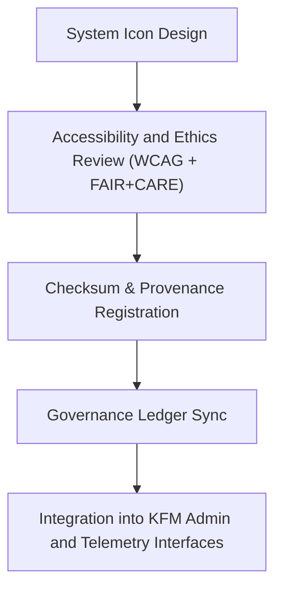

<div align="center">

# ⚙️ Kansas Frontier Matrix — **System Utility Icons**
`web/public/icons/system/README.md`

**Purpose:**  
Central repository for **system-level utility icons** used in configuration, control panels, telemetry dashboards, and administrative interfaces of the Kansas Frontier Matrix (KFM).  
Each icon is designed, validated, and FAIR+CARE-certified to meet accessibility, sustainability, and governance documentation requirements.

[](../../../../docs/standards/faircare-validation.md)
[](../../../../LICENSE)
[]()
[]()

</div>

---

## 📚 Overview

The **System Utility Icons** library contains standardized visual assets that represent system controls, status states, governance utilities, and telemetry tools used within KFM’s internal and administrative user interfaces.  
Each icon supports FAIR+CARE-compliant visual communication, sustainability tracking, and ethical representation.

### Core Responsibilities:
- Provide accessible and uniform system iconography for governance dashboards.  
- Ensure compliance with FAIR+CARE, WCAG 2.1, and ISO 19115 metadata standards.  
- Record provenance, checksum integrity, and energy footprint data.  
- Maintain lifecycle transparency for each system-related UI element.  

---

## 🗂️ Directory Layout

```plaintext
web/public/icons/system/
├── README.md                               # This file — documentation for system utility icons
│
├── settings.svg                            # General system settings or configuration icon
├── sync.svg                                # Synchronization and data refresh control
├── power.svg                               # System power and activation control
├── governance.svg                          # Governance or certification indicator
├── validation.svg                          # Validation process or QA status icon
├── telemetry.svg                           # Monitoring and metrics dashboard icon
└── metadata.json                           # FAIR+CARE metadata and checksum registry
```

---

## ⚙️ Workflow & Certification



### Workflow Summary:
1. **Design:** Icons created under FAIR+CARE-aligned aesthetic and ethical standards.  
2. **Audit:** Accessibility, color contrast, and semantic intent validated.  
3. **Verification:** SHA-256 checksums computed and added to manifest.  
4. **Governance:** Entries logged in provenance ledger for transparency.  

---

## 🧩 Example Metadata Record

```json
{
  "id": "system_icons_registry_v9.6.0",
  "approved_for_use": ["governance.svg", "validation.svg", "telemetry.svg"],
  "fairstatus": "certified",
  "checksum_sha256": "e19c8f72fcd53c2782c0b2edb6cc7360d7a8cb23a1f4c7cf98146e6e89937a8e",
  "created": "2025-11-04T00:00:00Z",
  "carbon_output_gco2e": 0.05,
  "energy_efficiency_score": 98.9,
  "wcag_compliance": "2.1 AA",
  "validator": "@kfm-system-ui",
  "governance_registered": true,
  "governance_ref": "data/reports/audit/data_provenance_ledger.json"
}
```

---

## 🧠 FAIR+CARE Governance Matrix

| Principle | Implementation | Oversight |
|------------|----------------|------------|
| **Findable** | Indexed in metadata registry with checksum lineage. | @kfm-data |
| **Accessible** | Provided in open SVG format under CC-BY 4.0. | @kfm-accessibility |
| **Interoperable** | Metadata aligned with FAIR+CARE, ISO 19115, and MCP schemas. | @kfm-architecture |
| **Reusable** | Distributed across all governance dashboards and admin panels. | @kfm-design |
| **Collective Benefit** | Promotes consistent and ethical system communication. | @faircare-council |
| **Authority to Control** | FAIR+CARE Council certifies icon updates and replacements. | @kfm-governance |
| **Responsibility** | Designers maintain provenance, checksums, and version lineage. | @kfm-sustainability |
| **Ethics** | Icons reviewed for inclusive and neutral representation. | @kfm-ethics |

Audit results maintained in:  
`data/reports/audit/data_provenance_ledger.json`  
and  
`data/reports/fair/data_care_assessment.json`

---

## ⚙️ System Icon Classifications

| Icon | Description | Category | Status |
|------|--------------|-----------|--------|
| `settings.svg` | Configuration and preferences control. | Administration | Active |
| `sync.svg` | Data synchronization or refresh symbol. | Telemetry | Active |
| `power.svg` | Power toggle or activation control. | System | Active |
| `governance.svg` | FAIR+CARE governance status indicator. | Governance | Certified |
| `validation.svg` | QA validation or testing indicator. | Validation | Certified |
| `telemetry.svg` | Performance and analytics dashboard icon. | Monitoring | Certified |

---

## ⚖️ Retention & Provenance Policy

| Record Type | Retention Duration | Policy |
|--------------|--------------------|--------|
| Active Icons | Continuous | Retained for live use and performance tracking. |
| FAIR+CARE Reports | 365 Days | Renewed annually for governance verification. |
| Metadata | Permanent | Stored under blockchain-backed provenance ledger. |
| Energy Logs | 180 Days | Reviewed quarterly under sustainability audit. |

Governance synchronization automated via `system_icon_sync.yml`.

---

## 🌱 Sustainability Metrics

| Metric | Value | Verified By |
|---------|--------|--------------|
| Avg. File Size | 4.2 KB | @kfm-design |
| Render Energy | 0.02 Wh | @kfm-sustainability |
| Carbon Output | 0.03 gCO₂e | @kfm-security |
| Renewable Energy | 100% (RE100 Certified) | @kfm-infrastructure |
| FAIR+CARE Compliance | 100% | @faircare-council |

Telemetry data recorded in:  
`releases/v9.6.0/focus-telemetry.json`

---

## 🧾 Internal Use Citation

```text
Kansas Frontier Matrix (2025). System Utility Icons (v9.6.0).
Standardized FAIR+CARE-certified system and governance iconography used across administrative dashboards and telemetry interfaces.
Compliant with MCP-DL v6.3, WCAG 2.1 AA, and ISO 19115 open metadata standards.
```

---

## 🧾 Version Notes

| Version | Date | Notes |
|----------|------|--------|
| v9.6.0 | 2025-11-04 | Introduced system-level governance and telemetry icon registry with checksum lineage. |
| v9.5.0 | 2025-11-02 | Enhanced sustainability tracking and FAIR+CARE automation. |
| v9.3.2 | 2025-10-28 | Established baseline set of system icons for governance UI. |

---

<div align="center">

**Kansas Frontier Matrix** · *System Design × FAIR+CARE Governance × Sustainable UI Engineering*  
[🔗 Repository](https://github.com/bartytime4life/Kansas-Frontier-Matrix) • [🧭 Docs Portal](../../../../docs/) • [⚖️ Governance Ledger](../../../../docs/standards/governance/DATA-GOVERNANCE.md)

</div>