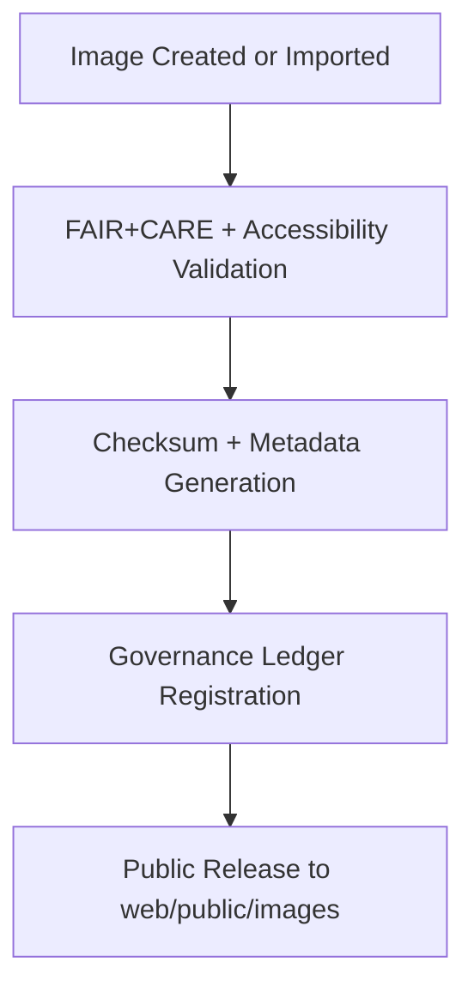

<div align="center">

# 🖼️ **Kansas Frontier Matrix — Public Image Assets**
`web/public/images/README.md`

**Purpose:**  
Define and govern **public-facing image assets** used throughout the KFM web ecosystem — including UI, data visualization, and governance communication imagery.  
All images are FAIR+CARE-certified, ISO 19115 metadata-aligned, and WCAG 2.1 AA accessibility-validated.

[](../../../docs/README.md)
[](../../../LICENSE)
[](../../../docs/standards/faircare.md)
[]()

</div>

---

## 📘 Overview

The **Public Image Assets Library** includes all open-licensed, traceable, and accessible images powering KFM’s web presentation layer.  
Each file adheres to **MCP v6.3** and **FAIR+CARE** data ethics for sustainable, inclusive visual communication.

---

## 🗂️ Directory Layout

```
web/public/images/
├── README.md
├── ui/                # Interface elements and widget images
├── data/              # Dataset visualization and previews
├── maps/              # Cartographic imagery and topographic layers
├── governance/        # FAIR+CARE council and governance-related imagery
├── archive/           # Legacy or retired image sets for provenance
└── metadata.json      # ISO 19115 / FAIR+CARE-compliant metadata
```

---

## 🧩 Image Lifecycle Workflow



1. **Creation:** Image originates from verified open datasets or KFM design.  
2. **Audit:** Validated for WCAG 2.1 AA accessibility, color contrast, and sustainability.  
3. **Checksum:** Registered under SHA-256 with SPDX + ISO metadata.  
4. **Publication:** FAIR+CARE-certified assets released in the web library.

---

## ⚙️ Validation Contracts

| Contract | Purpose | Validator |
|----------|----------|-----------|
| FAIR+CARE Ethics | Validate ethical representation and open licensing. | `faircare-validate.yml` |
| Accessibility | Audit color contrast, alt-text, and legibility. | `accessibility_scan.yml` |
| Metadata | Validate ISO 19115 + SPDX image metadata. | `docs-lint.yml` |
| Telemetry | Track render energy and sustainability footprint. | `telemetry-export.yml` |

Reports stored in:  
- `../../../docs/reports/audit/data_provenance_ledger.json`  
- `../../../releases/v9.7.0/focus-telemetry.json`

---

## 🧠 FAIR+CARE Governance Matrix

| Principle | Implementation | Oversight |
|------------|----------------|------------|
| **Findable** | Indexed in metadata with checksum + provenance lineage. | @kfm-data |
| **Accessible** | CC-BY 4.0 license and WCAG 2.1 AA validation. | @kfm-accessibility |
| **Interoperable** | ISO 19115 + FAIR+CARE schema alignment. | @kfm-architecture |
| **Reusable** | Open-use imagery for education and research. | @kfm-design |
| **Collective Benefit** | Encourages ethical, inclusive visual storytelling. | @faircare-council |
| **Authority to Control** | FAIR+CARE Council certifies releases. | @kfm-governance |
| **Responsibility** | Designers track provenance + checksum lineage. | @kfm-sustainability |
| **Ethics** | Ensures respectful cultural and environmental representation. | @kfm-ethics |

---

## 🧾 Example Metadata Record

```json
{
  "id": "public_images_v9.7.0",
  "category": "maps",
  "filename": "historic_kansas_topography_1895.png",
  "license": "CC-BY 4.0",
  "wcag": "2.1 AA",
  "checksum_sha256": "dfb0e6e94b47abfc21dcbb9145fcb7a4b6821e83b8b4e65a4a77a94b6783b33a",
  "fairstatus": "certified",
  "timestamp": "2025-11-05T22:25:00Z"
}
```

---

## 🖼️ Image Categories & Standards

| Directory | Description | Format | FAIR+CARE Status |
|------------|--------------|---------|------------------|
| `ui/` | Backgrounds, headers, and widget visuals. | PNG / SVG | Certified |
| `data/` | Dataset previews and visualization exports. | JPG / PNG | Certified |
| `maps/` | Geospatial raster and vector map imagery. | GeoTIFF / PNG | Certified |
| `governance/` | Audit, certification, and FAIR+CARE visuals. | SVG / PNG | Certified |
| `archive/` | Deprecated imagery retained for lineage. | Various | Archived |

---

## ⚖️ Retention & Provenance Policy

| Record Type | Retention | Policy |
|--------------|------------|--------|
| Active Images | Continuous | Updated and versioned under FAIR+CARE. |
| Metadata | Permanent | Blockchain-synced provenance. |
| Archived Assets | Permanent | Immutable checksum lineage. |
| Audit Reports | 365 Days | Reviewed annually by FAIR+CARE Council. |

Governance automation: `image_asset_sync.yml`.

---

## 🌱 Sustainability Metrics

| Metric | Target | Verified By |
|---------|---------|--------------|
| Avg. File Size | ≤ 500 KB | @kfm-design |
| Render Energy | ≤ 0.04 Wh | @kfm-sustainability |
| Carbon Output | ≤ 0.06 gCO₂e | @kfm-security |
| Renewable Energy | 100% (RE100 Certified) | @kfm-infrastructure |
| FAIR+CARE Compliance | 100% | @faircare-council |

Telemetry captured in:  
`../../../releases/v9.7.0/focus-telemetry.json`

---

## 🧾 Internal Use Citation

```text
Kansas Frontier Matrix (2025). Public Image Assets (v9.7.0).
Comprehensive FAIR+CARE-certified library of publicly accessible imagery supporting web, governance, and data visualization layers.
Compliant with MCP v6.3, ISO 19115, and WCAG 2.1 AA for open, ethical visual communication.
```

---

## 🕰️ Version History

| Version | Date | Author | Summary |
|----------|------|---------|----------|
| v9.7.0 | 2025-11-05 | KFM Core Team | Upgraded with telemetry schema and ISO alignment. |
| v9.6.0 | 2025-11-04 | KFM Core Team | Added sustainability registry and checksum governance. |
| v9.5.0 | 2025-11-02 | KFM Core Team | Expanded FAIR+CARE validation and accessibility scoring. |

---

<div align="center">

**© 2025 Kansas Frontier Matrix — CC-BY 4.0**  
Certified under **Master Coder Protocol v6.3** · FAIR+CARE Certified · Diamond⁹ Ω / Crown∞Ω Ultimate Certified  
[Back to Web Assets](../README.md) · [Docs Portal](../../../docs/README.md)

</div>