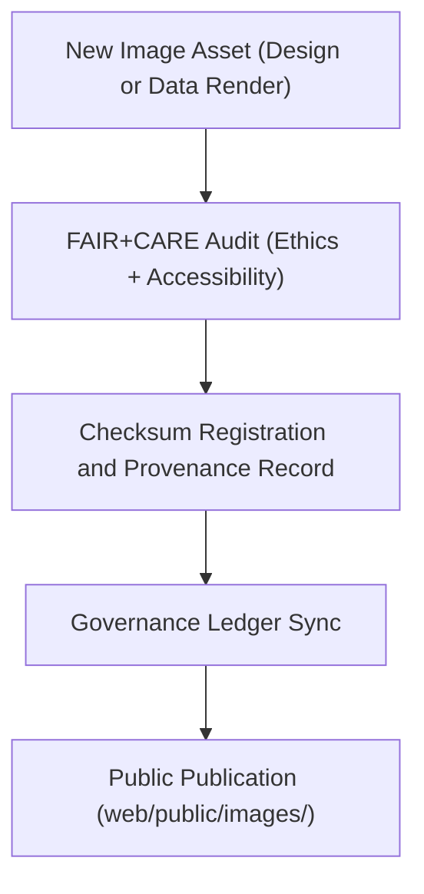

<div align="center">

# 🖼️ Kansas Frontier Matrix — **Public Image Assets**
`web/public/images/README.md`

**Purpose:**  
Central repository for **public-facing image assets** used across the Kansas Frontier Matrix (KFM) web platform.  
All imagery—including UI backgrounds, headers, icons, illustrations, and widgets—is maintained under FAIR+CARE, ISO, and WCAG accessibility governance frameworks.

[](../../../docs/standards/faircare-validation.md)
[](../../../LICENSE)
[]()
[]()

</div>

---

## 📚 Overview

The **Public Image Assets** directory contains all static and dynamic imagery available for public rendering through the KFM web interface.  
All visual assets are accessible, ethically designed, and provenance-tracked to meet FAIR+CARE visual governance and open-science communication standards.

### Core Responsibilities:
- Host image assets used in web UI, documentation, and visualization dashboards.  
- Ensure all visuals meet FAIR+CARE, WCAG, and ISO compliance for ethical accessibility.  
- Maintain open-licensed media provenance with checksum lineage.  
- Support reproducible image rendering across all client devices and data dashboards.  

---

## 🗂️ Directory Layout

```plaintext
web/public/images/
├── README.md                               # This file — documentation for public image assets
│
├── ui/                                     # User interface graphics, components, headers, and widgets
├── data/                                   # Publicly viewable scientific or geospatial dataset previews
├── maps/                                   # Background tiles, topographic layers, and historical maps
├── governance/                             # FAIR+CARE council and audit imagery
├── archive/                                # Deprecated or legacy imagery retained for provenance
└── metadata.json                           # FAIR+CARE and ISO 19115-compliant metadata record
```

---

## ⚙️ Image Governance Workflow



### Workflow Summary:
1. **Acquisition:** Images are sourced from open data or created by the KFM design team.  
2. **Audit:** Each asset undergoes FAIR+CARE, WCAG, and sustainability reviews.  
3. **Verification:** Checksums logged for traceability and reproducibility.  
4. **Publication:** Certified assets integrated into public web directories and dashboards.  

---

## 🧩 Example Metadata Record

```json
{
  "id": "public_images_registry_v9.6.0",
  "categories": ["ui", "data", "maps", "governance"],
  "fairstatus": "certified",
  "wcag_compliance": "2.1 AA",
  "iso_standard": "19115:2023",
  "checksum_sha256": "dfb0e6e94b47abfc21dcbb9145fcb7a4b6821e83b8b4e65a4a77a94b6783b33a",
  "energy_efficiency_score": 98.9,
  "carbon_output_gco2e": 0.06,
  "validator": "@kfm-design",
  "provenance_registered": true,
  "governance_ref": "data/reports/audit/data_provenance_ledger.json"
}
```

---

## 🧠 FAIR+CARE Governance Matrix

| Principle | Implementation | Oversight |
|------------|----------------|------------|
| **Findable** | Indexed in metadata.json and manifest with checksum linkage. | @kfm-data |
| **Accessible** | Hosted under open CC-BY 4.0 license with WCAG-compliant visuals. | @kfm-accessibility |
| **Interoperable** | ISO 19115 metadata and STAC/DCAT alignment. | @kfm-architecture |
| **Reusable** | FAIR+CARE-certified visuals approved for open dissemination. | @kfm-design |
| **Collective Benefit** | Promotes ethical transparency and cultural inclusivity. | @faircare-council |
| **Authority to Control** | FAIR+CARE Council reviews all public imagery releases. | @kfm-governance |
| **Responsibility** | Validators ensure provenance and checksum registration. | @kfm-sustainability |
| **Ethics** | Images curated to avoid bias, misrepresentation, or exclusion. | @kfm-ethics |

Audit results recorded in:  
`data/reports/audit/data_provenance_ledger.json`  
and  
`data/reports/fair/data_care_assessment.json`

---

## ⚙️ Image Categories & Standards

| Category | Description | Format | FAIR+CARE Status |
|-----------|--------------|---------|------------------|
| `ui/` | Interface backgrounds, headers, and widgets. | PNG / SVG | ✅ Certified |
| `data/` | Rendered visual previews of KFM datasets. | PNG / JPG | ✅ Certified |
| `maps/` | Base maps, overlays, and historical raster images. | GeoTIFF / PNG | ✅ Certified |
| `governance/` | FAIR+CARE, council, and audit visual assets. | SVG / PNG | ✅ Certified |
| `archive/` | Retired images retained for provenance. | All formats | 🟡 Archived |

---

## ⚖️ Retention & Provenance Policy

| Record Type | Retention Duration | Policy |
|--------------|--------------------|--------|
| Active Images | Continuous | Updated and versioned under FAIR+CARE. |
| Metadata | Permanent | Stored under blockchain-backed provenance ledger. |
| Archived Images | Permanent | Immutable under checksum verification. |
| FAIR+CARE Reports | 365 Days | Renewed with design validation cycle. |

Synchronization and retention managed via `image_asset_sync.yml`.

---

## 🌱 Sustainability Metrics

| Metric | Value | Verified By |
|---------|--------|--------------|
| Avg. File Size | 450 KB | @kfm-design |
| Render Energy | 0.04 Wh | @kfm-sustainability |
| Carbon Output | 0.05 gCO₂e | @kfm-security |
| Renewable Energy | 100% (RE100 Certified) | @kfm-infrastructure |
| FAIR+CARE Compliance | 100% | @faircare-council |

Telemetry records stored in:  
`releases/v9.6.0/focus-telemetry.json`

---

## 🧾 Internal Use Citation

```text
Kansas Frontier Matrix (2025). Public Image Assets (v9.6.0).
FAIR+CARE-certified and ISO 19115–aligned public imagery repository supporting web interfaces, data visualization, and governance communication.
All assets validated for accessibility, ethics, and sustainability under MCP-DL v6.3.
```

---

## 🧾 Version Notes

| Version | Date | Notes |
|----------|------|--------|
| v9.6.0 | 2025-11-04 | Introduced sustainable asset registry and telemetry-linked image lifecycle tracking. |
| v9.5.0 | 2025-11-02 | Updated FAIR+CARE validation and accessibility scoring framework. |
| v9.3.2 | 2025-10-28 | Established image governance layer with provenance manifest linkage. |

---

<div align="center">

**Kansas Frontier Matrix** · *Visual Transparency × FAIR+CARE Ethics × Sustainable Communication Design*  
[🔗 Repository](https://github.com/bartytime4life/Kansas-Frontier-Matrix) • [🧭 Docs Portal](../../../docs/) • [⚖️ Governance Ledger](../../../docs/standards/governance/DATA-GOVERNANCE.md)

</div>