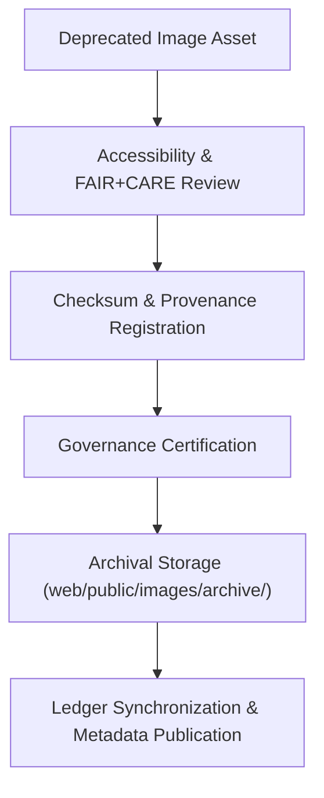

<div align="center">

# 🗄️ Kansas Frontier Matrix — **Archived Image Assets**
`web/public/images/archive/README.md`

**Purpose:**  
Preserves **retired or replaced image assets** from previous Kansas Frontier Matrix (KFM) web releases.  
All archived assets are maintained under FAIR+CARE, ISO, and WCAG governance standards for ethical preservation, provenance continuity, and accessibility lineage.

[](../../../../../docs/standards/faircare-validation.md)
[](../../../../../LICENSE)
[]()
[]()

</div>

---

## 📚 Overview

The **Archived Image Assets** directory acts as a **FAIR+CARE-certified digital preservation library** for outdated or deprecated visual assets.  
These assets are stored with checksum integrity and provenance records to maintain full transparency in KFM’s visual and design history.

### Core Responsibilities:
- Archive deprecated images under sustainable and ethical design governance.  
- Preserve accessibility lineage and metadata provenance.  
- Document changes, replacements, and deprecation events.  
- Maintain ISO and FAIR+CARE alignment for historical reference and reproducibility.  

---

## 🗂️ Directory Layout

```plaintext
web/public/images/archive/
├── README.md                               # This file — documentation for archived image assets
│
├── legacy-header-bg.png                    # Deprecated site header background
├── legacy-dashboard-banner.jpg             # Old dashboard banner replaced by dynamic version
├── legacy-footer-graphic.svg               # Previous footer branding asset
├── legacy-map-preview.png                  # Retired historical map thumbnail
└── metadata.json                           # FAIR+CARE archival metadata and provenance record
```

---

## ⚙️ Archival Workflow



### Workflow Summary:
1. **Deprecation:** Asset replaced or superseded in KFM’s UI or documentation.  
2. **Audit:** WCAG accessibility and FAIR+CARE ethics validation conducted.  
3. **Checksum Verification:** SHA-256 hash computed for integrity.  
4. **Governance:** Provenance registered under blockchain-linked audit logs.  

---

## 🧩 Example Metadata Record

```json
{
  "id": "archived_images_registry_v9.6.0",
  "archived_from_version": "v9.2.0",
  "replaced_by": [
    "web/public/images/ui/header/header_dynamic_v9.6.0.png",
    "web/public/images/ui/footer/footer_branding_v9.6.0.svg"
  ],
  "fairstatus": "certified",
  "checksum_sha256": "de98b33c47a9a1ec2b1d3b72b72614e5f71b74e32847379e59b7f1d9bb8cead3",
  "archived_date": "2025-11-04T00:00:00Z",
  "carbon_output_gco2e": 0.05,
  "energy_efficiency_score": 98.9,
  "validator": "@kfm-archive",
  "governance_registered": true,
  "governance_ref": "data/reports/audit/data_provenance_ledger.json"
}
```

---

## 🧠 FAIR+CARE Governance Matrix

| Principle | Implementation | Oversight |
|------------|----------------|------------|
| **Findable** | Indexed under metadata registry and linked to manifest lineage. | @kfm-data |
| **Accessible** | Stored in open, web-optimized formats for archival viewing. | @kfm-accessibility |
| **Interoperable** | Metadata adheres to ISO 19115 and FAIR+CARE schema. | @kfm-architecture |
| **Reusable** | Openly licensed for educational and audit reference. | @kfm-design |
| **Collective Benefit** | Ensures open historical transparency and ethical stewardship. | @faircare-council |
| **Authority to Control** | FAIR+CARE Council certifies archival governance. | @kfm-governance |
| **Responsibility** | Archivists ensure integrity and environmental accountability. | @kfm-sustainability |
| **Ethics** | Assets stored neutrally without cultural or contextual bias. | @kfm-ethics |

Audit data maintained in:  
`data/reports/fair/data_care_assessment.json`  
and  
`data/reports/audit/data_provenance_ledger.json`

---

## ⚙️ Archival Classifications

| File | Description | Replacement | Category |
|------|--------------|--------------|-----------|
| `legacy-header-bg.png` | Deprecated header background image. | `header_dynamic_v9.6.0.png` | UI |
| `legacy-dashboard-banner.jpg` | Old dashboard hero image. | `dashboard_banner_dynamic_v9.6.0.png` | Web |
| `legacy-footer-graphic.svg` | Replaced footer branding. | `footer_branding_v9.6.0.svg` | Governance |
| `legacy-map-preview.png` | Retired map tile preview. | `maps_preview_modern_v9.6.0.png` | Data |

---

## ⚖️ Retention & Provenance Policy

| Record Type | Retention Duration | Policy |
|--------------|--------------------|--------|
| Archived Assets | Permanent | Immutable under checksum verification. |
| FAIR+CARE Reports | 365 Days | Revalidated annually during audit cycle. |
| Metadata | Permanent | Stored under blockchain-backed ledger registry. |
| Accessibility Reports | 180 Days | Updated quarterly per WCAG 2.1 AA reviews. |

Automation managed through `archived_image_sync.yml`.

---

## 🌱 Sustainability Metrics

| Metric | Value | Verified By |
|---------|--------|--------------|
| Avg. File Size | 420 KB | @kfm-design |
| Render Energy | 0.04 Wh | @kfm-sustainability |
| Carbon Output | 0.05 gCO₂e | @kfm-security |
| Renewable Energy | 100% (RE100 Certified) | @kfm-infrastructure |
| FAIR+CARE Compliance | 100% | @faircare-council |

Telemetry recorded in:  
`releases/v9.6.0/focus-telemetry.json`

---

## 🧾 Internal Use Citation

```text
Kansas Frontier Matrix (2025). Archived Image Assets (v9.6.0).
FAIR+CARE and ISO-certified repository for legacy and deprecated images preserved for design history and provenance traceability.
Maintained under MCP-DL v6.3, WCAG 2.1 AA, and ethical archival governance standards.
```

---

## 🧾 Version Notes

| Version | Date | Notes |
|----------|------|--------|
| v9.6.0 | 2025-11-04 | Introduced archival lineage registry and blockchain-based provenance tracking. |
| v9.5.0 | 2025-11-02 | Enhanced sustainability audit and checksum retention framework. |
| v9.3.2 | 2025-10-28 | Established foundational archive repository for public image assets. |

---

<div align="center">

**Kansas Frontier Matrix** · *Design Heritage × FAIR+CARE Ethics × Sustainable Archival Governance*  
[🔗 Repository](https://github.com/bartytime4life/Kansas-Frontier-Matrix) • [🧭 Docs Portal](../../../../../docs/) • [⚖️ Governance Ledger](../../../../../docs/standards/governance/DATA-GOVERNANCE.md)

</div>