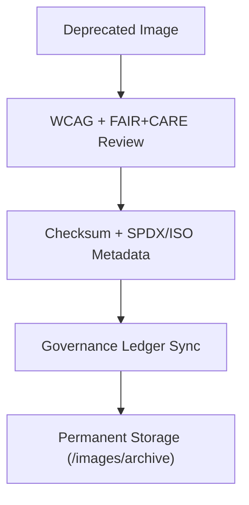

<div align="center">

# 🗄️ **Kansas Frontier Matrix — Archived Image Assets**
`web/public/images/archive/README.md`

**Purpose:**  
Preserve **retired or replaced public images** from prior KFM releases with full FAIR+CARE lineage, ISO 19115 metadata, and checksum provenance for transparent, ethical design stewardship under **MCP v6.3**.

[](../../../../../docs/README.md)
[](../../../../../LICENSE)
[](../../../../../docs/standards/faircare.md)
[]()

</div>

---

## 📘 Overview

The **Archived Image Assets** library provides immutable, accessible storage for deprecated backgrounds, banners, thumbnails, and governance visuals.  
Every asset is checksum-locked and linked to provenance ledgers, enabling reproducible audits and research into KFM’s visual evolution.

---

## 🗂️ Directory Layout

```
web/public/images/archive/
├── README.md
├── legacy-header-bg.png
├── legacy-dashboard-banner.jpg
├── legacy-footer-graphic.svg
├── legacy-map-preview.png
└── metadata.json
```

---

## 🧩 Archival Workflow



1. **Audit:** Accessibility, ethics, and sustainability reviewed.  
2. **Register:** SHA-256 checksum + license + alt/context metadata recorded.  
3. **Governance:** Archive entry linked to ledger with replacement mapping.  
4. **Storage:** Assets retained permanently; publicly viewable for documentation.

---

## ⚙️ Validation Contracts

| Contract | Purpose | Validator |
|----------|----------|-----------|
| Accessibility Lineage | Maintain WCAG AA history + alt text | `accessibility_scan.yml` |
| FAIR+CARE Archive | Ethical retention & cultural neutrality | `faircare-validate.yml` |
| Metadata Schema | ISO 19115 + SPDX archival conformance | `docs-lint.yml` |
| Telemetry | Track archival energy and carbon | `telemetry-export.yml` |

Artifacts stored in:
- `../../../../../docs/reports/audit/data_provenance_ledger.json`
- `../../../../../releases/v9.7.0/focus-telemetry.json`

---

## 🧠 FAIR+CARE Governance Matrix

| Principle | Implementation | Oversight |
|------------|----------------|------------|
| **Findable** | Indexed by checksum and retired version in metadata.json. | @kfm-data |
| **Accessible** | Open formats (PNG/JPG/SVG/GeoTIFF) with alt/context. | @kfm-accessibility |
| **Interoperable** | Metadata aligned with ISO 19115 and FAIR+CARE schema. | @kfm-architecture |
| **Reusable** | CC-BY 4.0 allows educational and historical reuse. | @kfm-design |
| **Collective Benefit** | Documents open design heritage and transparency. | @faircare-council |
| **Authority to Control** | Council certifies archival entries and replacements. | @kfm-governance |
| **Responsibility** | Archivists maintain checksums, lineage, and sustainability data. | @kfm-sustainability |
| **Ethics** | Assets contextualized neutrally; no misleading imagery. | @kfm-ethics |

---

## 🧾 Example Metadata Record

```json
{
  "id": "archived_images_v9.7.0",
  "file": "legacy-footer-graphic.svg",
  "retired_in": "v9.6.0",
  "replacement": "web/public/images/ui/footer/footer_branding_v9.7.0.svg",
  "retire_reason": "Updated brand tokens and AA contrast improvements",
  "checksum_sha256": "de98b33c47a9a1ec2b1d3b72b72614e5f71b74e32847379e59b7f1d9bb8cead3",
  "fairstatus": "archived",
  "timestamp": "2025-11-05T22:35:00Z"
}
```

---

## 🗂️ Archival Classifications

| File | Description | Replacement | Category |
|------|-------------|-------------|----------|
| `legacy-header-bg.png` | Deprecated header background image. | `ui/header/header_dynamic_v9.7.0.png` | UI |
| `legacy-dashboard-banner.jpg` | Former dashboard hero image. | `ui/header/dashboard_banner_dynamic_v9.7.0.png` | Web |
| `legacy-footer-graphic.svg` | Previous footer branding asset. | `ui/footer/footer_branding_v9.7.0.svg` | Governance |
| `legacy-map-preview.png` | Retired historical map thumbnail. | `maps/preview/preview_modern_v9.7.0.png` | Data |

---

## ♿ Accessibility & Preservation Standards

- Archived imagery includes **alt text**, **title**, and context in metadata.  
- Immutable under checksum governance; not deployed in live UI.  
- Color/contrast lineage retained for historical audits.  
- Sustainability metrics tracked per archival sync.

---

## 🌱 Sustainability Metrics

| Metric | Target | Verified By |
|-------|--------|-------------|
| Avg. File Size | ≤ 500 KB | Build metrics |
| Archive Energy | ≤ 0.04 Wh | Telemetry |
| Carbon Output | ≤ 0.06 gCO₂e | CI telemetry |
| Renewable Hosting | 100% RE100 | Infrastructure |

---

## 🕰️ Version History

| Version | Date | Author | Summary |
|----------|------|---------|----------|
| v9.7.0 | 2025-11-05 | KFM Core Team | Upgraded: telemetry schema v1, ISO/FAIR alignment, replacement mappings. |
| v9.6.0 | 2025-11-04 | KFM Core Team | Introduced archival lineage + checksum governance. |
| v9.5.0 | 2025-11-02 | KFM Core Team | Added sustainability audit integration and AA checks. |

---

<div align="center">

**© 2025 Kansas Frontier Matrix — CC-BY 4.0**  
Certified under **Master Coder Protocol v6.3** · FAIR+CARE Certified · Diamond⁹ Ω / Crown∞Ω Ultimate Certified  
[Back to Public Images](../README.md) · [Docs Portal](../../../../../docs/README.md)

</div>