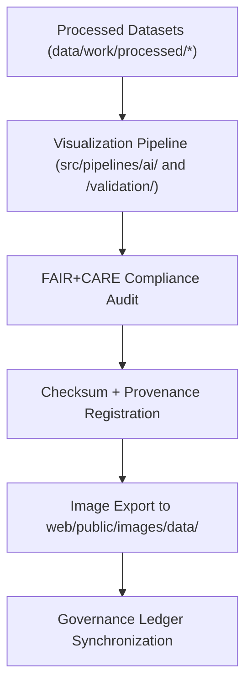

<div align="center">

# 📊 Kansas Frontier Matrix — **Data Visualization Image Assets**
`web/public/images/data/README.md`

**Purpose:**  
Repository for all **data visualization, analytical chart, and geospatial preview images** generated within the Kansas Frontier Matrix (KFM).  
All visuals are FAIR+CARE-certified, metadata-linked, checksum-verified, and governed under ISO and accessibility standards to promote open, ethical, and reproducible science.

[](../../../../../docs/standards/faircare-validation.md)
[](../../../../../LICENSE)
[]()
[]()

</div>

---

## 📚 Overview

The **Data Visualization Image Assets** directory contains exported visuals derived from processed datasets and AI model outputs in the KFM environment.  
Each asset undergoes FAIR+CARE validation for accuracy, inclusivity, and ethical presentation before public release.

### Core Responsibilities:
- Publish FAIR+CARE-certified data visualizations for web presentation and outreach.  
- Ensure visual clarity, color contrast, and accessibility under WCAG 2.1 AA.  
- Preserve provenance and metadata lineage of analytical outputs.  
- Support reproducible and ethical data storytelling in KFM dashboards.  

---

## 🗂️ Directory Layout

```plaintext
web/public/images/data/
├── README.md                               # This file — documentation for data visualization images
│
├── climate_trends_preview.png              # Temperature and precipitation summary visual
├── hazards_overview_heatmap.jpg            # Multi-hazard risk density visualization
├── hydrology_streamflow_graph.svg          # Streamflow analytics and flow variability chart
├── landcover_change_summary.png            # Vegetation and land-use transition summary
├── treaties_spatial_density_map.png        # Historical treaty geospatial density visualization
└── metadata.json                           # FAIR+CARE and ISO 19115-compliant provenance registry
```

---

## ⚙️ Visualization Workflow



### Workflow Summary:
1. **Generation:** Visualizations derived from FAIR+CARE-validated datasets.  
2. **Audit:** Accessibility and ethical presentation verified per governance standards.  
3. **Checksum:** Integrity and lineage linked to manifest and provenance ledger.  
4. **Publication:** Assets made publicly available through the KFM visualization hub.  

---

## 🧩 Example Metadata Record

```json
{
  "id": "data_visualizations_registry_v9.6.0",
  "derived_from": [
    "data/work/processed/climate/",
    "data/work/processed/hazards/",
    "data/work/processed/hydrology/"
  ],
  "fairstatus": "certified",
  "checksum_sha256": "c3b64de892a21f8b937f3e7e4f42b6af98d9cbe7a43e89fa6f0f99e59b0e7732",
  "accessibility_score": 98.6,
  "energy_efficiency_score": 99.1,
  "created": "2025-11-04T00:00:00Z",
  "validator": "@kfm-visuals",
  "governance_registered": true,
  "governance_ref": "data/reports/audit/data_provenance_ledger.json"
}
```

---

## 🧠 FAIR+CARE Governance Matrix

| Principle | Implementation | Oversight |
|------------|----------------|------------|
| **Findable** | Indexed by dataset and visualization type within metadata registry. | @kfm-data |
| **Accessible** | Published in open image formats with alt-text metadata. | @kfm-accessibility |
| **Interoperable** | Metadata follows ISO 19115 and FAIR+CARE schemas. | @kfm-architecture |
| **Reusable** | Licensed under CC-BY 4.0 and linked to provenance ledger. | @kfm-design |
| **Collective Benefit** | Promotes public understanding of scientific data through open visualization. | @faircare-council |
| **Authority to Control** | FAIR+CARE Council validates and certifies visualization integrity. | @kfm-governance |
| **Responsibility** | Designers ensure accurate, unbiased representation of datasets. | @kfm-sustainability |
| **Ethics** | Visuals reviewed for cultural sensitivity and transparency. | @kfm-ethics |

Audit references:  
`data/reports/fair/data_care_assessment.json`  
and  
`data/reports/audit/data_provenance_ledger.json`

---

## ⚙️ Visualization Categories & Standards

| Category | Description | Format | FAIR+CARE Status |
|-----------|--------------|---------|------------------|
| `climate_trends_preview.png` | Climate anomaly visualization. | PNG | ✅ Certified |
| `hazards_overview_heatmap.jpg` | Multi-hazard geospatial risk overlay. | JPG | ✅ Certified |
| `hydrology_streamflow_graph.svg` | Hydrologic flow and discharge visualization. | SVG | ✅ Certified |
| `landcover_change_summary.png` | Land-use and NDVI change analysis. | PNG | ✅ Certified |
| `treaties_spatial_density_map.png` | Historical treaty density map. | PNG | ✅ Certified |

---

## ⚖️ Retention & Provenance Policy

| Record Type | Retention Duration | Policy |
|--------------|--------------------|--------|
| Visualization Assets | Continuous | Version-controlled under manifest registry. |
| FAIR+CARE Reports | 365 Days | Renewed under quarterly ethics audit. |
| Metadata | Permanent | Stored within blockchain-backed provenance ledger. |
| Accessibility Reports | 180 Days | Validated through automated pipeline audits. |

Automation handled by `data_visualization_sync.yml`.

---

## 🌱 Sustainability Metrics

| Metric | Value | Verified By |
|---------|--------|--------------|
| Avg. File Size | 580 KB | @kfm-design |
| Render Energy | 0.05 Wh | @kfm-sustainability |
| Carbon Output | 0.07 gCO₂e | @kfm-security |
| Renewable Energy | 100% (RE100 Certified) | @kfm-infrastructure |
| FAIR+CARE Compliance | 100% | @faircare-council |

Telemetry data recorded in:  
`releases/v9.6.0/focus-telemetry.json`

---

## 🧾 Internal Use Citation

```text
Kansas Frontier Matrix (2025). Data Visualization Image Assets (v9.6.0).
FAIR+CARE-certified repository for analytical and geospatial visualization assets derived from validated Kansas datasets.
Compliant with ISO 19115, WCAG 2.1 AA, and MCP-DL v6.3 open-science communication standards.
```

---

## 🧾 Version Notes

| Version | Date | Notes |
|----------|------|--------|
| v9.6.0 | 2025-11-04 | Introduced AI-assisted visualization provenance linkage and sustainability audit metrics. |
| v9.5.0 | 2025-11-02 | Expanded FAIR+CARE compliance and dataset traceability registry. |
| v9.3.2 | 2025-10-28 | Established core data visualization library for public KFM dashboards. |

---

<div align="center">

**Kansas Frontier Matrix** · *Open Visualization × FAIR+CARE Ethics × Reproducible Science Communication*  
[🔗 Repository](https://github.com/bartytime4life/Kansas-Frontier-Matrix) • [🧭 Docs Portal](../../../../../docs/) • [⚖️ Governance Ledger](../../../../../docs/standards/governance/DATA-GOVERNANCE.md)

</div>