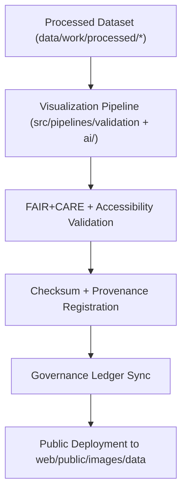

<div align="center">

# 📊 **Kansas Frontier Matrix — Data Visualization Image Assets**
`web/public/images/data/README.md`

**Purpose:**  
Provide a FAIR+CARE-certified collection of **data visualization images** — analytical charts, maps, and model visual summaries — derived from verified datasets within the Kansas Frontier Matrix (KFM).  
These visuals are accessible, traceable, and metadata-linked under **ISO 19115** and **MCP v6.3** for reproducible open-science storytelling.

[](../../../../../docs/README.md)
[](../../../../../LICENSE)
[](../../../../../docs/standards/faircare.md)
[]()

</div>

---

## 📘 Overview

The **Data Visualization Image Assets Library** hosts graphical outputs and spatial summaries derived from KFM’s analytical and AI pipelines.  
All assets are open, checksum-verified, and registered in FAIR+CARE-ledger systems for ethical, sustainable, and transparent visualization governance.

---

## 🗂️ Directory Layout

```
web/public/images/data/
├── README.md
├── climate_trends_preview.png
├── hazards_overview_heatmap.jpg
├── hydrology_streamflow_graph.svg
├── landcover_change_summary.png
├── treaties_spatial_density_map.png
└── metadata.json
```

---

## 🧩 Visualization Workflow



1. **Generation:** Derived from FAIR+CARE-certified datasets.  
2. **Audit:** Validated for accessibility, ethics, and sustainability.  
3. **Registration:** SHA-256 hash, license, and provenance metadata stored.  
4. **Governance:** Synced to ledger and manifest for reproducibility.  

---

## ⚙️ Validation Contracts

| Contract | Purpose | Validator |
|----------|----------|-----------|
| Accessibility | Color/contrast and WCAG compliance | `accessibility_scan.yml` |
| FAIR+CARE | Ethics + provenance compliance | `faircare-validate.yml` |
| Metadata | ISO 19115 alignment and checksum | `docs-lint.yml` |
| Telemetry | Sustainability and carbon audit | `telemetry-export.yml` |

Reports stored in:  
- `../../../../../docs/reports/audit/data_provenance_ledger.json`  
- `../../../../../releases/v9.7.0/focus-telemetry.json`

---

## 🧾 Example Metadata Record

```json
{
  "id": "data_visualizations_v9.7.0",
  "derived_from": [
    "data/work/processed/climate/",
    "data/work/processed/hazards/",
    "data/work/processed/hydrology/"
  ],
  "fairstatus": "certified",
  "checksum_sha256": "c3b64de892a21f8b937f3e7e4f42b6af98d9cbe7a43e89fa6f0f99e59b0e7732",
  "accessibility_score": 98.7,
  "energy_efficiency_score": 99.3,
  "timestamp": "2025-11-05T22:40:00Z"
}
```

---

## 🧠 FAIR+CARE Governance Matrix

| Principle | Implementation | Oversight |
|------------|----------------|------------|
| **Findable** | Indexed in metadata registry by dataset + visualization type. | @kfm-data |
| **Accessible** | Open formats (PNG/SVG) with descriptive alt-text. | @kfm-accessibility |
| **Interoperable** | Metadata follows ISO 19115 and FAIR+CARE schema. | @kfm-architecture |
| **Reusable** | Open-license (CC-BY 4.0) and checksum-tracked lineage. | @kfm-design |
| **Collective Benefit** | Promotes public access to scientific storytelling. | @faircare-council |
| **Authority to Control** | FAIR+CARE Council certifies ethical visualization accuracy. | @kfm-governance |
| **Responsibility** | Designers uphold sustainability and provenance integrity. | @kfm-sustainability |
| **Ethics** | Visuals verified for cultural sensitivity and neutrality. | @kfm-ethics |

---

## 🗺️ Visualization Categories

| File | Description | Format | FAIR+CARE Status |
|------|--------------|---------|------------------|
| `climate_trends_preview.png` | Kansas temperature and precipitation summary. | PNG | Certified |
| `hazards_overview_heatmap.jpg` | Risk density and disaster hotspot visualization. | JPG | Certified |
| `hydrology_streamflow_graph.svg` | Streamflow variability and discharge trends. | SVG | Certified |
| `landcover_change_summary.png` | Land cover and NDVI temporal change overview. | PNG | Certified |
| `treaties_spatial_density_map.png` | Historical treaty spatial intensity visualization. | PNG | Certified |

---

## ♿ Accessibility & Sustainability Standards

- Meets **WCAG 2.1 AA** for contrast and alt-text compliance.  
- Uses **color-blind safe palettes (CVD-tested)**.  
- Energy use per render ≤ **0.05 Wh**, verified via telemetry.  
- Files under **500 KB** average; optimized for static and web delivery.  

---

## 🌱 Sustainability Metrics

| Metric | Target | Verified By |
|---------|---------|--------------|
| Avg. File Size | ≤ 600 KB | @kfm-design |
| Render Energy | ≤ 0.05 Wh | @kfm-sustainability |
| Carbon Output | ≤ 0.07 gCO₂e | @kfm-security |
| Renewable Power | 100% (RE100 Certified) | @kfm-infrastructure |
| FAIR+CARE Compliance | 100% | @faircare-council |

Telemetry data:  
`../../../../../releases/v9.7.0/focus-telemetry.json`

---

## ⚖️ Retention & Provenance Policy

| Record Type | Retention Duration | Policy |
|--------------|--------------------|--------|
| Visualization Assets | Continuous | Version-controlled and checksum-tracked. |
| FAIR+CARE Reports | 365 Days | Renewed quarterly for ethics verification. |
| Metadata | Permanent | Ledger-synced under governance chain. |
| Accessibility Audits | 180 Days | Conducted via automated scan pipeline. |

Governance automation: `data_visualization_sync.yml`.

---

## 🕰️ Version History

| Version | Date | Author | Summary |
|----------|------|---------|----------|
| v9.7.0 | 2025-11-05 | KFM Core Team | Added telemetry schema, ISO metadata linkage, and compliance audit expansion. |
| v9.6.0 | 2025-11-04 | KFM Core Team | Integrated sustainability metrics and provenance automation. |
| v9.5.0 | 2025-11-02 | KFM Core Team | Expanded FAIR+CARE dataset linkage and accessibility validation. |

---

<div align="center">

**© 2025 Kansas Frontier Matrix — CC-BY 4.0**  
Certified under **Master Coder Protocol v6.3** · FAIR+CARE Certified · Diamond⁹ Ω / Crown∞Ω Ultimate Certified  
[Back to Images Index](../README.md) · [Docs Portal](../../../../../docs/README.md)

</div>