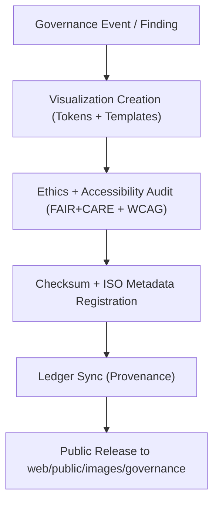

<div align="center">

# ⚖️ **Kansas Frontier Matrix — Governance and Ethics Image Assets**
`web/public/images/governance/README.md`

**Purpose:**  
Host and govern **FAIR+CARE-certified** visuals for ethics reporting, audit flows, council communications, and certification displays across the KFM ecosystem.  
Assets are licensed, checksum-verified, and metadata-aligned with **ISO 19115** under **MCP v6.3** for transparent governance communication.

[](../../../../../docs/README.md)
[](../../../../../LICENSE)
[](../../../../../docs/standards/faircare.md)
[]()

</div>

---

## 📘 Overview

This directory includes official images for **council banners, audit workflows, ledger visuals, ethics infographics**, and certification marks.  
Every file is traceable, accessible, and published with sustainability metrics for reproducible governance narratives.

---

## 🗂️ Directory Layout

```
web/public/images/governance/
├── README.md
├── faircare_certified_badge.svg
├── governance_council_banner.png
├── audit_workflow_diagram.svg
├── ledger_system_visualization.png
├── ethics_principles_infographic.svg
└── metadata.json
```

---

## 🧩 Governance Visualization Workflow



1. **Creation:** Designed using tokenized color palettes and accessible layouts.  
2. **Audit:** Validated for neutrality, inclusivity, and AA contrast.  
3. **Register:** SHA-256 and ISO metadata added to registry.  
4. **Publish:** Linked to manifest, SBOM, and ledger for verifiable provenance.

---

## ⚙️ Validation Contracts

| Contract | Purpose | Validator |
|----------|----------|-----------|
| FAIR+CARE | Ethics + provenance verification | `faircare-validate.yml` |
| Accessibility | WCAG 2.1 AA checks + alt-text enforcement | `accessibility_scan.yml` |
| Metadata | ISO 19115 + SPDX field validation | `docs-lint.yml` |
| Telemetry | Broadcast energy and carbon metrics | `telemetry-export.yml` |

Reports stored in:  
- `../../../../../docs/reports/audit/data_provenance_ledger.json`  
- `../../../../../releases/v9.7.0/focus-telemetry.json`

---

## 🧠 FAIR+CARE Governance Matrix

| Principle | Implementation | Oversight |
|------------|----------------|------------|
| **Findable** | Indexed by category and checksum in metadata.json. | @kfm-data |
| **Accessible** | CC-BY SVG/PNG assets with descriptive alt text. | @kfm-accessibility |
| **Interoperable** | Conforms to ISO 19115 + FAIR+CARE documentation schema. | @kfm-architecture |
| **Reusable** | Approved for reports, dashboards, and training. | @kfm-design |
| **Collective Benefit** | Enhances public understanding of ethics and governance. | @faircare-council |
| **Authority to Control** | Council validates additions and updates. | @kfm-governance |
| **Responsibility** | Designers track checksum lineage and sustainability. | @kfm-sustainability |
| **Ethics** | Graphics reviewed for neutral and respectful representation. | @kfm-ethics |

---

## 🧾 Example Metadata Record

```json
{
  "id": "governance_images_v9.7.0",
  "file": "audit_workflow_diagram.svg",
  "category": "audit",
  "wcag": "2.1 AA",
  "license": "CC-BY 4.0",
  "checksum_sha256": "4c7a9b83cbdc3d6f85a33a247fa19b192be23a7e63e4c7b228ef2399b933dbcc",
  "fairstatus": "certified",
  "timestamp": "2025-11-05T22:55:00Z"
}
```

---

## 🗂️ Governance Image Classification

| File | Description | Category | FAIR+CARE Status |
|------|-------------|----------|------------------|
| `faircare_certified_badge.svg` | Official FAIR+CARE certification emblem. | Certification | Certified |
| `governance_council_banner.png` | Banner for council communications. | Governance | Certified |
| `audit_workflow_diagram.svg` | Workflow for audits and ethics reviews. | Audit | Certified |
| `ledger_system_visualization.png` | Ledger architecture visualization. | Governance | Certified |
| `ethics_principles_infographic.svg` | FAIR+CARE ethics overview. | Education | Certified |

---

## ♿ Accessibility & Sustainability Standards

- Alt-text mandatory; color-blind safe palettes; AA contrast.  
- Images optimized (≤ 500 KB avg); energy ≤ 0.04 Wh per render.  
- Metadata includes context + purpose to avoid misinterpretation.  
- Telemetry captured per release for sustainability audits.

---

## ⚖️ Retention & Provenance Policy

| Record Type | Retention | Policy |
|--------------|-----------|--------|
| Active Assets | Continuous | Versioned and certified via governance manifest. |
| Metadata | Permanent | Ledger-synced under blockchain governance. |
| Audit Reports | 365 Days | Renewed quarterly. |
| Accessibility Reviews | 180 Days | Automated scans + human review. |

Automation: `governance_image_sync.yml`.

---

## 🕰️ Version History

| Version | Date | Author | Summary |
|----------|------|---------|----------|
| v9.7.0 | 2025-11-05 | KFM Core Team | Upgraded governance schema + telemetry integration; clarified classifications. |
| v9.6.0 | 2025-11-04 | KFM Core Team | Added checksum lineage and ISO alignment. |
| v9.5.0 | 2025-11-02 | KFM Core Team | Expanded FAIR+CARE audit visualization set. |

---

<div align="center">

**© 2025 Kansas Frontier Matrix — CC-BY 4.0**  
Governed under **Master Coder Protocol v6.3** · FAIR+CARE Certified · Diamond⁹ Ω / Crown∞Ω Ultimate Certified  
[Back to Images Index](../README.md) · [Docs Portal](../../../../../docs/README.md)

</div>