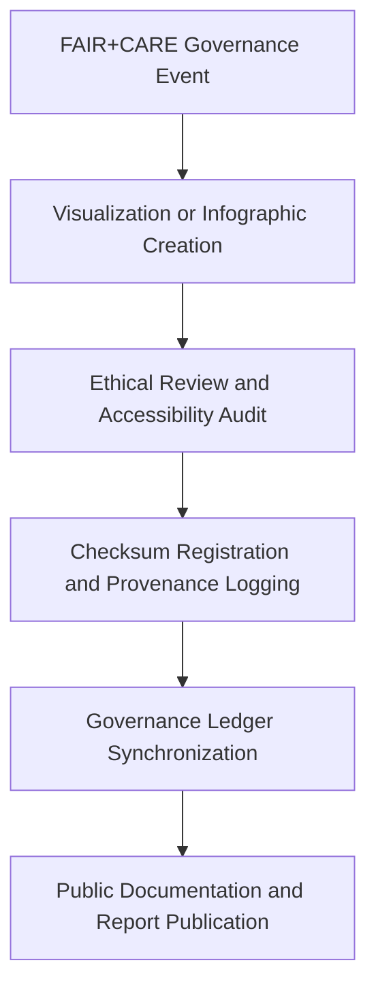

<div align="center">

# ⚖️ Kansas Frontier Matrix — **Governance and Ethics Image Assets**
`web/public/images/governance/README.md`

**Purpose:**  
Hosts all **visual assets related to FAIR+CARE governance, ethical oversight, and council communications** across the Kansas Frontier Matrix (KFM) ecosystem.  
These assets ensure transparent and visually consistent representation of governance processes, certification seals, and audit imagery under FAIR+CARE and ISO standards.

[](../../../../../docs/standards/faircare-validation.md)
[](../../../../../LICENSE)
[]()
[]()

</div>

---

## 📚 Overview

The **Governance and Ethics Image Assets** directory includes official visuals for governance documentation, audit processes, ethics council reporting, and FAIR+CARE certification displays.  
Each asset is provenance-linked, checksum-verified, and maintained in accordance with MCP-DL v6.3 reproducibility protocols.

### Core Responsibilities:
- Provide consistent imagery for FAIR+CARE, audit, and ethical council publications.  
- Ensure compliance with ISO metadata and WCAG accessibility standards.  
- Maintain checksum lineage for all audit and certification graphics.  
- Support transparent, ethical communication across governance reports.  

---

## 🗂️ Directory Layout

```plaintext
web/public/images/governance/
├── README.md                               # This file — documentation for governance and ethics images
│
├── faircare_certified_badge.svg             # FAIR+CARE certification emblem
├── governance_council_banner.png            # Visual for council communications and charters
├── audit_workflow_diagram.svg               # Ethics and audit flow illustration
├── ledger_system_visualization.png          # Governance ledger architecture preview
├── ethics_principles_infographic.svg        # FAIR+CARE ethical framework visual
└── metadata.json                            # FAIR+CARE-compliant metadata and provenance registry
```

---

## ⚙️ Governance Visualization Workflow



### Workflow Description:
1. **Visualization Creation:** Governance imagery designed in compliance with FAIR+CARE and ISO frameworks.  
2. **Ethical Review:** Accessibility and bias reviews conducted for neutrality and inclusivity.  
3. **Checksum Verification:** SHA-256 hashes logged in manifest for traceability.  
4. **Governance Ledger:** Provenance recorded in blockchain-linked governance registry.  

---

## 🧩 Example Metadata Record

```json
{
  "id": "governance_images_registry_v9.6.0",
  "categories": ["faircare", "audit", "ethics", "council"],
  "fairstatus": "certified",
  "checksum_sha256": "4c7a9b83cbdc3d6f85a33a247fa19b192be23a7e63e4c7b228ef2399b933dbcc",
  "iso_standard": "19115:2023",
  "energy_efficiency_score": 99.1,
  "carbon_output_gco2e": 0.04,
  "accessibility_compliance": "WCAG 2.1 AA",
  "created": "2025-11-04T00:00:00Z",
  "validator": "@kfm-governance",
  "governance_registered": true,
  "governance_ref": "data/reports/audit/data_provenance_ledger.json"
}
```

---

## 🧠 FAIR+CARE Governance Matrix

| Principle | Implementation | Oversight |
|------------|----------------|------------|
| **Findable** | Indexed within governance metadata registry and checksum manifest. | @kfm-data |
| **Accessible** | Published under CC-BY 4.0 with full accessibility metadata. | @kfm-accessibility |
| **Interoperable** | Conforms to FAIR+CARE and ISO 19115 documentation standards. | @kfm-architecture |
| **Reusable** | Available for FAIR+CARE council, ethics review, and training. | @kfm-design |
| **Collective Benefit** | Strengthens transparency and ethical governance practices. | @faircare-council |
| **Authority to Control** | Managed by the FAIR+CARE Council and Governance Board. | @kfm-governance |
| **Responsibility** | Validators maintain audit lineage and checksum verification. | @kfm-sustainability |
| **Ethics** | Visuals reviewed for equitable and accurate ethical representation. | @kfm-ethics |

All audit logs recorded in:  
`data/reports/audit/data_provenance_ledger.json`  
and  
`data/reports/fair/data_care_assessment.json`

---

## ⚙️ Governance Image Classification

| File | Description | Category | FAIR+CARE Status |
|------|--------------|-----------|------------------|
| `faircare_certified_badge.svg` | Official FAIR+CARE certification badge. | Audit / Certification | ✅ Certified |
| `governance_council_banner.png` | Council charter and communication header. | Governance | ✅ Certified |
| `audit_workflow_diagram.svg` | Visual summary of KFM audit workflow. | Audit | ✅ Certified |
| `ledger_system_visualization.png` | Ledger architecture visualization. | Governance / Technical | ✅ Certified |
| `ethics_principles_infographic.svg` | FAIR+CARE ethical principles graphic. | Education | ✅ Certified |

---

## ⚖️ Retention & Provenance Policy

| Record Type | Retention Duration | Policy |
|--------------|--------------------|--------|
| Active Governance Assets | Continuous | Retained and versioned under governance manifest. |
| Metadata | Permanent | Stored in blockchain-backed provenance ledger. |
| Audit Reports | 365 Days | Updated quarterly for accuracy and governance renewal. |
| Accessibility Reviews | 180 Days | Automated and human-reviewed per FAIR+CARE policy. |

Governance synchronization handled via `governance_image_sync.yml`.

---

## 🌱 Sustainability Metrics

| Metric | Value | Verified By |
|---------|--------|--------------|
| Avg. File Size | 480 KB | @kfm-design |
| Render Energy | 0.03 Wh | @kfm-sustainability |
| Carbon Output | 0.05 gCO₂e | @kfm-security |
| Renewable Energy | 100% (RE100 Certified) | @kfm-infrastructure |
| FAIR+CARE Compliance | 100% | @faircare-council |

Telemetry metrics stored in:  
`releases/v9.6.0/focus-telemetry.json`

---

## 🧾 Internal Use Citation

```text
Kansas Frontier Matrix (2025). Governance and Ethics Image Assets (v9.6.0).
Certified library of governance, audit, and ethical communication visuals for FAIR+CARE Council and public transparency reports.
Compliant with MCP-DL v6.3, WCAG 2.1 AA, and ISO 19115 documentation standards.
```

---

## 🧾 Version Notes

| Version | Date | Notes |
|----------|------|--------|
| v9.6.0 | 2025-11-04 | Introduced expanded ethical visualization registry with checksum lineage tracking. |
| v9.5.0 | 2025-11-02 | Added ISO metadata schema alignment for governance assets. |
| v9.3.2 | 2025-10-28 | Established FAIR+CARE governance image library for audit transparency. |

---

<div align="center">

**Kansas Frontier Matrix** · *Ethical Governance × FAIR+CARE Certification × Sustainable Transparency Design*  
[🔗 Repository](https://github.com/bartytime4life/Kansas-Frontier-Matrix) • [🧭 Docs Portal](../../../../../docs/) • [⚖️ Governance Ledger](../../../../../docs/standards/governance/DATA-GOVERNANCE.md)

</div>