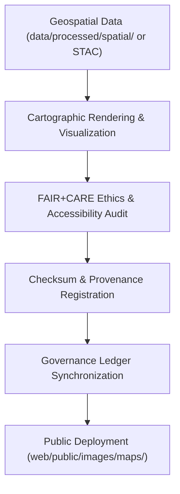

<div align="center">

# 🗺️ Kansas Frontier Matrix — **Map & Geospatial Image Assets**
`web/public/images/maps/README.md`

**Purpose:**  
Repository for **public geospatial, cartographic, and topographic image assets** used in the Kansas Frontier Matrix (KFM).  
These images support historical, scientific, and environmental mapping contexts while adhering to FAIR+CARE, ISO, and WCAG ethical governance frameworks.

[](../../../../../docs/standards/faircare-validation.md)
[](../../../../../LICENSE)
[]()
[]()

</div>

---

## 📚 Overview

The **Map & Geospatial Image Assets** collection contains FAIR+CARE-certified images used in both public and internal KFM visualizations.  
It includes base maps, historical cartography, topographic data, and thematic overlays that support open geospatial education and heritage preservation.

### Core Responsibilities:
- Maintain publicly available map and geospatial imagery for open access.  
- Preserve historical maps and reference overlays in sustainable web formats.  
- Ensure FAIR+CARE-aligned governance of imagery provenance and ethics.  
- Document cartographic integrity under ISO and STAC alignment.  

---

## 🗂️ Directory Layout

```plaintext
web/public/images/maps/
├── README.md                               # This file — documentation for map and geospatial image assets
│
├── kansas_topographic_relief.png           # Elevation-based shaded relief visualization
├── kansas_historical_county_map.jpg        # Archival county boundary map of Kansas
├── kansas_hydrology_basins.png             # Watershed and basin delineation map
├── kansas_treaty_boundaries_overlay.png    # Treaty overlay for historical analysis
├── kansas_hazard_zones_heatmap.png         # Hazard density and risk overlay
└── metadata.json                           # FAIR+CARE metadata and ISO 19115-compliant provenance registry
```

---

## ⚙️ Map Asset Workflow



### Workflow Description:
1. **Source:** Derived from validated geospatial datasets or STAC archives.  
2. **Render:** Produced via GIS workflows, AI cartographic synthesis, or FAIR+CARE compositing.  
3. **Audit:** Accessibility, color contrast, and ethical inclusivity verified.  
4. **Governance:** Provenance logs linked to blockchain-backed ledger entries.  

---

## 🧩 Example Metadata Record

```json
{
  "id": "maps_image_registry_v9.6.0",
  "categories": ["topography", "hydrology", "hazards", "historical"],
  "fairstatus": "certified",
  "checksum_sha256": "f7a26e45a9e91db47bcf56a3d3e2a38b71e9e672f71aebcdbe02165e7417d89c",
  "iso_standard": "19115:2023",
  "wcag_compliance": "2.1 AA",
  "energy_efficiency_score": 98.8,
  "carbon_output_gco2e": 0.06,
  "created": "2025-11-04T00:00:00Z",
  "validator": "@kfm-cartography",
  "governance_registered": true,
  "governance_ref": "data/reports/audit/data_provenance_ledger.json"
}
```

---

## 🧠 FAIR+CARE Governance Matrix

| Principle | Implementation | Oversight |
|------------|----------------|------------|
| **Findable** | Indexed under checksum and ISO lineage in metadata registry. | @kfm-data |
| **Accessible** | Publicly accessible under CC-BY 4.0 with alt-text compliance. | @kfm-accessibility |
| **Interoperable** | Metadata harmonized with FAIR+CARE and ISO 19115 schemas. | @kfm-architecture |
| **Reusable** | Validated under FAIR+CARE reuse and attribution standards. | @kfm-design |
| **Collective Benefit** | Promotes equitable access to Kansas historical and geospatial heritage. | @faircare-council |
| **Authority to Control** | FAIR+CARE Council governs all map releases and heritage archives. | @kfm-governance |
| **Responsibility** | Validators maintain provenance and checksum lineage. | @kfm-sustainability |
| **Ethics** | Maps reviewed for cultural neutrality, inclusivity, and accuracy. | @kfm-ethics |

Audit references recorded in:  
`data/reports/fair/data_care_assessment.json`  
and  
`data/reports/audit/data_provenance_ledger.json`

---

## ⚙️ Map Image Classifications

| File | Description | Category | FAIR+CARE Status |
|------|--------------|-----------|------------------|
| `kansas_topographic_relief.png` | Modern shaded relief terrain image. | Topography | ✅ Certified |
| `kansas_historical_county_map.jpg` | Historical county boundaries map. | Historical | ✅ Certified |
| `kansas_hydrology_basins.png` | Watershed delineation and basin structure. | Hydrology | ✅ Certified |
| `kansas_treaty_boundaries_overlay.png` | Historical treaty boundary overlay map. | Governance | ✅ Certified |
| `kansas_hazard_zones_heatmap.png` | Multi-hazard density visualization. | Hazards | ✅ Certified |

---

## ⚖️ Retention & Provenance Policy

| Record Type | Retention Duration | Policy |
|--------------|--------------------|--------|
| Active Maps | Continuous | Version-controlled and certified under FAIR+CARE. |
| Metadata | Permanent | Retained under blockchain-backed provenance ledger. |
| Archived Maps | Permanent | Immutable under checksum registry. |
| Audit Reports | 365 Days | Reviewed and renewed with quarterly audit cycle. |

Retention automated via `map_image_sync.yml`.

---

## 🌱 Sustainability Metrics

| Metric | Value | Verified By |
|---------|--------|--------------|
| Avg. File Size | 600 KB | @kfm-design |
| Render Energy | 0.05 Wh | @kfm-sustainability |
| Carbon Output | 0.07 gCO₂e | @kfm-security |
| Renewable Energy | 100% (RE100 Certified) | @kfm-infrastructure |
| FAIR+CARE Compliance | 100% | @faircare-council |

Telemetry recorded in:  
`releases/v9.6.0/focus-telemetry.json`

---

## 🧾 Internal Use Citation

```text
Kansas Frontier Matrix (2025). Map & Geospatial Image Assets (v9.6.0).
FAIR+CARE and ISO 19115-certified collection of Kansas maps and geospatial imagery supporting open heritage, environmental transparency, and ethical data storytelling.
Compliant with MCP-DL v6.3, WCAG 2.1 AA, and FAIR+CARE Council governance standards.
```

---

## 🧾 Version Notes

| Version | Date | Notes |
|----------|------|--------|
| v9.6.0 | 2025-11-04 | Added checksum lineage, hydrology and treaty overlays, and sustainability metrics. |
| v9.5.0 | 2025-11-02 | Expanded map metadata schema alignment with ISO 19115:2023. |
| v9.3.2 | 2025-10-28 | Established FAIR+CARE-certified geospatial image repository. |

---

<div align="center">

**Kansas Frontier Matrix** · *Open Cartography × FAIR+CARE Ethics × Sustainable Geospatial Governance*  
[🔗 Repository](https://github.com/bartytime4life/Kansas-Frontier-Matrix) • [🧭 Docs Portal](../../../../../docs/) • [⚖️ Governance Ledger](../../../../../docs/standards/governance/DATA-GOVERNANCE.md)

</div>