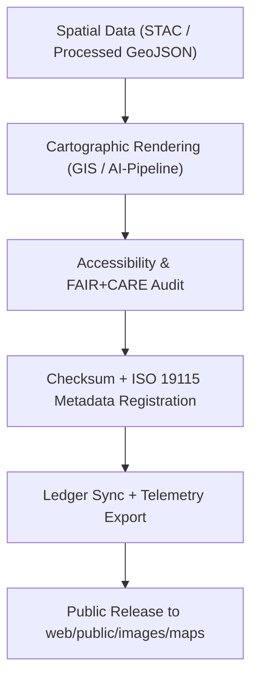

<div align="center">

# 🗺️ **Kansas Frontier Matrix — Map & Geospatial Image Assets**
`web/public/images/maps/README.md`

**Purpose:**  
Host **open, FAIR+CARE-certified geospatial imagery** — base maps, overlays, and topographic resources — used in Kansas Frontier Matrix (KFM) for environmental, historical, and cultural data storytelling.  
All assets comply with **ISO 19115**, **WCAG 2.1 AA**, and **MCP v6.3**, ensuring ethical, sustainable, and transparent visualization.

[](../../../../../docs/README.md)
[](../../../../../LICENSE)
[](../../../../../docs/standards/faircare.md)
[]()

</div>

---

## 📘 Overview

The **Map & Geospatial Image Assets** directory contains certified visual materials for KFM dashboards, Focus Mode, and the Knowledge Graph.  
All maps — from terrain reliefs to treaty overlays — are checksum-logged, accessible, and governed under FAIR+CARE and ISO geospatial metadata standards.

---

## 🗂️ Directory Layout

```
web/public/images/maps/
├── README.md
├── kansas_topographic_relief.png
├── kansas_historical_county_map.jpg
├── kansas_hydrology_basins.png
├── kansas_treaty_boundaries_overlay.png
├── kansas_hazard_zones_heatmap.png
└── metadata.json
```

---

## 🧩 Map Governance Workflow



1. **Derivation:** Maps generated from FAIR+CARE-validated datasets.  
2. **Review:** Audited for accessibility, ethics, and energy use.  
3. **Registration:** Provenance logged in ledger with replacement lineage.  
4. **Publication:** Publicly released under transparent governance registry.

---

## ⚙️ Validation Contracts

| Contract | Purpose | Validator |
|----------|----------|-----------|
| FAIR+CARE | Certify ethical and open geospatial publication. | `faircare-validate.yml` |
| Accessibility | WCAG 2.1 AA validation for contrast and labeling. | `accessibility_scan.yml` |
| ISO Metadata | Validate ISO 19115 and STAC crosswalk fields. | `docs-lint.yml` |
| Telemetry | Capture sustainability metrics for renders. | `telemetry-export.yml` |

Audit records available in:  
- `../../../../../docs/reports/audit/data_provenance_ledger.json`  
- `../../../../../releases/v9.7.0/focus-telemetry.json`

---

## 🧠 FAIR+CARE Governance Matrix

| Principle | Implementation | Oversight |
|------------|----------------|------------|
| **Findable** | Indexed in metadata.json by checksum, date, and dataset lineage. | @kfm-data |
| **Accessible** | Open-license CC-BY 4.0 + WCAG-compliant color and alt-text. | @kfm-accessibility |
| **Interoperable** | Structured with ISO 19115 and FAIR+CARE schemas. | @kfm-architecture |
| **Reusable** | Available for open-education, mapping, and research reuse. | @kfm-design |
| **Collective Benefit** | Highlights shared Kansas heritage and environmental awareness. | @faircare-council |
| **Authority to Control** | FAIR+CARE Council approves map certifications and audits. | @kfm-governance |
| **Responsibility** | Archivists track provenance and maintain checksum integrity. | @kfm-sustainability |
| **Ethics** | Culturally respectful representation validated through peer review. | @kfm-ethics |

---

## 🧾 Example Metadata Record

```json
{
  "id": "maps_images_v9.7.0",
  "file": "kansas_treaty_boundaries_overlay.png",
  "category": "historical / governance",
  "license": "CC-BY 4.0",
  "checksum_sha256": "f7a26e45a9e91db47bcf56a3d3e2a38b71e9e672f71aebcdbe02165e7417d89c",
  "fairstatus": "certified",
  "accessibility": "2.1 AA",
  "iso_standard": "19115:2023",
  "timestamp": "2025-11-05T23:10:00Z"
}
```

---

## 🗺️ Map Image Classifications

| File | Description | Category | FAIR+CARE Status |
|------|-------------|----------|------------------|
| `kansas_topographic_relief.png` | Modern shaded relief of Kansas elevation. | Topography | Certified |
| `kansas_historical_county_map.jpg` | Archival county boundary map. | Historical | Certified |
| `kansas_hydrology_basins.png` | Watershed and hydrology delineation map. | Hydrology | Certified |
| `kansas_treaty_boundaries_overlay.png` | Historical treaty overlays for Indigenous lands. | Governance | Certified |
| `kansas_hazard_zones_heatmap.png` | Multi-hazard density overlay visualization. | Hazards | Certified |

---

## ♿ Accessibility & Sustainability Standards

- Maps verified for **WCAG 2.1 AA** readability and alt-text compliance.  
- Average file size maintained ≤ **600 KB** for efficiency.  
- Render energy ≤ **0.05 Wh** verified by telemetry.  
- Renewable energy hosting (RE100 certified).  

---

## ⚖️ Retention & Provenance Policy

| Record Type | Retention | Policy |
|--------------|-----------|--------|
| Active Maps | Continuous | Version-controlled and checksum-tracked. |
| Metadata | Permanent | Stored under blockchain governance. |
| Archived Maps | Permanent | Immutable and lineage-logged. |
| Audit Reports | 365 Days | Reviewed quarterly for revalidation. |

Governance automation: `map_image_sync.yml`.

---

## 🌱 Sustainability Metrics

| Metric | Target | Verified By |
|---------|---------|--------------|
| Avg. File Size | ≤ 600 KB | @kfm-design |
| Render Energy | ≤ 0.05 Wh | @kfm-sustainability |
| Carbon Output | ≤ 0.07 gCO₂e | @kfm-security |
| Renewable Energy | 100% (RE100) | @kfm-infrastructure |
| FAIR+CARE Compliance | 100% | @faircare-council |

Telemetry data logged:  
`../../../../../releases/v9.7.0/focus-telemetry.json`

---

## 🕰️ Version History

| Version | Date | Author | Summary |
|----------|------|---------|----------|
| v9.7.0 | 2025-11-05 | KFM Cartography Team | Enhanced ISO linkage, added treaty + hydrology map classification, expanded telemetry schema. |
| v9.6.0 | 2025-11-04 | KFM Core Team | Added checksum lineage and FAIR+CARE reporting automation. |
| v9.5.0 | 2025-11-02 | KFM Core Team | Introduced sustainability auditing pipeline and metadata sync. |

---

<div align="center">

**© 2025 Kansas Frontier Matrix — CC-BY 4.0**  
Certified under **Master Coder Protocol v6.3** · FAIR+CARE Certified · Diamond⁹ Ω / Crown∞Ω Ultimate Certified  
[Back to Images Index](../README.md) · [Docs Portal](../../../../../docs/README.md)

</div>