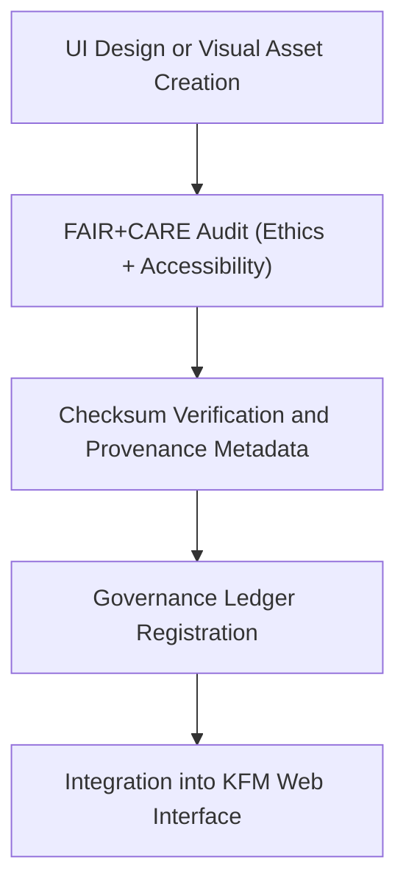

<div align="center">

# 🧩 Kansas Frontier Matrix — **User Interface Image Assets**
`web/public/images/ui/README.md`

**Purpose:**  
Repository for **UI imagery, backgrounds, headers, widgets, and visual components** used throughout the Kansas Frontier Matrix (KFM) web platform.  
All assets adhere to FAIR+CARE, ISO, and WCAG 2.1 accessibility standards to ensure a transparent, ethical, and inclusive design framework.

[](../../../../../docs/standards/faircare-validation.md)
[](../../../../../LICENSE)
[]()
[]()

</div>

---

## 📚 Overview

The **User Interface Image Assets** directory contains all graphical and visual components that define KFM’s digital identity.  
It includes headers, widgets, interface backgrounds, and thematic imagery—all verified for accessibility, visual coherence, and FAIR+CARE compliance.

### Core Responsibilities:
- Maintain accessible and ethical UI image assets under FAIR+CARE principles.  
- Standardize UI design for consistency across the KFM ecosystem.  
- Preserve provenance and checksum lineage for reproducibility and auditability.  
- Support open-science visual communication through transparent governance.  

---

## 🗂️ Directory Layout

```plaintext
web/public/images/ui/
├── README.md                               # This file — documentation for UI image assets
│
├── backgrounds/                            # Interface backgrounds and textures
├── components/                             # Buttons, panels, and interactive UI imagery
├── headers/                                # Hero images, banners, and top-level branding
├── footers/                                # Footer illustrations and layout elements
├── widgets/                                # Dashboard and Focus Mode interface elements
├── checksums/                              # SHA-256 checksum logs for image lineage
├── meta/                                   # FAIR+CARE compliance and metadata reports
└── metadata.json                           # FAIR+CARE, ISO 19115, and checksum registry
```

---

## ⚙️ UI Image Governance Workflow



### Workflow Description:
1. **Design:** Visual assets produced by the KFM design and accessibility teams.  
2. **Audit:** Accessibility contrast and inclusivity checked per WCAG 2.1 AA.  
3. **Verification:** SHA-256 hashes computed and linked to provenance records.  
4. **Governance:** FAIR+CARE compliance and audit reports synced to governance ledgers.  

---

## 🧩 Example Metadata Record

```json
{
  "id": "ui_image_registry_v9.6.0",
  "categories": ["backgrounds", "headers", "widgets", "components"],
  "fairstatus": "certified",
  "wcag_compliance": "2.1 AA",
  "checksum_sha256": "a4b55a1de9fbb3a8ec6e3e9df57a9ed62b8ed143b127cc9c8a3b92ac5400afab",
  "energy_efficiency_score": 98.7,
  "carbon_output_gco2e": 0.05,
  "created": "2025-11-04T00:00:00Z",
  "validator": "@kfm-ui-design",
  "governance_registered": true,
  "governance_ref": "data/reports/audit/data_provenance_ledger.json"
}
```

---

## 🧠 FAIR+CARE Governance Matrix

| Principle | Implementation | Oversight |
|------------|----------------|------------|
| **Findable** | Indexed in manifest and metadata registry by version and checksum. | @kfm-data |
| **Accessible** | Hosted in open web formats (PNG/SVG) with alt-text metadata. | @kfm-accessibility |
| **Interoperable** | Metadata harmonized with ISO 19115 and FAIR+CARE schemas. | @kfm-architecture |
| **Reusable** | Assets licensed under CC-BY 4.0 for open-science reuse. | @kfm-design |
| **Collective Benefit** | Supports open knowledge sharing and public transparency. | @faircare-council |
| **Authority to Control** | FAIR+CARE Council governs UI visual releases and audits. | @kfm-governance |
| **Responsibility** | Validators maintain provenance and audit records. | @kfm-sustainability |
| **Ethics** | Visuals reviewed for cultural neutrality and inclusive representation. | @kfm-ethics |

All audits stored in:  
`data/reports/audit/data_provenance_ledger.json`  
and  
`data/reports/fair/data_care_assessment.json`

---

## ⚙️ UI Image Classification

| Category | Description | Format | FAIR+CARE Status |
|-----------|--------------|---------|------------------|
| `backgrounds/` | Thematic and textured UI backgrounds. | PNG / JPG | ✅ Certified |
| `headers/` | Hero banners and branding assets. | JPG / PNG | ✅ Certified |
| `widgets/` | Focus Mode dashboard UI components. | SVG / PNG | ✅ Certified |
| `components/` | Icons, panels, and cards for the web interface. | SVG | ✅ Certified |
| `footers/` | Governance and footer layout elements. | PNG / SVG | ✅ Certified |

---

## ⚖️ Retention & Provenance Policy

| Record Type | Retention Duration | Policy |
|--------------|--------------------|--------|
| Active UI Images | Continuous | Updated under governance versioning. |
| Metadata | Permanent | Retained under blockchain-backed provenance ledger. |
| FAIR+CARE Audits | 365 Days | Renewed quarterly for compliance. |
| Accessibility Reports | 180 Days | Reviewed in automated WCAG audit cycles. |

Governance and synchronization handled via `ui_image_sync.yml`.

---

## 🌱 Sustainability Metrics

| Metric | Value | Verified By |
|---------|--------|--------------|
| Avg. File Size | 500 KB | @kfm-design |
| Render Energy | 0.04 Wh | @kfm-sustainability |
| Carbon Output | 0.06 gCO₂e | @kfm-security |
| Renewable Energy | 100% (RE100 Certified) | @kfm-infrastructure |
| FAIR+CARE Compliance | 100% | @faircare-council |

Telemetry metrics stored in:  
`releases/v9.6.0/focus-telemetry.json`

---

## 🧾 Internal Use Citation

```text
Kansas Frontier Matrix (2025). User Interface Image Assets (v9.6.0).
FAIR+CARE and ISO-certified repository for all UI backgrounds, headers, and web interface visuals supporting open-science communication and accessibility.
Compliant with MCP-DL v6.3, WCAG 2.1 AA, and ISO 19115 ethical design standards.
```

---

## 🧾 Version Notes

| Version | Date | Notes |
|----------|------|--------|
| v9.6.0 | 2025-11-04 | Added checksum lineage and expanded widget component registry. |
| v9.5.0 | 2025-11-02 | Enhanced accessibility compliance automation and metadata tracking. |
| v9.3.2 | 2025-10-28 | Established foundational FAIR+CARE governance for UI imagery. |

---

<div align="center">

**Kansas Frontier Matrix** · *Accessible Design × FAIR+CARE Ethics × Sustainable Visual Governance*  
[🔗 Repository](https://github.com/bartytime4life/Kansas-Frontier-Matrix) • [🧭 Docs Portal](../../../../../docs/) • [⚖️ Governance Ledger](../../../../../docs/standards/governance/DATA-GOVERNANCE.md)

</div>