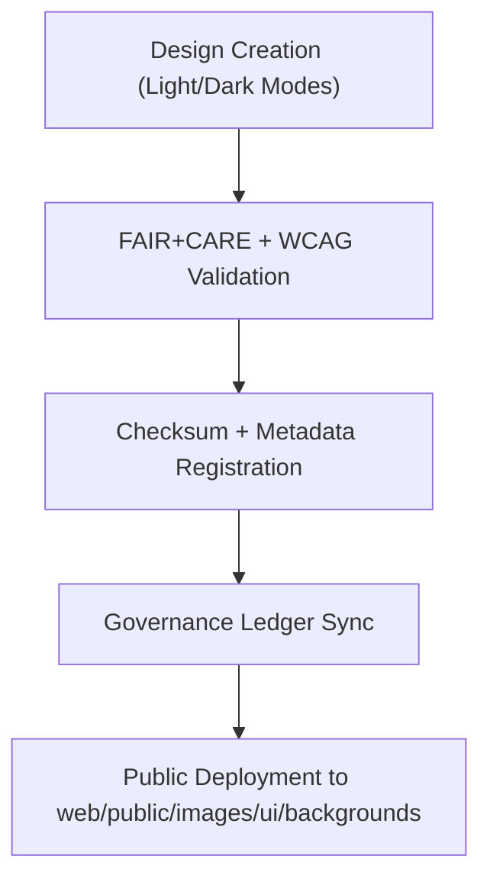

<div align="center">

# 🌅 **Kansas Frontier Matrix — UI Background Image Assets**
`web/public/images/ui/backgrounds/README.md`

**Purpose:**  
Maintain the **background and texture imagery** that defines the visual foundation of KFM’s web application interface.  
All images are FAIR+CARE-certified, ISO 19115 metadata-aligned, and optimized for low-carbon, accessible rendering in compliance with MCP-DL v6.3.

[](../../../../../../docs/README.md)
[](../../../../../../LICENSE)
[](../../../../../../docs/standards/faircare.md)
[]()

</div>

---

## 📘 Overview

The **UI Background Image Assets** directory provides reusable and accessible interface backgrounds for the Kansas Frontier Matrix (KFM) application and dashboards.  
Every asset is contrast-tested, color-safe, and documented under FAIR+CARE and ISO governance frameworks.

---

## 🗂️ Directory Layout

```
web/public/images/ui/backgrounds/
├── README.md
├── bg_default_light.png
├── bg_default_dark.png
├── bg_texture_1.jpg
├── bg_texture_2.jpg
└── metadata.json
```

---

## 🧩 Background Asset Workflow



1. **Design:** Created by KFM’s design team for visual harmony and accessibility.  
2. **Validation:** Audited for WCAG 2.1 AA contrast and motion safety.  
3. **Registration:** Checksum, license, and metadata recorded for governance.  
4. **Deployment:** Assets integrated into UI layers via manifest automation.

---

## ⚙️ Validation Contracts

| Contract | Function | Validator |
|----------|-----------|-----------|
| Accessibility | WCAG 2.1 AA compliance testing | `accessibility_scan.yml` |
| FAIR+CARE | Ethical representation + metadata audit | `faircare-validate.yml` |
| Metadata | ISO 19115 field verification | `docs-lint.yml` |
| Telemetry | Sustainability metrics export | `telemetry-export.yml` |

Reports logged under:  
`../../../../../../docs/reports/audit/data_provenance_ledger.json`

---

## 🧠 FAIR+CARE Governance Matrix

| Principle | Implementation | Oversight |
|------------|----------------|------------|
| **Findable** | Indexed in manifest with checksum lineage. | @kfm-data |
| **Accessible** | Open CC-BY assets with descriptive alt-text. | @kfm-accessibility |
| **Interoperable** | Conforms to ISO 19115 + FAIR+CARE metadata schema. | @kfm-architecture |
| **Reusable** | Publicly licensed for open research and design reuse. | @kfm-design |
| **Collective Benefit** | Supports accessible and sustainable open-science UI design. | @faircare-council |
| **Authority to Control** | Governance board certifies visual and sustainability compliance. | @kfm-governance |
| **Responsibility** | Designers maintain metadata accuracy and checksum verification. | @kfm-sustainability |
| **Ethics** | Visuals reviewed for inclusivity and ethical context. | @kfm-ethics |

---

## 🧾 Example Metadata Record

```json
{
  "id": "ui_backgrounds_v9.7.0",
  "category": "backgrounds",
  "file": "bg_default_light.png",
  "license": "CC-BY 4.0",
  "wcag": "2.1 AA",
  "checksum_sha256": "6fd42b8ae76d3acb3e925c53a6b87423256ec9f86d0231c5b4b9b6ec2f214d0a",
  "fairstatus": "certified",
  "energy_efficiency_score": 99.0,
  "carbon_output_gco2e": 0.05,
  "timestamp": "2025-11-05T23:45:00Z"
}
```

---

## 🧩 Asset Classifications

| File | Description | Mode | FAIR+CARE Status |
|------|-------------|------|------------------|
| `bg_default_light.png` | Default background for light mode UI. | Light | ✅ Certified |
| `bg_default_dark.png` | Default background for dark mode UI. | Dark | ✅ Certified |
| `bg_texture_1.jpg` | Neutral texture for dashboard backgrounds. | Texture | ✅ Certified |
| `bg_texture_2.jpg` | Abstract background pattern for accessibility testing. | Texture | ✅ Certified |

---

## ♿ Accessibility & Sustainability Standards

- Alt-text included for contextual UI readability.  
- Motion-safe designs; contrast ≥ 4.5:1 verified.  
- Avg file ≤ 400 KB; render energy ≤ 0.04 Wh.  
- Renewable-powered CDN distribution.

---

## ⚖️ Retention & Provenance Policy

| Record Type | Retention | Policy |
|--------------|-----------|--------|
| Active Backgrounds | Continuous | Versioned and tracked by manifest. |
| Metadata | Permanent | Stored in blockchain-linked governance ledger. |
| Accessibility Audits | 365 Days | Re-run each quarter. |
| Sustainability Reports | 180 Days | Included in telemetry exports. |

Automation pipeline: `ui_background_image_sync.yml`

---

## 🌱 Sustainability Metrics

| Metric | Target | Verified By |
|---------|---------|--------------|
| Avg File Size | ≤ 400 KB | @kfm-design |
| Render Energy | ≤ 0.04 Wh | @kfm-sustainability |
| Carbon Output | ≤ 0.05 gCO₂e | @kfm-security |
| Renewable Energy | 100% (RE100) | @kfm-infrastructure |
| FAIR+CARE Compliance | 100% | @faircare-council |

---

## 🕰️ Version History

| Version | Date | Author | Summary |
|----------|------|---------|----------|
| v9.7.0 | 2025-11-05 | KFM UI Design Team | Introduced telemetry schema and expanded texture metadata alignment. |
| v9.6.0 | 2025-11-04 | KFM Core Team | Added sustainability metrics and FAIR+CARE validation automation. |
| v9.5.0 | 2025-11-02 | KFM Core Team | Established accessibility lineage and governance linkage. |

---

<div align="center">

**© 2025 Kansas Frontier Matrix — CC-BY 4.0**  
Certified under **Master Coder Protocol v6.3** · FAIR+CARE Certified · Diamond⁹ Ω / Crown∞Ω Ultimate Certified  
[Back to UI Images](../README.md) · [Docs Portal](../../../../../../docs/README.md)

</div>