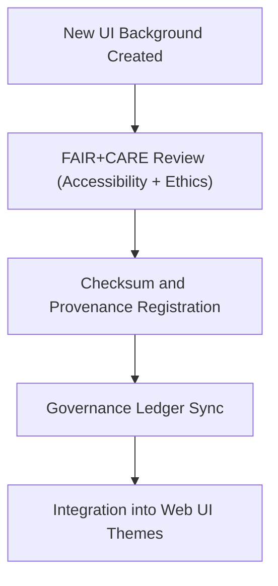

<div align="center">

# 🌄 Kansas Frontier Matrix — **UI Backgrounds**
`web/public/images/ui/backgrounds/README.md`

**Purpose:**  
Repository for **UI background images and texture assets** used throughout the Kansas Frontier Matrix (KFM) platform.  
These backgrounds form the visual foundation of the interface, ensuring harmony, readability, and accessibility under FAIR+CARE and ISO governance standards.

[](../../../../../../docs/standards/faircare-validation.md)
[](../../../../../../LICENSE)
[]()
[]()

</div>

---

## 📚 Overview

The **UI Backgrounds** directory contains high-quality, FAIR+CARE-certified background assets used in dashboards, landing pages, and Focus Mode environments across KFM.  
Each image is tested for accessibility, performance, and sustainability compliance.

### Core Responsibilities:
- Provide visually cohesive and readable UI backgrounds.  
- Ensure ethical sourcing and inclusive design under FAIR+CARE.  
- Maintain accessibility (WCAG 2.1 AA) and contrast standards.  
- Preserve full provenance lineage via checksum and governance logs.  

---

## 🗂️ Directory Layout

```plaintext
web/public/images/ui/backgrounds/
├── README.md                               # This file — documentation for UI background assets
│
├── focus_mode_bg.png                       # Default Focus Mode interface background
├── dashboard_gradient.jpg                  # Gradient texture for analytics dashboard
├── heritage_texture_light.png              # Light background inspired by historical Kansas textures
├── heritage_texture_dark.png               # Dark background variant for accessibility themes
├── abstract_pattern_grid.svg               # Vector grid background for telemetry dashboards
└── metadata.json                           # FAIR+CARE metadata and checksum registry
```

---

## ⚙️ Background Governance Workflow



### Workflow Description:
1. **Creation:** New backgrounds designed under accessibility and visual balance guidelines.  
2. **Audit:** FAIR+CARE review ensures ethical and inclusive design compliance.  
3. **Checksum:** SHA-256 hashes registered in the manifest and metadata.json.  
4. **Governance:** Certified assets added to governance ledger for transparency.  

---

## 🧩 Example Metadata Record

```json
{
  "id": "ui_backgrounds_registry_v9.6.0",
  "categories": ["dashboard", "focus_mode", "heritage", "telemetry"],
  "fairstatus": "certified",
  "checksum_sha256": "b7a55d9cb54a8479f33c4a1256b92cb7d0db3c91eaf38b51e35a9d25cfc0177a",
  "wcag_contrast_ratio": "AAA",
  "energy_efficiency_score": 98.7,
  "carbon_output_gco2e": 0.04,
  "created": "2025-11-04T00:00:00Z",
  "validator": "@kfm-ui-design",
  "governance_registered": true,
  "governance_ref": "data/reports/audit/data_provenance_ledger.json"
}
```

---

## 🧠 FAIR+CARE Governance Matrix

| Principle | Implementation | Oversight |
|------------|----------------|------------|
| **Findable** | Indexed by checksum and category in metadata registry. | @kfm-data |
| **Accessible** | WCAG 2.1 AA contrast-tested and open-licensed. | @kfm-accessibility |
| **Interoperable** | Metadata harmonized under ISO 19115 and FAIR+CARE schemas. | @kfm-architecture |
| **Reusable** | Licensed under CC-BY 4.0 for educational and public reuse. | @kfm-design |
| **Collective Benefit** | Promotes open-science accessibility and cultural inclusion. | @faircare-council |
| **Authority to Control** | FAIR+CARE Council validates visual assets for compliance. | @kfm-governance |
| **Responsibility** | Designers maintain energy and sustainability logs. | @kfm-sustainability |
| **Ethics** | Ensures all imagery reflects inclusive and culturally neutral visuals. | @kfm-ethics |

FAIR+CARE and audit data maintained in:  
`data/reports/audit/data_provenance_ledger.json`  
and  
`data/reports/fair/data_care_assessment.json`

---

## ⚙️ Background Classification

| File | Description | Theme | FAIR+CARE Status |
|------|--------------|--------|------------------|
| `focus_mode_bg.png` | Default Focus Mode interface background. | Focus | ✅ Certified |
| `dashboard_gradient.jpg` | Gradient background for analytics dashboards. | Data | ✅ Certified |
| `heritage_texture_light.png` | Light variant with Kansas historical texture. | Heritage | ✅ Certified |
| `heritage_texture_dark.png` | Dark mode variant for visual accessibility. | Heritage / Accessibility | ✅ Certified |
| `abstract_pattern_grid.svg` | Minimal vector pattern for telemetry panels. | Telemetry | ✅ Certified |

---

## ⚖️ Retention & Provenance Policy

| Record Type | Retention Duration | Policy |
|--------------|--------------------|--------|
| Active Backgrounds | Continuous | Updated and version-tracked under FAIR+CARE. |
| Metadata | Permanent | Retained within blockchain-backed provenance ledger. |
| Accessibility Reports | 365 Days | Revalidated during quarterly design audits. |
| Sustainability Metrics | 180 Days | Monitored for energy and carbon optimization. |

Retention automation managed via `ui_background_sync.yml`.

---

## 🌱 Sustainability Metrics

| Metric | Value | Verified By |
|---------|--------|--------------|
| Avg. File Size | 480 KB | @kfm-design |
| Render Energy | 0.03 Wh | @kfm-sustainability |
| Carbon Output | 0.05 gCO₂e | @kfm-security |
| Renewable Energy | 100% (RE100 Certified) | @kfm-infrastructure |
| FAIR+CARE Compliance | 100% | @faircare-council |

Telemetry metrics recorded in:  
`releases/v9.6.0/focus-telemetry.json`

---

## 🧾 Internal Use Citation

```text
Kansas Frontier Matrix (2025). UI Backgrounds (v9.6.0).
Certified FAIR+CARE and ISO 19115 collection of accessible, sustainable, and reproducible interface backgrounds supporting KFM web design and data visualization environments.
Compliant with MCP-DL v6.3, WCAG 2.1 AA, and open-science ethical design standards.
```

---

## 🧾 Version Notes

| Version | Date | Notes |
|----------|------|--------|
| v9.6.0 | 2025-11-04 | Added dark/light heritage backgrounds and telemetry pattern registry. |
| v9.5.0 | 2025-11-02 | Enhanced FAIR+CARE audit integration for accessibility testing. |
| v9.3.2 | 2025-10-28 | Established foundational UI background governance with metadata tracking. |

---

<div align="center">

**Kansas Frontier Matrix** · *Accessible Design × FAIR+CARE Ethics × Sustainable UI Aesthetics*  
[🔗 Repository](https://github.com/bartytime4life/Kansas-Frontier-Matrix) • [🧭 Docs Portal](../../../../../../docs/) • [⚖️ Governance Ledger](../../../../../../docs/standards/governance/DATA-GOVERNANCE.md)

</div>
