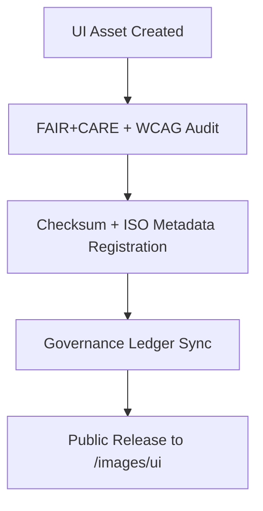

<div align="center">

# 🧩 **Kansas Frontier Matrix — User Interface Image Assets**
`web/public/images/ui/README.md`

**Purpose:**  
Document and govern **UI imagery** (backgrounds, headers, widgets, components) used across KFM’s web application.  
Assets are FAIR+CARE-certified, ISO 19115 metadata-aligned, and WCAG 2.1 AA accessible for ethical, sustainable, and reproducible design under **MCP v6.3**.

[](../../../../../docs/README.md)
[](../../../../../LICENSE)
[](../../../../../docs/standards/faircare.md)
[]()

</div>

---

## 📘 Overview

The **UI Image Assets Library** includes all open-licensed visuals shaping KFM’s public experience.  
Files are checksum-logged, accessible, and registered with provenance ledgers to support transparent open-science communication.

---

## 🗂️ Directory Layout

```
web/public/images/ui/
├── README.md
├── backgrounds/
├── components/
├── headers/
├── footers/
├── widgets/
├── checksums/
├── meta/
└── metadata.json
```

---

## 🧩 UI Asset Workflow



1. **Design:** Assets produced with tokenized colors, inclusive imagery, and a11y guidance.  
2. **Audit:** Contrast and semantics validated via automated scans + human review.  
3. **Register:** SHA-256 + SPDX license recorded in metadata.  
4. **Publish:** Manifest + SBOM updated; telemetry snapshot includes sustainability metrics.

---

## ⚙️ Validation Contracts

| Contract | Purpose | Validator |
|----------|----------|-----------|
| Accessibility | WCAG 2.1 AA, alt-text, motion safety | `accessibility_scan.yml` |
| FAIR+CARE | Ethics + governance metadata verification | `faircare-validate.yml` |
| Metadata | ISO 19115 + SPDX structure checks | `docs-lint.yml` |
| Telemetry | Energy + carbon traceability | `telemetry-export.yml` |

Reports recorded at:  
- `../../../../../docs/reports/audit/data_provenance_ledger.json`  
- `../../../../../releases/v9.7.0/focus-telemetry.json`

---

## 🧠 FAIR+CARE Governance Matrix

| Principle | Implementation | Oversight |
|------------|----------------|------------|
| **Findable** | Indexed by checksum + category in registry. | @kfm-data |
| **Accessible** | CC-BY assets with descriptive alt-text and AA contrast. | @kfm-accessibility |
| **Interoperable** | ISO 19115 + FAIR+CARE metadata alignment. | @kfm-architecture |
| **Reusable** | Open reuse in education, docs, and outreach. | @kfm-design |
| **Collective Benefit** | Elevates inclusive, open-science visual narratives. | @faircare-council |
| **Authority to Control** | Council certifies releases and updates. | @kfm-governance |
| **Responsibility** | Designers track provenance and sustainability metrics. | @kfm-sustainability |
| **Ethics** | Cultural neutrality and respect enforced in imagery. | @kfm-ethics |

---

## 🧾 Example Metadata Record

```json
{
  "id": "ui_images_v9.7.0",
  "category": "headers",
  "filename": "dashboard_banner_dynamic_v9.7.0.png",
  "checksum_sha256": "a4b55a1de9fbb3a8ec6e3e9df57a9ed62b8ed143b127cc9c8a3b92ac5400afab",
  "license": "CC-BY 4.0",
  "wcag": "2.1 AA",
  "fairstatus": "certified",
  "timestamp": "2025-11-05T23:25:00Z"
}
```

---

## 🧩 UI Image Classification

| Category | Description | Format | FAIR+CARE Status |
|-----------|--------------|---------|------------------|
| `backgrounds/` | Thematic, low-contrast textures for UI. | PNG / JPG | Certified |
| `headers/` | Hero banners and brand visuals. | JPG / PNG | Certified |
| `widgets/` | Focus Mode and dashboard UI elements. | SVG / PNG | Certified |
| `components/` | Panels, cards, and control imagery. | SVG | Certified |
| `footers/` | Governance visuals and footer layouts. | PNG / SVG | Certified |

---

## ♿ Accessibility & Sustainability Standards

- Alt-text required; color-blind safe palettes; AA contrast.  
- Motion-safe imagery; respects `prefers-reduced-motion`.  
- Average file ≤ **500 KB**; render energy ≤ **0.04 Wh**; renewable hosting.  
- Telemetry logged per release for sustainability audits.

---

## ⚖️ Retention & Provenance Policy

| Record Type | Retention | Policy |
|--------------|-----------|--------|
| Active UI Images | Continuous | Versioned and checksum-tracked. |
| Metadata | Permanent | Ledger-synced under governance. |
| Audits (FAIR+CARE/WCAG) | 365 Days | Revalidated quarterly. |
| Archived Assets | Permanent | Immutable checksum lineage. |

Automation: `ui_image_sync.yml`.

---

## 🕰️ Version History

| Version | Date | Author | Summary |
|----------|------|---------|----------|
| v9.7.0 | 2025-11-05 | KFM Core Team | Upgraded telemetry schema, enhanced ISO alignment, added example metadata. |
| v9.6.0 | 2025-11-04 | KFM Core Team | Added checksum lineage and expanded widget registry. |
| v9.5.0 | 2025-11-02 | KFM Core Team | Improved automation for accessibility validation. |

---

<div align="center">

**© 2025 Kansas Frontier Matrix — CC-BY 4.0**  
Certified under **Master Coder Protocol v6.3** · FAIR+CARE Certified · Diamond⁹ Ω / Crown∞Ω Ultimate Certified  
[Back to Images Index](../README.md) · [Docs Portal](../../../../../docs/README.md)

</div>