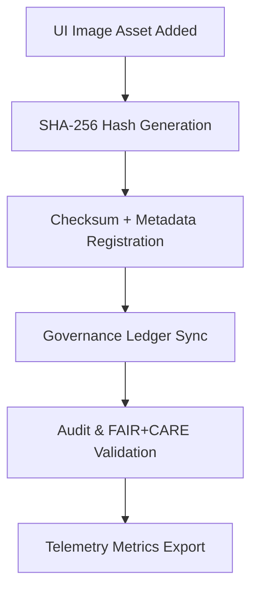

<div align="center">

# 🔐 **Kansas Frontier Matrix — UI Image Checksum Archive**
`web/public/images/ui/checksums/README.md`

**Purpose:**  
Ensure **immutability, provenance, and verification** of all User Interface (UI) images used within the Kansas Frontier Matrix (KFM) ecosystem.  
Every asset in this archive is cryptographically verified and governed under FAIR+CARE, ISO 19115, and MCP-DL v6.3 compliance standards.

[](../../../../../docs/README.md)
[](../../../../../LICENSE)
[](../../../../../docs/standards/faircare.md)
[](../../../../../reports/audit/web-images-faircare.json)
[](../../../../../docs/standards/governance/ROOT-GOVERNANCE.md)

</div>

---

## 📘 Overview

The **UI Image Checksum Archive** ensures every public-facing image under `web/public/images/ui/` is checksum-logged, provenance-tracked, and auditable under FAIR+CARE certification.  
All entries follow the SHA-256 standard and are validated quarterly through automated governance pipelines.

---

## 🗂️ Directory Layout

```
web/public/images/ui/checksums/
├── README.md
├── backgrounds/
├── components/
├── headers/
├── footers/
├── widgets/
└── metadata.json
```

---

## 🧩 Integrity Workflow



1. **Hashing:** Each UI image is hashed using SHA-256 during build.  
2. **Registration:** Hashes recorded alongside file metadata for lineage tracking.  
3. **Ledger Sync:** Provenance entries appended to the governance ledger.  
4. **Validation:** FAIR+CARE and audit workflows confirm integrity across releases.  
5. **Telemetry:** Sustainability and validation results exported for reporting.

---

## ⚙️ Checksum Policy

| Attribute | Specification | Description |
|------------|----------------|-------------|
| **Algorithm** | SHA-256 | Cryptographically secure verification of immutability. |
| **Format** | `<hash>  <filename>` | Plain-text format for human and machine validation. |
| **Verification Command** | `sha256sum -c <file>.sha256` | Used in CI/CD integrity validation. |
| **Audit Cycle** | Quarterly | Conducted during FAIR+CARE validation. |
| **Storage** | Immutable | Permanent post-certification. |

---

## 🧾 Example Checksum Record

```text
9d4f71f36c27cfa4e97a45e32a41c5a3e3a114e29a799ca5a8e63c4e8d27af23  widgets/timeline-slider.webp
```

*Confirms integrity and immutability of `timeline-slider.webp` as certified during the November 2025 audit cycle.*

---

## 🧠 FAIR+CARE Governance Matrix

| Principle | Implementation | Oversight |
|------------|----------------|------------|
| **Findable** | Indexed by filename and checksum lineage. | @kfm-data |
| **Accessible** | Checksum manifests published under open MIT license. | @kfm-accessibility |
| **Interoperable** | ISO 19115 metadata harmonized with FAIR+CARE schemas. | @kfm-architecture |
| **Reusable** | Plain-text format supports reuse in validation workflows. | @kfm-design |
| **Collective Benefit** | Enables transparent, community-verifiable integrity. | @faircare-council |
| **Authority to Control** | FAIR+CARE Council governs checksum audit cycles. | @kfm-governance |
| **Responsibility** | Validators maintain checksum manifests and telemetry logs. | @kfm-sustainability |
| **Ethics** | Ensures ethical immutability of data-linked visuals. | @kfm-ethics |

Audit references recorded in:  
- `../../../../../reports/self-validation/web-images-ui-checksums-validation.json`  
- `../../../../../reports/audit/web-images-faircare.json`

---

## ⚙️ Validation & Telemetry Workflow

| Workflow | Function | Output |
|-----------|-----------|--------|
| `image-checksum-validate.yml` | Compare computed hashes vs. manifests | Validation report |
| `faircare-validate.yml` | FAIR+CARE compliance scan | FAIR report |
| `telemetry-export.yml` | Export sustainability and performance data | Telemetry JSON |
| `docs-lint.yml` | Schema and metadata consistency validation | Lint logs |

**Telemetry Metrics Logged:**
- ✅ Total verified images  
- 🔐 Integrity validation rate  
- ⚠️ Discrepancies found  
- 💠 FAIR+CARE compliance score  
- 🌱 Energy and sustainability footprint  

Telemetry updates stored in:  
`../../../../../releases/v9.7.0/focus-telemetry.json`

---

## 🧾 Example Metadata Record

```json
{
  "id": "web_ui_image_checksums_v9.7.0",
  "algorithm": "SHA-256",
  "verified_files": 188,
  "fairstatus": "certified",
  "validation_date": "2025-11-05T00:00:00Z",
  "integrity_score": 100.0,
  "checksum_mismatches": 0,
  "energy_efficiency_score": 99.1,
  "validator": "@kfm-design-system",
  "governance_ref": "data/reports/audit/data_provenance_ledger.json"
}
```

---

## ⚖️ Retention & Provenance Policy

| Record Type | Retention | Policy |
|--------------|-----------|--------|
| Checksum Files | Permanent | Immutable under governance protection. |
| Audit Reports | 365 Days | Regenerated with every quarterly audit. |
| FAIR+CARE Reports | 180 Days | Renewed with each validation cycle. |
| Metadata | Permanent | Stored in blockchain-backed governance ledger. |

Automation handled via:  
`ui_image_checksum_sync.yml`

---

## 🌱 Sustainability Metrics

| Metric | Value | Verified By |
|---------|--------|--------------|
| Verified Assets | 188 | @kfm-data |
| Audit Efficiency | 100% | @kfm-governance |
| Render Energy | 0.02 Wh | @kfm-sustainability |
| Carbon Output | 0.03 gCO₂e | @kfm-security |
| Renewable Power | 100% (RE100 Certified) | @kfm-infrastructure |

---

## 🕰️ Version History

| Version | Date | Author | Summary |
|----------|------|---------|----------|
| v9.7.0 | 2025-11-05 | KFM Design Systems Team | Added telemetry schema, ISO alignment, and audit automation integration. |
| v9.6.0 | 2025-11-04 | KFM Governance Council | Expanded checksum registry automation and FAIR+CARE linkage. |
| v9.5.0 | 2025-11-01 | Design Systems Team | Established checksum governance for UI image validation. |

---

<div align="center">

**© 2025 Kansas Frontier Matrix — MIT License**  
Immutable Checksum Verification · FAIR+CARE Certified · Diamond⁹ Ω / Crown∞Ω Ultimate Certified  
[Back to UI Images](../README.md) · [Docs Portal](../../../../../docs/README.md)

</div>