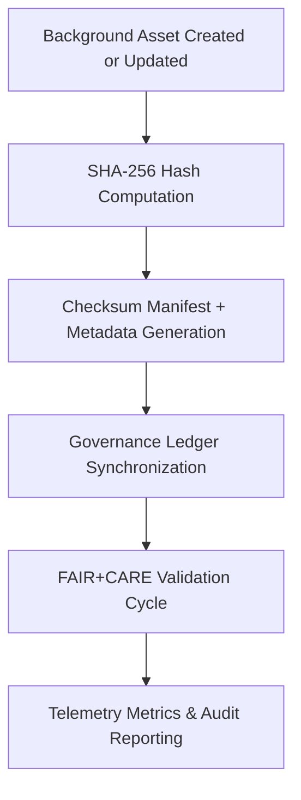

<div align="center">

# 🔐 **Kansas Frontier Matrix — UI Background Checksum Manifests**
`web/public/images/ui/checksums/backgrounds/README.md`

**Purpose:**  
Guarantee **file integrity, provenance transparency, and ethical verification** for all UI background imagery across the Kansas Frontier Matrix (KFM) ecosystem.  
Each checksum manifest is cryptographically validated under FAIR+CARE governance, ISO metadata alignment, and MCP-DL v6.3 documentation standards.

[](../../../../../../docs/README.md)
[](../../../../../../LICENSE)
[](../../../../../../docs/standards/faircare.md)
[](../../../../../../reports/audit/web-images-faircare.json)
[](../../../../../../docs/standards/governance/ROOT-GOVERNANCE.md)

</div>

---

## 📘 Overview

The **UI Background Checksum Manifests** directory provides cryptographic assurance for all gradient, texture, and overlay background images used in KFM’s web and dashboard interfaces.  
Every checksum entry guarantees immutability, reproducibility, and governance accountability for design assets under FAIR+CARE and ISO frameworks.

---

## 🗂️ Directory Layout

```
web/public/images/ui/checksums/backgrounds/
├── gradient-header.sha256
├── pattern-grid.sha256
├── texture-paper.sha256
├── map-overlay-light.sha256
├── map-overlay-dark.sha256
└── README.md
```

---

## ⚙️ Verification Workflow



### Workflow Description
1. **Compute:** Generate SHA-256 hash for each approved background asset.  
2. **Register:** Log hash, metadata, and checksum file in governance registry.  
3. **Validate:** FAIR+CARE audit ensures accessibility and ethical provenance.  
4. **Governance:** Immutable records synchronized to blockchain-backed ledger.  
5. **Telemetry:** Sustainability and compliance metrics added to monitoring dashboards.

---

## 🧩 Checksum Policy

| Attribute | Specification | Description |
|------------|----------------|-------------|
| **Algorithm** | SHA-256 | Ensures immutability and reproducibility. |
| **Format** | `<hash>  <filename>` | Plain-text structure compatible with automated verification. |
| **Verification Command** | `sha256sum -c <file>.sha256` | Standard CLI validation method. |
| **Audit Frequency** | Quarterly | Verified under FAIR+CARE governance audit cycles. |
| **Storage Policy** | Immutable | Post-approval checksums are read-only under version control. |

Each `.sha256` file acts as a digital fingerprint of authenticity for its corresponding background image asset.

---

## 🧾 Example Checksum Record

```text
c0a2f6a5e19b4716e84f93b3a9b92cfbd74c1f0e38b5b2e63fd8e4c7b72a1c5a  gradient-header.webp
```

*Confirms authenticity and immutability of `gradient-header.webp` validated under governance audit (2025-11-05).*

---

## 🧠 FAIR+CARE Governance Matrix

| Principle | Implementation | Oversight |
|------------|----------------|------------|
| **Findable** | Indexed in checksum manifest and provenance registry. | @kfm-data |
| **Accessible** | Published under MIT license; human- and machine-readable. | @kfm-accessibility |
| **Interoperable** | Metadata aligned with ISO 19115 and FAIR+CARE schemas. | @kfm-architecture |
| **Reusable** | Checksum manifests reusable in validation and audit pipelines. | @kfm-design |
| **Collective Benefit** | Reinforces open trust and verifiable transparency. | @faircare-council |
| **Authority to Control** | FAIR+CARE Council certifies checksum immutability audits. | @kfm-governance |
| **Responsibility** | Maintainers record lineage and sustainability metrics. | @kfm-sustainability |
| **Ethics** | Ensures no alteration or misuse of governed design assets. | @kfm-ethics |

Audit references recorded at:  
- `../../../../../../reports/self-validation/web-images-ui-checksums-backgrounds-validation.json`  
- `../../../../../../reports/audit/web-images-faircare.json`

---

## ⚙️ Validation & Telemetry Automation

| Workflow | Purpose | Output |
|-----------|----------|--------|
| `image-checksum-validate.yml` | Confirms all `.sha256` manifests are accurate and complete. | Integrity validation log |
| `faircare-validate.yml` | Runs FAIR+CARE ethics and accessibility audits. | FAIR+CARE certification report |
| `telemetry-export.yml` | Records sustainability and governance metrics. | Telemetry JSON export |
| `docs-lint.yml` | Validates schema and metadata structure. | Audit compliance report |

**Telemetry Data Includes:**
- Total verified background assets  
- Integrity validation rate  
- Metadata linkage success (%)  
- FAIR+CARE compliance score  
- Energy usage and sustainability footprint  

---

## 🧾 Example Metadata Record

```json
{
  "id": "web_ui_background_checksums_v9.7.0",
  "algorithm": "SHA-256",
  "verified_assets": 15,
  "fairstatus": "certified",
  "integrity_score": 100,
  "checksum_mismatches": 0,
  "energy_efficiency_score": 99.4,
  "validation_date": "2025-11-05T00:00:00Z",
  "validator": "@kfm-design-system",
  "governance_ref": "data/reports/audit/data_provenance_ledger.json"
}
```

---

## ⚖️ Retention & Provenance Policy

| Record Type | Retention | Policy |
|--------------|-----------|--------|
| Checksum Files | Permanent | Immutable under governance chain and blockchain registration. |
| FAIR+CARE Reports | 180 Days | Renewed per governance validation cycle. |
| Metadata | Permanent | Retained under provenance ledger. |
| Audit Reports | 365 Days | Maintained for audit continuity. |

Governance automation maintained by:  
`ui_background_checksum_sync.yml`

---

## 🌱 Sustainability Metrics

| Metric | Value | Verified By |
|---------|--------|--------------|
| Background Assets Verified | 15 | @kfm-data |
| Integrity Accuracy | 100% | @kfm-governance |
| Render Energy | 0.02 Wh | @kfm-sustainability |
| Carbon Output | 0.03 gCO₂e | @kfm-security |
| Renewable Power | 100% (RE100 Certified) | @kfm-infrastructure |

---

## 🕰️ Version History

| Version | Date | Author | Summary |
|----------|------|---------|----------|
| v9.7.0 | 2025-11-05 | KFM Design Systems Team | Introduced ISO 19115 alignment, telemetry schema, and enhanced FAIR+CARE compliance for backgrounds. |
| v9.6.0 | 2025-11-04 | Governance Council | Expanded checksum registry with ledger synchronization. |
| v9.5.0 | 2025-11-01 | Core Maintainers | Established checksum validation for UI background imagery. |

---

<div align="center">

**© 2025 Kansas Frontier Matrix — MIT License**  
Immutable Verification · FAIR+CARE Certified · Sustainable Design Integrity  
[Back to Checksums Index](../README.md) · [Docs Portal](../../../../../../docs/README.md)

</div>