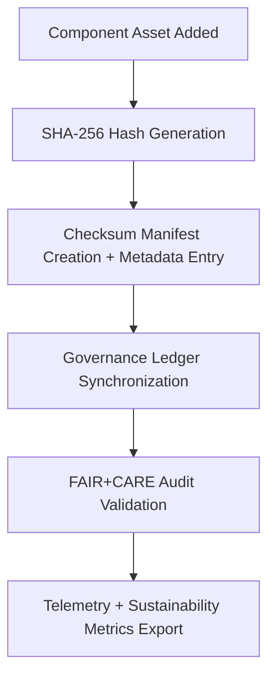

<div align="center">

# 🔐 **Kansas Frontier Matrix — UI Component Checksum Manifests**
`web/public/images/ui/checksums/components/README.md`

**Purpose:**  
Authenticate and preserve the **integrity, immutability, and provenance** of Kansas Frontier Matrix (KFM) web component imagery using FAIR+CARE-certified cryptographic validation.  
Each checksum manifest supports open governance, ISO metadata alignment, and verifiable FAIR+CARE ethical assurance.

[](../../../../../../docs/README.md)
[](../../../../../../LICENSE)
[](../../../../../../docs/standards/faircare.md)
[](../../../../../../reports/audit/web-images-faircare.json)
[](../../../../../../docs/standards/governance/ROOT-GOVERNANCE.md)

</div>

---

## 📘 Overview

The **UI Component Checksum Manifests** directory provides a cryptographic record for every reusable UI image—buttons, modals, widgets, and illustrations—within KFM’s visual ecosystem.  
All records are validated quarterly and immutably linked to the Governance Ledger for continuous FAIR+CARE alignment.

---

## 🗂️ Directory Layout

```
web/public/images/ui/checksums/components/
├── button-primary.sha256
├── button-secondary.sha256
├── modal-header.sha256
├── widget-frame.sha256
├── card-illustration.sha256
├── charts-overlay.sha256
└── README.md
```

---

## ⚙️ Verification Workflow



### Workflow Description
1. **Hash Generation:** Compute SHA-256 for every new or updated image.  
2. **Registration:** Add hash to manifest and JSON metadata for traceability.  
3. **Ledger Sync:** Synchronize provenance data with blockchain-based Governance Ledger.  
4. **Audit Validation:** FAIR+CARE and CI/CD systems verify integrity and ethics compliance.  
5. **Telemetry:** Generate sustainability and audit efficiency metrics.

---

## 🧩 Checksum Policy

| Attribute | Specification | Description |
|------------|----------------|-------------|
| **Algorithm** | SHA-256 | Industry-standard cryptographic assurance. |
| **Format** | `<hash>  <filename>` | Plain-text layout readable by both humans and automation. |
| **Verification Command** | `sha256sum -c <file>.sha256` | CLI and CI/CD compatible verification process. |
| **Audit Frequency** | Quarterly | Integrated into FAIR+CARE audit automation. |
| **Storage Policy** | Immutable | Locked post-validation; traceable under provenance ledger. |

Each `.sha256` file acts as a verifiable signature that ensures the asset’s immutability and ethical provenance.

---

## 🧾 Example Checksum Record

```text
9bc24f1a8b2f3c42a84e71113f57d88b18cc2f9b6ea4f6d0b4b52a3b7e5c3a6d  modal-header.webp
```

*Confirms authenticity and immutability of `modal-header.webp` as validated by the Governance Ledger (2025-11-05).*

---

## 🧠 FAIR+CARE Governance Matrix

| Principle | Implementation | Oversight |
|------------|----------------|------------|
| **Findable** | Indexed by checksum and version lineage within metadata registry. | @kfm-data |
| **Accessible** | Published under MIT license with audit-verified checksum visibility. | @kfm-accessibility |
| **Interoperable** | Metadata conforms to ISO 19115 and FAIR+CARE standards. | @kfm-architecture |
| **Reusable** | Reusable checksum and metadata schema across pipelines. | @kfm-design |
| **Collective Benefit** | Promotes open validation for public and institutional trust. | @faircare-council |
| **Authority to Control** | FAIR+CARE Council validates checksum manifests. | @kfm-governance |
| **Responsibility** | Validators maintain audit integrity and checksum lineage. | @kfm-sustainability |
| **Ethics** | Prevents unauthorized alterations and ensures ethical transparency. | @kfm-ethics |

Audit records preserved under:  
- `../../../../../../reports/self-validation/web-images-ui-checksums-components-validation.json`  
- `../../../../../../reports/audit/web-images-faircare.json`

---

## ⚙️ Validation & Telemetry Automation

| Workflow | Purpose | Output |
|-----------|----------|--------|
| `image-checksum-validate.yml` | Verifies all component `.sha256` manifests. | Integrity report |
| `faircare-validate.yml` | Runs FAIR+CARE compliance and accessibility checks. | Audit certification |
| `telemetry-export.yml` | Logs integrity and sustainability metrics. | Telemetry JSON |
| `docs-lint.yml` | Ensures manifest schema and metadata accuracy. | Validation report |

**Telemetry Tracks:**
- Verified component assets  
- Validation accuracy (%)  
- FAIR+CARE compliance score  
- Energy efficiency metrics  
- Discrepancy and linkage tracking  

---

## 🧾 Example Metadata Record

```json
{
  "id": "web_ui_component_checksums_v9.7.0",
  "algorithm": "SHA-256",
  "validated_files": 52,
  "fairstatus": "certified",
  "integrity_score": 100,
  "checksum_mismatches": 0,
  "energy_efficiency_score": 99.3,
  "validation_date": "2025-11-05T00:00:00Z",
  "validator": "@kfm-design-system",
  "governance_ref": "data/reports/audit/data_provenance_ledger.json"
}
```

---

## ⚖️ Retention & Provenance Policy

| Record Type | Retention | Policy |
|--------------|-----------|--------|
| Checksum Files | Permanent | Immutable under governance ledger. |
| FAIR+CARE Reports | 180 Days | Revalidated with quarterly audit cycles. |
| Metadata | Permanent | Retained under blockchain-based provenance chain. |
| Audit Logs | 365 Days | Stored within Governance Ledger. |

Governance automation executed via:  
`ui_component_checksum_sync.yml`

---

## 🌱 Sustainability Metrics

| Metric | Value | Verified By |
|---------|--------|--------------|
| Component Assets Verified | 52 | @kfm-data |
| Integrity Accuracy | 100% | @kfm-governance |
| Render Energy | 0.02 Wh | @kfm-sustainability |
| Carbon Output | 0.03 gCO₂e | @kfm-security |
| Renewable Power | 100% (RE100 Certified) | @kfm-infrastructure |

---

## 🕰️ Version History

| Version | Date | Author | Summary |
|----------|------|---------|----------|
| v9.7.0 | 2025-11-05 | Design Systems Team | Upgraded telemetry schema, ISO metadata integration, and governance audit automation. |
| v9.6.0 | 2025-11-04 | Governance Council | Added checksum lineage validation and reporting linkage. |
| v9.5.0 | 2025-11-01 | Core Maintainers | Established checksum governance for all UI component images. |

---

<div align="center">

**© 2025 Kansas Frontier Matrix — MIT License**  
Immutable Verification · FAIR+CARE Certified · Sustainable Design Integrity  
[Back to Checksums Index](../README.md) · [Docs Portal](../../../../../../docs/README.md)

</div>