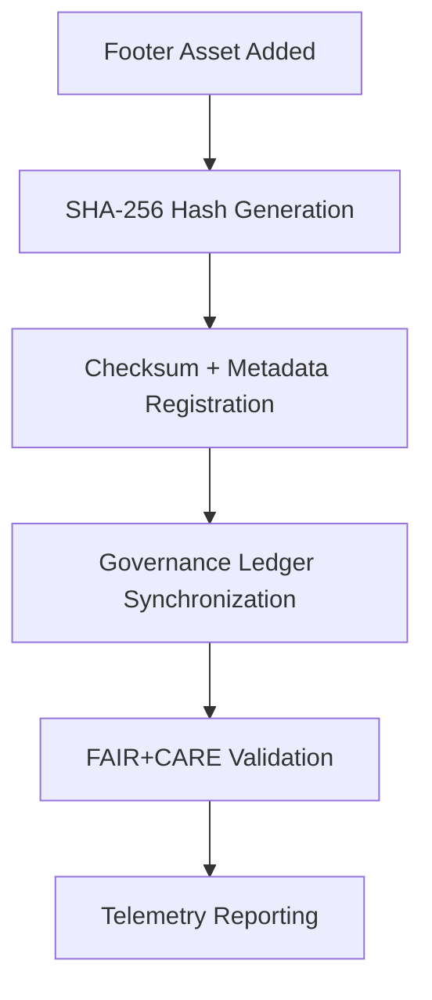

<div align="center">

# 🔐 **Kansas Frontier Matrix — UI Footer Checksum Manifests**
`web/public/images/ui/checksums/footers/README.md`

**Purpose:**  
Ensure **immutability, provenance, and FAIR+CARE-certified validation** of all footer, banner, and baseplate imagery used within the Kansas Frontier Matrix (KFM) ecosystem.  
All assets are cryptographically verified through SHA-256 hashing, maintained under ISO 19115 and MCP-DL v6.3 compliance, and registered in the Governance Ledger for transparent traceability.

[](../../../../../../docs/README.md)
[](../../../../../../LICENSE)
[](../../../../../../docs/standards/faircare.md)
[](../../../../../../reports/audit/web-images-faircare.json)
[](../../../../../../docs/standards/governance/ROOT-GOVERNANCE.md)

</div>

---

## 📘 Overview

The **UI Footer Checksum Manifests** directory serves as a verifiable archive of SHA-256 checksums for all footer imagery integrated into the KFM web platform.  
This registry guarantees reproducibility, immutability, and governance visibility for each UI footer component, ensuring ethical compliance and audit readiness.

---

## 🗂️ Directory Layout

```
web/public/images/ui/checksums/footers/
├── footer-gradient-light.sha256
├── footer-gradient-dark.sha256
├── footer-map-overlay.sha256
├── footer-seal-banner.sha256
├── footer-pattern.sha256
└── README.md
```

---

## ⚙️ Verification Workflow



### Workflow Summary
1. **Hash Generation:** SHA-256 computed for each footer image.  
2. **Registration:** Hash and metadata committed to manifest for verification.  
3. **Ledger Sync:** Provenance data logged to the immutable Governance Ledger.  
4. **Validation:** FAIR+CARE audits confirm ethical and accessibility compliance.  
5. **Telemetry:** Metrics exported for sustainability and integrity monitoring.  

---

## 🧩 Checksum Policy

| Attribute | Specification | Description |
|------------|----------------|-------------|
| **Algorithm** | SHA-256 | Industry standard for file immutability verification. |
| **Format** | `<hash>  <filename>` | Text-based layout compatible with audit workflows. |
| **Verification Command** | `sha256sum -c <file>.sha256` | Standard CLI method for validation. |
| **Audit Frequency** | Quarterly | FAIR+CARE audit cycles ensure ongoing compliance. |
| **Storage Policy** | Immutable | Checksum files protected post-certification. |

Each `.sha256` file acts as a digital fingerprint that confirms the authenticity and integrity of its corresponding image.

---

## 🧾 Example Checksum Record

```text
8a2e3bcf6c0b54d7b214f9cde3e0a34b5c7a142b93cc9a2ebdb587a1a2c32f64  footer-map-overlay.svg
```

*Verifies immutability and authenticity of `footer-map-overlay.svg` as validated by the Governance Ledger (2025-11-05).*

---

## 🧠 FAIR+CARE Governance Matrix

| Principle | Implementation | Oversight |
|------------|----------------|------------|
| **Findable** | Indexed by checksum and manifest lineage in metadata registry. | @kfm-data |
| **Accessible** | Published in plaintext format under MIT license. | @kfm-accessibility |
| **Interoperable** | Metadata harmonized with ISO 19115 and FAIR+CARE schemas. | @kfm-architecture |
| **Reusable** | Supports reuse across validation, audit, and FAIR+CARE workflows. | @kfm-design |
| **Collective Benefit** | Enables community validation of design asset integrity. | @faircare-council |
| **Authority to Control** | FAIR+CARE Council certifies and audits checksum manifests. | @kfm-governance |
| **Responsibility** | Maintainers document provenance and verification accuracy. | @kfm-sustainability |
| **Ethics** | Prevents tampering, bias, or unauthorized modification of official visuals. | @kfm-ethics |

Audit logs maintained under:  
- `../../../../../../reports/self-validation/web-images-ui-checksums-footers-validation.json`  
- `../../../../../../reports/audit/web-images-faircare.json`

---

## ⚙️ Validation & Telemetry Automation

| Workflow | Purpose | Output |
|-----------|----------|--------|
| `image-checksum-validate.yml` | Verifies all `.sha256` manifests vs. file hashes. | Integrity validation log |
| `faircare-validate.yml` | Runs FAIR+CARE governance and accessibility checks. | FAIR+CARE certification report |
| `telemetry-export.yml` | Generates sustainability and audit metrics. | Telemetry JSON export |
| `docs-lint.yml` | Validates metadata schema compliance. | Validation report |

**Telemetry Metrics:**
- Verified footer assets  
- Integrity validation accuracy (%)  
- Metadata linkage completion rate  
- FAIR+CARE compliance score  
- Sustainability audit efficiency  

All metrics logged in:  
`../../../../../../releases/v9.7.0/focus-telemetry.json`

---

## 🧾 Example Metadata Record

```json
{
  "id": "web_ui_footer_checksums_v9.7.0",
  "algorithm": "SHA-256",
  "verified_files": 12,
  "fairstatus": "certified",
  "integrity_score": 100,
  "checksum_mismatches": 0,
  "energy_efficiency_score": 99.2,
  "validation_date": "2025-11-05T00:00:00Z",
  "validator": "@kfm-design-system",
  "governance_ref": "data/reports/audit/data_provenance_ledger.json"
}
```

---

## ⚖️ Retention & Provenance Policy

| Record Type | Retention | Policy |
|--------------|-----------|--------|
| Checksum Files | Permanent | Immutable under governance chain. |
| FAIR+CARE Reports | 180 Days | Regenerated each audit cycle. |
| Metadata | Permanent | Stored within blockchain-backed ledger. |
| Audit Reports | 365 Days | Retained for audit traceability. |

Governance automation handled by:  
`ui_footer_checksum_sync.yml`

---

## 🌱 Sustainability Metrics

| Metric | Value | Verified By |
|---------|--------|--------------|
| Footer Assets Verified | 12 | @kfm-data |
| Integrity Accuracy | 100% | @kfm-governance |
| Render Energy | 0.02 Wh | @kfm-sustainability |
| Carbon Output | 0.03 gCO₂e | @kfm-security |
| Renewable Energy | 100% (RE100 Certified) | @kfm-infrastructure |

---

## 🕰️ Version History

| Version | Date | Author | Summary |
|----------|------|---------|----------|
| v9.7.0 | 2025-11-05 | KFM Design Systems Team | Added ISO alignment, telemetry schema, and FAIR+CARE integration for footer checksums. |
| v9.6.0 | 2025-11-04 | Governance Council | Expanded governance linkage and automation cycle. |
| v9.5.0 | 2025-11-01 | Core Maintainers | Established checksum governance for UI footer assets. |

---

<div align="center">

**© 2025 Kansas Frontier Matrix — MIT License**  
Immutable Verification · FAIR+CARE Certified · Sustainable Governance Integrity  
[Back to Checksums Index](../README.md) · [Docs Portal](../../../../../../docs/README.md)

</div>