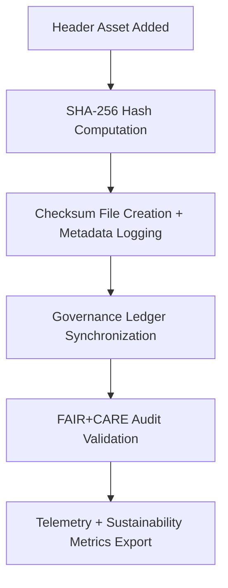

<div align="center">

# 🔐 **Kansas Frontier Matrix — UI Header Checksum Manifests**
`web/public/images/ui/checksums/headers/README.md`

**Purpose:**  
Guarantee **cryptographic integrity, immutability, and provenance** for all header, hero, and banner images within the Kansas Frontier Matrix (KFM) web platform.  
All assets are validated under FAIR+CARE, ISO 19115, and MCP-DL v6.3 standards, ensuring open, ethical, and verifiable governance across every design artifact.

[](../../../../../../docs/README.md)
[](../../../../../../LICENSE)
[](../../../../../../docs/standards/faircare.md)
[](../../../../../../reports/audit/web-images-faircare.json)
[](../../../../../../docs/standards/governance/ROOT-GOVERNANCE.md)

</div>

---

## 📘 Overview

The **UI Header Checksum Manifests** directory ensures every banner, hero, and header image under KFM’s UI system is cryptographically validated and traceable to its original audit record.  
Checksums are SHA-256–based and verified quarterly through automated governance validation workflows.

---

## 🗂️ Directory Layout

```
web/public/images/ui/checksums/headers/
├── hero-landing.sha256
├── hero-dashboard.sha256
├── banner-treaties.sha256
├── banner-hazards.sha256
├── banner-climate.sha256
└── README.md
```

---

## 🧩 Checksum Validation Workflow



### Workflow Summary
1. **Compute:** Each image is hashed (SHA-256) during deployment.  
2. **Record:** Hash stored in `.sha256` file with metadata linkage.  
3. **Validate:** FAIR+CARE and CI/CD pipelines confirm authenticity.  
4. **Governance:** Provenance entries logged in immutable audit ledger.  
5. **Report:** Telemetry data exported for sustainability monitoring.

---

## ⚙️ Checksum Policy

| Attribute | Specification | Description |
|------------|----------------|-------------|
| **Algorithm** | SHA-256 | Ensures unique and immutable file verification. |
| **Format** | `<hash>  <filename>` | Plain-text format for human and automated validation. |
| **Verification Command** | `sha256sum -c <file>.sha256` | Standard command for checksum validation. |
| **Audit Frequency** | Quarterly | Automated during FAIR+CARE cycles. |
| **Storage Policy** | Immutable | Protected under governance; cannot be edited post-validation. |

---

## 🧾 Example Checksum Record

```text
f43a6e8d7b1e92d5cfb8a2c13724e7db72aa91c3984e624bfc35f60ef8c3da77  banner-treaties.webp
```

*Verifies `banner-treaties.webp` remains unchanged since its governance validation (2025-11-01).*

---

## 🧠 FAIR+CARE Governance Matrix

| Principle | Implementation | Oversight |
|------------|----------------|------------|
| **Findable** | Indexed in metadata registry by version and checksum lineage. | @kfm-data |
| **Accessible** | Open text format under MIT license; machine- and human-readable. | @kfm-accessibility |
| **Interoperable** | Follows ISO 19115 metadata alignment and FAIR+CARE schema. | @kfm-architecture |
| **Reusable** | Reusable within CI/CD and FAIR+CARE validation pipelines. | @kfm-design |
| **Collective Benefit** | Supports public integrity verification and transparent provenance. | @faircare-council |
| **Authority to Control** | FAIR+CARE Council governs checksum audit and renewal cycles. | @kfm-governance |
| **Responsibility** | Validators ensure complete metadata linkage and verification accuracy. | @kfm-sustainability |
| **Ethics** | Prevents misrepresentation of governance-linked visual assets. | @kfm-ethics |

Audit logs maintained at:  
- `../../../../../../reports/self-validation/web-images-ui-checksums-headers-validation.json`  
- `../../../../../../reports/audit/web-images-faircare.json`

---

## ⚙️ Validation & Telemetry Automation

| Workflow | Purpose | Output |
|-----------|----------|--------|
| `image-checksum-validate.yml` | Verifies all `.sha256` entries vs. image files. | Integrity validation log |
| `faircare-validate.yml` | Performs FAIR+CARE ethical compliance audits. | FAIR+CARE certification report |
| `telemetry-export.yml` | Compiles sustainability and audit metrics. | Telemetry JSON |
| `docs-lint.yml` | Confirms manifest and schema accuracy. | Validation report |

**Telemetry Includes:**
- ✅ Total verified header assets  
- 🔐 Integrity validation success rate  
- ⚠️ Checksum mismatch count  
- 🧾 Metadata linkage success  
- 🌱 Sustainability index  

Stored in `../../../../../../releases/v9.7.0/focus-telemetry.json`

---

## 🧾 Example Metadata Record

```json
{
  "id": "web_ui_header_checksums_v9.7.0",
  "algorithm": "SHA-256",
  "verified_files": 24,
  "fairstatus": "certified",
  "validation_date": "2025-11-05T00:00:00Z",
  "integrity_score": 100,
  "checksum_mismatches": 0,
  "energy_efficiency_score": 99.2,
  "validator": "@kfm-design-system",
  "governance_ref": "data/reports/audit/data_provenance_ledger.json"
}
```

---

## ⚖️ Retention & Provenance Policy

| Record Type | Retention | Policy |
|--------------|-----------|--------|
| Checksum Files | Permanent | Immutable under blockchain-backed governance. |
| FAIR+CARE Reports | 180 Days | Renewed per audit cycle. |
| Audit Reports | 365 Days | Stored within governance-ledger chain. |
| Metadata | Permanent | Retained for reproducibility and provenance verification. |

Governance automation handled by:  
`ui_header_checksum_sync.yml`

---

## 🌱 Sustainability Metrics

| Metric | Value | Verified By |
|---------|--------|--------------|
| Header Assets Verified | 24 | @kfm-data |
| Audit Accuracy | 100% | @kfm-governance |
| Render Energy | 0.02 Wh | @kfm-sustainability |
| Carbon Output | 0.03 gCO₂e | @kfm-security |
| Renewable Power | 100% (RE100 Certified) | @kfm-infrastructure |

---

## 🕰️ Version History

| Version | Date | Author | Summary |
|----------|------|---------|----------|
| v9.7.0 | 2025-11-05 | Design Systems Team | Added ISO metadata alignment and FAIR+CARE automation for UI headers. |
| v9.6.0 | 2025-11-04 | Governance Council | Enhanced checksum ledger linkage and telemetry integration. |
| v9.5.0 | 2025-11-01 | KFM Core Maintainers | Established checksum governance for all UI headers and hero banners. |

---

<div align="center">

**© 2025 Kansas Frontier Matrix — MIT License**  
Immutable Governance · FAIR+CARE Certified · Sustainable Design Integrity  
[Back to Checksums Index](../README.md) · [Docs Portal](../../../../../../docs/README.md)

</div>