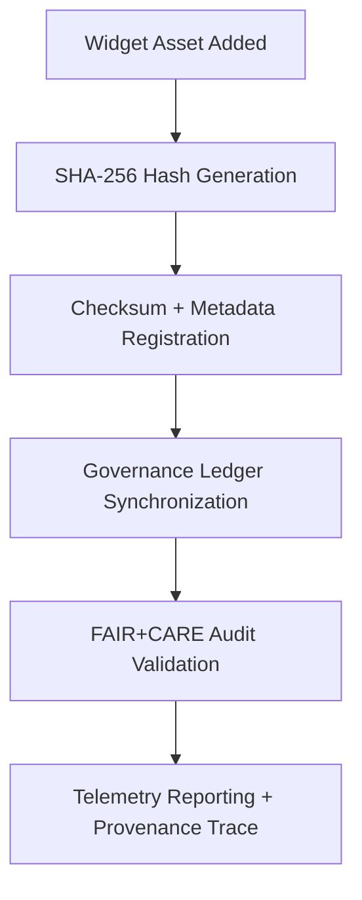

<div align="center">

# 🔐 **Kansas Frontier Matrix — UI Widget Checksum Manifests**
`web/public/images/ui/checksums/widgets/README.md`

**Purpose:**  
Guarantee **integrity, traceability, and FAIR+CARE-compliant verification** for every Kansas Frontier Matrix (KFM) interactive widget image.  
This archive cryptographically verifies immutability using SHA-256, ensuring transparent and ethical governance across all UI data components.

[](../../../../../../docs/README.md)
[](../../../../../../LICENSE)
[](../../../../../../docs/standards/faircare.md)
[](../../../../../../reports/audit/web-images-faircare.json)
[](../../../../../../docs/standards/governance/ROOT-GOVERNANCE.md)

</div>

---

## 📘 Overview

The **UI Widget Checksum Manifests** directory maintains the cryptographic hashes of all interactive KFM widget images.  
Each `.sha256` file validates asset authenticity, immutability, and alignment with FAIR+CARE data governance and ISO metadata standards.

---

## 🗂️ Directory Layout

```
web/public/images/ui/checksums/widgets/
├── map-zoom-controls.sha256
├── timeline-slider.sha256
├── chart-frame.sha256
├── data-legend-panel.sha256
├── heatmap-overlay.sha256
└── README.md
```

---

## 🧩 Integrity Verification Workflow



### Process Summary:
1. **Generation:** Each widget image is hashed via SHA-256 during build.  
2. **Registration:** Hash logged to manifest and metadata for lineage.  
3. **Audit:** Validation workflows ensure FAIR+CARE ethical compliance.  
4. **Ledger Sync:** Provenance recorded within governance ledger chain.  
5. **Telemetry:** Metrics exported to sustainability dashboards.

---

## ⚙️ Checksum Policy

| Attribute | Specification | Description |
|------------|----------------|-------------|
| **Algorithm** | SHA-256 | Cryptographic verification of immutability. |
| **Format** | `<hash>  <filename>` | Readable and script-compatible layout. |
| **Verification** | `sha256sum -c <file>.sha256` | Validates checksum consistency. |
| **Audit Cycle** | Quarterly | Automated through FAIR+CARE governance checks. |
| **Storage** | Immutable | Archived and uneditable post-verification. |

---

## 🧾 Example Checksum Record

```text
fe3c19a97b94a8e162f7a3a431d9a721e89c2e6d3ab7b1db2e4c115b8c6d43a7  data-legend-panel.webp
```

*Confirms authenticity and immutability of `data-legend-panel.webp` as of November 2025.*

---

## 🧠 FAIR+CARE Governance Matrix

| Principle | Implementation | Oversight |
|------------|----------------|------------|
| **Findable** | Indexed by checksum and version lineage in registry. | @kfm-data |
| **Accessible** | Published under open MIT license for transparency. | @kfm-accessibility |
| **Interoperable** | Metadata aligned with ISO 19115 and FAIR+CARE standards. | @kfm-architecture |
| **Reusable** | Hash manifests reusable across audits and pipelines. | @kfm-design |
| **Collective Benefit** | Promotes reproducibility and data ethics visibility. | @faircare-council |
| **Authority to Control** | FAIR+CARE Council certifies checksum manifests. | @kfm-governance |
| **Responsibility** | Validators track provenance and integrity logs. | @kfm-sustainability |
| **Ethics** | Prevents tampering or misrepresentation of scientific visuals. | @kfm-ethics |

Audit references stored under:  
- `../../../../../../reports/self-validation/web-images-ui-checksums-widgets-validation.json`  
- `../../../../../../reports/audit/web-images-faircare.json`

---

## ⚙️ Validation & Telemetry Workflow

| Workflow | Function | Output |
|-----------|-----------|--------|
| `image-checksum-validate.yml` | Compute and verify hashes vs. stored manifests. | Integrity report. |
| `faircare-validate.yml` | Confirm FAIR+CARE compliance and ethical metadata. | FAIR report. |
| `telemetry-export.yml` | Log validation outcomes and sustainability metrics. | Telemetry JSON. |
| `docs-lint.yml` | Validate registry structure and schema compliance. | Lint output. |

**Telemetry includes:**
- Verified widget assets  
- Integrity validation rate (%)  
- FAIR+CARE compliance index  
- Energy and audit efficiency metrics  
- Discrepancy and mismatch detection count  

---

## 🧾 Example Metadata Record

```json
{
  "id": "ui_widget_checksums_v9.7.0",
  "algorithm": "SHA-256",
  "validated_files": 34,
  "fairstatus": "certified",
  "checksum_mismatches": 0,
  "integrity_score": 100,
  "energy_efficiency_score": 99.3,
  "validation_date": "2025-11-05T00:00:00Z",
  "validator": "@kfm-design-system",
  "governance_ref": "data/reports/audit/data_provenance_ledger.json"
}
```

---

## ⚖️ Retention & Provenance Policy

| Record Type | Retention | Policy |
|--------------|-----------|--------|
| Checksum Files | Permanent | Immutable and ledger-verified. |
| FAIR+CARE Reports | 180 Days | Reviewed per audit cycle. |
| Metadata | Permanent | Stored within blockchain-linked provenance ledger. |
| Accessibility Logs | 365 Days | Renewed quarterly for traceability. |

Automation handled by:  
`ui_widget_checksum_sync.yml`

---

## 🌱 Sustainability Metrics

| Metric | Value | Verified By |
|---------|--------|--------------|
| Widget Assets Verified | 34 | @kfm-data |
| Audit Accuracy | 100% | @kfm-governance |
| Render Energy | 0.02 Wh | @kfm-sustainability |
| Carbon Output | 0.03 gCO₂e | @kfm-security |
| Renewable Power | 100% (RE100 Certified) | @kfm-infrastructure |

Telemetry logs stored at:  
`../../../../../../releases/v9.7.0/focus-telemetry.json`

---

## 🕰️ Version History

| Version | Date | Author | Summary |
|----------|------|---------|----------|
| v9.7.0 | 2025-11-05 | Design Systems Team | Upgraded telemetry schema, ISO registry alignment, and validation automation. |
| v9.6.0 | 2025-11-04 | Governance Council | Enhanced checksum lineage and audit dashboard integration. |
| v9.5.0 | 2025-11-01 | KFM Core Maintainers | Established baseline checksum governance for widget assets. |

---

<div align="center">

**© 2025 Kansas Frontier Matrix — MIT License**  
FAIR+CARE Certified · Immutable Verification · Sustainable Design Governance  
[Back to Checksums Index](../README.md) · [Docs Portal](../../../../../../docs/README.md)

</div>