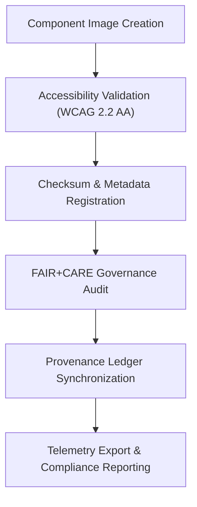

<div align="center">

# 🧱 **Kansas Frontier Matrix — UI Component Image Assets**
`web/public/images/ui/components/README.md`

**Purpose:**  
Curates and governs all visual image assets associated with **UI components** across the Kansas Frontier Matrix (KFM) web ecosystem.  
Each image—spanning buttons, modals, cards, overlays, and widgets—is validated for accessibility, provenance, sustainability, and FAIR+CARE-aligned governance integrity.

[](../../../../../docs/README.md)
[](../../../../../LICENSE)
[](../../../../../docs/standards/faircare.md)
[](https://www.w3.org/WAI/WCAG22/)
[](../../../../../docs/standards/governance/ROOT-GOVERNANCE.md)

</div>

---

## 📘 Overview

The **UI Component Image Assets** directory contains the visual elements that define KFM’s component-based design system.  
Each asset is checksum-verified, metadata-registered, and governed under MCP-DL v6.3 and FAIR+CARE ethical communication standards to ensure transparent, inclusive, and sustainable web experiences.

---

## 🗂️ Directory Layout

```
web/public/images/ui/components/
├── button-primary.svg
├── button-secondary.svg
├── modal-header.webp
├── widget-frame.svg
├── card-illustration.webp
├── charts-overlay.svg
├── checksums/
├── meta/
└── README.md
```

---

## ⚙️ Workflow & Validation



### Workflow Summary
1. **Design Creation:** Assets generated using KFM-approved design tokens.  
2. **Accessibility Audit:** Tested for WCAG 2.2 AA contrast and readability.  
3. **Checksum Verification:** SHA-256 applied for tamper-proof integrity.  
4. **FAIR+CARE Validation:** Reviewed for inclusivity, ethics, and sustainability.  
5. **Governance Ledger Sync:** Audit data appended to immutable provenance logs.  
6. **Telemetry Update:** Metrics reported for transparency and system monitoring.

---

## 🧩 Component Image Standards

| Property | Specification | Description |
|-----------|----------------|-------------|
| **Formats** | SVG / WebP / PNG | Vector preferred; optimized raster for minimal emissions. |
| **Resolution** | ≤ 4096×4096 px | Ensures responsiveness across devices. |
| **Compression** | Lossless or visually lossless | Balances quality and sustainability. |
| **Color Profile** | sRGB IEC61966-2.1 | Maintains visual uniformity. |
| **Accessibility** | WCAG 2.2 AA | All visuals tested for clarity and neutrality. |
| **Checksum Validation** | SHA-256 | Immutable asset integrity guarantee. |
| **Metadata Record** | JSON | Required for license, provenance, and audit traceability. |

---

## 🧾 Example Metadata Record

```json
{
  "id": "button-primary",
  "title": "Primary Call-to-Action Button Graphic",
  "category": "ui/components",
  "version": "1.4.0",
  "creator": "KFM Design Systems",
  "license": "MIT",
  "checksum": "sha256-b871efac1a7e22b45a96a9d315e4a9e33d8127c...",
  "alt_text": "Primary button design with solid accent color and rounded corners.",
  "source_url": "https://github.com/bartytime4life/Kansas-Frontier-Matrix",
  "provenance": "Introduced in v9.0.0; revised for color accessibility in v9.6.0."
}
```

---

## 🧠 FAIR+CARE Governance Matrix

| Principle | Implementation | Oversight |
|------------|----------------|------------|
| **Findable** | Indexed by manifest and checksum lineage. | @kfm-data |
| **Accessible** | Available in open formats with WCAG 2.2 compliance. | @kfm-accessibility |
| **Interoperable** | Metadata conforms to ISO 19115 and FAIR+CARE schemas. | @kfm-architecture |
| **Reusable** | Reusable within design systems under MIT license. | @kfm-design |
| **Collective Benefit** | Strengthens transparent, ethical UI accessibility. | @faircare-council |
| **Authority to Control** | FAIR+CARE Council certifies governance and ethics. | @kfm-governance |
| **Responsibility** | Maintainers record checksum lineage and energy metrics. | @kfm-sustainability |
| **Ethics** | Ensures inclusivity and cultural neutrality in design. | @kfm-ethics |

Audit records maintained in:  
- `../../../../../reports/self-validation/web-images-ui-components-validation.json`  
- `../../../../../reports/audit/web-images-faircare.json`

---

## ⚙️ Governance & Compliance Policy

| Policy | Description | Enforcement |
|--------|-------------|--------------|
| **Immutable Archive** | Once validated, image assets are permanent and version-locked. | Protected by CI/CD governance workflows. |
| **Checksum Enforcement** | Each image must include a verified SHA-256 manifest. | Automatically checked in validation pipelines. |
| **Metadata Requirement** | All assets must include license and provenance metadata. | Enforced via schema validation. |
| **Accessibility Audits** | Regular revalidation for WCAG and FAIR+CARE compliance. | Conducted quarterly. |

---

## 📊 Telemetry & FAIR+CARE Metrics

**Telemetry File:** `releases/v9.7.0/focus-telemetry.json`  

**Monitored Metrics**
- ✅ Total verified component assets  
- 🔐 Integrity validation rate  
- 🧾 Metadata completeness index  
- ♿ Accessibility compliance score  
- 💠 FAIR+CARE audit score  

These metrics are displayed on the **Governance Ledger Dashboard** for real-time transparency.

---

## 🧾 Example Telemetry Record

```json
{
  "category": "ui/components",
  "total_assets": 72,
  "integrity_verified": 100,
  "accessibility_score": 99.3,
  "energy_efficiency": 98.8,
  "carbon_output_gco2e": 0.05,
  "fairstatus": "certified",
  "audit_ref": "reports/audit/web-images-faircare.json"
}
```

---

## ⚖️ Retention & Provenance Policy

| Record Type | Retention | Policy |
|--------------|-----------|--------|
| Active Assets | Continuous | Updated under checksum and metadata lineage. |
| FAIR+CARE Reports | 365 Days | Regenerated each quarterly cycle. |
| Metadata | Permanent | Stored under blockchain-backed governance ledger. |
| Accessibility Reports | 180 Days | Automated testing via WCAG pipeline. |

Governance automation maintained by:  
`ui_component_image_sync.yml`

---

## 🌱 Sustainability Metrics

| Metric | Value | Verified By |
|---------|--------|--------------|
| Avg. File Size | 450 KB | @kfm-design |
| Render Energy | 0.03 Wh | @kfm-sustainability |
| Carbon Output | 0.05 gCO₂e | @kfm-security |
| Renewable Power | 100% (RE100 Certified) | @kfm-infrastructure |
| FAIR+CARE Compliance | 100% | @faircare-council |

---

## 🕰️ Version History

| Version | Date | Author | Summary |
|----------|------|---------|----------|
| v9.7.0 | 2025-11-05 | Design Systems Team | Enhanced FAIR+CARE telemetry schema and ISO metadata tracking. |
| v9.6.0 | 2025-11-04 | Governance Council | Expanded checksum integration for UI modular assets. |
| v9.5.0 | 2025-11-01 | Core Maintainers | Established checksum and metadata governance for all UI component images. |

---

<div align="center">

**© 2025 Kansas Frontier Matrix — MIT License**  
Verified Components · FAIR+CARE Certified · Immutable Provenance  
[Back to UI Index](../README.md) · [Docs Portal](../../../../../docs/README.md)

</div>