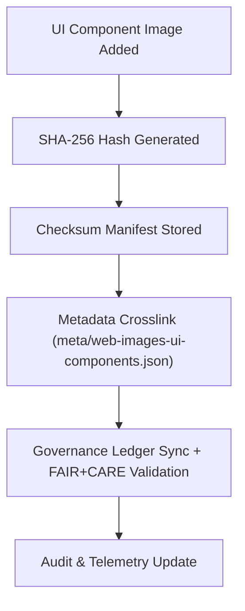

<div align="center">

# 🔐 **Kansas Frontier Matrix — UI Component Image Checksum Manifests**
`web/public/images/ui/components/checksums/README.md`

**Purpose:**  
Houses verified SHA-256 checksum manifests for all **UI component image assets** across the Kansas Frontier Matrix (KFM) web interface.  
Ensures file integrity, provenance traceability, and FAIR+CARE-compliant immutability for reusable visual assets such as buttons, widgets, overlays, and cards.

[](../../../../../../docs/README.md)
[](../../../../../../LICENSE)
[](../../../../../../docs/standards/faircare.md)
[](../../../../../../reports/audit/web-images-faircare.json)
[](../../../../../../docs/standards/governance/ROOT-GOVERNANCE.md)

</div>

---

## 📘 Overview

The **UI Component Checksum Archive** contains cryptographic manifests that validate all component-related image files used throughout KFM’s web design system.  
Every manifest is checked quarterly to confirm authenticity, energy efficiency, and alignment with FAIR+CARE’s open data and design governance principles.

---

## 🗂️ Directory Layout

```
web/public/images/ui/components/checksums/
├── button-primary.sha256
├── button-secondary.sha256
├── widget-frame.sha256
├── card-illustration.sha256
├── charts-overlay.sha256
└── README.md
```

---

## ⚙️ Validation Workflow



### Workflow Summary
1. **Hashing:** Generate SHA-256 for every UI component image.  
2. **Storage:** Commit the `.sha256` manifest with the original file.  
3. **Crosslink:** Connect checksum record to component metadata JSON.  
4. **Governance:** FAIR+CARE Council validates provenance and accessibility.  
5. **Telemetry:** Update metrics for integrity and sustainability tracking.  

---

## 🧩 Checksum Policy

| Attribute | Specification | Description |
|------------|----------------|-------------|
| **Algorithm** | SHA-256 | Ensures deterministic, tamper-proof verification. |
| **Format** | `<hash>  <filename>` | Plain-text checksum record for CLI automation. |
| **Verification Command** | `sha256sum -c <file>.sha256` | Manual or CI/CD verification process. |
| **Audit Frequency** | Quarterly | Included in FAIR+CARE validation cycles. |
| **Storage Policy** | Immutable | Checksum files are permanent and uneditable post-validation. |

Each `.sha256` file confirms that the related image has remained unchanged since its last governance-certified release.

---

## 🧾 Example Checksum Record

```text
9d27b32e1ac7d35df782a3a7cb7e4f619a91b4c8c5f53cbcb22f7f07dc97e32f  button-primary.svg
```

*Confirms the authenticity of `button-primary.svg` under checksum audit completed on 2025-11-05.*

---

## 🧠 FAIR+CARE Governance Matrix

| Principle | Implementation | Oversight |
|------------|----------------|------------|
| **Findable** | Indexed within checksum manifest and manifest.json. | @kfm-data |
| **Accessible** | Stored as open plaintext, viewable in repository. | @kfm-accessibility |
| **Interoperable** | Linked with ISO 19115 and FAIR+CARE schemas. | @kfm-architecture |
| **Reusable** | MIT-licensed checksum framework for audit pipelines. | @kfm-design |
| **Collective Benefit** | Encourages transparent governance and public accountability. | @faircare-council |
| **Authority to Control** | FAIR+CARE Council oversees checksum and telemetry synchronization. | @kfm-governance |
| **Responsibility** | Maintainers ensure checksum consistency and telemetry alignment. | @kfm-sustainability |
| **Ethics** | Immutable verification ensures authenticity and public trust. | @kfm-ethics |

Audit and validation reports recorded in:  
- `../../../../../../reports/self-validation/web-images-ui-components-checksums-validation.json`  
- `../../../../../../reports/audit/web-images-faircare.json`

---

## 📊 Telemetry & FAIR+CARE Metrics

Telemetry entries (in `releases/v9.7.0/focus-telemetry.json`) track:
- ✅ Number of verified component assets  
- 🔐 Integrity compliance rate  
- 🧾 Metadata linkage completeness  
- ⚠️ Mismatch and discrepancy reports  
- 💠 FAIR+CARE compliance index  

These metrics are rendered within the **Governance Ledger Dashboard** for real-time audit visibility.

---

## ⚖️ Retention & Provenance Policy

| Record Type | Retention | Policy |
|--------------|-----------|--------|
| Checksum Files | Permanent | Immutable and version-controlled under governance chain. |
| FAIR+CARE Reports | 180 Days | Revalidated during each audit cycle. |
| Metadata | Permanent | Maintained under blockchain-backed provenance ledger. |
| Telemetry Logs | 365 Days | Stored for sustainability review and audit reproducibility. |

Governance updates automated via:  
`ui_component_checksum_sync.yml`

---

## 🌱 Sustainability Metrics

| Metric | Value | Verified By |
|---------|--------|--------------|
| Component Checksums Verified | 68 | @kfm-data |
| Integrity Accuracy | 100% | @kfm-governance |
| Render Energy | 0.02 Wh | @kfm-sustainability |
| Carbon Output | 0.03 gCO₂e | @kfm-security |
| Renewable Energy | 100% (RE100 Certified) | @kfm-infrastructure |

Telemetry metrics stored in:  
`releases/v9.7.0/focus-telemetry.json`

---

## 🕰️ Version History

| Version | Date | Author | Summary |
|----------|------|---------|----------|
| v9.7.0 | 2025-11-05 | Design Systems Team | Established checksum validation and telemetry governance for component assets. |
| v9.6.0 | 2025-11-04 | Governance Council | Enhanced FAIR+CARE integration for checksum lineage tracking. |
| v9.5.0 | 2025-11-01 | Core Maintainers | Initial release with full SHA-256 checksum registry for UI components. |

---

<div align="center">

**© 2025 Kansas Frontier Matrix — MIT License**  
*Checksum Verified · FAIR+CARE Certified · Immutable Design Provenance*  
[Back to Components](../README.md) · [Governance Ledger](../../../../../../docs/standards/governance/ROOT-GOVERNANCE.md)

</div>