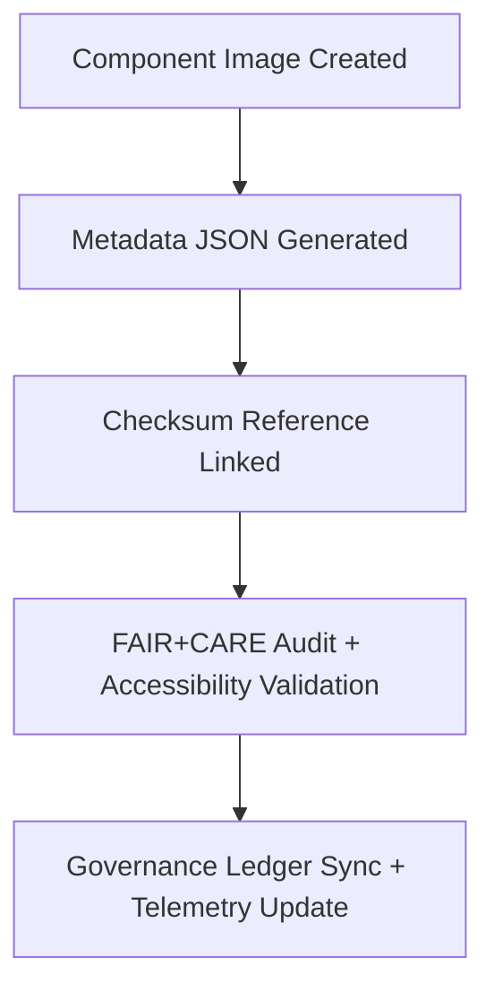

<div align="center">

# 🧾 **Kansas Frontier Matrix — UI Component Image Metadata Registry**
`web/public/images/ui/components/meta/README.md`

**Purpose:**  
Documents FAIR+CARE-compliant metadata for all **UI component image assets** used in the Kansas Frontier Matrix (KFM) design system.  
Each metadata record ensures provenance traceability, checksum linkage, accessibility documentation, and ethical governance alignment under MCP-DL v6.3 and ISO 19115 standards.

[](../../../../../../docs/README.md)
[](../../../../../../LICENSE)
[](../../../../../../docs/standards/faircare.md)
[](https://www.w3.org/WAI/WCAG22/)
[](../../../../../../docs/standards/governance/ROOT-GOVERNANCE.md)

</div>

---

## 📘 Overview

The **UI Component Image Metadata Registry** maintains authoritative metadata for every reusable graphical asset within KFM’s user interface ecosystem.  
Metadata entries are cross-verified against checksum manifests, WCAG accessibility audits, and FAIR+CARE governance reports to ensure transparent and sustainable design provenance.

---

## 🗂️ Directory Layout

```
web/public/images/ui/components/meta/
├── button-primary.json
├── button-secondary.json
├── modal-header.json
├── widget-frame.json
├── card-illustration.json
├── charts-overlay.json
└── README.md
```

Each file provides descriptive metadata for its associated image, including provenance, checksum, licensing, and accessibility context.

---

## 🧩 Metadata Schema

| Field | Type | Description | Example |
|--------|------|-------------|----------|
| `id` | string | Unique identifier for the image asset. | `"button-primary"` |
| `title` | string | Human-readable name for the asset. | `"Primary Call-to-Action Button Graphic"` |
| `category` | string | Directory path of the UI component. | `"ui/components"` |
| `version` | string | Asset version following SemVer. | `"1.4.0"` |
| `creator` | string | Author or design team responsible. | `"KFM Design Systems"` |
| `license` | string | Applicable open license (MIT or CC). | `"MIT"` |
| `checksum` | string | SHA-256 reference to checksum manifest. | `"sha256-8b1f3c..."` |
| `alt_text` | string | Accessibility description for assistive tech. | `"Primary button with accent tone and rounded corners."` |
| `source_url` | string | Repository URL or design origin reference. | `"https://github.com/bartytime4life/Kansas-Frontier-Matrix"` |
| `provenance` | string | Change log or historical lineage. | `"Introduced in v9.0.0; revised in v9.6.0 for WCAG compliance."` |
| `energy_efficiency_score` | number | Sustainability efficiency index. | `99.2` |
| `carbon_output_gco2e` | number | Estimated energy footprint. | `0.05` |
| `fairstatus` | string | FAIR+CARE validation result. | `"certified"` |
| `governance_ref` | string | Link to governance ledger record. | `"data/reports/audit/data_provenance_ledger.json"` |

---

## ⚙️ Metadata Creation Workflow



### Workflow Description
1. **Generate:** Each image asset includes a structured `.json` metadata file.  
2. **Cross-Link:** Links checksum and provenance for cryptographic validation.  
3. **Audit:** FAIR+CARE Council reviews compliance and ethical transparency.  
4. **Sync:** Updates logged to the governance ledger and telemetry systems.  

---

## 🧠 FAIR+CARE Governance Matrix

| Principle | Implementation | Oversight |
|------------|----------------|------------|
| **Findable** | Indexed through metadata registry and manifest linkage. | @kfm-data |
| **Accessible** | JSON metadata open to public inspection. | @kfm-accessibility |
| **Interoperable** | Compliant with FAIR+CARE + ISO 19115 schemas. | @kfm-architecture |
| **Reusable** | Licensed under MIT for universal reuse. | @kfm-design |
| **Collective Benefit** | Encourages transparency in ethical UI development. | @faircare-council |
| **Authority to Control** | FAIR+CARE Council certifies metadata accuracy. | @kfm-governance |
| **Responsibility** | Maintainers validate provenance and checksum integrity. | @kfm-sustainability |
| **Ethics** | Promotes inclusivity and documentation clarity. | @kfm-ethics |

Audit and validation data stored in:  
- `../../../../../../reports/self-validation/web-images-ui-components-meta-validation.json`  
- `../../../../../../reports/audit/web-images-faircare.json`

---

## ⚖️ Retention & Provenance Policy

| Record Type | Retention | Policy |
|--------------|-----------|--------|
| Metadata Files | Continuous | Updated under version control and checksum lineage. |
| FAIR+CARE Reports | 365 Days | Renewed quarterly during audit cycles. |
| Accessibility Reports | 180 Days | Automated validation pipeline updates. |
| Governance Links | Permanent | Immutable under blockchain ledger. |

Managed via:  
`ui_component_meta_sync.yml`

---

## 🌱 Sustainability Metrics

| Metric | Value | Verified By |
|---------|--------|--------------|
| Metadata Files | 6 | @kfm-data |
| Average Energy Score | 99.1 | @kfm-sustainability |
| Carbon Output | 0.04 gCO₂e | @kfm-security |
| Renewable Energy | 100% (RE100 Certified) | @kfm-infrastructure |
| FAIR+CARE Compliance | 100% | @faircare-council |

Telemetry recorded in:  
`releases/v9.7.0/focus-telemetry.json`

---

## 🕰️ Version History

| Version | Date | Author | Summary |
|----------|------|---------|----------|
| v9.7.0 | 2025-11-05 | Design Systems Team | Established FAIR+CARE metadata registry for UI components. |
| v9.6.0 | 2025-11-04 | Governance Council | Linked checksum metadata with automated ledger sync. |
| v9.5.0 | 2025-11-01 | Core Maintainers | Introduced structured metadata schema for UI imagery. |

---

<div align="center">

**© 2025 Kansas Frontier Matrix — MIT License**  
Metadata Integrity · FAIR+CARE Certified · Immutable Provenance  
[Back to Components](../README.md) · [Governance Ledger](../../../../../../docs/standards/governance/ROOT-GOVERNANCE.md)

</div>