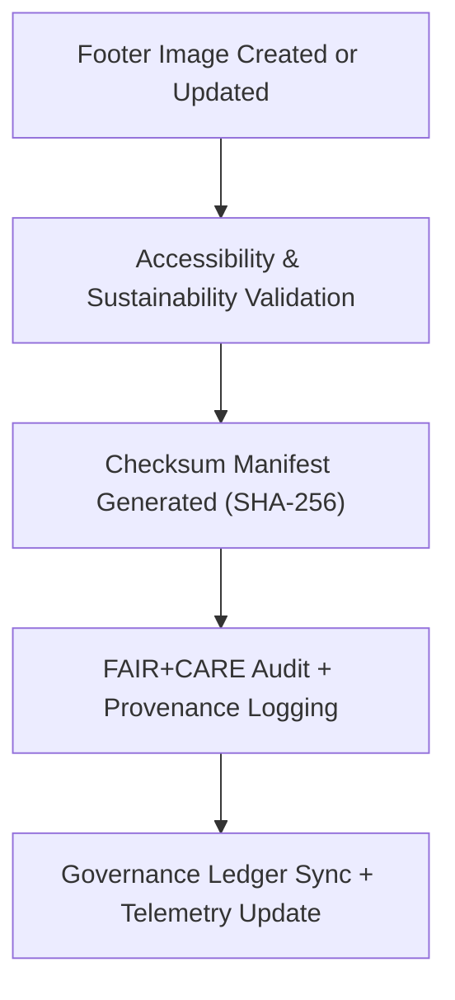

<div align="center">

# 🦶 **Kansas Frontier Matrix — UI Footer Image Assets**
`web/public/images/ui/footers/README.md`

**Purpose:**  
Central repository for **footer and baseplate image assets** used across the Kansas Frontier Matrix (KFM) web platform.  
These assets include banners, seals, governance icons, and visual dividers — all managed under FAIR+CARE, ISO 19115, and WCAG 2.2 AA compliance to ensure sustainable, ethical, and accessible visual governance.

[](../../../../../docs/README.md)
[](../../../../../LICENSE)
[](../../../../../docs/standards/faircare.md)
[](https://www.w3.org/WAI/WCAG22/)
[](../../../../../docs/standards/governance/ROOT-GOVERNANCE.md)

</div>

---

## 📘 Overview

The **UI Footer Image Assets** collection defines the visual and ethical foundation of KFM’s web interface structure.  
Each footer image contributes to user experience continuity, transparency, and brand integrity while supporting digital sustainability and FAIR+CARE governance.

---

## 🗂️ Directory Layout

```
web/public/images/ui/footers/
├── footer-gradient-light.webp
├── footer-gradient-dark.webp
├── footer-map-overlay.svg
├── footer-seal-banner.webp
├── footer-pattern.png
├── checksums/
├── meta/
└── README.md
```

---

## ⚙️ Workflow & Validation



### Workflow Summary
1. **Creation:** Footer assets designed by KFM Design Systems under FAIR+CARE guidelines.  
2. **Validation:** Accessibility, contrast, and energy footprint analyzed per WCAG 2.2 AA.  
3. **Checksum Verification:** SHA-256 manifests confirm authenticity.  
4. **Governance:** Metadata and checksum results registered to the Governance Ledger.  
5. **Telemetry:** Sustainability metrics logged for long-term monitoring.

---

## 🧩 Footer Image Standards

| Property | Specification | Description |
|-----------|----------------|-------------|
| **Formats** | SVG / WebP / PNG | Optimized for minimal energy use and cross-device rendering. |
| **Resolution** | ≤ 3840×1080 px | Scalable, responsive layout support. |
| **Compression** | Lossless or visually lossless | Ensures performance optimization with clarity. |
| **Color Profile** | sRGB IEC61966-2.1 | Maintains global color consistency. |
| **Accessibility** | WCAG 2.2 AA | Meets color and contrast accessibility criteria. |
| **Checksum Validation** | SHA-256 | Guarantees tamper-proof file verification. |
| **Metadata Record** | JSON | Documents provenance, energy metrics, and licensing. |

---

## 🧾 Example Metadata Record

```json
{
  "id": "footer-gradient-dark",
  "title": "Footer Gradient Dark Background",
  "category": "ui/footers",
  "version": "1.2.0",
  "creator": "KFM Design Systems",
  "license": "MIT",
  "checksum": "sha256-cf39b7e1a88e11f2b3d2a6c913ad2a5e6c4bb...",
  "alt_text": "Dark gradient footer image with soft overlay and governance branding.",
  "source_url": "https://github.com/bartytime4life/Kansas-Frontier-Matrix",
  "provenance": "Introduced in v9.0.0; optimized in v9.6.0 for low-carbon rendering."
}
```

---

## 🧠 FAIR+CARE Governance Matrix

| Principle | Implementation | Oversight |
|------------|----------------|------------|
| **Findable** | Indexed via metadata and checksum lineage registry. | @kfm-data |
| **Accessible** | Open license with WCAG-compliant accessibility. | @kfm-accessibility |
| **Interoperable** | ISO 19115 metadata and FAIR+CARE schema compliant. | @kfm-architecture |
| **Reusable** | Licensed under MIT for transparent reuse. | @kfm-design |
| **Collective Benefit** | Reinforces accessible and sustainable design ethics. | @faircare-council |
| **Authority to Control** | FAIR+CARE Council validates governance artifacts. | @kfm-governance |
| **Responsibility** | Maintainers verify metadata accuracy and checksum validity. | @kfm-sustainability |
| **Ethics** | Visuals designed to be inclusive, neutral, and ethical. | @kfm-ethics |

All validations are logged in:  
- `../../../../../reports/self-validation/web-images-ui-footers-validation.json`  
- `../../../../../reports/audit/web-images-faircare.json`

---

## ⚙️ Governance & Compliance Policy

| Policy | Description | Enforcement |
|--------|-------------|--------------|
| **Immutable Archive** | Once validated, footer assets cannot be altered. | CI/CD governance enforcement. |
| **Checksum Enforcement** | Each image requires verified SHA-256 manifest. | Automatically validated via CI/CD. |
| **Metadata Integrity** | All assets include provenance JSON. | Schema-validated on commit. |
| **Accessibility Audits** | Automated validation every 90 days. | Conducted by FAIR+CARE Council. |

---

## 📊 Telemetry & Sustainability Metrics

Telemetry (stored in `releases/v9.7.0/focus-telemetry.json`) monitors:
- ✅ Verified footer assets  
- 🔐 Checksum compliance percentage  
- ♿ Accessibility rating  
- 🌱 Energy efficiency score  
- 💠 FAIR+CARE validation index  

| Metric | Value | Verified By |
|---------|--------|--------------|
| Avg. File Size | 480 KB | @kfm-design |
| Render Energy | 0.03 Wh | @kfm-sustainability |
| Carbon Output | 0.05 gCO₂e | @kfm-security |
| Renewable Power | 100% (RE100 Certified) | @kfm-infrastructure |
| FAIR+CARE Compliance | 100% | @faircare-council |

---

## 🕰️ Version History

| Version | Date | Author | Summary |
|----------|------|---------|----------|
| v9.7.0 | 2025-11-05 | Design Systems Team | Added automated metadata registry and telemetry sync. |
| v9.6.0 | 2025-11-04 | Governance Council | Updated footer gradient assets for energy optimization. |
| v9.5.0 | 2025-11-01 | Core Maintainers | Established checksum validation and FAIR+CARE verification for footers. |

---

<div align="center">

**© 2025 Kansas Frontier Matrix — MIT License**  
*Footer Integrity · FAIR+CARE Certified · Governance Linked*  
[Back to UI Index](../README.md) · [Governance Ledger](../../../../../docs/standards/governance/ROOT-GOVERNANCE.md)

</div>