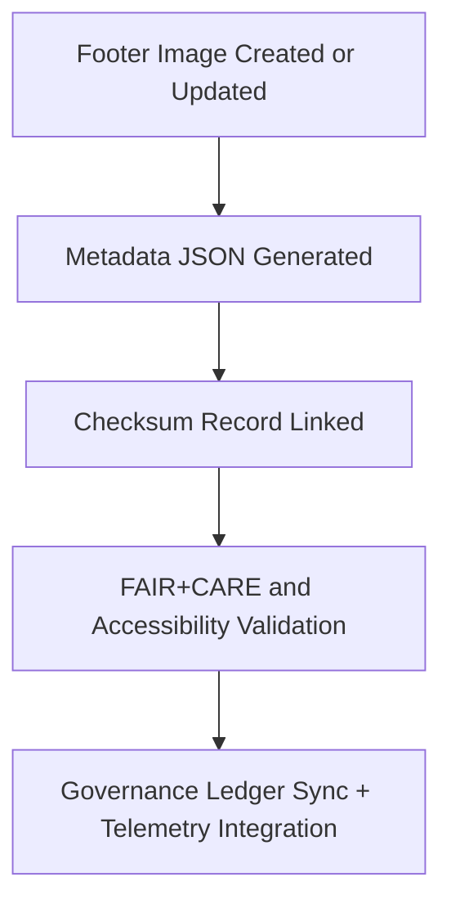

<div align="center">

# 🧾 **Kansas Frontier Matrix — UI Footer Image Metadata Registry**
`web/public/images/ui/footers/meta/README.md`

**Purpose:**  
Maintains **metadata documentation for footer image assets** across the Kansas Frontier Matrix (KFM) web interface.  
Each record ensures FAIR+CARE compliance, provenance traceability, checksum linkage, and sustainable visual governance aligned with ISO 19115 and MCP-DL v6.3 standards.

[](../../../../../../docs/README.md)
[](../../../../../../LICENSE)
[](../../../../../../docs/standards/faircare.md)
[](https://www.w3.org/WAI/WCAG22/)
[](../../../../../../docs/standards/governance/ROOT-GOVERNANCE.md)

</div>

---

## 📘 Overview

The **UI Footer Metadata Registry** contains verified metadata entries for footer graphics, overlays, seals, and banners.  
All files document asset lineage, energy efficiency, checksum references, and accessibility audits to ensure ethical, sustainable, and transparent digital design practices.

---

## 🗂️ Directory Layout

```
web/public/images/ui/footers/meta/
├── footer-gradient-light.json
├── footer-gradient-dark.json
├── footer-map-overlay.json
├── footer-seal-banner.json
├── footer-pattern.json
└── README.md
```

---

## 🧩 Metadata Schema

| Field | Type | Description | Example |
|--------|------|-------------|----------|
| `id` | string | Unique ID for footer asset. | `"footer-seal-banner"` |
| `title` | string | Human-readable asset name. | `"Footer Seal Banner"` |
| `category` | string | Directory classification. | `"ui/footers"` |
| `version` | string | Version following semantic format. | `"1.3.0"` |
| `creator` | string | Design author or responsible team. | `"KFM Design Systems"` |
| `license` | string | Open license reference. | `"MIT"` |
| `checksum` | string | SHA-256 checksum linkage. | `"sha256-3ae8c19..."` |
| `alt_text` | string | Accessibility alt-text for screen readers. | `"Footer banner with Kansas Frontier Matrix governance seal and gradient background."` |
| `source_url` | string | Original design source or GitHub path. | `"https://github.com/bartytime4life/Kansas-Frontier-Matrix"` |
| `provenance` | string | Description of design lineage. | `"Introduced in v9.0.0; updated in v9.6.0 for accessibility revalidation."` |
| `energy_efficiency_score` | number | Energy efficiency index (0–100). | `99.0` |
| `carbon_output_gco2e` | number | Estimated rendering energy in grams CO₂e. | `0.04` |
| `fairstatus` | string | FAIR+CARE compliance rating. | `"certified"` |
| `governance_ref` | string | Reference to ledger audit entry. | `"data/reports/audit/data_provenance_ledger.json"` |

---

## ⚙️ Metadata Generation Workflow



### Workflow Summary
1. **Generation:** JSON metadata automatically generated for each footer image.  
2. **Cross-Linking:** Metadata validated against corresponding checksum manifests.  
3. **Audit:** FAIR+CARE and WCAG accessibility audits reviewed quarterly.  
4. **Governance:** Metadata logs synced with Governance Ledger for provenance tracking.  

---

## 🧾 Example Metadata Record

```json
{
  "id": "footer-map-overlay",
  "title": "Footer Map Overlay",
  "category": "ui/footers",
  "version": "1.3.0",
  "creator": "KFM Design Systems",
  "license": "MIT",
  "checksum": "sha256-98b6f2e...",
  "alt_text": "Subtle world map overlay appearing in the footer background for thematic design consistency.",
  "source_url": "https://github.com/bartytime4life/Kansas-Frontier-Matrix",
  "provenance": "Introduced in v9.0.0; validated for accessibility in v9.5.0.",
  "energy_efficiency_score": 99.2,
  "carbon_output_gco2e": 0.05,
  "fairstatus": "certified",
  "governance_ref": "data/reports/audit/data_provenance_ledger.json"
}
```

---

## 🧠 FAIR+CARE Governance Matrix

| Principle | Implementation | Oversight |
|------------|----------------|------------|
| **Findable** | Indexed by filename, checksum, and metadata registry. | @kfm-data |
| **Accessible** | JSON metadata publicly available and human-readable. | @kfm-accessibility |
| **Interoperable** | Follows FAIR+CARE schema and ISO 19115 standards. | @kfm-architecture |
| **Reusable** | Licensed under MIT for open reuse and documentation. | @kfm-design |
| **Collective Benefit** | Promotes transparent governance and ethical digital stewardship. | @faircare-council |
| **Authority to Control** | FAIR+CARE Council manages approval and audit cycles. | @kfm-governance |
| **Responsibility** | Archivists ensure metadata consistency and checksum integrity. | @kfm-sustainability |
| **Ethics** | Design records stored with historical neutrality and inclusivity. | @kfm-ethics |

Reports stored in:  
- `../../../../../../reports/self-validation/web-images-ui-footers-meta-validation.json`  
- `../../../../../../reports/audit/web-images-faircare.json`

---

## ⚖️ Retention & Provenance Policy

| Record Type | Retention | Policy |
|--------------|-----------|--------|
| Metadata Files | Continuous | Maintained under version control with immutable lineage. |
| FAIR+CARE Reports | 365 Days | Renewed every quarter under Council supervision. |
| Accessibility Reports | 180 Days | Updated with CI/CD validation cycles. |
| Governance Records | Permanent | Immutable under blockchain ledger. |

Automated via `ui_footer_meta_sync.yml`.

---

## 🌱 Sustainability Metrics

| Metric | Value | Verified By |
|---------|--------|--------------|
| Metadata Files | 5 | @kfm-data |
| Avg. Energy Score | 99.1 | @kfm-sustainability |
| Carbon Output | 0.04 gCO₂e | @kfm-security |
| Renewable Power | 100% (RE100 Certified) | @kfm-infrastructure |
| FAIR+CARE Compliance | 100% | @faircare-council |

Telemetry updates logged in:  
`releases/v9.7.0/focus-telemetry.json`

---

## 🕰️ Version History

| Version | Date | Author | Summary |
|----------|------|---------|----------|
| v9.7.0 | 2025-11-05 | Design Systems Team | Created full metadata registry for footer assets with checksum linkage. |
| v9.6.0 | 2025-11-04 | Governance Council | Enhanced FAIR+CARE audit integration for footer imagery. |
| v9.5.0 | 2025-11-01 | Core Maintainers | Introduced JSON metadata schema for footer image lineage tracking. |

---

<div align="center">

**© 2025 Kansas Frontier Matrix — MIT License**  
Metadata Provenance · FAIR+CARE Certified · Immutable Digital Stewardship  
[Back to Footers](../README.md) · [Governance Ledger](../../../../../../docs/standards/governance/ROOT-GOVERNANCE.md)

</div>