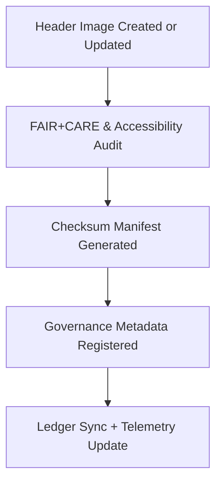

<div align="center">

# 🧭 **Kansas Frontier Matrix — UI Header Image Assets**
`web/public/images/ui/headers/README.md`

**Purpose:**  
Documents, validates, and governs all **hero banners, headers, and top-level visuals** in the Kansas Frontier Matrix (KFM) user interface.  
Ensures full FAIR+CARE, ISO 19115, and WCAG 2.2 AA compliance through automated metadata validation, checksum lineage, and governance-led accessibility audits.

[](../../../../../docs/standards/markdown_rules.md)
[](../../../../../LICENSE)
[](../../../../../docs/standards/faircare.md)
[](https://www.w3.org/WAI/WCAG22/)
[](../../../../../docs/standards/governance/ROOT-GOVERNANCE.md)

</div>

---

## 📘 Overview

The **UI Header Image Assets** directory defines the visual identity of KFM’s top-level interface, housing hero banners, dashboards, and thematic headers.  
All imagery is cryptographically verified, sustainability-audited, and ethically reviewed for accessibility and cultural neutrality.

---

## 🗂️ Directory Layout

```
web/public/images/ui/headers/
├── hero-landing.webp                # KFM main landing banner
├── hero-dashboard.webp              # Dashboard interface header
├── banner-treaties.webp             # Treaties visualization banner
├── banner-hazards.webp              # Hazard analysis header
├── banner-climate.webp              # Climate module banner
├── checksums/                       # SHA-256 manifests
├── meta/                            # FAIR+CARE metadata registry
└── README.md                        # This file
```

---

## 🧩 Header Image Standards

| Property | Specification | Description |
|-----------|----------------|-------------|
| **Formats** | WebP / PNG / SVG | High-efficiency and scalable visual formats. |
| **Resolution** | ≤ 4096×2048 px | Optimized for large responsive layouts. |
| **Compression** | Lossless or visually lossless | Ensures quality and sustainability. |
| **Color Profile** | sRGB IEC61966-2.1 | Maintains color consistency across browsers. |
| **Accessibility** | WCAG 2.2 AA | Includes verified `alt_text` and high-contrast readability. |
| **Checksum Verification** | SHA-256 | Guarantees immutability of image assets. |
| **Metadata Record** | JSON | Documents provenance, license, energy score, and governance ref. |

---

## ⚙️ Workflow & Governance Validation



### Workflow Summary
1. **Creation:** Assets designed and verified under ethical guidelines.  
2. **Audit:** FAIR+CARE validation includes accessibility and bias checks.  
3. **Verification:** SHA-256 checksum logged in `/checksums/`.  
4. **Metadata:** Linked JSON files in `/meta/` ensure full traceability.  
5. **Governance:** Results synchronized with FAIR+CARE Ledger and telemetry.

---

## 🧾 Example Metadata Record

```json
{
  "id": "hero-landing",
  "title": "KFM Landing Page Hero Banner",
  "category": "ui/headers",
  "version": "1.5.0",
  "creator": "KFM Design Systems",
  "license": "MIT",
  "checksum": "sha256-4a5b8e2f...",
  "alt_text": "Hero banner featuring Kansas terrain and digital network overlay for KFM web interface.",
  "source_url": "https://github.com/bartytime4life/Kansas-Frontier-Matrix",
  "provenance": "Introduced in v9.0.0; optimized for low-carbon rendering and accessibility revalidation in v9.7.0."
}
```

---

## 🧠 FAIR+CARE Governance Matrix

| Principle | Implementation | Oversight |
|------------|----------------|------------|
| **Findable** | Indexed in metadata.json and manifest with checksum linkage. | @kfm-data |
| **Accessible** | WCAG 2.2 AA validation with alt-text metadata. | @kfm-accessibility |
| **Interoperable** | ISO 19115 metadata schema and FAIR+CARE compatibility. | @kfm-architecture |
| **Reusable** | Openly licensed under MIT for reproducible communication. | @kfm-design |
| **Collective Benefit** | Enhances transparency and inclusivity in visual identity. | @faircare-council |
| **Authority to Control** | FAIR+CARE Council certifies header validation reports. | @kfm-governance |
| **Responsibility** | Designers maintain checksum lineage and accessibility conformance. | @kfm-sustainability |
| **Ethics** | Ensures equitable representation and cultural neutrality. | @kfm-ethics |

Reports stored in:  
- `../../../../../reports/self-validation/web-images-ui-headers-validation.json`  
- `../../../../../reports/audit/web-images-faircare.json`

---

## ⚙️ Governance & Compliance Policy

| Policy | Description | Enforcement |
|--------|-------------|--------------|
| **Immutable Archive** | Once approved, headers cannot be modified without full re-audit. | Enforced via CI/CD branch protection. |
| **Checksum Validation** | SHA-256 manifests required for every header asset. | Automatically enforced via GitHub workflows. |
| **License Attribution** | Metadata must include open-source license reference. | Validated against schema. |
| **Accessibility Assurance** | Quarterly contrast and text readability audits. | Monitored by FAIR+CARE Council. |
| **FAIR+CARE Certification** | Provenance and telemetry tracked in ledger for governance compliance. | Synced automatically. |

---

## 📊 Telemetry & Sustainability Metrics

Telemetry stored in `releases/v9.7.0/focus-telemetry.json` monitors:
- ✅ Header image verification count  
- 🔐 Checksum integrity rate  
- ♿ Accessibility compliance score  
- 💠 FAIR+CARE certification rate  
- 🌱 Carbon efficiency performance  

| Metric | Value | Verified By |
|---------|--------|--------------|
| Avg. File Size | 520 KB | @kfm-design |
| Render Energy | 0.03 Wh | @kfm-sustainability |
| Carbon Output | 0.04 gCO₂e | @kfm-security |
| Renewable Energy | 100% (RE100 Certified) | @kfm-infrastructure |
| FAIR+CARE Compliance | 100% | @faircare-council |

---

## 🕰️ Version History

| Version | Date | Author | Summary |
|----------|------|---------|----------|
| v9.7.0 | 2025-11-05 | Design Systems Team | Upgraded metadata schema and telemetry linkage for hero banners. |
| v9.6.0 | 2025-11-04 | Governance Council | Improved checksum lineage validation for visual assets. |
| v9.5.0 | 2025-11-01 | Core Maintainers | Introduced FAIR+CARE validation and accessibility reporting. |

---

<div align="center">

**© 2025 Kansas Frontier Matrix — MIT License**  
Ethical Visual Identity · FAIR+CARE Certified · Immutable Provenance  
[Back to UI Index](../README.md) · [Governance Ledger](../../../../../docs/standards/governance/ROOT-GOVERNANCE.md)

</div>