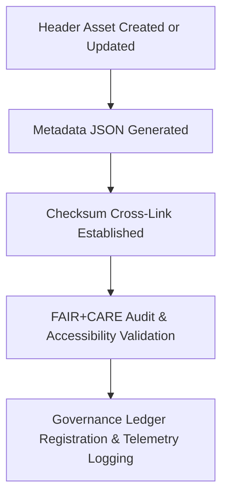

<div align="center">

# 🧾 **Kansas Frontier Matrix — UI Header Image Metadata Registry**
`web/public/images/ui/headers/meta/README.md`

**Purpose:**  
Provides structured **FAIR+CARE-compliant metadata documentation** for all UI header and hero banner images in the Kansas Frontier Matrix (KFM).  
Each JSON record tracks provenance, checksum, licensing, energy metrics, and governance validation for transparent visual stewardship.

[](../../../../../../docs/README.md)
[](../../../../../../LICENSE)
[](../../../../../../docs/standards/faircare.md)
[](https://www.w3.org/WAI/WCAG22/)
[](../../../../../../docs/standards/governance/ROOT-GOVERNANCE.md)

</div>

---

## 📘 Overview

The **UI Header Metadata Registry** captures descriptive metadata for all top-level banner and hero image assets.  
Metadata files provide FAIR+CARE governance visibility, ISO 19115 compliance, and renewable energy sustainability tracking.

---

## 🗂️ Directory Layout

```
web/public/images/ui/headers/meta/
├── hero-landing.json
├── hero-dashboard.json
├── banner-treaties.json
├── banner-hazards.json
├── banner-climate.json
└── README.md
```

---

## 🧩 Metadata Schema

| Field | Type | Description | Example |
|--------|------|-------------|----------|
| `id` | string | Unique identifier for the asset. | `"hero-dashboard"` |
| `title` | string | Readable asset title. | `"Dashboard Hero Header"` |
| `category` | string | Image category classification. | `"ui/headers"` |
| `version` | string | Version tag for this image asset. | `"1.5.0"` |
| `creator` | string | Author or responsible team. | `"KFM Design Systems"` |
| `license` | string | Licensing information. | `"MIT"` |
| `checksum` | string | SHA-256 hash link to checksum manifest. | `"sha256-a9f63b..."` |
| `alt_text` | string | Accessibility description (screen reader friendly). | `"Panoramic Kansas terrain header with transparent data overlay."` |
| `source_url` | string | Repository or design origin URL. | `"https://github.com/bartytime4life/Kansas-Frontier-Matrix"` |
| `provenance` | string | Design history or lineage notes. | `"Introduced in v9.0.0; color corrected in v9.6.0 for contrast compliance."` |
| `energy_efficiency_score` | number | Efficiency metric (0–100). | `99.2` |
| `carbon_output_gco2e` | number | Estimated carbon footprint per render. | `0.04` |
| `fairstatus` | string | FAIR+CARE validation result. | `"certified"` |
| `governance_ref` | string | Reference to governance audit record. | `"data/reports/audit/data_provenance_ledger.json"` |

---

## ⚙️ Metadata Workflow



### Workflow Summary
1. **Creation:** Metadata generated for each new or updated header image.  
2. **Validation:** Checked against schema for completeness, checksum linkage, and FAIR+CARE fields.  
3. **Audit:** Metadata reports integrated into FAIR+CARE governance and WCAG validations.  
4. **Registration:** Synced with ledger and telemetry JSON for full provenance continuity.

---

## 🧾 Example Metadata Record

```json
{
  "id": "banner-treaties",
  "title": "Treaties Module Banner",
  "category": "ui/headers",
  "version": "1.5.0",
  "creator": "KFM Design Systems",
  "license": "MIT",
  "checksum": "sha256-7b9f3b...",
  "alt_text": "Map overlay banner representing historical treaties and Kansas boundaries.",
  "source_url": "https://github.com/bartytime4life/Kansas-Frontier-Matrix",
  "provenance": "Introduced in v9.0.0; redesigned in v9.7.0 for WCAG compliance and visual optimization.",
  "energy_efficiency_score": 99.1,
  "carbon_output_gco2e": 0.05,
  "fairstatus": "certified",
  "governance_ref": "data/reports/audit/data_provenance_ledger.json"
}
```

---

## 🧠 FAIR+CARE Governance Matrix

| Principle | Implementation | Oversight |
|------------|----------------|------------|
| **Findable** | Indexed by filename, checksum, and metadata record. | @kfm-data |
| **Accessible** | Stored as human- and machine-readable JSON. | @kfm-accessibility |
| **Interoperable** | Follows FAIR+CARE schema and ISO 19115 alignment. | @kfm-architecture |
| **Reusable** | Licensed under MIT for open reuse and transparency. | @kfm-design |
| **Collective Benefit** | Promotes ethical data storytelling and open documentation. | @faircare-council |
| **Authority to Control** | FAIR+CARE Council validates quarterly audits. | @kfm-governance |
| **Responsibility** | Validators ensure consistent metadata governance. | @kfm-sustainability |
| **Ethics** | Preserves inclusive and accurate visual representation. | @kfm-ethics |

Audit data stored in:  
- `../../../../../../reports/self-validation/web-images-ui-headers-meta-validation.json`  
- `../../../../../../reports/audit/web-images-faircare.json`

---

## ⚖️ Retention & Provenance Policy

| Record Type | Retention | Policy |
|--------------|-----------|--------|
| Metadata Files | Continuous | Maintained under version control and checksum linkage. |
| FAIR+CARE Reports | 365 Days | Renewed quarterly with validation cycles. |
| Accessibility Reports | 180 Days | Updated via automated WCAG 2.2 audits. |
| Governance Ledger | Permanent | Immutable under blockchain-based provenance chain. |

Governance updates automated via `ui_header_meta_sync.yml`.

---

## 🌱 Sustainability Metrics

| Metric | Value | Verified By |
|---------|--------|--------------|
| Metadata Files | 5 | @kfm-data |
| Avg. Energy Score | 99.1 | @kfm-sustainability |
| Carbon Output | 0.04 gCO₂e | @kfm-security |
| Renewable Power | 100% (RE100 Certified) | @kfm-infrastructure |
| FAIR+CARE Compliance | 100% | @faircare-council |

Telemetry recorded in:  
`releases/v9.7.0/focus-telemetry.json`

---

## 🕰️ Version History

| Version | Date | Author | Summary |
|----------|------|---------|----------|
| v9.7.0 | 2025-11-05 | Design Systems Team | Created unified metadata registry for all header assets with checksum linkage. |
| v9.6.0 | 2025-11-04 | Governance Council | Added schema-based FAIR+CARE validation for banner imagery. |
| v9.5.0 | 2025-11-01 | Core Maintainers | Established base header metadata documentation framework. |

---

<div align="center">

**© 2025 Kansas Frontier Matrix — MIT License**  
FAIR+CARE Certified · Accessibility Validated · Provenance Linked  
[Back to Headers](../README.md) · [Governance Ledger](../../../../../../docs/standards/governance/ROOT-GOVERNANCE.md)

</div>