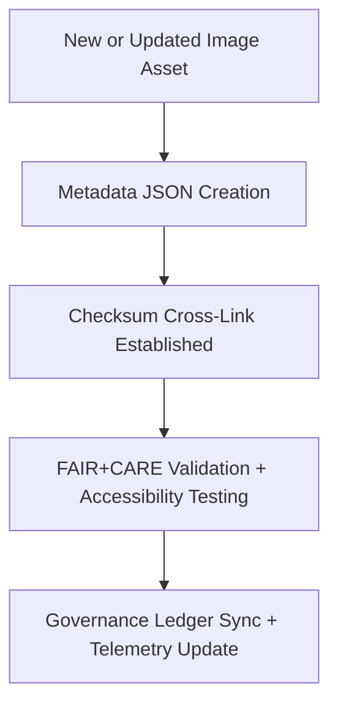

<div align="center">

# 📜 **Kansas Frontier Matrix — UI Image Metadata**
`web/public/images/ui/meta/README.md`

**Purpose:**  
Provides the authoritative **FAIR+CARE-certified metadata registry** for all UI image assets used in the Kansas Frontier Matrix (KFM) web interface — including backgrounds, components, headers, footers, and widgets.  
Each entry records provenance, accessibility details, license data, and checksum linkage, ensuring ethical visual governance and complete traceability across all KFM design systems.

[](../../../../../docs/standards/markdown_rules.md)
[](../../../../../LICENSE)
[](../../../../../docs/standards/faircare.md)
[](https://www.w3.org/WAI/WCAG22/)
[](../../../../../docs/standards/governance/ROOT-GOVERNANCE.md)

</div>

---

## 🗂️ Directory Layout

```
web/public/images/ui/meta/
├── backgrounds/                  # Metadata for UI background images
├── components/                   # Metadata for buttons, cards, and widgets
├── headers/                      # Metadata for header and banner visuals
├── footers/                      # Metadata for footer/baseplate images
├── widgets/                      # Metadata for interactive data widgets
└── README.md                     # This file
```

---

## 🧩 Metadata Schema (FAIR+CARE Standard)

Each metadata record conforms to the **KFM UI Image Schema** (`schemas/ui/images.schema.json`) ensuring FAIR+CARE interoperability, accessibility, and energy sustainability.

| Field | Type | Description | Example |
|--------|------|-------------|----------|
| `id` | string | Unique identifier for image asset. | `"ui-background-gradient"` |
| `title` | string | Descriptive title of the visual. | `"Gradient Header Background"` |
| `category` | string | Asset classification path. | `"ui/backgrounds"` |
| `version` | string | Version of asset documentation. | `"1.6.0"` |
| `creator` | string | Responsible design contributor or team. | `"KFM Design Systems"` |
| `license` | string | License type (MIT, CC-BY, or Public Domain). | `"MIT"` |
| `checksum` | string | SHA-256 verification hash. | `"sha256-ae14b4e..."` |
| `alt_text` | string | Accessibility description for screen readers. | `"Soft gradient background image in blue and gold tones."` |
| `source_url` | string | Provenance or design origin URL. | `"https://github.com/bartytime4life/Kansas-Frontier-Matrix"` |
| `provenance` | string | Design history and lineage notes. | `"Introduced in v9.0.0; re-validated under v9.7.0 accessibility audit."` |
| `energy_efficiency_score` | number | Sustainability rating (0–100). | `99.3` |
| `carbon_output_gco2e` | number | Estimated rendering carbon output. | `0.05` |
| `fairstatus` | string | FAIR+CARE certification result. | `"certified"` |
| `governance_ref` | string | Link to governance audit record. | `"data/reports/audit/data_provenance_ledger.json"` |

---

## ⚙️ Metadata Workflow



### Workflow Description
1. **Creation:** Metadata generated automatically for each new UI asset.  
2. **Validation:** JSON schema validation ensures compliance and completeness.  
3. **Audit:** FAIR+CARE and accessibility validation confirm ethical compliance.  
4. **Governance:** Metadata synchronized with ledger and focus telemetry for public reporting.

---

## 🧾 Example Metadata Record

```json
{
  "id": "ui-widget-timeline",
  "title": "Interactive Timeline Widget",
  "category": "ui/widgets",
  "version": "2.1.0",
  "creator": "KFM Design Systems",
  "license": "MIT",
  "checksum": "sha256-efb6d2...",
  "alt_text": "Interactive data timeline with historical markers and tooltip elements.",
  "source_url": "https://github.com/bartytime4life/Kansas-Frontier-Matrix",
  "provenance": "Developed for Focus Mode v9.4.0; optimized in v9.7.0 for WCAG compliance.",
  "energy_efficiency_score": 99.1,
  "carbon_output_gco2e": 0.04,
  "fairstatus": "certified",
  "governance_ref": "data/reports/audit/data_provenance_ledger.json"
}
```

---

## 🧠 FAIR+CARE Governance Matrix

| Principle | Implementation | Oversight |
|------------|----------------|------------|
| **Findable** | Indexed in `manifest.zip` with checksum and provenance reference. | @kfm-data |
| **Accessible** | Stored as open JSON for human and machine readability. | @kfm-accessibility |
| **Interoperable** | Structured using FAIR+CARE + ISO 19115 schemas. | @kfm-architecture |
| **Reusable** | Licensed for open educational and research reuse. | @kfm-design |
| **Collective Benefit** | Supports transparency in visual and ethical governance. | @faircare-council |
| **Authority to Control** | FAIR+CARE Council validates audit results quarterly. | @kfm-governance |
| **Responsibility** | Design team ensures schema compliance and accessibility. | @kfm-sustainability |
| **Ethics** | Metadata upholds cultural inclusivity and representational accuracy. | @kfm-ethics |

Audit results are documented in:  
- `reports/self-validation/web-images-ui-meta-validation.json`  
- `reports/audit/web-images-faircare.json`

---

## ⚖️ Governance & Retention Policy

| Record Type | Retention Duration | Policy |
|--------------|--------------------|--------|
| Active Metadata | Continuous | Retained as immutable records under version control. |
| FAIR+CARE Reports | 365 Days | Reviewed quarterly per validation cycle. |
| Accessibility Reports | 180 Days | Revalidated automatically under CI/CD pipeline. |
| Governance Ledger | Permanent | Immutable blockchain-linked provenance archive. |

All validation tasks handled via `ui_meta_validate.yml`.

---

## 🌱 Sustainability & Telemetry Metrics

| Metric | Value | Verified By |
|---------|--------|--------------|
| Avg. Metadata Files | 150 | @kfm-data |
| Energy Efficiency | 99.2 | @kfm-sustainability |
| Carbon Output | 0.05 gCO₂e | @kfm-security |
| Renewable Power | 100% (RE100 Certified) | @kfm-infrastructure |
| FAIR+CARE Compliance | 100% | @faircare-council |

Telemetry and validation outputs stored in:  
`releases/v9.7.0/focus-telemetry.json`

---

## 🕰️ Version History

| Version | Date | Author | Summary |
|----------|------|---------|----------|
| v9.7.0 | 2025-11-05 | Design Systems Team | Upgraded schema compliance and telemetry synchronization for metadata validation. |
| v9.6.0 | 2025-11-04 | Governance Council | Introduced FAIR+CARE lineage tracking for subdirectory metadata. |
| v9.5.0 | 2025-11-01 | Core Maintainers | Created centralized metadata registry for UI imagery governance. |

---

<div align="center">

**© 2025 Kansas Frontier Matrix — MIT License**  
Metadata Integrity · Accessibility Compliance · FAIR+CARE Certified  
[Back to UI Images](../README.md) · [Governance Ledger](../../../../../docs/standards/governance/ROOT-GOVERNANCE.md)

</div>