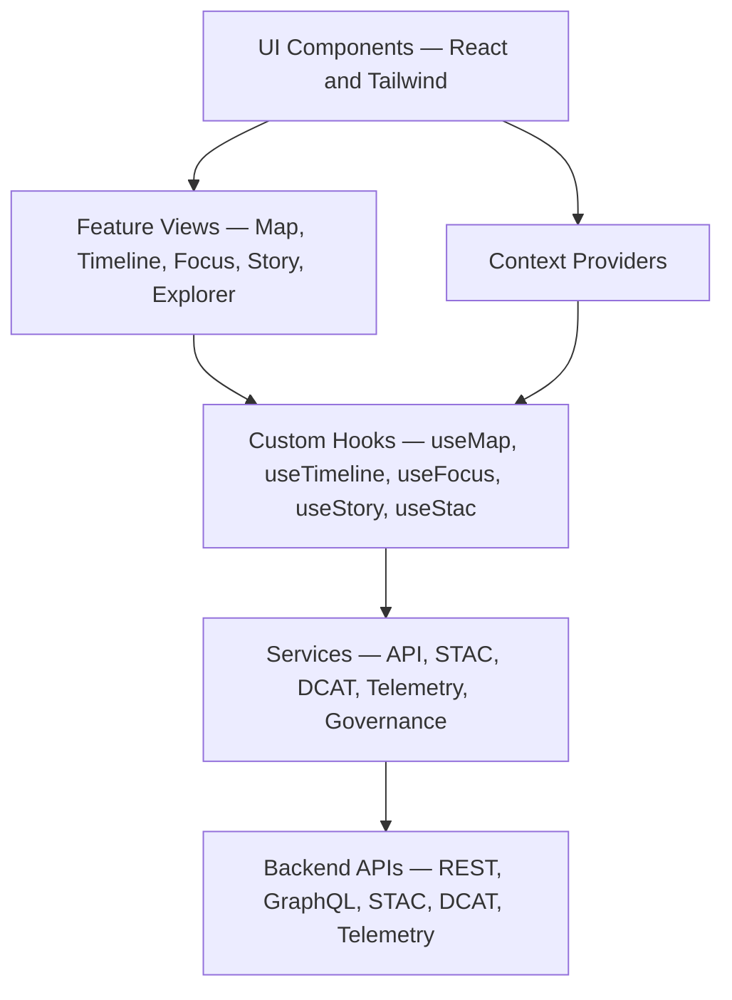

# 💻 Kansas Frontier Matrix — Web Source Architecture Specification (v11)

This document defines the source-level technical architecture for `web/src/**` in the Kansas Frontier Matrix (KFM) Web Platform. It governs UI composition, state management, Focus Mode v3 flows, 2D and 3D rendering, accessibility, FAIR+CARE enforcement, provenance visibility, typed DTO boundaries, STAC/DCAT integration, and telemetry instrumentation.

## 📘 1. Overview

The directory `web/src/` contains all frontend source code for the KFM Web Platform. It is responsible for:

- Rendering 2D and 3D map views.
- Presenting Story Node v3 narratives and Focus Mode v3 panels.
- Coordinating map, timeline, and focus state.
- Enforcing governance, CARE, and accessibility constraints at the UI layer.
- Emitting telemetry and error signals into the observability stack.

It must remain consistent with:

- `web/ARCHITECTURE.md` (web subsystem architecture).
- `ARCHITECTURE.md` (repository-wide architecture).
- `.github/ARCHITECTURE.md` (CI/CD and governance infrastructure).

## 🧱 2. Source Layout

The `web/src/` subtree is organized to support feature-based and layered development:

```text
web/src/
├── main.tsx              # SPA bootstrap
├── App.tsx               # Top-level routing shell
│
├── components/           # Presentational components
│   ├── map/              # MapLibre views and map controls
│   ├── timeline/         # Timeline tracks and handles
│   ├── focus/            # Focus Mode v3 panels and widgets
│   ├── story/            # Story Node v3 cards and detail components
│   ├── governance/       # CARE labels, provenance badges, masking indicators
│   ├── stac/             # STAC/DCAT explorer components
│   └── layout/           # Layout shells, panes, split views
│
├── pages/                # Route-level containers (landing, explore, focus, about)
├── hooks/                # Shared hooks (logic, no JSX)
├── context/              # React Context providers (time, focus, theme, a11y, governance)
├── services/             # API clients (REST, GraphQL, STAC, DCAT, telemetry, governance)
├── pipelines/            # Frontend orchestration flows (focus, story, stac, timeline)
├── types/                # Shared TypeScript types and DTOs
├── utils/                # Stateless utilities and guards
└── styles/               # Global styles, tokens, theming, map styling
```

This structure is governed. Any structural changes require explicit architecture review.

## 🧩 3. Layered Model

The `web/src/` architecture follows a layered pattern:

- **Components**: Render-only, no direct data fetching, A11y-compliant.
- **Hooks**: Encapsulate logic and side effects, call services, expose typed results.
- **Context Providers**: Manage shared state (time, focus, governance, theme, a11y, map).
- **Pipelines**: Orchestrate multi-step flows (Focus Mode, Story Nodes, STAC/DCAT, timeline).
- **Services**: Provide typed, schema-aware access to backend APIs.
- **Types**: Define DTOs and domain types; used across all layers.
- **Utils**: Provide stateless helpers and type guards.

These layers must not bypass governance or contracts defined at backend and schema level.

## 🧱 4. Component and State Architecture



**Rules:**

- Components do not call APIs directly.
- Hooks coordinate logic and are the only place where services are used.
- Contexts represent global state and must not be replaced by ad-hoc global variables.
- Services enforce DTO shapes and error handling before exposing data to UI.

## 📍 5. Contexts and Shared State

Core contexts:

- `TimeContext`: Active interval, granularity, and temporal filters.
- `FocusContext`: Current focus entity (person, place, event, dataset, story).
- `MapContext`: Viewport, active layers, base map options.
- `ThemeContext`: Theme and contrast settings.
- `A11yContext`: Accessibility preferences (reduced motion, high contrast, font scale).
- `GovernanceContext`: CARE labels, sovereignty flags, license and risk levels.

All cross-cutting concerns (time, focus, governance, a11y) must use these contexts, not local or duplicated state.

## 📑 6. Types and Data Contracts

`web/src/types/**` contains TypeScript types for:

- API responses and requests.
- Domain entities (place, event, dataset, Story Node, Focus summaries).
- Governance metadata (CARE label, sovereignty flags, licenses).
- STAC/DCAT structures used by the frontend.
- Telemetry payloads.

Each service uses these types and optional runtime guards in `utils/guards.ts` or equivalent to validate external data before it reaches the UI.

Schema changes in backend must be reflected in these types and any corresponding guards.

## 🧬 7. Focus Mode v3 Integration

Focus Mode v3 integration within `web/src/` is implemented via:

- `hooks/useFocus.ts`
- `context/FocusContext.tsx`
- `pipelines/focusPipeline.ts`
- `services/focusService.ts`
- `components/focus/**`

The architecture requires:

- Deterministic flows: UI triggers well-defined pipelines that call backend Focus Mode endpoints.
- Governance-aware presentations: all Focus outputs must show provenance and CARE labels where available.
- No local model execution: heavy AI reasoning is backend-only; frontend is strictly a consumer.

Any new Focus-related functionality must be added through these modules, not by introducing new, disconnected implementations.

## 📖 8. Story Node v3 Integration

Story Node v3 integration uses:

- `types/story.ts`
- `services/storyService.ts`
- `pipelines/storyPipeline.ts`
- `components/story/**`

Contracts:

- Story Node data must be valid against Story Node v3 schema before rendering.
- Story Node cards show title, summary, temporal range, and key spatial hints.
- Detail views show narrative, relations, and media, with CARE and provenance overlays.

Story Node interactions must update TimeContext and FocusContext appropriately so that the rest of the UI (map, timeline, Focus panels) remains coherent.

## 🛰 9. STAC/DCAT Integration

STAC and DCAT support is implemented via:

- `types/stac.ts`, `types/dcat.ts`
- `services/stacService.ts`, `services/dcatService.ts`
- `pipelines/stacPipeline.ts`
- `components/stac/**`

Responsibilities:

- List datasets by collection, region, or theme.
- Provide previews for map and 3D views.
- Display key metadata including license and CARE labels.
- Respect masking instructions and sovereignty rules.

The frontend must not allow direct dataset downloads or operations that violate backend governance.

## ⚖ 10. CARE, Sovereignty, and Governance

`web/src/` is responsible for representing governance signals in the UI:

- CARE labels rendered via governance components.
- Sovereignty flags recognized and displayed.
- Sensitive geometries indicated as generalized or masked.
- License, attribution, and provenance shown where appropriate.

The architecture forbids removal or downplaying of these signals. Governance behavior in UI is non-optional.

## ♿ 11. Accessibility Architecture

Accessibility implementation includes:

- Shared A11y utilities and components.
- Context-driven user preferences.
- Proper semantic markup via components.
- Keyboard navigation and focus management.

All new features under `web/src/**` must include accessibility considerations and, where relevant, tests or documented manual checks.

## 📈 12. Telemetry and Error Handling

Telemetry emission:

- Centralized via telemetry hooks and services.
- Uses schemas referenced by `telemetry_schema`.
- Produces non-PII, anonymized, or aggregated usage data.

Errors:

- Categorized by type (render, data, governance, focus).
- Reported via telemetry services.
- Displayed through user-safe notifications when appropriate.

Telemetry and error handling patterns must remain consistent across all feature slices in `web/src/**`.

## 🧪 13. Testing Requirements

Testing expectations for `web/src/**` include:

- Unit tests for components, hooks, and utilities.
- Integration tests for feature flows (map, timeline, Focus, Story, STAC).
- A11y tests for critical workflows and components.
- Governance behavior tests for CARE and masking overlays.
- Type checks for all code.

Tests are orchestrated via the main CI workflows described in `.github/ARCHITECTURE.md`.

## 🕰 14. Version History

| Version | Date       | Summary                                                                                          |
|--------:|------------|--------------------------------------------------------------------------------------------------|
| v11.0.1 | 2025-11-27 | Upgraded metadata to KFM-MDP v11.2.2; clarified layer boundaries and context/service patterns.   |
| v11.0.0 | 2025-11-24 | Initial v11 source architecture; aligned with Focus v3, Story Node v3, STAC/DCAT, and telemetry. |
| v10.4.1 | 2025-11-15 | Improved mapping between features, contexts, and services; clarified A11y responsibilities.      |
| v10.4.0 | 2025-11-15 | KFM v10.4 upgrade; richer focus/story flows and STAC integration.                                |
| v10.3.2 | 2025-11-14 | Refined source structure and separated layout, map, and story components.                        |
| v10.0.0 | 2025-11-09 | Initial source architecture specification for `web/src/`.                                        |

[Back to Web Architecture](../ARCHITECTURE.md) · [Web Platform Overview](../README.md) · [Governance Charter](../../docs/standards/governance/ROOT-GOVERNANCE.md)
