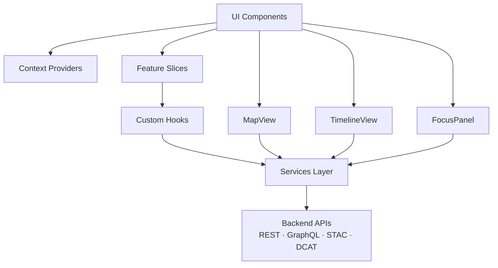
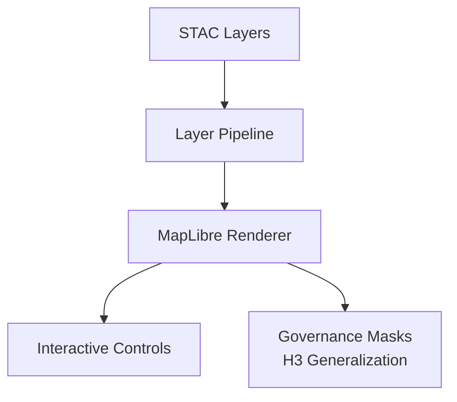
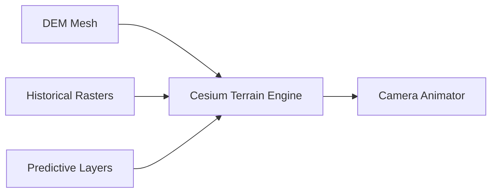
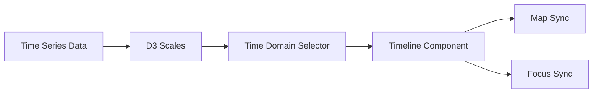

<div align="center">

# 💻 **Kansas Frontier Matrix — Web Source Architecture Specification**  
`web/src/ARCHITECTURE.md`

**Purpose:**  
Define the complete **source-level technical architecture** for the Kansas Frontier Matrix (KFM) web application, including UI rendering, Focus Mode v2.5 dataflow, 2D/3D mapping pipelines, accessibility architecture, FAIR+CARE governance enforcement, provenance visibility, typed DTO boundaries, STAC/DCAT integration, and telemetry & sustainability instrumentation.  
This document governs **all contributors** modifying `web/src/`.

[]()
[]()
[]()
[]()

</div>

---

# 📘 Overview

The `web/src/` directory contains **all frontend logic** for the Kansas Frontier Matrix.  
It implements:

- React 18 + TypeScript strict mode  
- Tailwind design system with tokens  
- **MapLibre GL** (2D) + **CesiumJS** (3D)  
- Timeline UI synchronized with map & Focus Mode  
- **Focus Mode v2.5**: narrative reasoning, explainability chips, provenance paths  
- STAC/DCAT dataset explorer UIs  
- Story Node rendering & cross-layer alignment  
- CARE-governed UI masking (tribal, archaeological, sensitive assets)  
- Accessibility (WCAG 2.1 AA) as a **hard requirement**  
- OpenTelemetry instrumentation for:
  - Performance  
  - A11y  
  - Ethics  
  - Sustainability  
  - UI usage  

The architecture ensures **deterministic, ethical, reproducible** interaction with KFM’s semantic geospatial intelligence.

---

# 🗂️ Directory Layout (Authoritative v10.3.2)

```text
web/src/
├── ARCHITECTURE.md
├── README.md
│
├── components/
│   ├── MapView/
│   ├── CesiumView/
│   ├── TimelineView/
│   ├── FocusPanel/
│   ├── StoryNode/
│   ├── DetailDrawer/
│   ├── LayerControls/
│   ├── Accessibility/
│   ├── Governance/
│   └── Shared/
│
├── context/
│   ├── FocusProvider.tsx
│   ├── A11yProvider.tsx
│   ├── ThemeProvider.tsx
│   └── AppProvider.tsx
│
├── entities/
│   ├── people/
│   ├── places/
│   ├── events/
│   └── datasets/
│
├── features/
│   ├── accessibility/
│   ├── focus-mode/
│   ├── map-layers/
│   ├── timeline-features/
│   └── governance/
│
├── hooks/
│   ├── useFocus.ts
│   ├── useStac.ts
│   ├── useTelemetry.ts
│   ├── useGovernance.ts
│   └── useA11y.ts
│
├── pages/
│   ├── index.tsx
│   ├── explorer.tsx
│   ├── focus.tsx
│   └── governance.tsx
│
├── pipelines/
│   ├── focusPipeline.ts
│   ├── stacPipeline.ts
│   ├── entityPipeline.ts
│   ├── timelinePipeline.ts
│   ├── layerPipeline.ts
│   └── metadata.json
│
├── services/
│   ├── apiClient.ts
│   ├── stacService.ts
│   ├── dcatService.ts
│   ├── graphService.ts
│   └── telemetryService.ts
│
├── utils/
│   ├── schemaGuards.ts
│   ├── provenance.ts
│   ├── a11y.ts
│   └── formatters.ts
│
├── styles/
│   ├── globals.css
│   ├── tokens.css
│   └── typography.css
│
└── types/
    ├── api.ts
    └── domain.ts
```

---

# 🧩 Source Flow Architecture



---

# 🧠 Focus Mode v2.5 — Client Architecture

Focus Mode is a **UI-only orchestrator**.  
The frontend does **NOT** run AI models.

### Responsibilities
- Request narratives from `/api/focus/{id}`  
- Render explainability chips  
- Display provenance (StoryNode → Dataset → Source)  
- Apply CARE filters & sovereignty banners  
- Map + timeline highlighting  
- Ethics-aware redaction  
- Non-PII telemetry emission  

### API Contract

```text
GET /api/focus/{id}

{
  narrative: string,
  subgraph: object,
  explainability: array,
  citations: array,
  ethics_flags: array,
  provenance: object,
  telemetry: object
}
```

All responses:

- Type-checked (`types/api.ts`)
- Runtime-verified (`schemaGuards.ts`)
- Governance-filtered (`useGovernance.ts`)

---

# 🌍 Mapping & 3D Rendering Architecture

## MapLibre (2D)

### Functions
- Vector + raster layer rendering  
- STAC-driven symbology  
- Geometries from Neo4j queries  
- Treaty, cultural, hydrologic, ecological overlays  
- Colorblind-safe palettes  

### Architecture



---

## CesiumJS (3D)

### Capabilities
- Photorealistic terrain  
- Historical terrain layers  
- Predictive climate & hydrology overlays  
- 3D Story Nodes w/ height extrusions  
- Time-bound camera flight paths  

### Architecture



---

# 📊 Timeline Architecture

Interactive time navigation shared between:

- MapView  
- Focus Panel  
- Story Nodes  
- Predictive futures engine  



---

# ⚙️ Services & API Contracts

## apiClient.ts
- REST + GraphQL  
- JSON-LD provenance injection  
- Governance headers (CARE, consent)  
- Retry & rate-limit strategy  
- Unified error normalization  

## stacService.ts
- STAC 1.0 search  
- COG asset fetch  
- Typed layer metadata  

## dcatService.ts
- DCAT dataset & distribution queries  

## graphService.ts
- GraphQL queries for Person, Place, Event, Dataset, StoryNode  
- Geometry & temporal metadata extraction  

## telemetryService.ts
- Sends aggregated, non-identifying client telemetry  
- Ethic & A11y events included  

All service responses must pass:

- Type constraints (`types/api.ts`)
- Schema guards (`schemaGuards.ts`)
- Governance filtering (`useGovernance.ts`)

---

# ♿ Accessibility Architecture (WCAG 2.1 AA)

Accessibility is **mandatory**, not optional.

Enforced via:
- `A11yProvider.tsx`  
- ARIA landmarks & roles  
- Skip links  
- Focus-visible outlines  
- Keyboard-only navigation  
- Reduced-motion & high-contrast modes  
- Colorblind-safe tokens  

Design tokens stored at:

```text
docs/design/tokens/accessibility-tokens.md
```

A11y CI gate requires:
- axe-core passes  
- Lighthouse ≥ 95

---

# 🔐 Governance & CARE Enforcement

Frontend governance responsibilities:

- CARE labels surface in UI  
- Sensitive geometries masked using:
  - H3 r7 generalization  
  - Spatial fuzzing  
- License & citation chips on all data & StoryNodes  
- Consent alerts for restricted datasets  
- Governance telemetry emitted for:
  - Masked views  
  - Blocked views  
  - Ethics flags  

Governance ledger:

```text
../../docs/reports/audit/web-governance-ledger.json
```

---

# 📡 Telemetry & Sustainability

Collected via:

- `useTelemetry.ts`  
- `telemetryService.ts`  
- A11y & ethics events  
- Focus Mode usage  
- WebVitals  
- Estimated energy & CO₂e (scoped from backend metrics)  

Merged into global telemetry:

```text
../../releases/v10.3.2/focus-telemetry.json
```

---

# ⚙️ Validation & CI Contracts

| Contract | Enforcement |
|---------|-------------|
| Types | `npm run typecheck` (TS strict) |
| Lint | `npm run lint` |
| A11y | axe-core + Lighthouse |
| Security | CodeQL + Trivy |
| Build | `build-and-deploy.yml` |
| Docs | `docs-lint.yml` |
| Telemetry | `telemetry-export.yml` |

All checks must pass before merging.

---

# 🚀 Local Development

```bash
npm --prefix web install
npm --prefix web run dev
npm --prefix web run typecheck
npm --prefix web run lint
npm --prefix web run build
```

Dev URL:

```text
http://localhost:3000
```

---

# 🕰️ Version History

| Version | Date       | Summary |
|---------|------------|---------|
| v10.3.2 | 2025-11-14 | Fully rebuilt using Markdown Output Protocol; added Focus Mode v2.5; updated governance & telemetry flows; directory layout aligned with v10.3.2. |
| v10.3.1 | 2025-11-13 | Initial architecture spec for web source layer. |
| v10.2.2 | 2025-11-12 | Refinements to API client and governance hooks. |

---

<div align="center">

**Kansas Frontier Matrix — Web Source Architecture**  
💻 Ethical UX · 🧠 Explainable AI · 🌐 FAIR+CARE · 🔗 Provenance by Design  
© 2025 Kansas Frontier Matrix — MIT License  

[Back to Web Source README](README.md) · [Web Architecture Overview](../ARCHITECTURE.md)

</div>
