# 💻 **Kansas Frontier Matrix — Web Source Architecture Specification (v11)**  
`web/src/ARCHITECTURE.md`

Defines the **source-level technical architecture** for `web/src/**` in the Kansas Frontier Matrix (KFM) Web Platform.  
It governs UI composition, state management, Focus Mode v3 flows, 2D and 3D rendering, accessibility,  
FAIR+CARE enforcement, provenance visibility, typed DTO boundaries, STAC/DCAT integration,  
and telemetry instrumentation.

· 
· 

---

## 📘 1. Overview

The `web/src/` directory contains all **frontend source code** for the KFM Web Platform. It is responsible for:

- Rendering 2D and 3D map views.  
- Presenting Story Node v3 narratives and Focus Mode v3 panels.  
- Coordinating map, timeline, and focus state.  
- Enforcing governance, CARE, sovereignty, and accessibility constraints at the UI layer.  
- Emitting telemetry and error signals into the observability stack.  

`web/src/` must remain consistent with:

- `web/ARCHITECTURE.md` — web subsystem architecture.  
- `web/README.md` — web platform behavioral contract.  
- `../ARCHITECTURE.md` — repository-wide architecture.  
- `../.github/ARCHITECTURE.md` — CI/CD and governance infrastructure.  

---

## 🗂 2. Source Layout (v11.2.2)

The `web/src/` subtree is organized to support feature-based and layered development:

~~~text
web/src/
├── 📄 main.tsx                 # SPA bootstrap
├── 📄 App.tsx                  # Top-level routing shell
│
├── 🧱 components/              # Presentational + container components
│   ├── 🗺️ map/                 # MapLibre views and map controls
│   ├── 🕒 timeline/            # Timeline tracks and handles
│   ├── 🎯 focus/               # Focus Mode v3 panels and widgets
│   ├── 📖 story/               # Story Node v3 cards and detail components
│   ├── ⚖️ governance/          # CARE labels, provenance badges, masking indicators
│   ├── 📦 stac/                # STAC/DCAT explorer components
│   └── 🧩 layout/              # Layout shells, panes, split views
│
├── 📄 pages/                   # Route-level containers (landing, explore, focus, about)
├── 🧵 hooks/                   # Shared hooks (logic, no JSX; call services, manage effects)
├── 🧠 context/                 # React Context providers (time, focus, theme, a11y, governance, map)
├── 🌐 services/                # API clients (REST, GraphQL, STAC, DCAT, telemetry, governance)
├── 🔁 pipelines/               # Frontend orchestration flows (focus, story, stac, timeline)
├── 🧾 types/                   # Shared TypeScript types and DTOs
├── 🛠 utils/                   # Stateless utilities, guards, formatting helpers
└── 🎨 styles/                  # Global styles, tokens, theming, map styling
~~~

This structure is **governed**. Any structural change requires explicit architecture review and governance approval.

---

## 🧩 3. Layered Model

The `web/src/` architecture follows a layered pattern:

- **Components**  
  - Render UI, handle local interaction, enforce A11y semantics.  
  - Do **not** call APIs directly.  

- **Hooks**  
  - Encapsulate logic and side effects.  
  - Call services and expose typed results to components.  

- **Context Providers**  
  - Manage shared state (time, focus, governance, theme, a11y, map).  
  - Expose controlled APIs for reading/updating shared state.  

- **Pipelines**  
  - Orchestrate multi-step flows (Focus Mode, Story Nodes, STAC/DCAT, timeline).  
  - Use hooks + services; never bypass contexts or governance.  

- **Services**  
  - Provide typed, schema-aware access to backend APIs (REST, GraphQL, STAC, DCAT, telemetry).  
  - Perform error normalization and logging.  

- **Types**  
  - Define DTOs and domain types for all inbound/outbound data.  

- **Utils**  
  - Stateless helpers, guards, formatters; no side effects, no API calls.  

All layers must respect contracts and governance rules defined at backend and schema level.

---

## 🧱 4. Component and State Architecture

```mermaid
flowchart TD
    UI["UI Components · React + Tailwind"] --> CTX["Context Providers"]
    UI --> FEAT["Feature Views · Map · Timeline · Focus · Story · Explorer"]

    FEAT --> HK["Custom Hooks · useMap · useTimeline · useFocus · useStory · useStac"]
    HK --> SVC["Services · API · STAC · DCAT · Telemetry · Governance"]
    CTX --> HK
    SVC --> API["Backend APIs · REST · GraphQL · STAC · DCAT · Telemetry"]
```

**Rules:**

- Components **never** call APIs directly.  
- Hooks are the **only** place where services are invoked.  
- Contexts represent global/shared state and must not be replaced by ad-hoc “global” variables.  
- Services enforce DTO shapes and error handling before data reaches UI.  
- Governance, CARE, and sovereignty flags must be respected at **every** layer.

---

## 📍 5. Contexts and Shared State

Core contexts (in `context/`):

- `TimeContext` — Active interval, granularity, temporal filters.  
- `FocusContext` — Current focus entity (person, place, event, dataset, story), Focus Mode state.  
- `MapContext` — Viewport, active layers, base map options, selection state.  
- `ThemeContext` — Theme, color mode, contrast preferences.  
- `A11yContext` — Accessibility settings (reduced motion, high contrast, font scale).  
- `GovernanceContext` — CARE labels, sovereignty flags, license and risk levels.  

All cross-cutting concerns (time, focus, governance, a11y) must use these contexts — never duplicated or shadowed local state.

---

## 📑 6. Types and Data Contracts

`web/src/types/**` defines TypeScript types for:

- **API DTOs** — requests/responses for REST & GraphQL.  
- **Domain entities** — places, events, datasets, Story Nodes, Focus summaries.  
- **Governance metadata** — CARE labels, sovereignty flags, licenses, risk-class.  
- **STAC/DCAT** structures — subset of the full schema relevant to UI.  
- **Telemetry payloads** — event and span attributes used by the web layer.  

Each service:

- Uses these types at compile-time.  
- Applies runtime guards (e.g., `isStoryNode`, `isStacItem`) in `utils/guards.ts` or equivalents to validate external data before it reaches UI.  

Schema changes in backend must be reflected in these types and guards **before** new data is relied upon in components.

---

## 🧬 7. Focus Mode v3 Integration

Focus Mode v3 integration within `web/src/` is implemented via:

- `hooks/useFocus.ts`  
- `context/FocusContext.tsx`  
- `pipelines/focusPipeline.ts`  
- `services/focusService.ts`  
- `components/focus/**`  

**Architectural requirements:**

- Frontend Focus flows are **deterministic** and repeatable given the same backend responses.  
- All AI-heavy reasoning happens on the backend; the frontend is a **consumer** and renderer.  
- Focus outputs must show:
  - provenance chips  
  - CARE labels  
  - dataset/entity references  

- `ai_transform_prohibited` flags are enforced:
  - No speculative additions  
  - No unverified historical claims  
  - No governance override or content alteration on the client.  

Any new Focus-related behavior must plug into these modules rather than creating new standalone entry points.

---

## 📖 8. Story Node v3 Integration

Story Node v3 integration uses:

- `types/story.ts`  
- `services/storyService.ts`  
- `pipelines/storyPipeline.ts`  
- `components/story/**`  

Contracts:

- Story Node data must validate against **Story Node v3** schema before rendering.  
- Story Node cards display:
  - title  
  - summary  
  - temporal range  
  - key spatial hints  
  - CARE labels / sovereignty markers  

- Detail views show:
  - narrative  
  - geometry  
  - relations  
  - media (only when allowed and safe)  

Story Node interactions must update `TimeContext` and `FocusContext` so that map, timeline, and Focus panels remain coherent.

---

## 🛰 9. STAC/DCAT Integration

STAC & DCAT support is implemented via:

- `types/stac.ts`, `types/dcat.ts`  
- `services/stacService.ts`, `services/dcatService.ts`  
- `pipelines/stacPipeline.ts`  
- `components/stac/**`  

Responsibilities:

- List datasets by collection, region, and theme.  
- Provide map and 3D previews for assets.  
- Display key metadata including license, FAIR+CARE attributes, and provenance.  
- Respect masking instructions and sovereignty rules from the backend:
  - no bypass of redactions  
  - no direct coordinates for sensitive archaeology layers  

The frontend must not implement actions (e.g., bulk download) that violate backend governance decisions.

---

## ⚖ 10. CARE, Sovereignty & Governance

`web/src/` is responsible for **rendering** governance signals, not deciding them.

Requirements:

- CARE labels shown via governance components.  
- Sovereignty flags visible wherever relevant data appears.  
- Sensitive geometries indicated as generalized/masked with clear labeling.  
- License, attribution, and provenance always accessible from datasets and Story Nodes.  

The architecture forbids:

- Removing or hiding governance overlays.  
- Downplaying warnings about sensitivity, restrictions, or incomplete consent.  
- Introducing feature flags that disable governance components for governed data.

---

## ♿ 11. Accessibility Architecture

Accessibility implementation includes:

- Shared `A11yContext` and helper hooks (e.g., `useA11yPreferences`).  
- Component patterns that support:
  - keyboard navigation  
  - screen reader usage  
  - high-contrast and reduced-motion modes  

Requirements:

- All interactive components must be reachable via keyboard and have focus outlines.  
- Maps and 3D views must provide accessible alternatives:
  - textual summaries  
  - outline-only views  
  - keyboard controls where possible  

New features must ship with accessibility considerations and, where relevant, tests or manual-check notes.

---

## 📈 12. Telemetry & Error Handling

Telemetry is centralized via dedicated services and hooks:

- Telemetry services conform to `telemetry_schema` and energy/carbon schemas.  
- Events include:
  - route changes  
  - Focus Mode calls and failures  
  - STAC/DCAT explorer usage  
  - A11y mode usage (high contrast, reduced motion, etc.)  

Error handling:

- Uses consistent error boundaries and reporting flows.  
- Distinguishes:
  - network errors  
  - schema/validation errors  
  - governance denials  
  - internal rendering errors  

Errors are surfaced:
- to users via safe, non-leaky notifications  
- to observability via telemetry events (never including PII).

---

## 🧪 13. Testing Requirements

For `web/src/**`, the architecture expects:

- **Unit tests** — components, hooks, services, utils.  
- **Integration tests** — feature flows (map, timeline, Focus, Story, STAC).  
- **A11y tests** — automated checks + targeted manual tests for key screens.  
- **Governance tests** — verifying CARE overlays and masking appear when required.  
- **Type checks** — TypeScript strict mode; no ignored errors.  

Tests are orchestrated via CI workflows described in `.github/ARCHITECTURE.md`.  
New modules must not degrade the existing test baseline.

---

## 🕰 14. Version History

| Version | Date       | Summary                                                                                                  |
|--------:|------------|----------------------------------------------------------------------------------------------------------|
| v11.2.2 | 2025-11-30 | Upgraded to KFM-MDP v11.2.2; added energy/carbon v2, SLSA refs, AI transform alignment & telemetry hooks. |
| v11.0.1 | 2025-11-27 | Clarified layer boundaries and context/service patterns; aligned with v11 web architecture.              |
| v11.0.0 | 2025-11-24 | Initial v11 source architecture; aligned with Focus v3, Story Node v3, STAC/DCAT, and telemetry.         |
| v10.4.1 | 2025-11-15 | Improved mapping between features, contexts, and services; clarified A11y responsibilities.              |
| v10.4.0 | 2025-11-15 | KFM v10.4 upgrade; richer focus/story flows and STAC integration.                                        |
| v10.3.2 | 2025-11-14 | Refined source structure; separated layout, map, and story components.                                   |
| v10.0.0 | 2025-11-09 | Initial source architecture specification for `web/src/`.                                                |

---

© 2025 Kansas Frontier Matrix — CC-BY 4.0  
[⬅️ Back to Web Architecture](../ARCHITECTURE.md) · [🌐 Web Platform Overview](../README.md) · [🛡 Governance Charter](../../docs/standards/governance/ROOT-GOVERNANCE.md)

