<div align="center">

# 💻 **Kansas Frontier Matrix — Web Source Architecture Specification (v11)**  
`web/src/ARCHITECTURE.md`

**Purpose**  
Define the complete, source-level **technical architecture** for `web/src/**` in the Kansas Frontier Matrix (KFM) Web Platform —  
including UI composition, state management, Focus Mode v3 flows, 2D/3D rendering pipelines, accessibility architecture,  
FAIR+CARE enforcement, provenance visibility, typed DTO boundaries, STAC/DCAT integration, and telemetry & sustainability instrumentation.  
This document governs all contributors modifying `web/src/`.

</div>

---

## 📘 1. Overview

The `web/src/` directory contains all **frontend source code** driving the KFM Web Platform UI:

- React 18 + TypeScript (strict mode)  
- Tailwind + design tokens for accessible styling  
- MapLibre GL for 2D cartography and STAC-driven layers  
- CesiumJS for 3D terrain, paleogeography, and future overlays  
- Focus Mode v3 entity reasoning flows (narrative, explainability, CARE gating)  
- Story Node v3 rendering synchronized with map and timeline  
- STAC/DCAT dataset explorers and layer controls  
- Governance UI (CARE labels, sovereignty, licenses, provenance trails)  
- Accessibility (WCAG 2.1 AA+) as a hard architectural requirement  
- Telemetry & sustainability instrumentation (WebVitals, ethics, A11y events)  

The architecture ensures that changes in `web/src/**` are:

- Deterministic and type-safe  
- Ethically governed and CARE-aware  
- Accessible and observable  
- Compatible with KFM’s global architecture (`src/ARCHITECTURE.md`) and Tools Platform (`tools/ARCHITECTURE.md`)

---

## 🎯 2. Purpose

This specification:

- Defines the **source-layer architecture** for `web/src/**`  
- Establishes boundaries and responsibilities for components, hooks, contexts, services, pipelines, and utilities  
- Ensures the code implements:

  - Focus Mode v3 UI requirements  
  - Story Node v3 rendering rules  
  - STAC/DCAT integration contracts  
  - A11y & FAIR+CARE governance overlays  
  - Telemetry and observability contracts  

**Primary consumers**: web engineers, architects, FAIR+CARE reviewers, SRE/observability teams, and maintainers of `web/src/**`.

---

## 📍 3. Scope

### 3.1 In Scope

- All source files under `web/src/**`, including:

  - `components/**`, `context/**`, `hooks/**`, `pages/**`, `pipelines/**`, `services/**`, `styles/**`, `types/**`, `utils/**`  

- Frontend-only pipelines (client orchestration flows)  
- Governance overlays and A11y integration at the UI layer  
- Telemetry emission and error taxonomy from the web client  

### 3.2 Out of Scope

- Backend ETL, AI, and pipeline architecture (`src/pipelines/**`)  
- Infra & deployment details (CDN, gateways, container orchestration)  
- Neo4j schema design and backend-only modeling  

---

## 📚 4. Definitions

- **Source Architecture** — Organizational and behavioral contracts of `web/src/**` modules.  
- **Feature Slice** — Vertical domain module (e.g., `focus-mode`, `data-explorer`) with tightly related components/hooks/services.  
- **Context Provider** — React provider wrapping the app tree that manages shared state (focus, A11y, theme, time, governance).  
- **Service** — Module in `services/` encapsulating network calls (REST/GraphQL/STAC/DCAT/telemetry/governance).  
- **Frontend Pipeline** — Client orchestration that combines hooks, services, and contexts into user flows (e.g., `focusPipeline.ts`).  
- **Story Node v3** — Structured narrative + spatial + temporal unit rendered by Story components and enforced by the Story Node schema.  
- **Focus Mode v3** — Frontend orchestrator that calls backend reasoning endpoints, never running heavy AI models in-browser.  

---

## 🧱 5. High-Level Module Layout

```text
web/src/
├── components/    # Presentational React components
├── context/       # Global React Context providers
├── features/      # Feature slices (Map, Timeline, Focus, Story, Data Explorer, etc.)
├── hooks/         # Shared hooks (logic, no JSX)
├── pages/         # Route containers (Map, Focus, Story, Explore, About, etc.)
├── pipelines/     # Frontend orchestration pipelines (Focus, STAC, Story, Timeline)
├── services/      # API, STAC/DCAT, telemetry, governance clients
├── styles/        # Tokens, themes, global styles
├── types/         # Shared TypeScript types and DTOs
└── utils/         # Stateless helper modules
```

---

## 🏗 6. Source Architecture in Context

```mermaid
flowchart TD
    UI[UI Components<br/>React · Tailwind] --> CTX[Context Providers]
    UI --> FEAT[Feature Slices]
    UI --> MAP[Map Feature]
    UI --> TL[Timeline Feature]
    UI --> FM[Focus Mode Feature]
    UI --> STORY[Story Feature]
    UI --> GOVUI[Governance & A11y UI]

    FEAT --> HK[Custom Hooks]
    HK --> SVC[Services Layer]

    MAP --> HK
    TL  --> HK
    FM  --> HK
    STORY --> HK

    SVC --> API[Backend APIs<br/>REST · GraphQL · STAC · DCAT · Telemetry]
```



**Key architectural principles:**

- Components are **dumb**: they render what they are told (via props/context) and emit events.  
- Hooks are **smart**: they implement logic, call services, and interact with contexts.  
- Services are **boundaries**: they enforce contracts, schemas, and governance rules when talking to the backend.  
- Pipelines coordinate flows across hooks, services, and contexts.

---

## ⚙️ 7. Implementation Pattern

### 7.1 Components (`components/**`)

- Pure rendering; no direct fetch logic  
- Receive typed props, including CARE/provenance flags  
- Emit events upward (e.g., `onSelectDataset`, `onFocusEntity`)  
- Must be A11y compliant (labels, keyboard, contrast)  

### 7.2 Hooks (`hooks/**`)

- Encapsulate side-effects and data fetching  
- Implement derived state (e.g., filtered layers, time windows)  
- Wrap calls to services with consistent error handling  
- Provide strongly typed results and callback APIs  

### 7.3 Context (`context/**`)

- Provide:

  - TimeContext — active temporal window + granularity  
  - FocusContext — active entity/story focus  
  - ThemeContext — light/dark/high-contrast  
  - A11yContext — reduced motion, font-size preferences, etc.  
  - GovernanceContext — CARE labels, sovereignty flags, license & risk levels  
  - MapContext — viewport, active layers, base map  

- Keep contexts small and well-defined to avoid re-render storms  

### 7.4 Pipelines (`pipelines/**`)

- Orchestrate multi-step flows:

  - Focus Mode fl ows (`focusPipeline.ts`)  
  - Story Node flows (`storyPipeline.ts`)  
  - Timeline coordination (`timelinePipeline.ts`)  
  - STAC/DCAT browsing flows (`stacPipeline.ts`)  

- Must not bypass governance or schema guards  

### 7.5 Services (`services/**`)

- API clients defined here (REST, GraphQL, STAC/DCAT, telemetry, governance)  
- Must honor data contracts and type definitions from `types/**`  
- Use runtime guards to validate responses before passing into UI  

---

## 📑 8. Data Contracts & Schemas

`web/src/**` relies on **structured contracts**, not ad hoc JSON:

- DTO definitions for:

  - API responses: `types/api.ts`  
  - Domain entities: `types/domain.ts`  
  - Story Nodes: `types/story.ts`  
  - Focus Mode: `types/focus.ts`  
  - Governance metadata: `types/governance.ts`  
  - STAC/DCAT: `types/stac.ts`, `types/dcat.ts`  
  - Telemetry: `types/telemetry.ts`  

- `utils/guards.ts` provides:

  - Type guards for each DTO type  
  - Schema-based validation (where applicable)  

Failures in validation:

- Must result in safe, non-crashing behavior  
- Must emit telemetry errors  
- May display user-friendly error states  

---

## 🧬 9. Ontology Alignment

The frontend aligns with KFM’s ontology design:

| Ontology   | Mapping                                                               |
|-----------:|-----------------------------------------------------------------------|
| CIDOC-CRM  | Interactions mapped to activities over Story Nodes and datasets       |
| OWL-Time   | Timeline state mapped to `time:TemporalEntity` semantics              |
| PROV-O     | Provenance overlays reflect `prov:Entity` and `prov:wasDerivedFrom`   |
| schema.org | Views described as `WebApplication`, `CreativeWork` where applicable  |
| STAC/DCAT  | Datasets + Items modeled via STAC 1.x and DCAT 3.0                    |

Frontend must not reinterpret ontologies; it follows backend and schema definitions.

---

## 🛰 10. STAC/DCAT Integration

### 10.1 STAC

- `stacService.ts` and related hooks:
  - Retrieve Collections/Items  
  - Provide typed results to UI  
- `stacPipeline.ts`:
  - Coordinates search, filter, and preview flows  
  - Connects STAC results to MapView and StoryNode flows  

### 10.2 DCAT

- `dcatService.ts`:
  - Integrates DCAT 3.0 Datasets/Distributions  
- DCAT entries are used for:

  - Browsing by theme/keyword/publisher  
  - Linking to STAC assets or other endpoints  

---

## 📖 11. Story Node v3 Integration

Story Node v3 integration is implemented across:

- `components/story/**`  
- `pipelines/storyPipeline.ts`  
- `types/story.ts`  

Architectural contracts:

- Story Node data must be schema-valid before rendering  
- Story Node UI must present:

  - Title, summary, narrative, media  
  - Time and space context (chips, mini maps)  
  - Provenance and CARE overlays  

- Story Nodes must interact with:

  - `MapContext` for spatial highlighting  
  - `TimeContext` for temporal highlighting  
  - `FocusContext` for entity-centric narratives  

---

## 🧠 12. Focus Mode Integration

Focus Mode front-end integration relies on:

- `hooks/useFocus.ts`  
- `context/FocusContext.tsx`  
- `pipelines/focusPipeline.ts`  
- `services/focusService.ts`  

The architecture ensures:

- Focus flows are **data-driven**, not model-driven on the client  
- UI shows provenance, CARE labels, and risk indicators  
- AI-generated content is clearly identified and can be disabled or filtered  

---

## ⚖️ 13. Ethics, CARE & Sovereignty in `web/src/**`

Architecture-level safeguards:

- Use `GovernanceContext` to determine which elements:

  - Should be masked or generalized  
  - Require CARE badges or sovereignty notices  

- Sensitive geometries (e.g., heritage sites) must be:

  - Generalized using H3 or equivalent  
  - Marked clearly as generalized/masked  

- Components must not:

  - Show disallowed coordinates  
  - Remove governance indicators  
  - Render unverified historical claims  

Any governance failure is treated as a serious regression.

---

## ♿ 14. Accessibility Architecture

Accessibility is enforced via:

- Shared A11y primitives (`components/Shared/*`, `utils/a11y.ts`)  
- `A11yContext` for user prefs and environment signals  
- Screen-reader only text helpers  
- Focus management utilities  

All new features must include A11y considerations and tests. Accessibility regressions are CI-blocking.

---

## 📈 15. Telemetry & Sustainability

Telemetry is integrated via:

- `hooks/useTelemetry.ts`  
- `services/telemetryService.ts`  

Metrics must be:

- Non-PII and aggregated  
- Schema-conformant (per `types/telemetry.ts` and relevant schemas)  

Focus Mode, Story Nodes, STAC explorers, and governance overlays contribute events for:

- Performance  
- Usage  
- A11y  
- Energy/CO₂ approximation (where supported)  

---

## 🧪 16. Testing Expectations

All changes in `web/src/**` must be covered by:

- Unit tests (components, hooks, utils)  
- Integration tests (end-to-end flows in the frontend domain)  
- A11y tests (Lighthouse/Axe)  
- Governance tests (CARE, masking, provenance)  
- Telemetry tests (event shape, frequency, and routing)  

CI workflows fail on:

- Broken type checks  
- Lint errors  
- Test failures  
- A11y regression  

---

## 🕰 17. Version History

| Version | Date       | Author / Team     | Summary                                                                                     |
|--------:|------------|-------------------|---------------------------------------------------------------------------------------------|
| v11.0.0 | 2025-11-24 | Web Platform Team | Upgraded to KFM-MDP v11; clarified layers, governance & A11y roles, telemetry v11 integration. |
| v10.4.1 | 2025-11-15 | Web Platform Team | Aligned architecture spec with MapView/TimelineView/FocusMode structures and updated pipelines. |
| v10.4.0 | 2025-11-15 | Web Platform Team | Upgraded to KFM-MDP v10.4; full YAML metadata; explicit ontology & CARE integration.        |
| v10.3.2 | 2025-11-14 | Web Platform Team | Deep source architecture clarification for v10.3.2.                                         |
| v10.0.0 | 2025-11-09 | Web Platform Team | Initial source architecture outline for `web/src`.                                          |

---

<div align="center">

© 2025 Kansas Frontier Matrix — MIT License  
Validated under Master Coder Protocol (MCP-DL v6.3) and KFM-MDP v11.0  
FAIR+CARE Certified · Public Document · Version-Pinned  

[Back to Web Source Overview](./README.md) · [Web Platform Overview](../README.md) · [System Architecture](../../src/ARCHITECTURE.md)

</div>