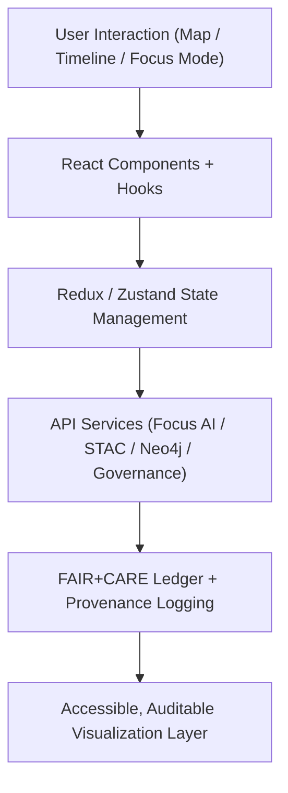

<div align="center">

# 🧱 **Kansas Frontier Matrix — Web Source Code Overview (v2.1.1 · Tier-Ω+∞ Certified)**  
`web/src/README.md`

**Mission:** Define, document, and govern the **frontend architecture** of the Kansas Frontier Matrix (KFM) web application —  
a FAIR+CARE-compliant, provenance-driven interface integrating geospatial, historical, and AI-powered visualization.

[](../../.github/workflows/site.yml)
[](../../docs/architecture/repo-focus.md)
[](../../docs/standards/faircare-validation.md)
[](../../docs/standards/accessibility.md)
[](../../LICENSE)

</div>

---

## 📚 Overview

The `web/src/` directory hosts the **entire source code** of the KFM frontend application —  
built with **React**, **TypeScript**, and **Vite**, and designed to meet FAIR+CARE, WCAG, and governance compliance.

This layer integrates:
- 🧠 **AI Reasoning Engine** for Focus Mode contextual insights  
- 🌎 **MapLibre + D3 Visualization** for spatial-temporal exploration  
- 🔗 **STAC + Neo4j** for metadata and semantic linkage  
- ⚖️ **Governance Integration** for ethical provenance and audit trails  

---

## 🗂️ Directory Layout

```bash
web/src/
├── README.md                     # This file — frontend source documentation
│
├── components/                   # Reusable UI building blocks (accessible + tested)
│   ├── layout/                   # Global page structure and responsive grids
│   ├── ui/                       # Buttons, modals, tooltips, dropdowns
│   ├── navigation/               # NavBar, breadcrumbs, pagination
│   └── Accessibility/            # WCAG / ARIA utilities (skip-link, focus-trap)
│
├── features/                     # Major functional domains
│   ├── map/                      # Geospatial rendering + layer controls
│   ├── timeline/                 # D3-based timeline for event visualization
│   ├── focus-mode/               # AI-driven contextual analysis interface
│   ├── metadata/                 # Metadata browsing, editing, and validation
│   └── accessibility/            # FAIR+CARE accessibility and settings modules
│
├── hooks/                        # Reusable React hooks (AI, map, accessibility, telemetry)
│
├── styles/                       # CSS variables, tokens, and theming
│   ├── tokens/                   # JSON design tokens (colors, spacing, typography)
│   └── globals.css
│
├── utils/                        # Helper utilities (formatters, provenance, validation)
│
├── assets/                       # Static assets (icons, banners, logos)
│
└── index.tsx                     # Application entry point
```

---

## ⚙️ Architectural Overview


<!-- END OF MERMAID -->

---

## 🧩 Core Frameworks

| Domain | Library / Standard | Purpose |
|:--|:--|:--|
| **Frontend Framework** | React 18 + TypeScript 5 | Declarative UI components |
| **Map Engine** | MapLibre GL JS | Open-source geospatial visualization |
| **Charts & Timelines** | D3.js + React D3 | Temporal event display |
| **State Management** | Redux Toolkit / Zustand | Predictable app state |
| **Accessibility** | WAI-ARIA + WCAG 2.1 | Ethical design validation |
| **Styling System** | Tailwind + CSS Tokens | Design consistency & theming |
| **Governance Integration** | FAIR+CARE + CIDOC CRM | Provenance, ethics, and audit linkage |

---

## 🧠 FAIR+CARE Integration in Web Architecture

| Principle | Implementation | Validation |
|:--|:--|:--|
| **Findable** | Linked STAC/DCAT metadata in UI panels. | `stac-validate.yml` |
| **Accessible** | Full WCAG 2.1 AA keyboard + ARIA compliance. | `design-validate.yml` |
| **Interoperable** | JSON-LD, GraphQL, and REST API layers unified. | `policy-check.yml` |
| **Reusable** | Modular React components with versioned metadata. | `ui-validate.yml` |
| **Collective Benefit (CARE)** | Ethical accessibility via governance council validation. | `faircare-validate.yml` |

---

## ♿ Accessibility Standards (WCAG 2.1 AA)

| Standard | Implementation | Verification |
|:--|:--|:--|
| **Keyboard Navigation** | Universal tab/arrow traversal across all UI. | `ui-validate.yml` |
| **Color Contrast** | Tokens ensure 4.5:1+ compliance. | `design-validate.yml` |
| **ARIA Compliance** | Role, label, and state defined for all widgets. | `design-validate.yml` |
| **Readable AI Output** | AI summaries constrained to ≤ Grade 9 level. | `faircare-validate.yml` |

---

## 🔍 Governance & Provenance Integration

| Artifact | Description | Path |
|:--|:--|:--|
| **Provenance Ledger** | Tracks UI and dataset actions. | `data/reports/audit/data_provenance_ledger.json` |
| **Accessibility Reports** | WCAG validation results. | `reports/validation/a11y_validation.json` |
| **FAIR+CARE Ethics Logs** | Inclusivity + ethics assessment. | `reports/fair/data_care_assessment.json` |
| **Telemetry Schema** | UI telemetry + governance tracking. | `schemas/telemetry/work-frontend-ui-v14.json` |

---

## 🧮 Observability & Metrics

| Metric | Description | Target | Workflow |
|:--|:--|:--|:--|
| **Accessibility Compliance** | WCAG/ARIA score across modules. | ≥ 95 | `design-validate.yml` |
| **Governance Ledger Sync** | Checksum logs per UI event. | 100% | `governance-ledger.yml` |
| **FAIR+CARE Ethics Score** | Inclusivity and ethical audit result. | ≥ 95 | `faircare-validate.yml` |
| **Build Performance** | Initial load (Vite build). | ≤ 2s | `site.yml` |

---

## 🧾 Version History

| Version | Date | Author | Summary |
|:--|:--|:--|:--|
| **v2.1.1** | 2025-11-16 | @kfm-web | Updated to MCP-DL v6.4.3; expanded governance linkage and FAIR+CARE compliance documentation. |
| v2.0.0 | 2025-10-25 | @kfm-accessibility | Integrated WCAG audits, component modularization, and provenance validation. |
| v1.0.0 | 2025-10-04 | @kfm-docs | Initial web source overview and architecture mapping. |

---

<div align="center">

**Kansas Frontier Matrix © 2025**  
*“Every Interface Tells a Story — Every Story Has Provenance.”*  
📍 `web/src/README.md` — FAIR+CARE-aligned frontend source architecture documentation for the Kansas Frontier Matrix.

</div>
