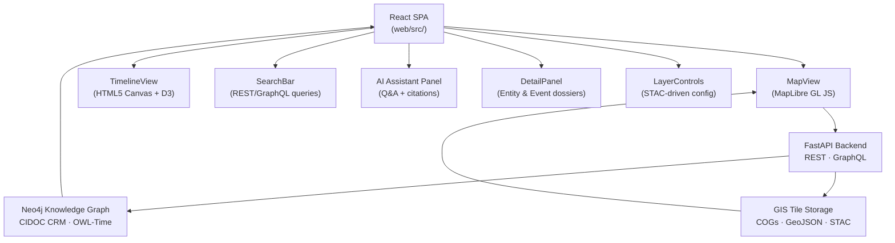

<div align="center">

# 🧭 Kansas Frontier Matrix — **Web Frontend**  
`web/src/`

**Interactive Map · Timeline · Knowledge Graph Interface**

[](../../../.github/workflows/ci.yml)
[](../../../.github/workflows/stac-validate.yml)
[](../../../.github/workflows/codeql.yml)
[](../../../.github/workflows/trivy.yml)
[](../../../docs/)
[](../../../LICENSE)

</div>

---

```yaml
---
title: "KFM • Web Frontend (web/src/)"
version: "v1.5.1"
last_updated: "2025-10-14"
owners: ["@kfm-web", "@kfm-architecture"]
tags: ["react","typescript","maplibre","canvas","timeline","vite","stac","mcp"]
license: "MIT"
semantic_alignment:
  - CIDOC CRM
  - OWL-Time
  - STAC 1.0
  - DCAT 2.0
---
````

---

## 📚 Table of Contents

* [🪶 Overview](#🪶-overview)
* [⚙️ Architecture](#️-architecture)
* [🗂 Directory Layout](#🗂-directory-layout)
* [🧩 Component Structure](#🧩-component-structure)
* [🚀 Usage](#🚀-usage)
* [🔌 API Contracts](#🔌-api-contracts)
* [🧠 Data Flow](#🧠-data-flow)
* [🧪 Development Notes](#🧪-development-notes)
* [🧭 Provenance & Dependencies](#🧭-provenance--dependencies)
* [🗂 Data & Semantics](#🗂-data--semantics)
* [⚙️ Configuration (generated)](#️-configuration-generated)
* [♿ Accessibility & Responsiveness](#♿-accessibility--responsiveness)
* [🛡 Security & Privacy](#🛡-security--privacy)
* [🛠 DevEx & MCP](#🛠-devex--mcp)
* [⚡ Performance Checklist](#⚡-performance-checklist)
* [🧑‍💻 Developer Quick Reference](#🧑‍💻-developer-quick-reference)
* [🧰 Troubleshooting](#🧰-troubleshooting)
* [🔗 Related Documentation](#🔗-related-documentation)
* [📜 License & Credits](#📜-license--credits)

---

## 🪶 Overview

The KFM Web Frontend is a **React 18+** SPA (TypeScript) rendering Kansas’s historical, environmental, and cultural layers through a synchronized **Map + Timeline** interface.
It is the public face of the KFM knowledge graph (**FastAPI / GraphQL + Neo4j**), driven by **STAC-indexed** datasets (**COG/GeoJSON**).

**Core principles**

* 📍 **Spatio-Temporal Sync** — map & timeline share one time window and selection model
* 🤖 **AI Assistance** — summaries & Q&A with citations from the knowledge graph
* 🗺 **Open Data** — STAC → `layers.json` (COG rasters & GeoJSON vectors)
* ♿ **Accessible & Modular** — composable React components; WCAG 2.1 AA practices

---

## ⚙️ Architecture



---

## 🗂 Directory Layout

```text
web/src/
├── components/                 # Core React components
│   ├── MapView.tsx             # MapLibre GL instance, loads STAC layers
│   ├── TimelineView.tsx        # Canvas-based chronological visualization
│   ├── DetailPanel.tsx         # Entity dossier and citation summaries
│   ├── SearchBar.tsx           # Knowledge Graph search + autocomplete
│   ├── AIAssistant.tsx         # Interactive Q&A panel (citations, context)
│   ├── LayerControls.tsx       # STAC-driven toggle interface for layers
│   └── index.ts                # Barrel export for all core components
│
├── context/                    # Global state contexts
│   ├── AppContext.tsx          # App-level provider (timeline, map, filters)
│   └── useGlobalState.ts       # Custom hooks for global data binding
│
├── hooks/                      # Reusable composable React hooks
│   ├── useMap.ts               # Map instance + layer sync
│   ├── useTimeline.ts          # Time window and zoom control
│   ├── useStac.ts              # Parse and fetch STAC catalogs
│   └── useSearch.ts            # Debounced search + entity linking
│
├── styles/                     # Styling assets
│   ├── tailwind.css            # TailwindCSS entry
│   ├── variables.scss          # Design tokens (color, typography, spacing)
│   └── index.css               # Base resets and globals
│
├── types/                      # Shared TypeScript types
│   ├── entities.d.ts           # Event, Entity, Layer interfaces
│   ├── api.d.ts                # API response types
│   └── index.d.ts              # Exported type definitions
│
├── utils/                      # Helper functions and data handlers
│   ├── api.ts                  # REST/GraphQL client bindings
│   ├── formatters.ts           # Date, number, string utilities
│   ├── geometry.ts             # Coordinate projections and map helpers
│   └── stac.ts                 # STAC parser and layer metadata utilities
│
├── config/                     # Generated runtime configuration
│   ├── layers.json             # Auto-built from STAC catalog
│   ├── app.config.json         # Frontend runtime metadata
│   └── vite.config.ts          # Vite bundler setup
│
├── tests/                      # Unit & integration tests
│   ├── MapView.test.tsx
│   ├── TimelineView.test.tsx
│   └── utils.test.ts
│
├── assets/                     # Icons, SVGs, manifest.json
└── index.tsx                   # App entry (ReactDOM.render)
```

---

## 🧩 Component Structure

| Component         | Purpose                                                 | Key Libraries                       |
| :---------------- | :------------------------------------------------------ | :---------------------------------- |
| **MapView**       | Basemap + overlays (historic maps, hydrology, treaties) | `maplibre-gl`, `react-map-gl`       |
| **TimelineView**  | Canvas zoom/pan/brush timeline                          | HTML5 Canvas, `d3-scale`, `d3-zoom` |
| **SearchBar**     | Autocomplete + knowledge graph queries                  | Fetch/Axios, React Context          |
| **AI Panel**      | AI Q&A + citations                                      | Backend `/ask` route                |
| **DetailPanel**   | Dossier summaries + linked entities                     | `react-markdown`, UI kit            |
| **LayerControls** | Layer toggles & legends                                 | React hooks, internal store         |

---

## 🚀 Usage

*(same as previous section — see prior message for setup commands)*

---

## 🔗 Related Documentation

* **System Architecture** — `../docs/architecture.md`
* **Web UI Architecture (full)** — `web/ARCHITECTURE.md`
* **Monorepo Design** — `../docs/monorepo.md`
* **ETL Pipelines** — `../docs/sop.md`

---

## 📜 License & Credits

**MIT License** — © Kansas Frontier Matrix.
Developed under the **Master Coder Protocol (MCP)**.

> *“Time, terrain, and story — united through data.”*

```
```
