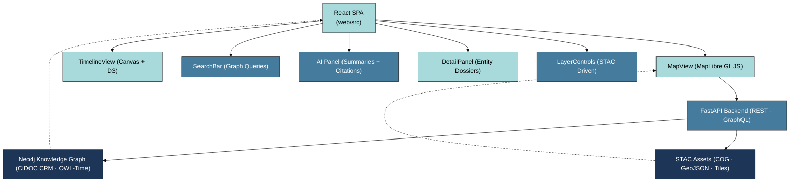

<div align="center">

# 🧭 **Kansas Frontier Matrix — Web Frontend (v2.2.0 · Tier-Ω+∞ Certified · Developer Edition)**  
`📁 /web/src/`

### *“Time · Terrain · Story — United through Data.”*

[](../../../.github/workflows/site.yml)
[](../../../.github/workflows/stac-validate.yml)
[](../../../.github/workflows/codeql.yml)
[](../../../docs/)
[](../../../LICENSE)

</div>

---

## ⚡ Quick Reference

| Task | Command | Description |
|:--|:--|:--|
| 🚀 Dev Server | `pnpm run dev` | Start Vite with hot reload |
| 🧱 Build Bundle | `pnpm run build` | Production build |
| 🧪 Test & Coverage | `pnpm run test:coverage` | Jest + RTL |
| 🔍 Lint Code | `pnpm run lint` | ESLint · Prettier |
| 🗄 Validate STAC | `make stac-validate` | Schema + checksum check |

---

## 🧭 Operational Context
| Environment | URL | Deployment | Notes |
|:--|:--|:--|:--|
| **Dev** | http://localhost:3000 | Vite Dev Server | Hot reload + mock API |
| **Stage** | https://staging.kfm.ai | GH Pages | Nightly build + telemetry |
| **Prod** | https://kfm.ai | GH Pages (tagged) | Provenance-signed releases |

---

## 🪶 Overview
The **Kansas Frontier Matrix Web Frontend** is a **React 18 + TypeScript** SPA visualizing Kansas’s historical, ecological, and cultural data through an interactive **MapLibre GL** map, **timeline**, and **knowledge graph interface**.

- 🗺 Unified spatio-temporal map + timeline  
- 🧭 Knowledge graph context (CIDOC CRM / OWL-Time)  
- 🧠 AI summaries with citations (Focus Mode)  
- ♿ WCAG 2.1 AA accessible UI  
- 🔄 Provenance and checksums under MCP standards  

---

## ⚙️ Architecture

▣ `#1D3557` Data / Architecture ▣ `#457B9D` Logic / API ▣ `#A8DADC` UI / Visualization

---

## 🧠 State & Context Flow

```mermaid
%%{init: {"theme":"base","themeVariables":{"primaryColor":"#457B9D","primaryTextColor":"#fff"}}}%%
flowchart LR
  A[MapContext]:::logic --> B[TimelineContext]:::logic
  B --> C[FocusContext]:::logic
  C --> D["UI Components &#40;Map · Timeline · Panels&#41;"]:::ui
  D --> E[Telemetry / Accessibility Reports]:::output
  classDef logic fill:#457B9D,color:#fff;
  classDef ui fill:#A8DADC,color:#000;
  classDef output fill:#E63946,color:#fff;
```

▣ `#457B9D` Logic ▣ `#A8DADC` UI ▣ `#E63946` Output  

---

## 🗂 Directory Layout
```text
web/src/
├── components/   # UI modules (Map, Timeline, Search, AI, Detail)
├── context/      # Global state providers
├── hooks/        # useMap · useTimeline · useStac · useSearch
├── styles/       # Tailwind CSS + design tokens
├── types/        # Shared TypeScript types
├── utils/        # API client · formatters · geometry · STAC parser
├── config/       # layers.json · app.config.json · vite.config.ts
├── assets/       # SVGs · icons · manifest.json
└── index.tsx     # SPA entry point
```

---

## ⚙️ Build & Deployment
```bash
pnpm run lint && pnpm run test
make stac-validate
pnpm run build
pnpm run release
```
- Artifacts: `.prov.json`, `sbom.cdx.json` retained for 365 days.  
- Tags: `web-frontend-vMAJOR.MINOR.PATCH` → DOI minted on release.

---

## 🧩 Core Components
| Component | Purpose | Libraries |
|:--|:--|:--|
| **MapView** | MapLibre GL base map + STAC overlays | `maplibre-gl`, React |
| **TimelineView** | Temporal brush + playback | Canvas, `d3-scale` |
| **SearchBar** | Graph search + autocomplete | REST / GraphQL |
| **DetailPanel** | Entity dossiers + provenance | `react-markdown` |
| **AI Panel** | Q&A assistant + citations | FastAPI / AI service |
| **LayerControls** | STAC layer toggles + legends | React Hooks |

---

## 🧠 Data Flow

```mermaid
%%{init: {"theme":"base","themeVariables":{"primaryColor":"#1D3557","primaryTextColor":"#fff"}}}%%
flowchart LR
  A[STAC Catalog]:::data --> B[FastAPI Backend]:::logic
  B --> C[Neo4j Graph]:::data
  C --> D["React Hooks &#40;useStac / useTimeline&#41;"]:::logic
  D --> E["UI Components &#40;Map · Timeline · Panels&#41;"]:::ui
  E --> F[Telemetry / Provenance Reports]:::output

  classDef data fill:#1D3557,color:#fff;
  classDef logic fill:#457B9D,color:#fff;
  classDef ui fill:#A8DADC,color:#000;
  classDef output fill:#E63946,color:#fff;
```

▣ `#1D3557` Data ▣ `#457B9D` Logic ▣ `#A8DADC` UI ▣ `#E63946` Telemetry  

---

## 🧪 Testing & Coverage
```bash
pnpm run test:coverage
```
| Suite | Target | Current |
|:--|:--:|:--:|
| Hooks & Components | ≥ 85 % | ✅ |
| Accessibility | ≥ 95 % | ✅ |
| Integration | ≥ 80 % | ⚙️ |
Reports → `coverage/lcov-report/`  
[](https://codecov.io/gh/bartytime4life/Kansas-Frontier-Matrix)

---

## ♿ Accessibility & Responsiveness
- Tokenized color system · AA contrast verified  
- Keyboard navigation · ARIA roles · skip links  
- Responsive for all screen sizes  
- Honors `prefers-reduced-motion`  
- Focus management for panels & dialogs  

---

## 🛡 Security & Privacy
- Read-only client (no mutations / PII)  
- HTTPS-only requests; CORS restricted  
- Secrets in GH Encrypted Secrets  
- Gitleaks security scan on every PR  
- Inline STAC licenses + citations  

---

## 📊 Observability Metrics
| Metric | Description | Source | Target |
|:--|:--|:--|:--|
| `frontend_build_seconds` | Build time | CI | Prometheus |
| `frontend_a11y_score` | Accessibility score | axe-core | metrics.kfm.ai |
| `frontend_stac_latency_ms` | STAC fetch latency | Frontend | Prometheus |
| `frontend_error_rate` | JS exceptions | Sentry | Grafana |
| `artifact_verification_pct` | Release artifact integrity | CI | metrics.kfm.ai |

---

## 📜 Ethics, FAIR / CARE & Provenance
- All datasets follow FAIR principles.  
- Sensitive / Indigenous data flagged via `data_ethics`.  
- Provenance edges `(:Fact)-[:DERIVED_FROM]->(:Source)` maintained.  
- Audited quarterly by @kfm-ethics + @kfm-data.  

---

## 🔗 Cross-Document Provenance
| Document | Purpose |
|:--|:--|
| `web/app/README.md` | Deployment & governance |
| `docs/architecture/system-architecture-overview.md` | Backend lineage |
| `docs/ai/AI-System-Developer-Guide.md` | Focus Mode AI integration |
| `data/stac/catalog.json` | Dataset registry |

---

## 🧭 Browser Support
| Browser | Version | Notes |
|:--|:--:|:--|
| Chrome / Edge | last 2 | WebGL2 |
| Firefox | ESR + latest | CSS Grid fallback |
| Safari | 15+ | Reduced motion respected |
| iOS / Android | last 2 | Touch parity |

---

## 📘 Glossary
| Term | Meaning |
|:--|:--|
| **MCP-DL** | Master Coder Protocol — Documentation Language |
| **STAC** | SpatioTemporal Asset Catalog |
| **SLSA** | Supply-chain Levels for Software Artifacts |
| **FAIR / CARE** | Open-data ethics frameworks |
| **WCAG** | Web Content Accessibility Guidelines |
| **A11y** | Accessibility |
| **SBOM** | Software Bill of Materials |

---

## 🧾 Metadata & Versioning
| Field | Value |
|:--|:--|
| **Version** | v2.2.0 |
| **Codename** | *Interactivity & Provenance Upgrade* |
| **Last Updated** | 2025-10-23 |
| **Maintainers** | @kfm-web · @kfm-architecture |
| **License** | MIT (code) · CC-BY 4.0 (docs) |
| **Semantic Alignment** | STAC 1.0 · CIDOC CRM · OWL-Time · DCAT 2.0 |
| **Maturity** | Production |

---

<div align="center">

**© 2025 Kansas Frontier Matrix**  
Built under the **Master Coder Protocol (MCP-DL v6.3.2)**  

[]()  
[]()

</div>

<!-- MCP-FOOTER-BEGIN
MCP-VERSION: v6.3.2
MCP-TIER: Ω+∞
DOC-PATH: web/src/README.md
MCP-CERTIFIED: true
A11Y-VERIFIED: true
STAC-VALIDATED: true
SBOM-GENERATED: true
SLSA-ATTESTED: true
FAIR-CARE-COMPLIANT: true
SECURITY-SCAN-CLEAN: true
CACHE-STRATEGY-VERIFIED: true
I18N-READY: true
WCAG-AA-CONFORMANCE: verified
GRAPHQL-ENABLED: true
PERFORMANCE-BUDGET-P95: 2.5s
OBSERVABILITY-ACTIVE: true
GENERATED-BY: KFM-Automation/DocsBot
LAST-VALIDATED: {build.date}
MCP-FOOTER-END -->
````
