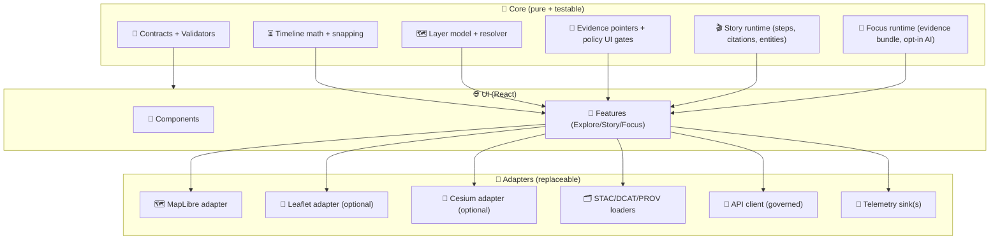

<!--
📌 This README defines the executable UI boundary for KFM’s Web Viewer source code.
🗓️ Last updated: 2026-01-13
🔁 Review cycle: 90 days (or anytime UI contracts / Story Node rules / Focus Mode rules / map engines change)
-->

<div align="center">

# 🧩🌾 `web/src/` — KFM Web Viewer Source  
`web/src/README.md`

**Explore Mode · Story Mode · Focus Mode · (Optional) 3D Story Mode**  
_The governed frontend runtime for Kansas Frontier Matrix (KFM) — contract-first, evidence-first, and redaction-aware._

<p align="center">
  
  
  
  
  
  
  
  
  
  
</p>

</div>

> **TL;DR 🧠**  
> `web/src/` is where the viewer becomes **real software**: it loads **cataloged layers**, runs the **timeline**, renders **2D/3D**, and enforces **UI-side governance guardrails** (redaction, safe defaults, evidence hooks).  
> If it can’t point to STAC/DCAT/PROV (or a governed API endpoint that can), it doesn’t belong here. ✅🧾

> [!IMPORTANT]
> **KFM invariant (UI is downstream):**  
> **ETL → Catalogs (STAC/DCAT/PROV) → Graph → API → UI → Story Nodes → Focus Mode**[^pipeline-order]  
> **API boundary rule:** the UI must **never** query Neo4j (or any graph DB) directly — all access goes through governed APIs.[^api-boundary]

---

## 🔗 Quick links 🧭

| What | Where |
|---|---|
| 🗺️ Web root README (modes, data contracts) | `../README.md` |
| 🎬 Story Node packages (web runtime) | `../story_nodes/` |
| 🧾 Web fixtures + manifests | `../data/` |
| 🎨 Visual assets (sprites/fonts/licensing) | `../assets/` |
| 🧬 Canonical pipeline boundary | `../../pipelines/README.md` |
| 🚪 API boundary | `../../api/README.md` |
| ✅ Repo-wide tests/QA gates | `../../tests/README.md` *(if present)* |
| 🧰 Tooling/validators | `../../tools/README.md` *(if present)* |

---

## 🧾 Doc metadata

| Field | Value |
|---|---|
| Doc | `web/src/README.md` |
| Status | Active ✅ |
| Last updated | **2026-01-13** |
| Review cycle | 90 days 🔁 |
| Audience | Frontend contributors (React/TS), cartography maintainers, Story Node authors integrating UI behaviors |
| Prime directive | **No evidence → no UI claim** (everything must be traceable) |
| Default stance | sanitize-by-default 🧼, redact-by-default 🔒, avoid big blobs 🧱 |

---

## 🧭 Table of contents

- [⭐ North stars](#-north-stars)
- [🚫 Non-goals](#-non-goals)
- [🧱 Frontend architecture](#-frontend-architecture)
- [📁 Source layout](#-source-layout-target-shape)
- [🧬 Core data flow](#-core-data-flow)
- [🗂️ Contracts and runtime validation](#️-contracts-and-runtime-validation)
- [🎬 Story Nodes runtime](#-story-nodes-runtime)
- [🎯 Focus Mode runtime](#-focus-mode-runtime)
- [🗺️ Map engine adapters](#️-map-engine-adapters)
- [⏳ Timeline engine](#-timeline-engine)
- [🧾 Evidence and provenance UX](#-evidence-and-provenance-ux)
- [📣 Telemetry and audit-friendly events](#-telemetry-and-audit-friendly-events)
- [⚡ Performance guardrails](#-performance-guardrails)
- [🛡️ Security and privacy](#️-security-and-privacy)
- [♿ Accessibility](#-accessibility)
- [🧪 Testing and validation](#-testing-and-validation)
- [🧰 Dev workflow](#-dev-workflow)
- [✅ Definition of done](#-definition-of-done)
- [📚 Project file influence map](#-project-file-influence-map)
- [🕰️ Version history](#️-version-history)
- [📎 Notes](#-notes)

---

## ⭐ North stars

Frontend decisions must preserve **trust** — not just “make it work.” 🧭🧾

- 🗂️ **Catalog-first UI:** layers and docs come from STAC/DCAT/PROV (or API endpoints that serve those IDs/links).[^catalog-outputs]
- 🔐 **No leakage:** UI must respect redaction and sovereignty rules; never become a “side channel.”[^ui-contracts][^focus-hard-gate]
- 📜 **Contract-first rendering:** manifests/configs are validated before use; broken contracts fail loudly (and in CI).[^ci-gates]
- 🎬 **Evidence-first story:** Story Nodes are **machine-ingestible** narratives with citations + entity IDs, not free-form blogging.[^story-nodes]
- 🧠 **AI is opt-in + labeled:** Focus Mode never shows AI text by default; it must be user-triggered and visibly labeled with uncertainty.[^focus-hard-gate]
- ♿ **Accessible by default:** keyboard flows + ARIA + responsive layouts are not optional.[^ui-contracts]

---

## 🚫 Non-goals

- ❌ Big compute in-browser (heavy analytics and simulation stay upstream)
- ❌ “Secret config” in the frontend bundle (frontend is public by definition)
- ❌ Direct graph/DB access (even if “it’s faster”)
- ❌ Rendering uncited narrative as truth
- ❌ Shipping giant raw rasters/vectors under `web/` (use tiles/COGs and pointers)

---

## 🧱 Frontend architecture

Think “clean boundaries” — map engines and data sources are **adapters**, not the core. 🧼🏛️

### ✅ Recommended layering



> [!NOTE]
> The Master Guide describes UI contract artifacts like **layer registry config**, **accessibility audits**, and **usage analytics hooks**, and states the UI must **cause no data leakage** and respect redaction rules.[^ui-contracts]

---

## 📁 Source layout (target shape)

> 📌 Treat this as the **target** layout. If the repo differs today, update this README when structure changes.

```text
web/src/
├─ 🧩 app/                      # bootstrapping: providers, routing, app shell
├─ 🧠 core/                     # pure logic: timeline, resolvers, policy UI gates
│  ├─ 📜 contracts/             # Zod/JSON schema wrappers for runtime validation
│  ├─ 🗺️ layers/                # layer registry types + resolution
│  ├─ ⏳ timeline/              # snapping, eras, steps, playback logic
│  ├─ 🧾 evidence/              # evidence pointers + link builders
│  ├─ 🎬 story/                 # story node parser + runtime
│  ├─ 🎯 focus/                 # focus mode context bundle + opt-in AI hooks
│  └─ 🔐 governance/            # classification + redaction UI rules
├─ 🔌 adapters/                 # replaceable IO + engines
│  ├─ 🗺️ maplibre/
│  ├─ 🍃 leaflet/               # optional
│  ├─ 🧊 cesium/                # optional
│  ├─ 🗂️ catalog/               # STAC/DCAT/PROV loaders + link resolution
│  ├─ 🚪 api/                   # governed API client (no graph direct)
│  └─ 📣 telemetry/             # event sinks (console/local/remote)
├─ 🧰 features/                 # Explore / Story / Focus features (UI+state glue)
├─ 🎛️ state/                    # store(s), selectors, event log
├─ 🧱 ui/                       # shared components (panels, dialogs, legend, etc.)
├─ 🧵 workers/                  # web workers for heavy parsing/joins
├─ 🧪 tests/                    # UI-scoped unit/integration tests
└─ 🧷 utils/                    # small helpers (dates, ids, fetch, memoization)
```

---

## 🧬 Core data flow

The viewer should have **two** primary ingestion paths:

1) **Static-first** (GitHub Pages friendly)  
   - `web/data/*` contains small, validated “views” (manifests, story configs, demo bundles)
   - those views **link back** to STAC/DCAT/PROV artifacts (source of truth)

2) **Progressive enhancement** (API-enabled)  
   - the UI calls the governed API for search, evidence bundles, and policy-safe slices  
   - API responses include evidence pointers (STAC/DCAT/PROV IDs/links), not mystery payloads

> [!IMPORTANT]
> When adding a new UI layer/feature, the guide requires that **layers tie back to provenance** and that UI interactions comply with CARE principles (e.g., hide precise coordinates if sensitive).[^ui-layer-provenance]

---

## 🗂️ Contracts and runtime validation

KFM expects CI gates that validate:
- markdown protocol & required sections
- link/reference integrity
- JSON Schema validation for structured artifacts (including UI config if schemas exist)[^ci-gates]

### ✅ What `web/src/` should validate at runtime

| Artifact | Validate with | Why |
|---|---|---|
| `ui_config.json` | Zod schema | predictable boot + safe defaults |
| layer manifest / registry | Zod + schema fixtures | no silent drift |
| timeline config | Zod | time semantics must be deterministic |
| Story Node `config.json` | Zod | step playback must be safe |
| evidence bundle | Zod | Focus Mode must be evidence-only |
| provenance links | link checker (dev/CI) | no broken evidence |

### Example: Zod validator wrapper (pattern)

```ts
// core/contracts/validate.ts
import { ZodSchema } from "zod";

export function validateOrThrow<T>(schema: ZodSchema<T>, data: unknown, label: string): T {
  const parsed = schema.safeParse(data);
  if (!parsed.success) {
    // IMPORTANT: do not log sensitive payloads in prod
    throw new Error(`[contract] ${label} failed validation: ${parsed.error.message}`);
  }
  return parsed.data;
}
```

> [!TIP]
> Treat contract failures like “bad data bugs,” not “UI bugs.”  
> Fail closed ✅ — don’t render half-truth.

---

## 🎬 Story Nodes runtime

Story Nodes are **governed narrative artifacts** — markdown with citations + semantic annotations.  
The v13 guide expects Story Nodes to:  
- include provenance for every claim (citations)
- reference graph entities via stable IDs (people/places/events/docs)
- distinguish fact vs interpretation (especially with AI assistance)[^story-nodes]

### ✅ Responsibilities in `web/src/`
- 🧩 Parse Story Node packages (`web/story_nodes/<id>/...`)
- 🧾 Render citations as clickable evidence pointers
- 🧭 Resolve entity references (by stable ID) into:
  - evidence links
  - map highlights (policy-gated)
  - related layers or documents (via API)
- 🧱 Enforce “no story without evidence”:
  - if a citation target is missing → show a clear error + block publish UI

### Suggested Story Node runtime state

```ts
type StoryState = {
  storyId: string;
  status: "draft" | "published";
  stepIndex: number;
  citations: Array<{ id: string; label: string; href: string }>;
  entities: Array<{ id: string; type: "place"|"event"|"doc"|"dataset" }>;
  gates: { citationsOk: boolean; linksOk: boolean; policyOk: boolean };
};
```

---

## 🎯 Focus Mode runtime

Focus Mode is a **hard-gated** experience: it must only show provenance-linked content.  
AI content must be opt-in + labeled; Focus Mode must not leak sensitive locations.[^focus-hard-gate]

### ✅ Responsibilities in `web/src/`
- 📦 Render “evidence bundles” (the **only** allowed payload shape)
- 🧾 Provide “trace back” clicks: STAC/DCAT/PROV links always reachable
- 🔒 Apply redaction/generalization hints from:
  - evidence bundle fields
  - layer governance metadata
  - API-provided policy decisions
- 🧠 If AI summaries exist:
  - show **only** after user action (opt-in)
  - label as AI-generated + show uncertainty
  - never invent facts beyond the evidence bundle[^focus-hard-gate]

### Focus Mode UI checklist ✅
- [ ] “Evidence” tab always visible
- [ ] “What is this based on?” links never hidden
- [ ] Redaction notices are explicit (what changed + why)
- [ ] Coordinates are generalized/omitted when required[^focus-hard-gate]

---

## 🗺️ Map engine adapters

KFM supports a hybrid rendering strategy:
- 2D is primary (MapLibre / Leaflet)
- 3D is Story Node–triggered (Cesium optional)

### Adapter interface (recommended)

```ts
export type Camera2D = { center: [number, number]; zoom: number; bearing: number; pitch: number };
export type Camera3D = { lon: number; lat: number; height: number; heading?: number; pitch?: number; roll?: number };

export interface MapEngine {
  kind: "maplibre" | "leaflet" | "cesium";
  mount(container: HTMLElement): void;
  unmount(): void;

  setTime(t: string): void;               // ISO date/time (viewer canonical)
  setCamera(camera: Camera2D | Camera3D): void;

  addLayer(layer: ResolvedLayer): void;
  removeLayer(layerId: string): void;

  setFeatureHighlight(opts: { id: string; style?: string } | null): void;
  on(event: "click" | "move" | "zoom", handler: (e: unknown) => void): () => void;
}
```

> [!TIP]
> Don’t “leak engine details” into features. Keep engine-specific code inside `adapters/`. 🔌✅

---

## ⏳ Timeline engine

Time is not decoration in KFM — it’s a primary axis. ⏳🗺️

### Requirements
- deterministic snapping (eras, steps, tick intervals)
- consistent “time drives visibility” rules
- shared time state across Explore/Story/Focus

### Recommended pattern
- **single** canonical time value in global state
- derived selectors produce layer visibility windows
- Story Nodes can override time per-step, but must restore state on exit

---

## 🧾 Evidence and provenance UX

Every layer must have a provenance-facing surface:
- legend/info panel cites source (DCAT/STAC)
- license and restrictions visible
- PROV “run receipt” link (when available)

This is explicitly required for new UI layers/features.[^ui-layer-provenance]

### “Evidence pointer” UI pattern (recommended)
- **Evidence chips** near the layer name:
  - 🗂️ STAC
  - 🏷️ DCAT
  - 🧬 PROV
  - 🔐 classification
  - 📜 license

---

## 📣 Telemetry and audit-friendly events

KFM plans stronger “telemetry-driven governance” signals (e.g., when sensitive data is accessed or redactions occur).[^telemetry-gov]

### ✅ In `web/src/`, emit events like:
- `layer.added`, `layer.removed`
- `evidence.opened`, `prov.opened`
- `story.step.changed`, `story.citation.clicked`
- `focus.ai.requested` *(opt-in action)*
- `governance.redaction.notice_shown`

> [!CAUTION]
> Telemetry must **not** become a privacy leak.  
> Never log raw document text, private coordinates, or secrets. Aggregate/summarize where possible.

---

## ⚡ Performance guardrails

The viewer should feel “fast enough” on average laptops and mobile devices 📱💻

### Defaults (safe)
- tiles over big vectors
- lazy-load heavy layers
- web workers for heavy parsing
- cap GeoJSON size in the client (warn/block)

### UI performance checklist ✅
- [ ] no unbounded loops over features on every render
- [ ] memoize derived selectors
- [ ] cache manifest and catalog fetches
- [ ] debounce expensive operations (search, hover queries)
- [ ] avoid synchronous parsing of large payloads on main thread

---

## 🛡️ Security and privacy

This is a public surface. Assume hostile inputs. 🧯

### Non-negotiables ✅
- sanitize any rendered markdown/HTML from docs
- never expose secrets in config (frontend is public)
- never leak sensitive locations (generalize/omit)[^focus-hard-gate]
- treat “IDs” as navigation, not access control (policy lives upstream)

### Licensing discipline 📜
KFM documentation explicitly flags the need for continued vigilance around third‑party licensing and compliance.[^licensing]

---

## ♿ Accessibility

The UI contract expects accessibility to be upheld.[^ui-contracts]

✅ Minimum bar:
- keyboard navigation across map + panels
- ARIA labels for toggles, sliders, dialogs
- color is not the only signal (patterns/labels/tooltips)
- responsive layouts (mobile-first)

---

## 🧪 Testing and validation

v13 CI gates include link validation and schema validation for structured artifacts; if metadata fails, CI fails.[^ci-gates]

### Suggested test rings
- 🧱 Unit: timeline snapping, layer resolver, evidence pointer builder
- 🧩 Component: legend + evidence chips, story stepper, focus panel
- 🧪 E2E: load manifest → scrub time → open story → click citations

### Suggested scripts (choose + standardize)
```bash
npm run dev
npm run build
npm run test
npm run test:e2e
npm run lint
npm run validate:data
npm run validate:story-nodes
```

---

## 🧰 Dev workflow

### Local dev (typical)
```bash
cd web
npm install
npm run dev
```

### Adding a new UI layer (happy path) 🗺️
1) add layer entry to layer registry/manifest  
2) ensure it links to STAC/DCAT/PROV  
3) add legend + evidence chips  
4) run validators + tests  
5) confirm governance behavior (classification/redaction)

> [!IMPORTANT]
> New layers must cite their data source via DCAT/STAC, and must hide precise coordinates if sensitive.[^ui-layer-provenance]

---

## ✅ Definition of done

A `web/src` change is “done” when:

- ✅ UI feature respects pipeline invariant + API boundary[^pipeline-order][^api-boundary]
- ✅ Contracts validated (Zod/Schema); broken contracts fail closed[^ci-gates]
- ✅ Evidence/provenance surfaced (STAC/DCAT/PROV links)
- ✅ No sensitive location leakage; redaction UX is explicit[^focus-hard-gate]
- ✅ A11y checks pass (keyboard + ARIA + responsive)
- ✅ Tests added/updated (unit + feature path)
- ✅ Telemetry events (if relevant) don’t leak sensitive content

---

## 📚 Project file influence map

> [!WARNING]
> Reference files can have different licenses than repo code. Respect upstream terms and avoid redistributing third‑party works without permission.

<details>
<summary><strong>📦 Expand: Project files → how they influence <code>web/src</code></strong></summary>

| Project file | What it influences in `web/src/` |
|---|---|
| `MARKDOWN_GUIDE_v13.md.gdoc` | 🧱 Canonical ordering + UI boundary rules, Story/Focus gates, CI validation expectations. |
| `Kansas Frontier Matrix (KFM) – Comprehensive Technical Documentation.pdf` | 🧭 System intent, UI role as evidence-first exploration/story hub, licensing posture. |
| `Comprehensive Markdown Guide_ Syntax, Extensions, and Best Practices.docx` | 📄 Markdown/front-matter conventions, citation discipline, doc validation mindset. |
| `responsive-web-design-with-html5-and-css3.pdf` | 📱 Responsive layouts, progressive enhancement, mobile-first UX constraints. |
| `Mobile Mapping_ Space, Cartography and the Digital - 9789048535217.pdf` | 🧭 Mobile/offline realities; sensitivity mindset for location data. |
| `making-maps-a-visual-guide-to-map-design-for-gis.pdf` | 🎨 “Maps persuade” discipline: legend integrity, visual hierarchy, uncertainty grammar. |
| `webgl-programming-guide-interactive-3d-graphics-programming-with-webgl.pdf` | 🧊 WebGL performance instincts for 3D/advanced rendering and safe GPU patterns. |
| `Archaeological 3D GIS_26_01_12_17_53_09.pdf` | 🧊 3D GIS interpretability + caution: 3D is powerful but easy to mislead; document assumptions. |
| `compressed-image-file-formats-jpeg-png-gif-xbm-bmp.pdf` | 🖼️ Thumbnail/sprite format choices; keep assets small + cacheable. |
| `python-geospatial-analysis-cookbook.pdf` | 🗺️ CRS hygiene + GeoJSON realities (helps frontend contract assumptions). |
| `KFM- python-geospatial-analysis-cookbook-...pdf` | 🧭 Web-application GIS patterns; reinforces bounded requests + predictable geometry handling. |
| `Cloud-Based Remote Sensing with Google Earth Engine-Fundamentals and Applications.pdf` | 🛰️ Time-series visualization patterns; remote sensing product conventions and metadata expectations. |
| `PostgreSQL Notes for Professionals - PostgreSQLNotesForProfessionals.pdf` | 🐘 Index-friendly query patterns (frontend request design: bbox/time/paging). |
| `Database Performance at Scale.pdf` | ⚡ Request selectivity, caching, avoiding “scan everything” UI loading patterns. |
| `Scalable Data Management for Future Hardware.pdf` | ⚙️ Throughput mindset: chunking, streaming, and avoiding unnecessary main-thread work. |
| `Data Spaces.pdf` | 🔗 Pointer-over-payload: UI prefers IDs/links + catalogs; federation-friendly patterns. |
| `Understanding Statistics & Experimental Design.pdf` | 📊 UI honesty: show assumptions, coverage, and avoid misleading comparisons. |
| `graphical-data-analysis-with-r.pdf` | 📉 Diagnostics/EDA artifacts as first-class UI panels (distributions, outliers). |
| `regression-analysis-with-python.pdf` | 📈 If regression outputs are shown, include diagnostics and caveats. |
| `Regression analysis using Python - slides-linear-regression.pdf` | 📈 Standard metrics + assumption reminders for compact UI views. |
| `think-bayes-bayesian-statistics-in-python.pdf` | 🎲 Credible intervals + uncertainty-first presentation (bands, posterior summaries). |
| `Scientific Modeling and Simulation_ A Comprehensive NASA-Grade Guide.pdf` | 🧪 V&V posture in UI: show validation status, sensitivity notes, and uncertainty artifacts. |
| `Generalized Topology Optimization for Structural Design.pdf` | 🧮 Optimization scenario UI: parameters/objectives/constraints must be visible and reproducible. |
| `Spectral Geometry of Graphs.pdf` | 🕸️ Graph metric caution: show signals as signals; don’t overclaim network visuals. |
| `Introduction to Digital Humanism.pdf` | ❤️ Transparency and accountability defaults, human autonomy in AI-assisted UX. |
| `Principles of Biological Autonomy - book_9780262381833.pdf` | 🔁 Feedback-loop thinking: keep the user in control; avoid “autopilot” UX. |
| `On the path to AI Law’s prophecies and the conceptual foundations of the machine learning age.pdf` | ⚖️ Label AI involvement; ensure accountability + provenance in assistant-like features. |
| `ethical-hacking-and-countermeasures-secure-network-infrastructures.pdf` | 🛡️ Threat modeling posture; defense-in-depth mindset for public surfaces. |
| `Gray Hat Python - Python Programming for Hackers and Reverse Engineers (2009).pdf` | 🧯 Hostile-input awareness (defensive posture only): sanitize, minimize attack surface. |
| `concurrent-real-time-and-distributed-programming-in-java-threads-rtsj-and-rmi.pdf` | 🧵 Concurrency discipline: avoid UI “thread explosion”; use bounded workers + queues. |
| `A programming Books.pdf` … `U-X programming Books.pdf` | 🧰 Polyglot shelf for implementation depth (but UI remains contract-first & evidence-first). |

</details>

---

## 🕰️ Version history

| Version | Date | Summary | Author |
|---:|---|---|---|
| v0.1.0 | 2026-01-13 | Created `web/src/README.md`: establishes frontend boundaries, target layout, contracts/validation, Story/Focus rules, telemetry posture, and definition-of-done aligned to v13 invariants. | KFM Engineering |

---

## 📎 Notes

[^pipeline-order]: Pipeline ordering is declared absolute: **ETL → Catalogs (STAC/DCAT/PROV) → Graph → API → UI → Story Nodes → Focus Mode**. [oai_citation:0‡MARKDOWN_GUIDE_v13.md.gdoc](file-service://file-UYVruFXfueR8veHMUKeugU)  
[^api-boundary]: The guide states the frontend must never query Neo4j directly; all access goes through governed APIs. [oai_citation:1‡MARKDOWN_GUIDE_v13.md.gdoc](file-service://file-UYVruFXfueR8veHMUKeugU)  
[^catalog-outputs]: Catalog outputs and staging layout (raw/work/processed → STAC/DCAT) are described in v13 guidance. [oai_citation:2‡MARKDOWN_GUIDE_v13.md.gdoc](file-service://file-UYVruFXfueR8veHMUKeugU)  
[^story-nodes]: Story Nodes are defined as machine-ingestible narratives requiring citations, stable entity IDs, and fact vs interpretation separation. [oai_citation:3‡MARKDOWN_GUIDE_v13.md.gdoc](file-service://file-UYVruFXfueR8veHMUKeugU)  
[^focus-hard-gate]: Focus Mode rules include provenance-only content, AI opt-in + labeled with uncertainty, and no sensitive location leaks (generalize/omit). [oai_citation:4‡MARKDOWN_GUIDE_v13.md.gdoc](file-service://file-UYVruFXfueR8veHMUKeugU)  
[^ci-gates]: Minimum CI gates include front-matter checks, link/reference validation, and JSON Schema validation for structured artifacts (incl. UI config if schemas exist). [oai_citation:5‡MARKDOWN_GUIDE_v13.md.gdoc](file-service://file-UYVruFXfueR8veHMUKeugU)  
[^ui-layer-provenance]: New UI layers/features must tie back to provenance; legends/popups should cite DCAT/STAC; sensitive coordinates must be hidden as needed (CARE). [oai_citation:6‡MARKDOWN_GUIDE_v13.md.gdoc](file-service://file-UYVruFXfueR8veHMUKeugU)  
[^ui-contracts]: UI contract artifacts include layer registry config, accessibility audits, and usage analytics hooks; UI must prevent data leakage and respect redaction rules. [oai_citation:7‡MARKDOWN_GUIDE_v13.md.gdoc](file-service://file-UYVruFXfueR8veHMUKeugU)  
[^telemetry-gov]: The guide discusses strengthening telemetry signals to monitor sensitive access, redactions, and policy blocks (telemetry-driven governance). [oai_citation:8‡MARKDOWN_GUIDE_v13.md.gdoc](file-service://file-UYVruFXfueR8veHMUKeugU)  
[^licensing]: KFM documentation highlights the need for vigilance around third‑party licensing and compliance over time.  
[^docs-front-matter]: Markdown best practices emphasize front-matter metadata, evidence/citations for claims, and CI checks to keep docs compliant and accessible. [oai_citation:9‡Comprehensive Markdown Guide_ Syntax, Extensions, and Best Practices.docx](file-service://file-J6rFRcp4ExCCeCdTevQjxz)  