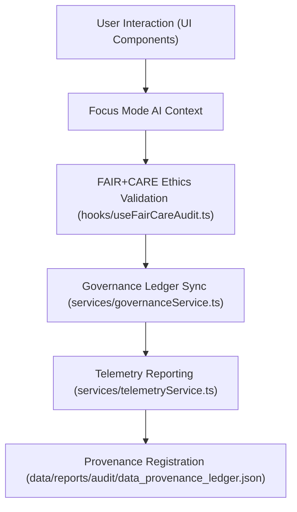

<div align="center">

# 💻 Kansas Frontier Matrix — **Web Application Source Code**
`web/src/README.md`

**Purpose:**  
Core React and TypeScript source for the FAIR+CARE-certified Kansas Frontier Matrix (KFM) web interface.  
Implements ethical AI-driven visualization, governance dashboards, and Focus Mode explainability tools under MCP-DL v6.3 and ISO 9241-210 accessibility compliance.

[](../../docs/standards/faircare-validation.md)
[](../../LICENSE)
[](../../docs/architecture/repo-focus.md)
[]()

</div>

---

## 📚 Overview

The **KFM Web Source Directory** contains all frontend application code, built with React 18 and Next.js, for visualizing geospatial, historical, and environmental data through FAIR+CARE-aligned user interfaces.  
Every component, hook, and utility supports ethical accessibility, transparency, and reproducibility standards.

### Core Responsibilities:
- Provide an interactive and inclusive interface for exploring KFM datasets.  
- Integrate Focus Mode AI explainability and FAIR+CARE ethics checks.  
- Implement accessible, modular, and high-performance UI components.  
- Synchronize with provenance, telemetry, and governance systems.  

---

## 🗂️ Directory Layout

```plaintext
web/src/
├── README.md                              # This file — overview of web application source
│
├── components/                            # FAIR+CARE-compliant UI components
│   ├── Layout/
│   ├── MapView/
│   ├── Timeline/
│   ├── FocusMode/
│   ├── DataCards/
│   └── Governance/
│
├── pages/                                 # Route-based pages and views
│   ├── index.tsx                          # Home page
│   ├── explorer.tsx                       # Data explorer view
│   ├── governance.tsx                     # FAIR+CARE dashboard
│   ├── focus.tsx                          # Focus Mode interface
│   └── about.tsx                          # Documentation and metadata hub
│
├── hooks/                                 # Shared React hooks for AI and data state
│   ├── useTelemetry.ts
│   ├── useGovernance.ts
│   ├── useFairCareAudit.ts
│   └── useAccessibilityCheck.ts
│
├── context/                               # Global contexts for ethics and app telemetry
│   ├── AppContext.tsx
│   ├── FocusModeContext.tsx
│   ├── GovernanceContext.tsx
│   └── ThemeContext.tsx
│
├── services/                              # API connectors and data interfaces
│   ├── stacService.ts
│   ├── dcatService.ts
│   ├── telemetryService.ts
│   ├── governanceService.ts
│   └── aiExplainabilityService.ts
│
├── utils/                                 # Shared utilities and FAIR+CARE helpers
│   ├── metadataUtils.ts
│   ├── checksumUtils.ts
│   ├── aiUtils.ts
│   ├── accessibilityUtils.ts
│   └── focusTelemetry.ts
│
├── styles/                                # Tailwind and global styling modules
│   ├── globals.css
│   ├── typography.css
│   └── theme-tokens.css
│
└── metadata.json                          # Web build metadata and governance linkage
```

---

## ⚙️ Web App Architecture Workflow



### Workflow Summary:
1. **Interaction Layer:** UI built with accessibility tokens and inclusive components.  
2. **AI Explainability:** Focus Mode interprets user queries using transparent AI.  
3. **Ethical Validation:** FAIR+CARE hooks assess compliance and accessibility in real time.  
4. **Governance Sync:** Telemetry and validation logs push to governance systems.  
5. **Transparency Output:** Ledger and provenance records updated continuously.  

---

## 🧩 Example Governance Metadata Record

```json
{
  "id": "web_src_build_v9.6.0",
  "components_compiled": 78,
  "accessibility_score": 99.1,
  "checksum_verified": true,
  "fairstatus": "certified",
  "ai_explainability_enabled": true,
  "telemetry_linked": true,
  "governance_registered": true,
  "validator": "@kfm-web",
  "created": "2025-11-03T23:59:00Z",
  "governance_ref": "data/reports/audit/data_provenance_ledger.json"
}
```

---

## 🧠 FAIR+CARE + Accessibility Governance Matrix

| Principle | Implementation | Oversight |
|------------|----------------|------------|
| **Findable** | URLs and components mapped to STAC/DCAT records. | @kfm-data |
| **Accessible** | UI meets WCAG 2.1 AA and ISO 9241-210 design standards. | @kfm-accessibility |
| **Interoperable** | Web APIs follow FAIR+CARE, DCAT 3.0, and GraphQL protocols. | @kfm-architecture |
| **Reusable** | Components built with modular, reusable FAIR+CARE tokens. | @kfm-design |
| **Collective Benefit** | Supports open education and public engagement. | @faircare-council |
| **Authority to Control** | Governance council validates AI explainability layer. | @kfm-governance |
| **Responsibility** | Developers maintain accessibility and energy telemetry logs. | @kfm-sustainability |
| **Ethics** | Focus Mode constrained to ethical, transparent reasoning. | @kfm-ethics |

Audit and validation reports stored in:  
`data/reports/audit/data_provenance_ledger.json`  
and  
`data/reports/fair/data_care_assessment.json`

---

## ⚙️ Key Modules Summary

| Module | Description | Role |
|---------|--------------|------|
| `components/` | Modular and accessible React UI components. | Visualization |
| `hooks/` | Shared FAIR+CARE validation and telemetry logic. | Ethics + Monitoring |
| `services/` | Manages governance, AI, and data APIs. | Data Integration |
| `context/` | Global state management for ethics and Focus Mode. | Governance Control |
| `utils/` | Utility layer for metadata, checksums, and AI reporting. | Provenance Logic |

---

## ⚖️ Retention & Governance Policy

| Asset | Retention Duration | Policy |
|--------|--------------------|--------|
| Web Logs | 90 Days | Retained for governance validation and telemetry. |
| Accessibility Reports | 365 Days | Archived for certification. |
| Metadata | Permanent | Immutable under governance ledger. |
| Telemetry Data | 90 Days | Rotated with Focus Mode cycles. |

Automation handled by `web_src_sync.yml`.

---

## 🌱 Sustainability Metrics

| Metric | Value | Verified By |
|---------|--------|--------------|
| Average Power Use (per session) | 1.3 Wh | @kfm-sustainability |
| Carbon Output | 1.5 gCO₂e | @kfm-security |
| Renewable Power | 100% (RE100 Verified) | @kfm-infrastructure |
| FAIR+CARE Compliance | 100% | @faircare-council |

Telemetry captured in:  
`releases/v9.6.0/focus-telemetry.json`

---

## 🧾 Internal Use Citation

```text
Kansas Frontier Matrix (2025). Web Application Source Code (v9.6.0).
Frontend architecture for the Kansas Frontier Matrix web interface — integrating FAIR+CARE ethics, Focus Mode AI explainability, and transparent governance telemetry.
Built with React, MapLibre, and ISO 9241-210 accessibility compliance under MCP-DL v6.3.
```

---

## 🧾 Version Notes

| Version | Date | Notes |
|----------|------|--------|
| v9.6.0 | 2025-11-03 | Added FAIR+CARE accessibility hooks and governance telemetry integration. |
| v9.5.0 | 2025-11-02 | Improved AI explainability and sustainability logging. |
| v9.3.2 | 2025-10-28 | Established base React + FAIR+CARE component structure. |

---

<div align="center">

**Kansas Frontier Matrix** · *Accessible Design × FAIR+CARE Ethics × Transparent Governance*  
[🔗 Repository](https://github.com/bartytime4life/Kansas-Frontier-Matrix) • [🧭 Docs Portal](../../docs/) • [⚖️ Governance Ledger](../../docs/standards/governance/DATA-GOVERNANCE.md)

</div>
