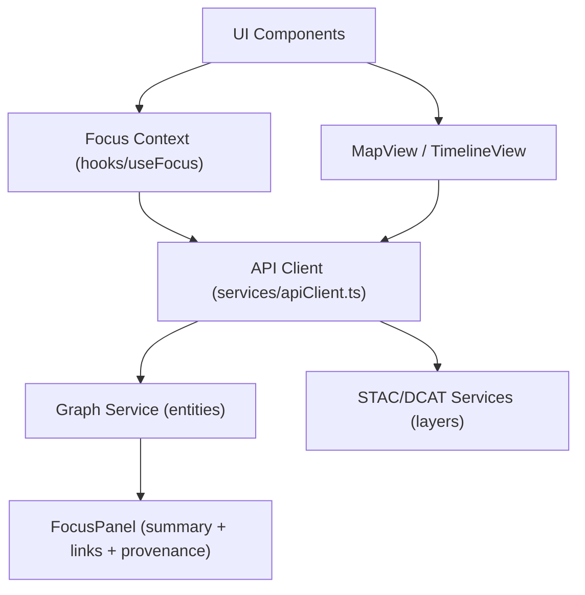

<div align="center">

# 💻 **Kansas Frontier Matrix — Web Application Source Code**  
`web/src/README.md`

**Purpose:**  
Describe the **React + TypeScript** source structure, contracts, and governance integrations for the KFM web tier.  
Aligns web modules with **MCP v6.3**, **FAIR+CARE**, **WCAG 2.1 AA**, and v10.2 telemetry/spec updates.

[](../../docs/README.md)
[](../../LICENSE)
[](../../docs/standards/faircare.md)
[](../../releases/v10.2.0/manifest.zip)

</div>

---

## 📘 Overview

`web/src/` implements the **timeline + map** experience and **Focus Mode v2.1** UI for entity-centric exploration.  
The codebase is **standards-first** (STAC/DCAT/JSON-LD), **accessibility-first** (WCAG 2.1 AA), and **ethics-aware** (CARE).  
All builds emit **immutable telemetry** and **governance ledger** entries per MCP v6.3.

**Responsibilities**
- Build an accessible, performant UI for geospatial storytelling  
- Render Focus Mode summaries + explainability (client display only)  
- Browse STAC/DCAT catalogs; fetch graph-linked entity details  
- Surface provenance, telemetry, and governance status

---

## 🗂️ Directory Layout

```
web/src/
├── README.md
│
├── components/                        # FAIR+CARE-compliant UI components
│   ├── MapView/                       # MapLibre (2D) + Cesium (3D) layers & interactions
│   ├── TimelineView/                  # Time navigation, density, break-markers
│   ├── FocusPanel/                    # AI narratives, related links, explainability chips
│   ├── LayerControls/                 # STAC/DCAT toggles, opacity, style presets
│   ├── DetailDrawer/                  # Entity metadata, citations, provenance
│   └── Accessibility/                 # Skip links, focus-traps, ARIA helpers
│
├── pages/                             # Route-level screens
│   ├── index.tsx                      # Home
│   ├── explorer.tsx                   # Data Explorer (catalog + map)
│   ├── focus.tsx                      # Focus Mode UI (entity-centric view)
│   └── governance.tsx                 # Governance dashboards & reports
│
├── hooks/                             # Shared logic & UI contracts
│   ├── useTelemetry.ts                # Web vitals, a11y, energy metrics
│   ├── useFocus.ts                    # Entity focus state & interactions
│   ├── useGovernance.ts               # CARE flags, consent indicators
│   └── useA11y.ts                     # Keyboard nav, skip links, motion prefs
│
├── context/                           # App-wide providers
│   ├── FocusProvider.tsx
│   ├── ThemeProvider.tsx
│   └── AppProvider.tsx
│
├── services/                          # Data/API clients (strongly typed)
│   ├── apiClient.ts                   # REST/GraphQL base (ETag, retries, JSON-LD)
│   ├── stacService.ts                 # STAC discovery & item fetch
│   ├── dcatService.ts                 # DCAT catalog integration
│   ├── graphService.ts                # GraphQL entity queries
│   └── telemetryService.ts            # Build & runtime metrics export
│
├── utils/                             # Helpers & guards
│   ├── schemaGuards.ts                # DTO guards; fail-fast on invalid payloads
│   ├── formatters.ts                  # Dates, numbers, legends
│   ├── provenance.ts                  # Citation chips & ledger deep-links
│   └── a11y.ts                        # Focus rings, aria helpers, reduced motion
│
├── styles/                            # Design tokens & themes
│   ├── globals.css
│   ├── tokens.css
│   └── typography.css
│
└── types/                             # Shared TS types
    ├── api.ts                         # API DTOs
    └── domain.ts                      # People/Places/Events/Documents
```

---

## 🧩 Web Flow (Modules & Data)



- **API Client** centralizes headers, ETags, retries, JSON-LD contexts  
- **Schema Guards** prevent UI from rendering invalid DTOs  
- **Provenance Utilities** attach citations + ledger links to UI chips

---

## 🧠 Focus Mode (UI Rendering Only)

- Inference runs **server-side**; the UI **renders** summaries, related entities, explainability links, and citations.  
- CARE-sensitive content is gated with **consent/citation** UI and obfuscation for protected sites.  
- Interactions emit **non-PII telemetry** (opt-out respected), feeding `../../releases/v10.2.0/focus-telemetry.json`.

**API Example**
```http
GET /api/focus/{entity_id}
```
**Returns:** Subgraph, narrative, citations, CARE flags (UI renders only).

---

## ⚙️ Contracts & Validations

| Contract | Purpose | Location |
|---|---|---|
| **API DTOs** | Typed request/response models | `types/api.ts` |
| **Domain Types** | People/Places/Events/Documents | `types/domain.ts` |
| **STAC/DCAT** | Layer/catalog compatibility | `services/{stac,dcat}Service.ts` |
| **A11y Contract** | Route-level a11y assertions | `hooks/useA11y.ts` (axe/Lighthouse in CI) |

**CI Enforcements:** `docs-lint.yml`, `build-and-deploy.yml`, `telemetry-export.yml`, `codeql.yml`, `trivy.yml`, `accessibility_scan.yml`.

---

## ♿ Accessibility & Inclusive Design

- Keyboard-first navigation, visible focus rings, skip-to-content  
- Contrast ≥ **4.5:1** (text), **3:1** (large icons/text)  
- Descriptive alt text; semantic regions (header/nav/main/aside/footer)  
- Reduced motion options; responsive reflow for narrow viewports  
- Automated **axe/Lighthouse** checks per release; results included in telemetry

---

## 📊 Telemetry & Governance

- **Build metrics:** `../../docs/reports/telemetry/build_metrics.json`  
- **Release snapshot:** `../../releases/v10.2.0/focus-telemetry.json`  
- **Governance ledgers:** `../../docs/reports/audit/` (workflow runs, approvals)

Telemetry captures workflow durations, a11y scores, STAC/DCAT counts, security passes, and commit metadata.

---

## ⚖️ Retention & Policy

| Asset | Retention | Policy |
|---|---|---|
| Build logs | 90 days | CI artifact retention |
| Accessibility scans | 365 days | Certification archive |
| Metadata/Manifests | Permanent | Governance ledger |
| Telemetry JSON | 90 days | Rolling snapshots (summarized in release notes) |

---

## 🚀 Local Development

```bash
# Install dependencies
npm --prefix web install

# Run dev server
npm --prefix web run dev   # → http://localhost:3000

# Typecheck & lint
npm --prefix web run typecheck
npm --prefix web run lint

# Build for production
npm --prefix web run build
```

> 🔐 **Secrets:** Use `.env.local` (never commit). CI parity defined in `.github/workflows/build-and-deploy.yml`.

---

## 🕰️ Version History

| Version | Date | Author | Summary |
|---|---|---|---|
| v10.2.2 | 2025-11-12 | Web Architecture Team | Align to v10.2: Focus v2.1 UI, schema guards, JSON-LD provenance, a11y & energy telemetry integration. |
| v10.0.0 | 2025-11-09 | Web Architecture Team | Focus v2 UI, Cesium layers, telemetry v2, accessibility budgets. |
| v9.7.0 | 2025-11-05 | KFM Core Team | Contracts, telemetry, CI mappings, a11y hooks. |
| v9.6.0 | 2025-11-03 | KFM Core Team | FAIR+CARE telemetry and Focus Mode UI safeguards. |
| v9.5.0 | 2025-11-02 | KFM Core Team | Explainability and sustainability logging. |

---

<div align="center">

**© 2025 Kansas Frontier Matrix — MIT / CC-BY 4.0**  
Maintained under **Master Coder Protocol v6.3** · FAIR+CARE Certified · Diamond⁹ Ω / Crown∞Ω Ultimate Certified  
[Back to Web Architecture](../ARCHITECTURE.md) · [Docs Index](../../docs/README.md)

</div>