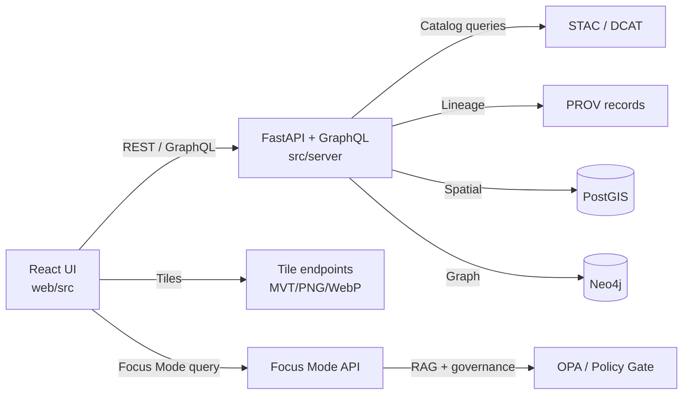

# 🗺️ Kansas Frontier Matrix — Web UI Source (`web/src`)

<p align="center">
  <b>React + TypeScript • MapLibre (2D) • Cesium (3D) • Timeline • Story Nodes • Focus Mode 🤖</b><br/>
  <sub><i>This README is scoped to <code>web/src</code> (frontend source). For full app setup, see <code>web/README.md</code> (or repo root README).</i></sub>
</p>

<p align="center">
  
  
  
  
  
  
</p>

---

## 🔎 What lives in `web/src`?

This folder is the **frontend implementation** of the Kansas Frontier Matrix (KFM) UI: a map-and-narrative experience that lets users explore **layers over time**, open **evidence-backed story content**, and ask **Focus Mode** questions that return **citation-bearing** answers.

### 🧩 The 4 UI pillars (mental model)

1. **🗺️ Map View**  
   - 2D: MapLibre GL JS (vector/raster tiles, GeoJSON overlays)  
   - 3D: CesiumJS (terrain/globe; optional toggle)
2. **⏳ Timeline / Time Control**  
   - A shared temporal state (e.g., `currentYear`) drives filtering/visibility across UI.
3. **📚 Story / Evidence Panels**  
   - Story Nodes (governed markdown narratives) render alongside map context.
4. **🤖 Focus Mode Assistant**  
   - Chat UI that **calls backend endpoints** (never model servers directly) and renders citations.

---

## 🚧 Non‑negotiables (KFM UI invariants)

> **These rules keep KFM “evidence-first” and policy-safe.** ✅

- **API boundary rule:** The UI must **never** query Neo4j/PostGIS (or any datastore) directly. All data access flows through the governed API layer. 🧱  
- **Pipeline ordering is absolute:** **ETL → Catalogs (STAC/DCAT/PROV) → Graph → API → UI → Story Nodes → Focus Mode**. No skipping stages. 🔒  
- **Provenance-first UX:** If the UI shows a dataset/layer/claim, it must be traceable to cataloged evidence (STAC/DCAT) and lineage (PROV). ⛓️  
- **CARE / sensitivity safeguards:** If a dataset is sensitive, the UI must respect redaction/generalization rules (e.g., don’t reveal precise locations when policy says “no”). 🛡️  
- **Focus Mode is API-driven:** The UI calls backend endpoints (e.g., `/focus-mode/query` or `/ai/query`) and renders citations; it does not call the LLM runtime directly. 🤝

---

## 🧭 Where to start in this folder

If you’re new here, start by locating:

- **Entry point**: `src/main.tsx` (Vite) or `src/index.tsx` (CRA)  
- **App shell & routes**: `src/App.tsx`  
- **State store**: `src/state/*` or `src/store/*`  
- **Map container**: `src/components/MapViewer/*`  
- **Layer registry/config**: `src/layers/*`  
- **API client wrapper**: `src/services/api.ts`

> Tip 💡: Keep UI “dumb” about data authority. It should **render what the API returns** + attach provenance affordances (legend, source, license, citations).

---

## 🗂️ Suggested `src/` layout (recommended pattern)

<details>
<summary><b>📁 Click to expand a clean, scalable layout</b></summary>

```text
web/
└─ 📁 src/
   ├─ ⚛️ App.tsx
   ├─ ⚡ main.tsx | index.tsx
   ├─ 📁 routes/                 # 🧭 route definitions (if multi-page)
   ├─ 📁 components/             # 🧱 reusable UI building blocks
   │  ├─ 📁 MapViewer/            # 🗺️ MapLibre + Cesium adapter + interactions
   │  ├─ 📁 TimelineSlider/       # ⏳ time controls (scrub/play)
   │  ├─ 📁 LayerControl/         # 🧩 layer toggles + legend + source info
   │  ├─ 📁 StoryPanel/           # 📚 story node renderer + map linking
   │  ├─ 📁 FocusMode/            # 🤖 chat UI + citation rendering
   │  └─ 📁 SearchBar/            # 🔎 catalog/search UI
   ├─ 📁 features/               # 🧠 “vertical slices” (optional, great for scaling)
   │  ├─ 📁 catalog/
   │  ├─ 📁 stories/
   │  ├─ 📁 focusMode/
   │  └─ 📁 analytics/
   ├─ 📁 layers/                 # 🧾 layer registry + style + metadata bindings
   ├─ 📁 state/                  # 🧠 global store (Redux Toolkit / Context)
   │  ├─ 📁 slices/
   │  └─ 📁 selectors/
   ├─ 📁 services/               # 🌐 API clients (REST/GraphQL), auth, telemetry
   ├─ 📁 hooks/                  # 🪝 shared hooks (debounce, viewport sync, etc.)
   ├─ 📁 styles/                 # 🎨 global styles, tokens, theming
   ├─ 📁 types/                  # 🧾 shared TS types (GeoJSON, catalog DTOs, etc.)
   ├─ 📁 utils/                  # 🧰 helpers (formatting, guards, parsing)
   └─ 📁 assets/                 # 🖼️ icons, images (small + UI only)
```
</details>

---

## 🔁 Data flow at a glance (how the UI should think)



**UI principle:** It’s okay for the UI to be powerful—**as long as it’s not authoritative**. The API is the authority. ✅

---

## 🗺️ Mapping: MapLibre (2D) + Cesium (3D)

### 2D (MapLibre)
Common patterns:
- Initialize a MapLibre `Map` with a basemap style (OSM or project style).
- Add layers as:
  - **Vector tiles (MVT)** for large datasets  
  - **Raster tiles** (PNG/WebP) for imagery/COGs served as tiles  
  - **GeoJSON overlays** for small layers or ad-hoc results

**Typical tile endpoints** (served by backend):
- `GET /tiles/{layer}/{z}/{x}/{y}.pbf` (vector tiles)
- `GET /tiles/{layer}/{z}/{x}/{y}.png` or `.webp` (raster tiles)

### 3D (Cesium)
Common patterns:
- Provide a UI toggle for 2D ↔ 3D.
- In 3D mode, mount a Cesium `Viewer` and add imagery + terrain layers.
- Keep state in sync (viewport/time/layers) with the 2D view when possible.

> ✅ Recommendation: treat 3D as an *alternate renderer* fed by the same catalog + API. Don’t fork your data sources.

---

## ⏳ Timeline: “one time state to rule them all”

The UI maintains a global time selection (often `currentYear` or `currentTimeRange`) used by:
- Map filtering (show only relevant tiles/features)
- Story highlighting (scroll sync, “this paragraph matches this time”)
- Search filters (catalog/time range)
- Focus Mode context (“You’re viewing 1874–1882 near Fort…”)  

**Pattern:**  
- Store `currentYear` in the global store  
- Components subscribe via selectors/hooks  
- Updates flow through actions (predictable + testable)

---

## 🤖 Focus Mode: chat UI that stays governed

**Frontend responsibilities**
- Provide chat input + conversation panel
- Send user queries to backend endpoint (examples):
  - `POST /focus-mode/query`
  - `POST /ai/query`
- Render:
  - The answer
  - **Citations** as clickable references (footnotes, popovers, or side panel)
  - Policy notices if content is redacted/blocked

**Hard rules**
- ❌ Never call an LLM runtime directly from the UI  
- ✅ Always call the governed API (which handles retrieval, policy gating, and citation formatting)

> UX tip 💡: Make citations obvious and frictionless. KFM trust comes from “show your receipts” behavior.

---

## 🧾 Provenance UX: make evidence visible (without being annoying)

When you add or display anything “real” (layer, chart, claim), add a path to evidence:

- **Layer legend** includes:
  - Dataset name
  - Time coverage
  - License
  - Source link (via catalog record)
- **Popup / inspect panel** includes:
  - Feature properties
  - “Source” section (DCAT/STAC references)
  - “Lineage” link (PROV summary)
- **Story + Focus Mode**:
  - Must show citations for factual claims
  - Distinguish fact vs interpretation where applicable

---

## 🧑‍💻 Adding things safely (recipes)

### ✅ Add a new map layer (the KFM way)
1. **Backend first (usually):**
   - Ensure dataset exists + tiles/data endpoints are available
2. **Register layer in UI**
   - Extend the **layer registry/config**
3. **Attach provenance**
   - Add legend/popup UI that references DCAT/STAC
4. **Respect sensitivity**
   - If restricted: mask/blur/generalize in UI (don’t rely on “frontend secrecy” alone)

### ✅ Add a new UI feature
- Put data access in `services/` (REST/GraphQL client)
- Store shared state in the global store (if cross-component)
- Keep “dumb” components in `components/`
- Keep feature logic grouped in `features/<feature>/` (optional but recommended)

---

## 🧪 Testing & quality (expectations)

- Prefer **small pure functions** for map style builders, filters, selectors, and parsers ✅
- Keep map integration code isolated (easy to mock) 🧰
- Use type guards when consuming API payloads 🧾
- Avoid “silent fallbacks” for missing provenance: fail loud in dev builds 🚨

---

## 🧯 Troubleshooting quick hits

- **Tiles render blank**  
  - Check layer id & endpoint paths
  - Verify z/x/y matches what MapLibre requests
- **Timeline changes don’t update map**  
  - Confirm map layer uses time filter (query params or style filters)
  - Ensure store updates propagate (selectors/hooks)
- **Focus Mode returns no citations**  
  - Confirm backend is returning citation markers + citation objects
  - Ensure the renderer isn’t stripping bracket tokens like `[1]`

---

## 📘 Glossary (tiny)

- **STAC**: Catalog format for geospatial assets (spatiotemporal metadata)  
- **DCAT**: Dataset catalog metadata (discovery + distributions)  
- **PROV**: Provenance / lineage record (how things were produced)  
- **MVT**: Mapbox Vector Tiles (`.pbf`)  
- **RAG**: Retrieval-Augmented Generation (AI answers grounded in retrieved evidence)

---

## 🧭 Keep this README honest ✅

This README is intended to reflect **how `web/src` should be organized** and **how KFM expects the UI to behave**.  
If the folder layout changes, update the tree and “Where to start” section so new contributors can ramp quickly. 🚀
