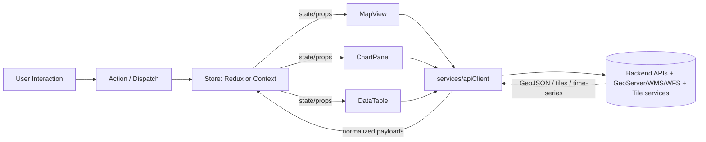

<!-- According to a document from 2026-01-05 (project docs linked in “Sources”). -->

# 🌐 KFM Web UI — `web/src/` (Frontend Source)


> 🧭 **What this folder is:** the **browser UI** for Kansas Frontier Matrix (KFM) — an SPA that turns geospatial + analytics outputs into an interactive map-first workflow (layers, timeline, charts, tables).:contentReference[oaicite:0]{index=0}

---

## ✨ What the UI is responsible for

The frontend is the primary interface where users:
- explore **interactive maps** (toggle layers, inspect features, view legends):contentReference[oaicite:1]{index=1}
- navigate **time** via a **timeline slider** (time-sliced layers + linked views):contentReference[oaicite:2]{index=2}
- view **analytics** via charts/graphs tied to map selections:contentReference[oaicite:3]{index=3}
- download/inspect **tabular outputs** (DataTable patterns):contentReference[oaicite:4]{index=4}

KFM’s UI design prioritizes:
- **modern browser compatibility** + mobile support:contentReference[oaicite:5]{index=5}
- **responsive layout** (Flexbox/Grid + breakpoints):contentReference[oaicite:6]{index=6}
- **cross-browser testing & accessibility** (semantic HTML, labels, ARIA, colorblind-safe choices):contentReference[oaicite:7]{index=7}

---

## 🧱 Key UI building blocks (mental model)

KFM’s frontend is intentionally componentized around a small set of “anchor” components:​:contentReference[oaicite:8]{index=8}

- 🗺️ **`MapView`** — interactive 2D map (layers + click/hover + popups)
- 🧩 **`Sidebar`** — layer toggles, legend, mode/context controls
- 🕒 **`TimelineSlider`** — time navigation (dispatches updates to map + charts):contentReference[oaicite:9]{index=9}
- 📈 **`ChartPanel`** — Plotly/Chart.js/D3 views, often tied to map selection:contentReference[oaicite:10]{index=10}
- 🧾 **`DataTable`** — tables for export/inspection
- 🧭 **`Header`** — global navigation (modes, settings, account)

---

## 🗂️ Expected folder structure

KFM’s docs recommend structuring React **by feature**, with shared primitives in `components/` and integration points in `services/` and `store/`.:contentReference[oaicite:11]{index=11}

```text
🌐 web/
└── 🧬 src/
    ├── 🧱 components/            # reusable UI primitives (Button, Modal, Chart wrappers, etc.)
    ├── 🧩 features/
    │   ├── 🗺️ map/               # MapView + map utils (layers, sources, interactions)
    │   ├── 🕒 timeline/          # TimelineSlider + time utilities
    │   ├── 🔐 auth/              # auth context, login flows (if enabled)
    │   └── 📊 dashboard/         # dashboards + composed views
    ├── 🎨 styles/                # global styles, tokens, CSS modules
    ├── 🔌 services/              # API clients (axios/fetch wrappers) + typed endpoints
    ├── 🧠 store/                 # Redux slices OR Context providers + selectors
    ├── 🧰 utils/                 # shared helpers (formatting, geo helpers, guards)
    ├── 🧭 App.(jsx|tsx)          # app shell + routing
    └── 🚀 index.(jsx|tsx)        # bootstraps SPA
```

✅ **TypeScript is preferred where possible** to make API responses + component props safer and easier to refactor.:contentReference[oaicite:12]{index=12}

---

## 🔁 Data flow & state management (how things “move”)

KFM is designed around predictable state updates (Redux or Context/hooks), where UI changes trigger actions and dependent components reactively refresh.:contentReference[oaicite:13]{index=13}



### 🕒 Timeline is a “global lever”
The timeline slider updates a shared `currentDate` (or equivalent), which triggers dependent components (map layers + charts) to refresh.:contentReference[oaicite:14]{index=14}

---

## 🗺️ Mapping stack

### 2D Map: **MapLibre GL JS** or **Leaflet**
Project design notes call out:
- **MapLibre GL JS** (open-source Mapbox GL fork) or **Leaflet** for interactive maps:contentReference[oaicite:15]{index=15}
- MapLibre supports high-performance WebGL rendering and timeline slider patterns:contentReference[oaicite:16]{index=16}

**Data formats we expect to visualize:**
- GeoJSON vectors (clickable features, overlays):contentReference[oaicite:17]{index=17}
- raster tiles or WMS/WMTS imagery overlays:contentReference[oaicite:18]{index=18}
- vector tiles (MBTiles / pbf) for performance when appropriate:contentReference[oaicite:19]{index=19}

### Map server integration (GeoServer/WMS/WFS)
KFM notes recommend using a map server (e.g., GeoServer backed by PostGIS) to publish layers as **WMS/WFS**, keeping heavy GIS serving outside the core app logic.:contentReference[oaicite:20]{index=20}

### CRS sanity
Docs emphasize a consistent pipeline:
- **WGS84** for universal storage
- **Web Mercator** for web maps
- transforms handled at system boundaries:contentReference[oaicite:21]{index=21}

---

## 🕒 Time slider & time-sliced layers

Many layers are explicitly time-indexed (NDVI, rainfall, soil moisture, etc.). The UI pattern is:

1) user chooses a date (slider)  
2) frontend requests a date-specific tile/layer OR calls an endpoint  
3) the map layer updates for the selected date:contentReference[oaicite:22]{index=22}

Additionally, the slider is described as a **custom component** with tick marks + discrete steps, connected to global state so it can fan out updates to map and charts.:contentReference[oaicite:23]{index=23}

---

## 📈 Charts & dashboards (linked to spatial selections)

KFM recommends:
- **Plotly.js** for interactive charts (hover, zoom, rich plot types), via React wrapper (`react-plotly`):contentReference[oaicite:24]{index=24}
- optionally Chart.js (simple) or D3 (custom):contentReference[oaicite:25]{index=25}

Key UX pattern:
- selecting a feature (e.g., a field boundary) triggers a request for time-series data (NDVI over time, etc.)
- chart updates to reflect the selected spatial entity:contentReference[oaicite:26]{index=26}

---

## 🌍 3D mode (CesiumJS) — optional but designed-in

KFM supports a **2D Map ↔ 3D Globe** toggle:
- 2D for lighter tasks
- CesiumJS for 3D terrain + earth overlays:contentReference[oaicite:27]{index=27}

Cesium integration notes include:
- imagery overlays via URL templates or WMS
- vectors via GeoJSON (draped/clamped) or CZML for time-dynamic content:contentReference[oaicite:28]{index=28}

The historical mapping hub design also notes:
- Cesium considered for future expansion (terrain + 3D Tiles/CZML)
- Google Earth KML supported as a lightweight 3D option in some contexts:contentReference[oaicite:29]{index=29}

---

## ⚡ Performance guidelines (don’t let maps melt laptops)

KFM’s frontend guidance calls out:
- **code splitting** and dynamic imports for heavy modules (e.g., 3D globe libraries):contentReference[oaicite:30]{index=30}
- React memoization / avoiding unnecessary re-renders for heavy components like maps:contentReference[oaicite:31]{index=31}

**Practical do’s ✅**
- memoize expensive derived state (selectors)
- keep map rendering “controlled” (only update the layers that changed)
- prefer vector tiles for large/complex vectors when possible:contentReference[oaicite:32]{index=32}

---

## ♿ Accessibility & UX guardrails

The UI should be usable beyond “power GIS users.” Key requirements include:
- semantic HTML controls (`<button>`, `<label>`, etc.)
- ARIA where needed
- color choices that remain meaningful for colorblind users
- alternative summary views (tables/summaries) for map-driven insights:contentReference[oaicite:33]{index=33}

---

## 🧹 Code quality: types, lint, formatting

KFM encourages:
- TypeScript where possible:contentReference[oaicite:34]{index=34}
- ESLint + Prettier for consistent style and quality gates:contentReference[oaicite:35]{index=35}

---

## 🧩 Adding a new map layer (recommended workflow)

> This is the “golden path” for new overlays so they integrate with legend, timeline, and feature inspection.

1. **Confirm how the layer will be served**
   - WMS/WFS via GeoServer/PostGIS:contentReference[oaicite:36]{index=36}
   - vector tiles (pbf/MBTiles) if performance requires it:contentReference[oaicite:37]{index=37}
   - GeoJSON for small/interactive overlays:contentReference[oaicite:38]{index=38}

2. **Register it in `features/map/`**
   - add a layer definition (id, label, type, source URL template)
   - add legend metadata (colors, ranges, attribution)

3. **If the layer is time-indexed**
   - connect it to `TimelineSlider` state (`currentDate`) so URL/endpoints can reflect date selection:contentReference[oaicite:39]{index=39}

4. **If it supports “click → details”**
   - implement feature selection + popup binding (MapView)
   - optionally add a linked chart in ChartPanel (field id → time-series endpoint):contentReference[oaicite:40]{index=40}

---

## 🧭 Routing & deep links

KFM uses client-side routing (e.g., React Router) for separate views like `/map`, `/analysis`, `/about`, and supports deep linking to specific states (zoom/time/selection).:contentReference[oaicite:41]{index=41}

---

## 📚 Sources

These project files were used to define the conventions and expectations in this `web/src/README.md`:

- KFM master documentation: :contentReference[oaicite:42]{index=42}  
  - Frontend architecture & core components:contentReference[oaicite:43]{index=43}  
  - Performance + a11y considerations:contentReference[oaicite:44]{index=44}  
  - React folder structure + TypeScript + lint/formatting:contentReference[oaicite:45]{index=45}  
  - Time slider + linked map/charts patterns:contentReference[oaicite:46]{index=46}  
  - Mapping/3D libs (Leaflet/MapboxGL/Cesium) + Plotly notes:contentReference[oaicite:47]{index=47}

- Open-source mapping hub design notes: :contentReference[oaicite:48]{index=48}  
  - MapLibre/Leaflet + timeline slider + Cesium/KML direction:contentReference[oaicite:49]{index=49}

- Repo layout / markdown governance guide: :contentReference[oaicite:50]{index=50}  
  - `web/` described as the UI app area (React, MapLibre, etc.):contentReference[oaicite:51]{index=51}

---

## 📌 Quick “where do I start?” (for new contributors)

- Want to change the map? ➜ `features/map/`
- Want to change the time slider? ➜ `features/timeline/`
- Want to add/change charts? ➜ `components/` (shared wrappers) + `features/dashboard/`
- Want to change API calls? ➜ `services/`
- Want to change global state? ➜ `store/`
- Want to adjust layout/styling? ➜ `styles/`

Happy mapping 🧭🗺️
