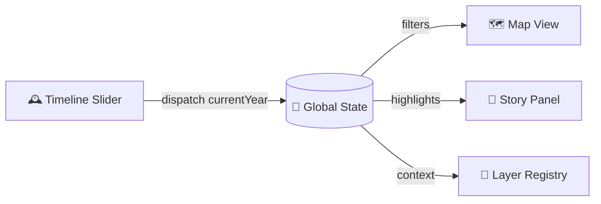
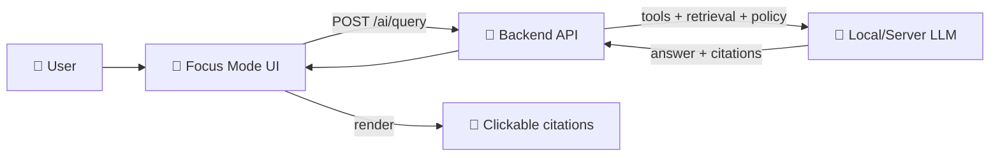

# 🗺️ KFM Web Client — `web/src`

Welcome to the **frontend source** of the **Kansas Frontier Matrix (KFM)** web application.  
This folder is where the **interactive map UI**, **timeline**, **story reading**, and **Focus Mode AI** experiences live.

> [!NOTE]
> This README is scoped to **`web/src`** (the *code*). For project-wide standards (data → catalogs → graph → API → UI), follow the repo’s master governance docs.

---

## 🎯 What this folder is responsible for

### ✅ Owns
- 🧩 **React UI** (pages, components, layout, routing)
- 🗺️ **Mapping & visualization**
  - **2D**: MapLibre-based map rendering + layer controls
  - **3D** (optional): Cesium-based terrain/globe view toggle
- 🕰️ **Time navigation**
  - timeline slider / playback
  - year/time filters that synchronize the whole UI
- 📖 **Story reading experience**
  - story panel + contextual highlight based on time/selection
  - citations/evidence affordances (popups, “source” panels, etc.)
- 🧠 **Focus Mode AI UI**
  - chat panel, citations rendering, (optional) multimodal input hooks
- 🔌 **Client API integration**
  - request/response types, loading states, errors, caching

### 🚫 Does *not* own
- ❌ Direct database access (Neo4j / PostGIS)  
- ❌ Hidden datasets stored in the UI  
- ❌ Narrative source-of-truth (Story Nodes live in governed docs folders, not in the UI)

---

## 🧱 Non‑negotiables (UI invariants) 🔒

> [!IMPORTANT]
> KFM’s UI is a **governed surface**. The frontend must preserve the “truth path”:
> **API → UI → user**, with provenance and redaction enforced at the API boundary.

**Rules of engagement**
- 🛑 **No direct DB calls** from frontend code — all access must go through the backend API.
- 🧾 **Evidence-first UX:** anything presented as *fact* should have a clear provenance trail (citations, dataset metadata, story source references, etc.).
- 🧿 **Classification & sensitivity propagation:** if data is restricted/sensitive, the UI must respect that (e.g., generalize/blur sensitive locations, hide precise coordinates when required).
- 🧠 **Focus Mode outputs must render citations** and keep “source → claim” traceability visible.

---

## 🔄 Key UI flows (at a glance)

### 🕰️ Time → Store → Everything stays in sync


### 🧠 Focus Mode AI (UI ↔ API ↔ governed reasoning)


---

## 📦 Suggested folder map (keep it boring & predictable)

> [!TIP]
> Your actual tree may differ — this is the **intended mental model** for where code should go.

<details>
<summary><strong>📁 Example layout</strong> (click to expand)</summary>

```text
📁 web/
└─ 📁 src/                                         🧭 KFM Web UI (React + MapLibre/Cesium + Story + Focus Mode)
   ├─ 📄 App.tsx                                   🧩 routes + top-level layout shell
   ├─ 📄 main.tsx                                  ⚡ React bootstrap (root mount, providers)
   │
   ├─ 📁 components/                               🧱 UI building blocks (feature-first)
   │  ├─ 📁 Map/                                   🗺️ MapLibre/Cesium wrappers + interactions
   │  ├─ 📁 Timeline/                              ⏳ time slider + playback + sync controls
   │  ├─ 📁 Story/                                 📚 story reader panel + citations UI + highlights
   │  ├─ 📁 FocusMode/                             🤖 AI chat UI + citation rendering + attachments
   │  ├─ 📁 LayerControl/                          🎛️ layer toggles + legend + symbology + visibility state
   │  └─ 📁 Common/                                🧰 shared UI (buttons, panels, modals, toasts)
   │
   ├─ 📁 store/                                    🧠 app state (store + slices)
   │  ├─ 📄 index.ts                               🧩 store setup (middleware, persistence hooks)
   │  └─ 📁 slices/                                🧩 feature slices (timeline/map/story/ui/userPrefs)
   │
   ├─ 📁 services/                                 🔌 API + data access layer
   │  ├─ 📄 api.ts                                 🌐 fetch wrapper (base URL, typed calls, errors)
   │  ├─ 📁 endpoints/                             🎯 per-feature API functions (thin + typed)
   │  └─ 📁 cache/                                 ♻️ optional request caching helpers
   │
   ├─ 📁 hooks/                                    🪝 feature hooks (lifecycle + orchestration)
   │  ├─ 🪝 useMap.ts                               🗺️ map lifecycle helpers (init, events, cleanup)
   │  ├─ 🪝 useTimeline.ts                          ⏳ time sync helpers (range, playback, listeners)
   │  └─ 🪝 useFocusMode.ts                         🤖 chat state + streaming + citations plumbing
   │
   ├─ 📁 config/                                   ⚙️ registry/config (declare, don’t hardcode)
   │  ├─ 🧩 layers.ts                               🗂️ layer registry (id, source, style, prov refs)
   │  └─ 🧩 basemaps.ts                             🗺️ basemap configs/styles
   │
   ├─ 📁 types/                                    🧾 shared types (UI ↔ API contracts)
   │  ├─ 🧩 geo.ts                                  🌍 GeoJSON / feature types
   │  ├─ 🧩 stac.ts                                 🛰️ STAC-ish metadata types
   │  ├─ 🧩 dcat.ts                                 🗂️ catalog types (if exposed to UI)
   │  └─ 🧩 prov.ts                                 🧬 provenance types (if exposed to UI)
   │
   ├─ 📁 utils/                                    🧰 helpers (pure + reusable)
   │  ├─ 🧩 debounce.ts                             ⏱️ debounce helper
   │  ├─ 🧩 formatters.ts                           🧾 format helpers (numbers/dates/labels)
   │  └─ 🛡️ safeHtml.ts                             🧼 sanitize/escape for narrative + citations rendering
   │
   └─ 📁 styles/                                   🎨 global styling
      ├─ 🎨 theme.css                               🖌️ theme rules (global look)
      └─ 🎛️ variables.css                           🧷 CSS variables/tokens
```
</details>

---

## 🗺️ Mapping module expectations

### 2D Map (MapLibre)
- Prefer **vector tiles / raster tiles** for large datasets.
- Use **GeoJSON overlays** for small, interactive feature sets.
- Layer toggles should connect to a **layer registry** (single source of truth) rather than ad-hoc map mutations.
- Every layer should expose:
  - ✅ id / label
  - ✅ time coverage rules (what years apply)
  - ✅ styling/symbology config
  - ✅ provenance reference (what dataset/story/source backs it)

### 3D Map (Cesium)
- Treat 3D as a **mode** (not a separate app).
- Keep shared UI state stable across toggles:
  - camera intent, selection, current time/year, active layers (where possible)

---

## 🕰️ Timeline & temporal filtering

The timeline is a first-class controller:
- It updates a single global value (e.g., `currentYear`)
- Map rendering **filters** layers by time
- Story UI **highlights** the relevant section(s) for the current time slice

**Design goal:** one slider move → one canonical state update → the entire UI reacts.

---

## 📖 Story & evidence UX

KFM treats narrative as **governed content**:
- Story text should render cleanly, but also surface provenance:
  - inline citations / footnotes
  - source panels
  - “view dataset” affordances for map layers

> [!IMPORTANT]
> The UI should make it easy for a user to answer:  
> **“Where did this claim come from?”**

---

## 🧠 Focus Mode AI UI (frontend contract)

The frontend Focus Mode experience should:
- Send prompts to the backend (`POST /ai/query`)
- Render:
  - the answer
  - the citations (clickable/inspectable)
  - optional “how it was derived” / trace details (when enabled)
- Support (optional future):
  - image/map snapshot attachments (“Ask AI about this”)
  - tool-result cards (search results, dataset previews)

---

## 🔌 API usage patterns (client-side)

### ✅ Do
- Centralize calls in `services/` (typed, consistent error handling)
- Handle redactions gracefully (don’t “work around” them)
- Cache carefully (especially for map requests), and cancel stale requests

### 🚫 Don’t
- Fetch from random components with ad-hoc `fetch()` everywhere
- Encode secrets in the client
- Depend on unstable internal endpoints without contracts

---

## 🧪 Quality gates (what PRs should keep green)

- ✅ Type safety (TypeScript)
- ✅ Lint/format
- ✅ Unit tests for critical logic (timeline sync, layer registry, citation rendering)
- ✅ Basic accessibility checks for key panels (map controls, story reader, focus mode)

---

## 🛠️ Troubleshooting (common dev pitfalls)

> [!TIP]
> Many issues show up as “nothing updates” — most often it’s a **port** or **volume mount** problem.

- 🔌 **Port conflicts**: if you already run Postgres/Neo4j locally, adjust compose ports.
- 🧱 **Web hot reload not working**: ensure the container mounts `web/src` into the running dev image.
- 🔁 **Package changes not applied**: rebuild the web image (or restart dev server) after dependency updates.
- 🧠 **Focus Mode errors**: usually means the backend AI provider isn’t reachable/configured (local Ollama, etc.).

---

## 🧭 When adding features: quick “where does this go?” guide

### ➕ Add a new UI feature
1. Add a component under `components/<Feature>/`
2. Add state in `store/slices/<featureSlice>.ts` if it needs cross-panel sync
3. Add API calls in `services/endpoints/`
4. Add tests for any non-trivial logic

### 🗺️ Add a new map layer
1. Add it to `config/layers.ts` (registry-driven)
2. Ensure time rules exist (start/end year or validity)
3. Ensure provenance info is displayable (legend/source panel)
4. Verify API contract exists (tile endpoint or GeoJSON endpoint)

### 🧠 Extend Focus Mode UI
1. Define a message/render type (answer, citation list, tool card, etc.)
2. Keep citations first-class and inspectable
3. Never render untrusted HTML without sanitization

---

## 📚 Glossary (UI terms)

- **Layer**: a visual overlay on the map (tiles or GeoJSON) with styling + provenance
- **Story Node**: governed narrative content (stored outside `web/`)
- **Focus Mode**: interactive reading + AI assistant experience with provenance-linked context
- **Provenance**: traceability of claims/visuals back to datasets/documents via citations/metadata
- **Truth path**: the rule that everything user-visible originates from governed pipeline outputs via the API
