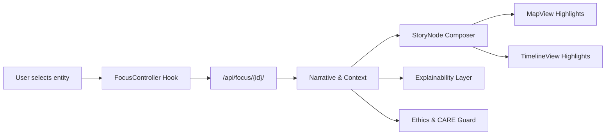

<div align="center">

# 💻 **Kansas Frontier Matrix — Web Application Source Code**  
`web/src/README.md`

**Purpose:**  
Define the *complete source-code architecture* of the KFM Web Platform (v10.4), including React/Tailwind component design, TypeScript DTO schemas, Focus Mode v2.5 integration, Story Node v3 rendering flows, STAC/DCAT adapters, governance & CARE overlays, A11y (WCAG 2.1 AA) patterns, telemetry instrumentation, and developer tooling — fully aligned with **MCP-DL v6.3**, **FAIR+CARE**, and **KFM-MDP v10.4** standards.

[](../../docs/README.md)  
[](../../docs/standards/faircare.md)  
[](../../LICENSE)  
[]()  
[]()

</div>

---

# 📘 Overview

`web/src/` contains all **core front-end logic** for the Kansas Frontier Matrix Web Application, including:

- 2D spatial rendering (**MapLibre GL**)  
- 3D terrain & deep-time models (**CesiumJS**)  
- Focus Mode v2.5 entity reasoning UI  
- Story Node v3 card rendering & timeline-map linking  
- STAC/DCAT dataset browsing flows  
- Governance & CARE overlays  
- Accessibility (WCAG 2.1 AA) token system  
- Telemetry instrumentation (WebVitals + ethics + sustainability)  

All source code must comply with:

- MCP-DL v6.3  
- Markdown Rules v10.4  
- FAIR+CARE governance  
- KFM v10.4 architecture  
- Web-security rules (RBAC, CSP, provenance guards)  
- A11y gating (Axe-core ≥ 95%)

---

# 📍 Scope

## In Scope

- All files under `web/src/**`  
- React components, hooks, context providers, services, DTOs  
- Front-end data pipelines (Focus Mode, Timeline, STAC/DCAT, entities)  
- Governance overlays & A11y-first patterns  
- Client-side telemetry emissions  

## Out of Scope

- Backend ingestion, pipeline logic (resides in `src/pipelines/**`)  
- API schema definitions (reference-only)  
- Deployment infrastructure

**Related references:**  
- `web/README.md` (platform overview)  
- `web/ARCHITECTURE.md` (full system architecture)  
- `src/ARCHITECTURE.md` (global system architecture)  

---

# 📚 Definitions

- **Feature Slice:** Cohesive vertical domain (e.g., map-layers, focus-mode).  
- **Provider:** React context wrapper (theme, auth, focus, A11y).  
- **Pipeline:** Front-end orchestration flow (client-only), not to be confused with backend ETL.  
- **Focus Mode v2.5:** Entity-centric reasoning + SHAP explanations + CARE gating.  
- **Story Node v3:** Narrative + spatial + temporal “atomic unit” rendered across map/timeline/cards.  
- **A11y Tokens:** CSS variables for accessible colors, spacing, typography, reduced motion.  

---

# 🏗 Architecture / Context

## High-Level Source Architecture

```mermaid
flowchart TD
    UI[React Components<br/>Tailwind · Zustand] --> MAP[MapLibre Layer Stack]
    UI --> CES[Cesium 3D Terrain]
    UI --> FOCUS[Focus Mode UI<br/>Narratives · Explainability]
    UI --> STORY[Story Node v3 Renderer]
    UI --> TL[Timeline Engine<br/>D3/Recharts]
    UI --> LAY[LayerControls<br/>STAC/DCAT]
    UI --> GOV[Governance UI<br/>CARE · Provenance]

    MAP --> API[API Client<br/>REST · GraphQL · JSON LD]
    CES --> API
    FOCUS --> API
    TL --> API
    STORY --> API

    API --> KG[Neo4j Graph]
    API --> STAC[STAC/DCAT Catalog]
    API --> GOVS[Governance Ledger]
    API --> TEL[Telemetry Export]
````

---

# 🗂️ Directory Layout (Authoritative v10.4)

```text
web/src/
├── README.md
│
├── components/
│   ├── MapView/               # MapLibre map, layers, rendering guards
│   ├── CesiumView/            # 3D terrain + camera + predictive overlays
│   ├── TimelineView/          # Temporal widgets, scales, brushes
│   ├── FocusPanel/            # Focus Mode narratives, explainability
│   ├── StoryNode/             # Story Node v3 UI elements
│   ├── LayerControls/         # STAC/DCAT layer toggles
│   ├── DetailDrawer/          # Entity detail sidebar
│   ├── Governance/            # CARE labels, license chips, provenance flags
│   ├── Accessibility/         # A11y helpers, keyboard navigation
│   └── Shared/                # Buttons, modals, UI primitives
│
├── context/
│   ├── FocusProvider.tsx      # Focus Mode global state
│   ├── A11yProvider.tsx       # WCAG preferences
│   ├── ThemeProvider.tsx      # Light/dark, high contrast
│   └── AppProvider.tsx        # Root composition
│
├── entities/
│   ├── people/
│   ├── places/
│   ├── events/
│   └── datasets/
│
├── features/
│   ├── accessibility/         # A11y controls, skip links, reduced motion
│   ├── focus-mode/            # Focus Mode core logic + explainability
│   ├── map-layers/            # STAC/DCAT layer registry, symbology
│   ├── timeline-features/     # Epochs, brushes, ghost future layers
│   └── governance/            # CARE gating & sovereignty alerts
│
├── hooks/
│   ├── useFocus.ts            # Entity reasoning & state
│   ├── useStac.ts             # STAC queries + pagination
│   ├── useTelemetry.ts        # WebVitals, FPS, A11y usage, ethics
│   ├── useGovernance.ts       # CARE, sovereignty, license gating
│   └── useA11y.ts             # Keyboard nav, high-contrast, reduced motion
│
├── pages/
│   ├── index.tsx              # Home page
│   ├── explorer.tsx           # Map + Timeline + Layers + Focus Mode
│   ├── focus.tsx              # Direct focus route
│   ├── governance.tsx         # FAIR+CARE dashboards
│   └── storynodes.tsx         # Story Node browser
│
├── pipelines/
│   ├── focusPipeline.ts       # Client reasoning pipeline for Focus Mode
│   ├── stacPipeline.ts        # Pipeline for STAC dataset browsing
│   ├── entityPipeline.ts      # Graph entity hydration
│   ├── timelinePipeline.ts    # Time-window orchestration
│   ├── layerPipeline.ts       # Layer stack management
│   └── metadata.json          # Pipeline registry & signatures
│
├── services/
│   ├── apiClient.ts           # REST/GraphQL/JSON-LD client
│   ├── stacService.ts         # STAC search + collection/item hydration
│   ├── dcatService.ts         # DCAT dataset/distribution browsing
│   ├── graphService.ts        # Neo4j entity queries
│   └── telemetryService.ts    # Telemetry emission
│
├── styles/
│   ├── globals.css
│   ├── tokens.css             # Design system tokens (A11y-compliant)
│   └── typography.css
│
├── utils/
│   ├── schemaGuards.ts        # Runtime DTO validation
│   ├── provenance.ts          # Construct provenance chips
│   ├── formatters.ts          # Date/number/human-readable formatting
│   └── a11y.ts                # A11y tooling
│
└── types/
    ├── api.ts                 # REST/GraphQL DTO definitions
    └── domain.ts              # Domain types mapping graph→UI
```

---

# 🧬 Ontology Alignment

The source code architecture implements:

| Ontology   | Mapping                                                  |
| ---------- | -------------------------------------------------------- |
| CIDOC-CRM  | UI actions → `E7 Activity`, Story Nodes → `E31 Document` |
| OWL-Time   | Timeline structures → `time:TemporalEntity`              |
| PROV-O     | Provenance chips → `prov:Entity`, `prov:wasDerivedFrom`  |
| schema.org | `SoftwareSourceCode` & `WebApplication`                  |
| STAC       | STAC Collections/Items → dataset browsing                |
| DCAT       | Dataset/Distribution views for metadata                  |

---

# 🧠 Focus Mode Integration

Focus Mode v2.5 architecture flow:



The source code defines:

* Narrative renderers
* Temporal and spatial synthesis logic
* CARE-aware masking
* SHAP-based explainability
* Provenance indicators
* Story Node card integration

---

# 🔐 Ethics & CARE

`web/src/**` must always enforce:

* CARE labels (public/restricted/sensitive)
* H3 r7 masking for sensitive geography
* Explicit provenance display for all entities
* Sovereignty warnings for tribal or culturally significant datasets
* Non-speculative narrative behavior (Focus Mode prohibits invention)

---

# 🧪 Validation & Testing

Testing includes:

* Component tests (Jest/React Testing Library)
* Integration tests for Focus Mode, Timeline, Map interactions
* A11y checks using axe-core
* TypeScript strict compile
* DTO schema guard tests
* Telemetry schema tests

---

# 📈 Telemetry

Captured metrics:

* WebVitals (LCP, FID, CLS)
* FPS (MapLibre/Cesium)
* Layer interactions
* Focus Mode usage
* A11y settings (high contrast, reduced motion)
* Story Node engagement

Telemetry export destination:

```
../../releases/<version>/focus-telemetry.json
```

---

# 🎧 Accessibility (WCAG 2.1 AA)

Plain-language summary:

> This source code provides the logic for displaying maps, timelines, and stories in a way that is accessible to all users, including people using screen readers or keyboard navigation.

Requirements:

* High-contrast and large-text modes
* Reduced-motion adherence
* Keyboard navigation throughout
* ARIA roles and landmarks
* Accessible color ramps for maps

---

# 🤖 Machine Extractability

This document respects:

* Proper heading hierarchy
* Structured tables
* Valid mermaid syntax
* YAML compliant with schema
* Predictable code block languages

---

# 🧩 Error Taxonomy

* **RenderingError:** map/timeline/story-node render failure
* **DataLoadError:** STAC/DCAT/Graph API load issues
* **GovernanceError:** missing CARE/provenance indicators
* **A11yError:** accessibility compliance regressions
* **TelemetryError:** invalid or missing telemetry events
* **FocusError:** narrative/explainability failures

---

# 📁 Directory Layout

```text
web/src/
├── components/
├── context/
├── entities/
├── features/
├── hooks/
├── pages/
├── pipelines/
├── services/
├── styles/
├── utils/
└── types/
```

---

# 🕰 Version History

| Version | Date       | Author            | Summary                                                                                                     |
| ------: | ---------- | ----------------- | ----------------------------------------------------------------------------------------------------------- |
| v10.4.0 | 2025-11-15 | Web Platform Team | Strict KFM-MDP v10.4 upgrade; added ontology, CARE gating, telemetry, A11y, Focus Mode v2.5, Story Node v3. |
| v10.3.2 | 2025-11-14 | Web Platform Team | Deep-feature alignment and full component review.                                                           |
| v10.3.1 | 2025-11-13 | Web Platform Team | TypeScript improvements; added governance components.                                                       |

---

<div align="center">

**© 2025 Kansas Frontier Matrix — MIT License**
Validated under **Master Coder Protocol v6.3**
FAIR+CARE Certified · Diamond⁹ Ω / Crown∞Ω Ultimate Certified
[Back to Web Architecture](../ARCHITECTURE.md) · [Root Governance Charter](../../docs/standards/governance/ROOT-GOVERNANCE.md)

</div>
