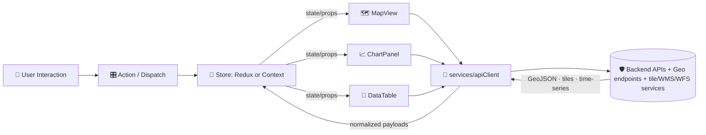

<!--
📌 KFM Web UI conventions are distilled from the project reference library listed in “Sources”.
🗓️ Last reviewed: 2026-01-06
-->

# 🌐 KFM Web UI — `web/src/` (Frontend Source)


> 🧭 **Purpose:** this folder contains the **browser UI** for Kansas Frontier Matrix (KFM) — an interactive, map‑first SPA that lets users **pan/zoom**, **toggle layers**, **inspect features**, and **explore time‑sliced simulation + remote‑sensing outputs** with linked charts and tables. 🗺️📈

---

## 🔗 Quick links

- [🧾 Doc metadata](#-doc-metadata)
- [✨ What lives here](#-what-lives-here)
- [🚫 What does not live here](#-what-does-not-live-here)
- [🧭 Architectural guardrails](#-architectural-guardrails-dont-break-these)
- [🗂️ Expected folder structure](#️-expected-folder-structure)
- [🔁 Data flow & state](#-data-flow--state-how-data-moves)
- [🗺️ Mapping stack](#️-mapping-stack)
- [🕒 Timeline & time-sliced layers](#-timeline--time-sliced-layers)
- [📈 Charts & dashboards](#-charts--dashboards-linked-to-spatial-selections)
- [🌍 3D mode](#-3d-mode-optional-but-designed-in)
- [⚡ Performance](#-performance-guidelines-dont-let-maps-melt-laptops)
- [♿ Accessibility & UX](#-accessibility--ux-guardrails)
- [🔐 Security & data governance](#-security--data-governance-ui-side)
- [🧪 Testing & quality gates](#-testing--quality-gates)
- [➕ Add/change features](#-adding-or-changing-a-feature-checklist)
- [📚 Sources](#-sources)

---

## 🧾 Doc metadata

| Field | Value |
|---|---|
| Folder | `web/src/` |
| Role | 🌐 Frontend app source (UI boundary) |
| Primary users | Analysts · researchers · operators · maintainers |
| Update policy | Keep aligned with API contracts + governance rules |
| Last updated | **2026-01-06** |

---

## ✨ What lives here

This folder is the **UI boundary implementation** — it’s a *view + interaction layer* that turns governed backend outputs into an experience humans can reason about.

Typical responsibilities:

- 🗺️ **Interactive mapping**: pan/zoom, base layers, overlays, feature hover/click, legends
- 🧩 **UI composition**: map + sidebar + charts + tables + settings
- 🕒 **Time navigation**: time slider / discrete time steps / animation controls
- 📈 **Linked analytics**: charts update based on map selection + filters
- 🧾 **Exports**: trigger safe downloads (GeoJSON/CSV/images) via API endpoints
- 📣 **UX feedback**: loading states, progress indicators, error IDs, empty states
- ♻️ **Progressive enhancement**: baseline usability first, then enhance for capable devices/browsers

> [!NOTE]
> KFM’s web UI is intended to be a **live control panel** — not just static dashboards. Expect interactive controls like sliders, play/pause, and map drawing tools to initiate analysis or simulations and then visualize incremental updates.

---

## 🚫 What does not live here

Keep these out of `web/src/` (or isolate them behind clear boundaries):

- 🛑 **Direct database / graph access** (Neo4j/Postgres/etc.)  
  ✅ The UI talks to **the API boundary** only.
- 🧠 **Core domain rules** (governance/redaction/business logic belongs server-side)  
  ✅ UI can *display* policy and *request* allowed actions; it shouldn’t *invent* policy.
- 🧱 **Data pipeline + ETL**  
  ✅ UI should consume cataloged/provenanced outputs, not generate them ad hoc.
- 🔑 **Secrets** (API keys, tokens, credentials)  
  ✅ Use runtime config + secure auth flows; never hardcode.

---

## 🧭 Architectural guardrails (don’t break these)

These are the “KFM-style” invariants for the UI:

- 🔒 **API boundary rule:** the UI **must not** bypass governance. All data access goes through the governed API (contracts + authZ + redaction).
- 🧪 **Predictable state:** changes flow through **explicit state updates** (Redux/Flux patterns or disciplined Context/hooks).  
  Selecting a feature must update charts/tables consistently.
- 🧾 **Provenance-friendly UX:** when a view “makes a claim” (e.g., a metric, anomaly, alert), the UI should have a place to show **evidence pointers** and metadata (IDs/links).
- 🧭 **CRS sanity:** treat coordinate systems seriously — do not mix projections silently; rely on clearly labeled transforms and metadata.
- 🧊 **Graceful degradation:** heavy WebGL/3D views must **fail soft** on older devices (fallback to 2D or pre-rendered output).
- 🧠 **Human-in-the-loop:** the UI should support *interpretability* (tooltips, contextual help, what-changed views) to keep users in control.

> [!TIP]
> If you’re unsure whether something belongs in `web/src/`, ask:  
> “Is this **presentation + interaction**, built on **contracted API outputs**, with **no hidden governance logic**?”  
> If yes → it likely belongs here.

---

## 🗂️ Expected folder structure

> 🧩 Recommended layout: **feature-first**, with shared primitives in `components/`, integration points in `services/` and state in `store/`.

```text
🌐 web/
└── 🧬 src/
    ├── 🧱 components/             # reusable primitives (Button, Modal, Chart wrappers, etc.)
    ├── 🧩 features/
    │   ├── 🗺️ map/                # MapView + layer registry + map interactions
    │   ├── 🕒 timeline/           # TimelineSlider + time utilities + animation controls
    │   ├── 📊 dashboard/          # composed views: charts + tables + selection summaries
    │   ├── 🧾 catalog/            # dataset browser: STAC/DCAT-style browsing (if enabled)
    │   ├── 🧪 simulations/        # run/configure jobs + progress + result viewer (if enabled)
    │   └── 🔐 auth/               # auth UI + session handling (if enabled)
    ├── 🎨 styles/                 # tokens, themes, CSS modules, global styles
    ├── 🔌 services/               # API client(s), contract-typed endpoints, request helpers
    ├── 🧠 store/                  # Redux slices OR Context providers + selectors
    ├── 🧰 utils/                  # geo helpers, formatting, guards, feature flags
    ├── 🧭 App.(jsx|tsx)           # app shell + routing
    └── 🚀 index.(jsx|tsx)         # SPA bootstrap
```

✅ **TypeScript is preferred** (where possible) for safer API payloads + refactors.

---

## 🔁 Data flow & state (how data “moves”)

KFM UI is designed around **predictable state updates** and **linked views**:



### 🕒 Timeline is a “global lever”
The timeline slider updates shared state (e.g., `currentDate` / `timeIndex`). Map layers + charts subscribe to that state and refresh accordingly.

---

## 🗺️ Mapping stack

### 2D maps (MapLibre GL JS or Leaflet)
Common front-end mapping choices for KFM-style apps:

- **MapLibre GL JS** (WebGL, fast vector rendering, good for timeline animation)
- **Leaflet** (lightweight, huge plugin ecosystem; pairs well with raster tiles and GeoJSON)

**Typical layer inputs:**
- 🧩 **GeoJSON** vectors (inspectable features, overlays)
- 🧊 raster tiles or **WMS/WMTS** imagery overlays
- 🧱 vector tiles (PBF/MBTiles) for large-scale performance

> [!IMPORTANT]
> Treat all external GeoJSON / vector tiles / 3D assets as **untrusted input**. Validate and sanitize where appropriate.

### 🛰️ Map services (WMS/WFS + geo-optimized APIs)
The UI commonly consumes:
- a **geo-optimized API** (contracted JSON/time-series endpoints), and/or
- **WMS/WFS** endpoints for map imagery and feature queries.

> [!NOTE]
> A WMS may offer multiple CRS options — clients can only request projections the service provides.

### 🧭 CRS sanity (don’t let projections lie)
Baseline expectations:

- 🌍 **GeoJSON default CRS:** WGS84 **EPSG:4326** (lat/lon) is the common default when CRS isn’t explicitly included.
- 🗺️ **Web maps often use “pseudo‑Mercator”** (commonly EPSG:3857) for tile rendering.
- 🔁 If datasets arrive in mixed CRSs (WGS84 vs UTM, etc.), handle transforms at clear system boundaries and show the user metadata when it matters.

---

## 🕒 Timeline & time-sliced layers

A standard pattern for time-indexed layers (NDVI, rainfall, soil moisture, simulation outputs):

1) user chooses a date/time (slider / stepper)  
2) UI requests a date-specific tile/layer or calls a time-parameterized endpoint  
3) map layer updates for the selected time  
4) charts/tables refresh to match selection + time

> [!TIP]
> Keep time steps **discrete and explicit** when the underlying data is discrete (e.g., monthly composites). Users trust “snap points” more than fuzzy time.

---

## 📈 Charts & dashboards (linked to spatial selections)

KFM-style charting emphasizes:
- **interactive exploration** (hover tooltips, zoom, brushing)
- **linked state** (map selection updates charts)
- **safe defaults** (show summary first, then allow drill-down)

Typical libraries:
- **D3.js** (custom, powerful)
- **Plotly** (quick interactive charts, rich plot types)

Common pattern:
- select a feature (field boundary, region, point)
- request a time-series or distribution
- chart updates to reflect that spatial entity

---

## 🌍 3D mode (optional but designed-in)

A common KFM flow is **2D Map ↔ 3D viewer**:

- 2D for fast navigation + clarity
- 3D for terrain, time animation, and “shape understanding”

3D can be implemented with:
- **Cesium** (globe/terrain, geospatial 3D)
- **Three.js** (general 3D; custom scenes/shaders)

> [!IMPORTANT]
> 3D must **degrade gracefully**:
> - if WebGL isn’t supported or is too slow → fall back to 2D or a pre-rendered animation
> - avoid hard failures that block core workflows

---

## ⚡ Performance guidelines (don’t let maps melt laptops)

The UI must stay responsive even with:
- thousands of features
- long time-series
- live-updating simulations

**Practical do’s ✅**
- 🧊 **Level of detail (LOD)** + **progressive loading** (only load what’s needed for view/time window)
- ♻️ **Client caching** of results where safe and correct
- 🧵 Offload heavy computations to **Web Workers** (never block the main UI thread)
- ✂️ **Code splitting** for heavy modules (3D, advanced analytics panels)
- 🧠 Memoize expensive derived state (selectors) and avoid re-render cascades
- 🧱 Prefer vector tiles for very large vector layers

**Practical don’ts ❌**
- render 50k DOM nodes without virtualization
- refetch the same layer repeatedly on small UI changes
- attach expensive work to mousemove without throttling

> [!TIP]
> If you introduce a feature that can spike CPU/GPU, add a “safe mode” toggle (reduce detail / pause animation / lower sample rate).

---

## ♿ Accessibility & UX guardrails

KFM UI should be usable beyond “power GIS users.”

**Requirements**
- semantic HTML (`<button>`, `<label>`, landmarks like `<header>`, `<main>`, etc.)
- keyboard navigability (focus outlines, skip links where relevant)
- ARIA only when needed (don’t ARIA-fy everything)
- responsive layout (Flexbox/Grid + breakpoints)
- reduce-motion friendly (respect OS settings; don’t force animation)

> [!NOTE]
> A “progressive enhancement” mindset helps accessibility: start with meaningful markup and enhance as capabilities allow.

---

## 🔐 Security & data governance (UI side)

Even though governance is enforced at the API boundary, the UI must still behave safely:

- 🔒 Don’t store secrets in source, localStorage, or logs
- 🧼 Never render untrusted strings as HTML
- 🧷 Display classification/sensitivity indicators when provided
- 📤 Only allow exports the API explicitly authorizes
- 🧾 Prefer showing evidence/provenance links over opaque claims
- 🧯 Treat browser logs as sensitive (avoid dumping payloads)

> [!IMPORTANT]
> If you discover a security issue, **do not** report it in public issues/PR comments. Follow the repo’s security policy.

---

## 🧪 Testing & quality gates

A pragmatic UI test strategy:

- ✅ **Unit tests**: reducers/selectors, utilities, component behavior
- 🧩 **Integration tests**: map interactions + service mocking, time slider fan-out
- 🧪 **Contract tests**: API client matches OpenAPI (typed schemas, runtime validation where used)
- 🧭 **E2E**: critical user flows (load map → select feature → chart updates → export)

Quality gates:
- ESLint + formatting
- TypeScript checks (if using TS)
- build succeeds without warnings
- basic accessibility checks (labels, contrast where tested)

---

## ➕ Adding or changing a feature (checklist)

Follow this order to avoid UI drift and broken governance:

1) 📜 **Confirm the API contract** (or request the API endpoint)
   - payload shape, filters, time parameters
   - auth requirements and classification behavior

2) 🧠 **Add state model**
   - define slice/context state + actions
   - selectors for derived data

3) 🗺️ **Implement the view**
   - MapView layer/interaction OR dashboard panel
   - consistent loading/error/empty states

4) 🔌 **Wire the service call**
   - typed request/response
   - caching strategy (if safe)

5) 🧪 **Add tests**
   - unit + integration (at minimum)
   - E2E if it’s a core workflow

6) 📣 **Add UX polish**
   - tooltips, legends, help text
   - “what changed” hints for time slider changes

### ✅ Quick self-check (before you PR)
- [ ] No direct access to DB/graph/tile secrets from the UI
- [ ] New UI state updates are predictable and testable
- [ ] Timeline changes update map + charts consistently
- [ ] Large layers use LOD/progressive loading where needed
- [ ] A11y basics: semantic controls, keyboard, sensible focus
- [ ] 3D/animation features degrade gracefully

---

## 📚 Sources

These project files shaped the expectations and conventions in this `web/src/README.md`:

<details>
<summary><strong>🛰️ KFM system + UI interaction patterns</strong></summary>

- **Kansas Frontier Matrix (KFM) – Master Technical Specification**  
  - Interactive mapping (pan/zoom, layer toggles, click-to-inspect)  
  - Time slider animation patterns  
  - WebGL/3D visualization and graceful degradation  
  - Performance strategies (LOD, progressive loading, caching, Web Workers)  
  - Responsive design + component-based UI architecture

</details>

<details>
<summary><strong>🗺️ Mapping hub design direction</strong></summary>

- **Kansas-Frontier-Matrix_ Open-Source Geospatial Historical Mapping Hub Design**  
  - MapLibre/Leaflet + timeline concept  
  - 2D ↔ 3D (terrain/globe) direction and KML/KMZ export ideas  
  - Popups/side-panels for contextual narrative and AI-highlighted sites

</details>

<details>
<summary><strong>🌐 Web UI engineering practices</strong></summary>

- **Responsive Web Design with HTML5 and CSS3** (progressive enhancement, semantic markup, support matrix thinking)  
- **WebGL Programming Guide (Interactive 3D Graphics)**  
- **Computer Graphics using JAVA 2D & 3D** (graphics fundamentals that inform rendering intuition)

</details>

<details>
<summary><strong>🧭 GIS & projection sanity</strong></summary>

- **Python Geospatial Analysis Cookbook** (GeoJSON CRS assumptions, EPSG:4326 baseline, EPSG:3857/pseudo-Mercator transforms, WMS CRS options)  
- **Geoprocessing with Python** (pipeline-oriented spatial processing patterns)  
- **Making Maps** (visual communication and map design instincts)

</details>

---

Happy mapping 🧭🗺️