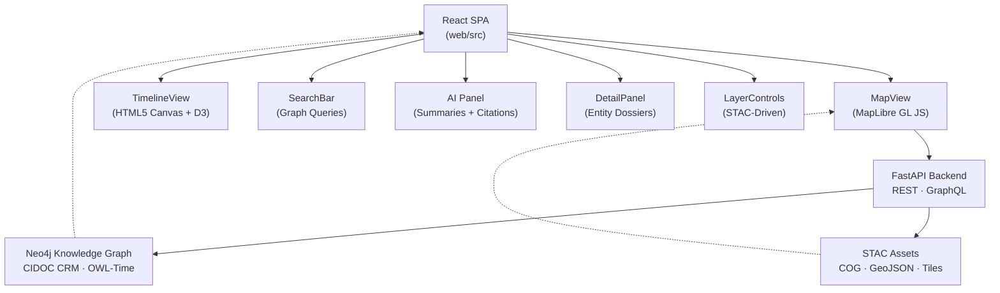

<div align="center">

# 🧭 Kansas Frontier Matrix — **Web Frontend**  
`/web/src/`

### *“Time · Terrain · Story — United through Data.”*

[](../../../.github/workflows/site.yml)
[](../../../.github/workflows/stac-validate.yml)
[](../../../.github/workflows/codeql.yml)
[](../../../docs/)
[](../../../LICENSE)

</div>

---

## 🪶 Overview

The **Kansas Frontier Matrix Web Frontend** is a **React 18 + TypeScript** single-page application that visualizes Kansas’s historical, ecological, and cultural landscape through an interactive **map**, **timeline**, and **knowledge-graph-driven interface**.  
It connects directly to the **FastAPI / Neo4j backend**, rendering **STAC-indexed data layers** as dynamic stories across space and time.

- 🗺 **Spatio-Temporal Integration** — unified map + timeline window  
- 🧭 **Knowledge Graph Context** — CIDOC CRM / OWL-Time aligned entities  
- 🧠 **AI-Enhanced Summaries** — contextual Q&A with citations  
- ♿ **Accessible Design** — WCAG 2.1 AA-compliant components  
- 🔄 **Provenance-Aware** — transparent data lineage under MCP

---

## ⚙️ Architecture



---

## 🗂 Directory Layout

```text
web/src/
├── components/        # UI modules (Map, Timeline, Search, AI, Detail)
├── context/           # Global state providers
├── hooks/             # useMap · useTimeline · useStac · useSearch
├── styles/            # Tailwind CSS + design tokens
├── types/             # Shared TypeScript types
├── utils/             # API client · formatters · geometry · STAC parser
├── config/            # layers.json · app.config.json · vite.config.ts
├── assets/            # SVGs · icons · manifest.json
└── index.tsx          # SPA entry point
```

---

## 🧩 Core Components

| Component | Purpose | Key Libraries |
|:-----------|:---------|:---------------|
| **MapView** | MapLibre GL base map + STAC overlays | `maplibre-gl`, React |
| **TimelineView** | Temporal brush & playback | Canvas, `d3-scale` |
| **SearchBar** | Knowledge Graph search + autocomplete | REST / GraphQL |
| **DetailPanel** | Entity / Event dossiers + provenance | `react-markdown` |
| **AI Panel** | Q&A assistant with citation links | FastAPI / AI service |
| **LayerControls** | Toggle STAC layers + legends | React Hooks |

---

## 🚀 Quick Start

```bash
# Install dependencies
pnpm install

# Run development server
pnpm dev        # → http://localhost:5173

# Build & preview production
pnpm build
pnpm preview
```

**Environment Variables (`.env`):**

```bash
VITE_API_URL=https://localhost:8000
VITE_MAP_STYLE_URL=/tiles/style.json
```

---

## 🧠 Data Flow

1. **STAC Catalog → layers.json** — built automatically by ETL pipelines.  
2. **FastAPI → Neo4j Graph** — delivers CIDOC CRM / OWL-Time aligned entities & events.  
3. **Timeline Sync** — single temporal state drives map and query filters.  
4. **AI Overlay** — citations & contextual summaries from validated sources.

---

## ♿ Accessibility & Responsiveness

- Tokenized color system · AA contrast verified  
- Full keyboard navigation + ARIA roles  
- Responsive layout for mobile and tablet  
- Reduced-motion preferences honored  
- Focus management within panels and dialogs  

---

## 🛡 Security & Privacy

- Read-only client (no mutations / credentials)  
- HTTPS only requests enforced  
- CORS limited to backend origin  
- No PII or tracking; only provenance metadata  
- STAC licenses and citations visible inline  

---

## 🔗 Related Documentation

- `docs/Kansas Frontier Matrix Web UI Design Document.pdf`  
- `docs/Kansas Frontier Matrix – Monorepo Repository Design.pdf`  
- `docs/File and Data Architecture for KFM.pdf`  
- `docs/Markdown styling guide.pdf`  

---

<div align="center">

**MIT License · © Kansas Frontier Matrix**  
Built under the **Master Coder Protocol (MCP)**  

[]()  
[]()

</div>