# 🌾🗺️ `web/` — Kansas Frontier Matrix Web Viewer
**Explore Mode · Story Mode · Focus Mode · (Optional) 3D Story Mode**

<p align="left">
  
  
  
  
  
  
  
  
  
</p>

A browser-based **interactive map + timeline** experience for the Kansas Frontier Matrix (KFM).  
This is where users **explore spatiotemporal layers**, **step through eras**, and **open linked evidence** (documents, runs, provenance) without breaking the governance pipeline. 🧭✨

> [!IMPORTANT]
> The viewer is **contract-driven** and **catalog-first**:
> - it renders from **catalog artifacts** (STAC/DCAT/PROV, or STAC-like UI manifests as a thin view)  
> - it is **static-first** and deployable on GitHub Pages  
> - the API (when present) is **progressive enhancement**, not a bypass  
>
> **Invariant:** **data → catalogs → graph → API → UI → narrative** (no shortcutting). [oai_citation:0‡MARKDOWN_GUIDE_v13.md.gdoc](file-service://file-UYVruFXfueR8veHMUKeugU)

---

## ⚡ Quick links

| Action | Where |
|---|---|
| 🏠 Back to repo root | `../README.md` |
| 🤝 Collaboration rules | `../.github/README.md` |
| 🔐 Security policy | `../.github/SECURITY.md` *(if present)* |
| 📦 Data & catalog conventions | `../data/README.md` *(if present)* |
| 🧪 CI workflows | `../.github/workflows/README.md` *(if present)* |
| 🧾 Report an issue | `https://github.com/bartytime4life/Kansas-Frontier-Matrix/issues/new/choose` |

---

<details>
<summary><strong>🧭 Table of contents</strong></summary>

- [🎯 Goals](#-goals)
- [🚫 Non-goals](#-non-goals)
- [🧠 Where the UI fits in KFM](#-where-the-ui-fits-in-kfm)
- [🧰 Viewer modes](#-viewer-modes)
- [🚀 Quickstart](#-quickstart)
- [⚙️ Configuration](#️-configuration)
- [🗂️ Recommended structure](#️-recommended-structure)
- [🗺️ Data contracts](#️-data-contracts)
  - [1) Layer manifest (STAC-first, UI-view friendly)](#1-layer-manifest-stac-first-ui-view-friendly)
  - [2) Timeline config](#2-timeline-config)
  - [3) Document index](#3-document-index)
  - [4) Evidence bundle (Focus Mode friendly)](#4-evidence-bundle-focus-mode-friendly)
  - [5) Story Nodes](#5-story-nodes)
  - [Validation](#validation)
- [🧭 Cartography & map-design standards](#-cartography--map-design-standards)
- [🌍 3D Story Mode (Cesium + MapLibre hybrid)](#-3d-story-mode-cesium--maplibre-hybrid)
- [⚡ Performance](#-performance)
- [♿ Accessibility](#-accessibility-non-negotiable)
- [🛡️ Security & privacy](#️-security--privacy)
- [🧪 Testing & validation](#-testing--validation-tv)
- [🚢 Deployment](#-deployment)
- [✅ Roadmap](#-roadmap)
- [📚 Project file influence map](#-project-file-influence-map)
- [🔙 Back to root](#-back-to-root)

</details>

---

## 🎯 Goals

What this viewer should feel like:

- 🗺️ **Exploration-first:** map is primary; evidence is always one click away
- ⏳ **Time-aware:** slider, stepping, and playback drive what’s visible
- 🔎 **Findable:** search places / themes / eras, jump-to results
- 🧾 **Traceable:** every layer exposes provenance + license + “how derived”
- 🧠 **Evidence-first:** Focus Mode + Story Nodes never “free-narrate” without links to sources [oai_citation:1‡MARKDOWN_GUIDE_v13.md.gdoc](file-service://file-UYVruFXfueR8veHMUKeugU)
- ♿ **Accessible + responsive:** mobile layouts and keyboard-first flows are non-negotiable
- 🧊 **Static-first deployable:** works on GitHub Pages with **no server required** (API makes it richer)

---

## 🚫 Non-goals

- 🧠 Heavy analytics in-browser (big compute stays upstream / server-side / precomputed)
- 🛰️ Storing giant raw imagery in `web/` (serve COGs/tiles from stable storage)
- 🔓 Treating IDs as “security” (access control is enforced by API & governance, not obscurity)

---

## 🧠 Where the UI fits in KFM

KFM enforces a trust pipeline. The UI is **downstream** — it does not invent truth.

```mermaid
flowchart LR
  DATA["🗃️ Data (raw/processed)"] --> CAT["🗂️ Catalogs<br/>(STAC/DCAT/PROV)"]
  CAT --> GRAPH["🕸️ Graph / Index<br/>(derived)"]
  CAT --> API["🛡️ API<br/>(governed access)"]
  API --> UI["🌐 Web Viewer"]
  CAT --> UI
  UI --> NARR["🎬 Narrative (Story Nodes)<br/>Evidence-linked"]
```



> [!IMPORTANT]
> **Story Nodes** and **Focus Mode** are *governed narrative artifacts* — every claim or media should reference cataloged sources (no uncited interpretation). [oai_citation:2‡MARKDOWN_GUIDE_v13.md.gdoc](file-service://file-UYVruFXfueR8veHMUKeugU)

### What the UI must do ✅
- Render layers based on **catalog manifests** (STAC-first, UI-view allowed)
- Show provenance, license, and caveats **next to the layer** (not buried)
- Respect **sensitivity flags** (hide/lock layers, generalize/redact geometry)
- Keep time semantics consistent across map + charts + docs

### What the UI must NOT do 🚫
- Bypass governed services (graph direct, raw bucket scraping, etc.)
- Treat uncited text as evidence
- Ship secrets (any `VITE_*` key is public by definition)

---

## 🧰 Viewer modes

KFM can ship progressively; these modes can coexist:

| Mode | What it feels like | What it’s for |
|---|---|---|
| 🗺️ Explore Mode | Layers + legend + map + timeline | Browse datasets, inspect features |
| 🎬 Story Mode | Guided steps + citations | Teaching, curated tours |
| 🧠 Focus Mode | Evidence panel + citations | “Explain this place/layer/event” in context [oai_citation:3‡MARKDOWN_GUIDE_v13.md.gdoc](file-service://file-UYVruFXfueR8veHMUKeugU) |
| 🧊 3D Story Mode | Smooth 2D→3D camera beats | Terrain context, corridors, uncertainty volumes |
| 📊 Analysis Mode | Charts + downloads + uncertainty | Model outputs, reproducible artifacts |

> [!NOTE]
> The design intent is **hybrid**: MapLibre stays the primary 2D mental model; Cesium is activated for specific Story Nodes (mode switch), not a replacement. [oai_citation:4‡Latest Ideas.docx](file-service://file-Uv1nK1SFjjBKqha9qPW4D4)

---

## 🚀 Quickstart

> [!CAUTION]
> Don’t open `index.html` by double-clicking (CORS/file issues). Always run a local server.

### Option A — Static viewer (no build step) ✅
```bash
cd web

# Python
python -m http.server 8000

# Or Node
npx serve -l 8000
```

Open:
- `http://localhost:8000`

### Option B — React dev server ⚛️
```bash
cd web
npm install
npm run dev   # or: npm start
```

### Option C — Docker preview 🐳
```bash
docker run --rm -p 8000:80 \
  -v "$(pwd)/web:/usr/share/nginx/html:ro" nginx:alpine
```

---

## ⚙️ Configuration

Frontends need **public** configuration (tile endpoints, style URL, API base URL).  
Create a local env file **without committing secrets**.

### Preferred: JSON config (static-first)
- ✅ `web/data/ui_config.json` — committed defaults  
- 🚫 `web/data/ui_config.local.json` — gitignored overrides

Example `ui_config.json`:
```json
{
  "app": { "title": "Kansas Frontier Matrix", "defaultMode": "explore" },
  "map": {
    "styleUrl": "./data/styles/kfm-style.json",
    "tileBaseUrl": "./tiles",
    "defaultView": { "center": [-98.0, 38.5], "zoom": 5 }
  },
  "api": { "enabled": false, "baseUrl": "http://localhost:8000/api/v1" },
  "features": { "storyNodes": true, "focusMode": true, "cesium3D": "story-only" }
}
```

### Optional: `.env` (Vite-style)
```bash
VITE_API_BASE_URL=http://localhost:8000/api/v1
VITE_MAP_STYLE_URL=./data/styles/kfm-style.json
VITE_TILE_BASE_URL=./tiles
VITE_MAPTILER_KEY=YOUR_PUBLIC_KEY
```

> [!IMPORTANT]
> Frontend tokens are **public enough** by definition.  
> If it’s a secret, it must **not** ship in the bundle (use server-side exchange or proxy).

---

## 🗂️ Recommended structure

This layout keeps **static deploy clean** while allowing a richer app build and Story Node-driven 2D→3D transitions.

```text
web/
├─ 🧾 README.md
├─ 🧾 index.html
├─ 🎨 style.css
├─ 🧠 app.js                       # static entry (or built entry)
├─ 📦 package.json                 # optional (React/tooling)
├─ ⚙️ vite.config.js               # optional (if Vite app)
├─ 🧩 src/                         # optional (React source)
│  ├─ 🗺️ components/
│  │  ├─ MapView/
│  │  ├─ Sidebar/
│  │  ├─ Timeline/
│  │  ├─ Legend/
│  │  ├─ DocPanel/
│  │  └─ EvidencePanel/            # Focus Mode UI
│  ├─ 🧠 state/                    # shared store: time + layers + view + mode
│  ├─ 🔌 api/                      # API clients (optional)
│  ├─ 🧰 lib/                      # pure helpers (testable)
│  └─ 🧪 tests/
├─ 🎬 story_nodes/
│  └─ kansas_from_above/           # 2D→3D demo Story Node
│     ├─ config.json               # camera steps, fades, timings
│     ├─ narrative.md              # human-readable story (with citations)
│     └─ cesium_scene.js           # Cesium scene bootstrap for this node
├─ 👁️ viewers/
│  ├─ maplibre/                    # 2D viewer bootstrap
│  └─ cesium/                      # 3D viewer bootstrap
│     └─ bootstrap.js
├─ 📚 data/
│  ├─ 🗃️ catalog/                  # UI-view manifests, STAC views, indices
│  ├─ ⏳ timeline.json
│  ├─ 🧾 doc_index.json
│  ├─ 🧾 evidence/                 # precomputed evidence bundles (optional)
│  ├─ 🗺️ styles/                   # MapLibre style JSON + sprites/fonts
│  ├─ 🧭 ui_config.json
│  └─ 🧪 schemas/                  # JSON Schemas for validation (recommended)
└─ 🖼️ assets/
   ├─ logos/
   ├─ icons/
   ├─ sprites/                     # optimize formats + size
   └─ screenshots/
```

This structure aligns with the “non-disruptive” Story Node demo approach (no backend required) while keeping a future-proof path to full 3D Tiles streaming. [oai_citation:5‡Latest Ideas.docx](file-service://file-Uv1nK1SFjjBKqha9qPW4D4)

---

## 🗺️ Data contracts

KFM is built around **traceable, reproducible, time-aware layers**.  
The UI should prefer **STAC** records (Collections/Items/assets) and allow **thin UI manifests** as a derived view.

### 1) Layer manifest (STAC-first, UI-view friendly)

**Goal:** one file per layer describing:
- how to render it (tiles, style, symbology)
- how it behaves over time
- what it is, where it came from, what caveats exist (provenance + license)

✅ Minimum recommended fields (UI-view):
- `id`, `title`, `description`
- `bbox` (WGS84 lon/lat)
- `time`: `static | range | steps`
- `assets`: `raster_tiles | vector_tiles | geojson | pmtiles | cog`
- `render`: opacity/minzoom/maxzoom + optional color ramp
- `provenance`: source/ref/license/processing/uncertainty
- `governance`: `public | internal | restricted` + redaction rules
- `links`: pointers back to STAC/DCAT/PROV “source of truth”

> [!TIP]
> Prefer serving vectors as **tiles** (PBF/PMTiles) once layers grow beyond “small GeoJSON”.  
> Use GeoJSON for small curated layers and “teaching” artifacts.

Example UI manifest:
```json
{
  "id": "air_pm25_fusion_monthly",
  "title": "Kansas PM2.5 Fusion (Monthly)",
  "description": "Fused PM2.5 surface (stations + satellite proxy). Includes uncertainty band.",
  "bbox": [-102.05, 36.99, -94.59, 40.00],
  "time": { "type": "steps", "step": "1M", "available": ["2019-01-01","2019-02-01"] },
  "assets": {
    "raster_tiles": {
      "type": "xyz",
      "url": "./tiles/air/pm25_fusion/{time}/{z}/{x}/{y}.png"
    },
    "legend": { "type": "ramp", "units": "µg/m³", "min": 0, "max": 35 }
  },
  "render": { "opacity": 0.8, "minzoom": 5, "maxzoom": 12 },
  "provenance": {
    "sources": ["EPA monitors", "satellite proxy"],
    "license": "TBD",
    "processing": ["normalize", "fuse", "tile"],
    "uncertainty": "Expose band + notes in UI"
  },
  "governance": { "sensitivity": "public", "redactions": [] },
  "links": {
    "stac_collection": "../data/catalog/air/collection.json",
    "prov_run": "../data/provenance/air/pm25_fusion/run_2019_02.json"
  }
}
```

This aligns with the design intent that *web layers should show provenance, license, caveats, and links back to STAC/PROV* (including “transparency badges” and kill-switch/rollback surfacing where applicable).

---

### 2) Timeline config

**Goal:** define eras + ticks + snapping so time is predictable.

Recommended fields:
- `default_date`
- `eras` (human navigation)
- `ticks` (major/minor cadence)
- `rules` (snapping by layer)

Example:
```json
{
  "default_date": "1870-01-01",
  "eras": [
    { "id": "frontier", "label": "Frontier", "start": "1820-01-01", "end": "1870-12-31" },
    { "id": "rail", "label": "Rail & Settlement", "start": "1871-01-01", "end": "1915-12-31" }
  ],
  "ticks": { "major": "10y", "minor": "1y" },
  "playback": { "enabled": true, "step": "1y" }
}
```

---

### 3) Document index

**Goal:** find linked docs by place, time, theme, and geometry.

Recommended capabilities:
- search by `place_name`, `tags`, `era`, `date_range`
- geometry association (point/line/polygon) or nearest-feature linking
- citations/excerpts that connect “feature → doc panel” experiences

Example:
```json
{
  "id": "doc_1847_fort_leavenworth_letter",
  "title": "Letter from Fort Leavenworth",
  "date": "1847-05-12",
  "era": "frontier",
  "tags": ["trade", "military", "transport"],
  "places": ["Fort Leavenworth", "Kansas River"],
  "geometry": { "type": "Point", "coordinates": [-94.922, 39.368] },
  "excerpt": "…",
  "citation": "Archive Ref XYZ",
  "assets": { "pdf": "./docs/letters/1847_fort_leavenworth.pdf" }
}
```

> [!CAUTION]
> Treat excerpts as untrusted input. If you render HTML, sanitize it.

---

### 4) Evidence bundle (Focus Mode friendly)

**Goal:** a single payload the UI can show as “evidence-only” for a place/layer/time.

Typical fields:
- `claim` (what the user is seeing)
- `supports` (citations + assets + provenance)
- `lineage` (PROV refs)
- `confidence/uncertainty`

Example:
```json
{
  "id": "bundle_ks_railroads_1880__bbox_-98_38",
  "time": "1880-01-01",
  "layer_id": "ks_railroads",
  "bbox": [-98.5, 37.8, -98.1, 38.2],
  "supports": [
    {
      "type": "citation",
      "label": "Kansas Historical Society map sheet (1880)",
      "ref": "KHS:<id>",
      "asset": "./data/processed/railroads_1880_sheet_12.tif"
    }
  ],
  "uncertainty": { "notes": "Georeferencing RMS ~ 18m; linework generalized." }
}
```

> [!IMPORTANT]
> Focus Mode is **evidence-backed and advisory** — no “hallucinated” narrative.  
> Any AI assistance must be clearly labeled and constrained by provenance-linked sources. [oai_citation:6‡MARKDOWN_GUIDE_v13.md.gdoc](file-service://file-UYVruFXfueR8veHMUKeugU)

---

### 5) Story Nodes

Story Nodes are governed narrative artifacts:
- machine-ingestible, step-based, and **time/map aware**
- can lock camera, fade layers, and (optionally) **switch engines** 2D→3D
- every claim/media must link back to cataloged evidence [oai_citation:7‡MARKDOWN_GUIDE_v13.md.gdoc](file-service://file-UYVruFXfueR8veHMUKeugU)

#### Folder shape
```text
web/story_nodes/
└─ kansas_from_above/
   ├─ config.json         # camera steps, layer fades, timings
   ├─ narrative.md        # human-readable story (with citations)
   ├─ cesium_scene.js     # optional: node-specific 3D scene bootstrap
   └─ assets/             # optional local images / tiles / media
```
(Recommended in the project’s 3D demo plan.) [oai_citation:8‡Latest Ideas.docx](file-service://file-Uv1nK1SFjjBKqha9qPW4D4)

#### Minimal `config.json` concept
```json
{
  "id": "kansas_from_above",
  "title": "Kansas From Above",
  "mode": "hybrid-2d-3d",
  "steps": [
    {
      "engine": "maplibre",
      "time": "2020-01-01",
      "camera": { "center": [-98.0, 38.5], "zoom": 5, "bearing": 0, "pitch": 0 },
      "layers": ["ks_context", "ks_counties"]
    },
    {
      "engine": "cesium",
      "camera": { "flyTo": { "lon": -98.0, "lat": 38.5, "height": 250000 } },
      "effects": { "terrainExaggeration": 1.5 },
      "layers": ["ks_elevation", "ks_corridor_overlay"]
    }
  ]
}
```

---

### Validation

**Target:** a validator that runs in CI and locally.

Suggested commands (pick one stack and standardize):
```bash
npm run validate:data
python ../scripts/qa/validate_web_catalogs.py
```

Minimum checks:
- JSON parses ✅
- required fields present ✅
- referenced assets exist (or return 200 in deployment) ✅
- time schemas are consistent ✅
- links back to STAC/DCAT/PROV are not broken ✅

---

## 🧭 Cartography & map-design standards

A geospatial viewer is only as good as its **cartographic decisions**:

- ✅ Always show a clear **legend** (with units + ranges)
- ✅ Use **visual hierarchy** (what matters should “pop”; context recedes)
- ✅ Make map fundamentals present/consistent: **title, scale bar, north arrow, credits** (as appropriate)
- ✅ Prefer color ramps that are interpretable and accessible (don’t rely on color alone)
- ✅ Include attribution prominently for any basemap / tiles

> [!TIP]
> Keep style JSON diffs reviewable: avoid giant monolithic style edits; split sprites/fonts cleanly.

---

## 🌍 3D Story Mode (Cesium + MapLibre hybrid)

KFM’s fastest path to real 3D is **hybrid**:

- **MapLibre GL JS** = primary 2D exploration (vector layers, labels, time slider)
- **CesiumJS** = Story Node “3D context” mode (terrain, globe, 3D Tiles)
- **Story Nodes** orchestrate: camera locks, fades, engine switch, continuity [oai_citation:9‡Latest Ideas.docx](file-service://file-Uv1nK1SFjjBKqha9qPW4D4)

### 3D flow (engine switch)

```mermaid
flowchart TB
  A["🗺️ Explore (MapLibre)"] --> B["🎬 Story Node trigger"]
  B --> C["🧊 3D Context (Cesium)"]
  C --> D["↩️ Return to 2D (MapLibre)"]
  D --> E["✅ Resume timeline + layers state"]
```


### WebGL expectations (performance + correctness)
MapLibre and Cesium are both WebGL-heavy. Key implications:

- avoid unnecessary shader churn (switching shaders per-feature can be expensive)
- treat fragment shading as a hotspot (fragment shader is the final stage and runs a lot)
- prefer tiles and simplified geometries over “megageojson”
- keep textures/sprites optimized (format and size matter)

---

## ⚡ Performance

Geospatial web apps can melt laptops 🔥💻 — keep it smooth:

### “Move less data” principle
Minimize data movement:
- tiles over raw rasters/vectors
- filtered queries over “download everything”
- index-friendly patterns (bbox + time windows)

This aligns with broader data-system guidance that emphasizes **index acceleration** and selective processing (avoid scanning more than needed). [oai_citation:10‡Scalable Data Management for Future Hardware.pdf](file-service://file-GZ8gMsQ8hxu7GWEVd3csNE)

### Practical viewer tactics
- 🧊 Prefer **tiled raster** and **vector tiles** for large layers
- 🧬 Simplify geometry at small zooms (build-time or server-side)
- 🧰 Lazy-load heavy layers (toggle-load, not boot-load)
- 🧠 Cache aggressively:
  - long-lived caching for tiles/manifests
  - hashed assets for builds
- 🧵 Offload parsing to Web Workers for big GeoJSON
- 🗜️ Compress JSON (gzip/brotli) and consider NDJSON streams
- 🧭 Throttle + debounce feature queries at high zoom

### Image + sprite optimization
Choose image formats deliberately and keep sprites/icons small and compressed.

---

## ♿ Accessibility non-negotiable

- ⌨️ Keyboard navigation:
  - sidebar focus order
  - timeline control (←/→ step, space play/pause)
  - escape closes dialogs/panels
- 🏷️ ARIA labels:
  - timeline slider
  - layer toggles
  - dialogs / popovers
- 🎨 Color is not the only signal:
  - patterns + labels + tooltips
- 📱 Responsive layouts:
  - map + panels stack cleanly
  - “map is always reachable” (no trapped scroll)

Responsive UI is a first-class requirement, not polish — build with breakpoints and flexible layouts from day one.

---

## 🛡️ Security & privacy

KFM’s design is explicitly aligned with security + governance + privacy by design. [oai_citation:11‡Kansas Frontier Matrix (KFM) – Comprehensive Engineering Design.docx](file-service://file-Wa2tWyESBZfsNGmRH7vGHY)

### Frontend safety rules
- ✅ Treat frontend keys as public
- 🔒 Never embed secrets in `VITE_*`
- 🧼 Sanitize document excerpts (and never trust remote HTML)
- 🧾 Always show provenance where decisions are made
- 🧯 Prefer strict Content Security Policy (especially on Pages)
- 🧊 Public repo reminder: anything in `web/` is downloadable by default

### Avoid “info leaks”
Don’t leak versions/config in obvious places (headers, banners, verbose errors). Security references often highlight that exposed banners can reveal vendor/version info and increase attack surface.

### Sensitivity handling
If a dataset contains sensitive locations:
- generalize precision (grid/jitter/aggregation)
- hide or gate layers based on governance sensitivity
- clearly mark restricted access paths

The KFM design calls for controlled access and generalized display for sensitive sites (e.g., sacred sites). [oai_citation:12‡Kansas Frontier Matrix (KFM) – Comprehensive Engineering Design.docx](file-service://file-Wa2tWyESBZfsNGmRH7vGHY)

---

## 🧪 Testing & validation (TV)

“TV” here = **Testing + Verification/Validation** (for both code and evidence).

### Minimum bar
- unit: timeline snapping + layer resolver + doc ranking
- component: legend/layer toggles + timeline + panels
- e2e: load layer → scrub time → inspect → open evidence

### Evidence-first validation
- broken links are a *data bug*
- missing provenance is a *ship blocker*
- uncertainty/caveats must render alongside model outputs

Graphics and visual diagnostics aren’t decoration — they reveal structure, trends, and problems early (EDA mindset).

---

## 🚢 Deployment

### GitHub Pages (static-first)
This folder is designed to be the **publish root**:

- Keep paths relative (`./data/...`, `./assets/...`)
- Avoid absolute `/` paths unless you control the domain root
- Ensure fonts/sprites referenced by your MapLibre style are reachable

### Vite base path (if React/Vite)
```js
// vite.config.js
export default {
  base: "/Kansas-Frontier-Matrix/"
}
```

---

## ✅ Roadmap

### P0 — Make the viewer real ✅
- [ ] Finalize `web/data/catalog/*.json` schema + validator
- [ ] Implement Timeline (ticks + play/pause) tied to layer visibility
- [ ] Implement Layer Resolver: `static | range | steps`
- [ ] Ship a “demo dataset” bundle for instant onboarding 📦
- [ ] Ship Story Node demo: **“Kansas From Above”** (2D→3D→2D) [oai_citation:13‡Latest Ideas.docx](file-service://file-Uv1nK1SFjjBKqha9qPW4D4)

### P1 — Make it useful 🧰
- [ ] “Document mentions near view” panel (bbox + time)
- [ ] Search: place name + tags/themes + date range
- [ ] Robust error UI: missing tiles, slow network, stale manifests
- [ ] Transparency badges: provenance links + kill-switch/rollback visibility in legend (where applicable)

### P2 — Make it culturally and scientifically stronger ❤️🧭
The project audit highlights missing/underused sources and narrative enrichment opportunities:
- [ ] Oral histories + Indigenous narratives (place-linked, consent-aware) [oai_citation:14‡Kansas-Frontier-Matrix Design Audit – Gaps and Enhancement Opportunities.pdf](file-service://file-TkRzAfTnxCYDUHauCf1NcH)
- [ ] Historic fire regimes / prairie burn practices (timeline-linked) [oai_citation:15‡Kansas-Frontier-Matrix Design Audit – Gaps and Enhancement Opportunities.pdf](file-service://file-TkRzAfTnxCYDUHauCf1NcH)
- [ ] Paleoclimate proxies (tree rings/pollen cores) tied to events [oai_citation:16‡Kansas-Frontier-Matrix Design Audit – Gaps and Enhancement Opportunities.pdf](file-service://file-TkRzAfTnxCYDUHauCf1NcH)
- [ ] Hydrology change narratives and optional modeling outputs (clearly labeled + V&V) [oai_citation:17‡Kansas-Frontier-Matrix Design Audit – Gaps and Enhancement Opportunities.pdf](file-service://file-TkRzAfTnxCYDUHauCf1NcH)
- [ ] Treaty layers upgraded from polygons → interactive narratives + linked texts [oai_citation:18‡Kansas-Frontier-Matrix Design Audit – Gaps and Enhancement Opportunities.pdf](file-service://file-TkRzAfTnxCYDUHauCf1NcH)

---

## 📚 Project file influence map

This repo is backed by a multidisciplinary library pack. These files influence **how we design the viewer**, not just what we show.

> [!NOTE]
> Many reference files have different licenses than the repo code. Keep them in `docs/library/` and respect upstream terms.

<details>
<summary><strong>📦 Expand: Project files → what they influence in <code>web/</code></strong></summary>

### 🧱 KFM canonical docs
- `Kansas Frontier Matrix (KFM) – Comprehensive Engineering Design.docx` — UI governance, security/privacy, interoperability, evidence-first pipeline. [oai_citation:19‡Kansas Frontier Matrix (KFM) – Comprehensive Engineering Design.docx](file-service://file-Wa2tWyESBZfsNGmRH7vGHY)
- `Latest Ideas.docx` — 3D Story Node demo plan (“Kansas From Above”), hybrid Cesium+MapLibre, repo shape. [oai_citation:20‡Latest Ideas.docx](file-service://file-Uv1nK1SFjjBKqha9qPW4D4)
- `MARKDOWN_GUIDE_v13.md.gdoc` — canonical pipeline ordering + definitions for Story Nodes / Focus Mode. [oai_citation:21‡MARKDOWN_GUIDE_v13.md.gdoc](file-service://file-UYVruFXfueR8veHMUKeugU)
- `Kansas-Frontier-Matrix Design Audit – Gaps and Enhancement Opportunities.pdf` — roadmap gaps: oral histories, paleoclimate, fire regimes, hydrology, treaty narratives. [oai_citation:22‡Kansas-Frontier-Matrix Design Audit – Gaps and Enhancement Opportunities.pdf](file-service://file-TkRzAfTnxCYDUHauCf1NcH)

### 🌐 Web + UI + graphics + 3D
- `responsive-web-design-with-html5-and-css3.pdf` — mobile-first/responsive constraints and layout thinking.
- `webgl-programming-guide-interactive-3d-graphics-programming-with-webgl.pdf` — WebGL performance mindset (shader stages, fragment cost).
- `compressed-image-file-formats-jpeg-png-gif-xbm-bmp.pdf` — image/sprite format tradeoffs and optimization awareness.
- `Mobile Mapping_ Space, Cartography and the Digital - 9789048535217.pdf` — mobile mapping context; geo-sensor networks & situated mapping concerns.

### 🗺️ GIS + geospatial engineering
- `making-maps-a-visual-guide-to-map-design-for-gis.pdf` — map composition fundamentals and visual hierarchy.
- `python-geospatial-analysis-cookbook.pdf` + `KFM-python-geospatial-analysis-cookbook.pdf` — practical GIS processing patterns, PostGIS↔GeoJSON, Leaflet visualization workflows. [oai_citation:23‡Latest Ideas.docx](file-service://file-Uv1nK1SFjjBKqha9qPW4D4)
- `Cloud-Based Remote Sensing with Google Earth Engine-Fundamentals and Applications.pdf` — remote-sensing pipeline mental model; map/legend/time-series outputs integration.

### 🗄️ Data + DB + interoperability + scaling
- `PostgreSQL Notes for Professionals - PostgreSQLNotesForProfessionals.pdf` — query patterns, recursion/hierarchies (useful for graph-ish UI queries). [oai_citation:24‡think-bayes-bayesian-statistics-in-python.pdf](file-service://file-LXwJApPMVhRZgyqLb9eg7c)
- `Data Spaces.pdf` — interoperability challenges, ETL, semantic layers (why catalogs matter). [oai_citation:25‡Scientific Modeling and Simulation_ A Comprehensive NASA-Grade Guide.pdf](file-service://file-LuWF23hffNAZJaZm2Gzvcd)
- `Scalable Data Management for Future Hardware.pdf` — indexing/selectivity, push-based pipelines, performance-first processing. [oai_citation:26‡Scalable Data Management for Future Hardware.pdf](file-service://file-GZ8gMsQ8hxu7GWEVd3csNE)

### 📈 Modeling + analytics + scientific discipline
- `Scientific Modeling and Simulation_ A Comprehensive NASA-Grade Guide.pdf`
- `Understanding Statistics & Experimental Design.pdf`
- `regression-analysis-with-python.pdf`
- `Regression analysis using Python - slides-linear-regression.pdf`
- `graphical-data-analysis-with-r.pdf` — EDA/diagnostics mindset for Analysis Mode UIs.
- `think-bayes-bayesian-statistics-in-python.pdf`
- `Deep Learning for Coders with fastai and PyTorch - Deep.Learning.for.Coders.with.fastai.and.PyTorchpdf` — ML artifacts (model cards, bias awareness), surface outputs with uncertainty + citations.

### 🧪 Simulation + advanced math (future overlays / graph views)
- `Generalized Topology Optimization for Structural Design.pdf` — “design domain” thinking; scenario exploration and constraints visualization. [oai_citation:27‡Scientific Modeling and Simulation_ A Comprehensive NASA-Grade Guide.pdf](file-service://file-LuWF23hffNAZJaZm2Gzvcd)
- `Spectral Geometry of Graphs.pdf` — graph Laplacian ideas that can inform network-based layers and graph UI views. [oai_citation:28‡python-geospatial-analysis-cookbook.pdf](file-service://file-HT14njz1MhrTZCE7Pwm5Cu)

### 🔒 Security + governance + ethics
- `ethical-hacking-and-countermeasures-secure-network-infrastructures.pdf` — don’t treat identifiers as secrets; enforce real access controls.
- `Gray Hat Python - Python Programming for Hackers and Reverse Engineers (2009).pdf` — threat mindset; reduce info leakage; responsible disclosure posture.
- `Introduction to Digital Humanism.pdf` — human determination + transparency + governance for AI systems.
- `Principles of Biological Autonomy - book_9780262381833.pdf` — autonomy/self-organization framing; keep humans accountable in the loop. [oai_citation:29‡python-geospatial-analysis-cookbook.pdf](file-service://file-HT14njz1MhrTZCE7Pwm5Cu)
- `On the path to AI Law’s prophecies and the conceptual foundations of the machine learning age.pdf` — ML limitations framing (pattern finding/curve fitting) → label AI outputs carefully.

### 🧱 General programming shelf (bundles)
- `A programming Books.pdf`
- `B-C programming Books.pdf`
- `D-E programming Books.pdf`
- `F-H programming Books.pdf`
- `I-L programming Books.pdf`
- `M-N programming Books.pdf`
- `O-R programming Books.pdf`
- `S-T programming Books.pdf`
- `U-X programming Books.pdf`

These bundles are used as “depth references” across UI engineering, GIS querying patterns, performance tradeoffs, and analysis toolchains (but the viewer stays contract-first and evidence-first). [oai_citation:30‡MARKDOWN_GUIDE_v13.md.gdoc](file-service://file-UYVruFXfueR8veHMUKeugU)

</details>

---

## 🔙 Back to root
- Back to project root: `../README.md`